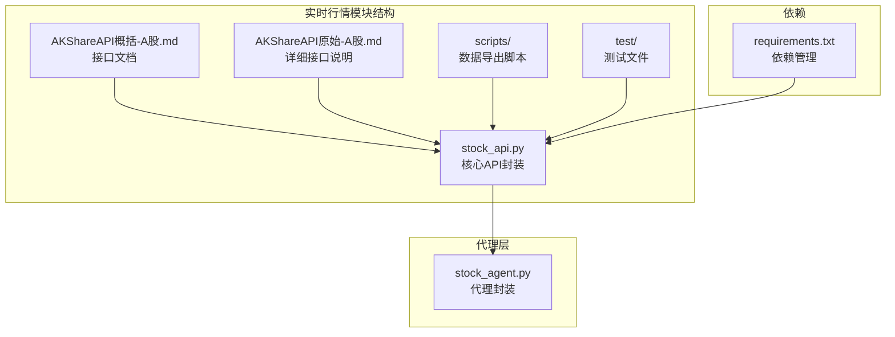
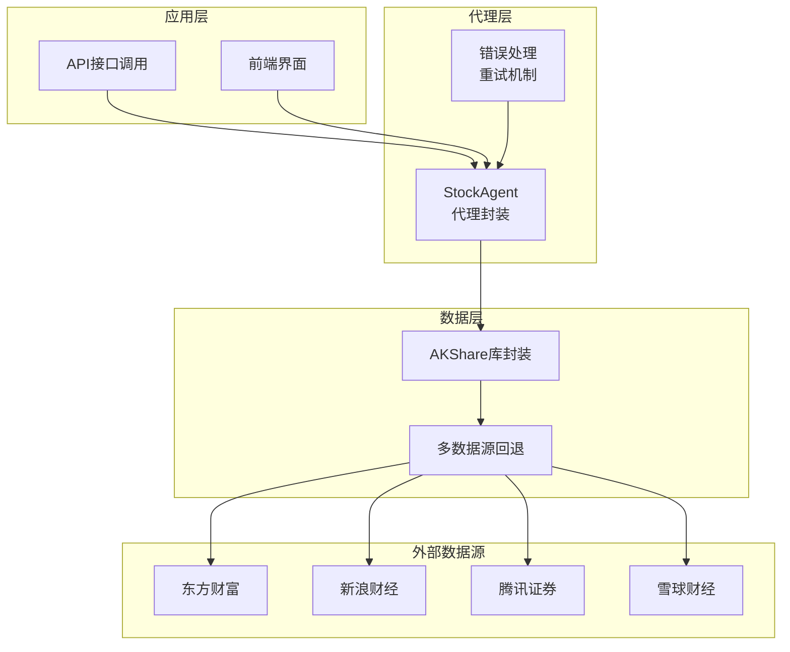
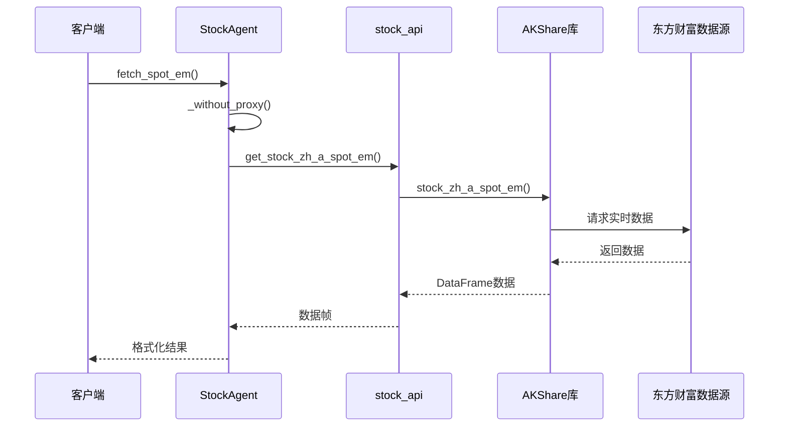
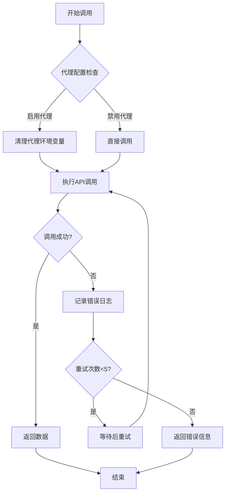
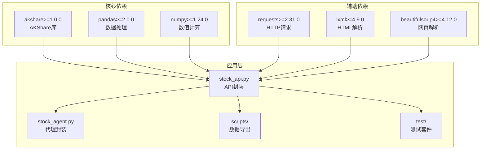
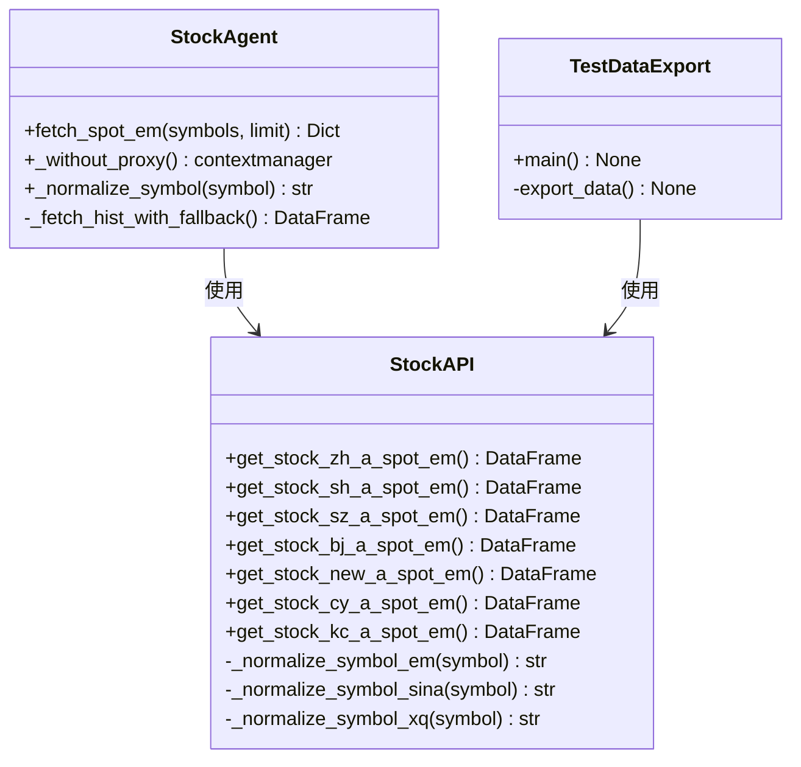
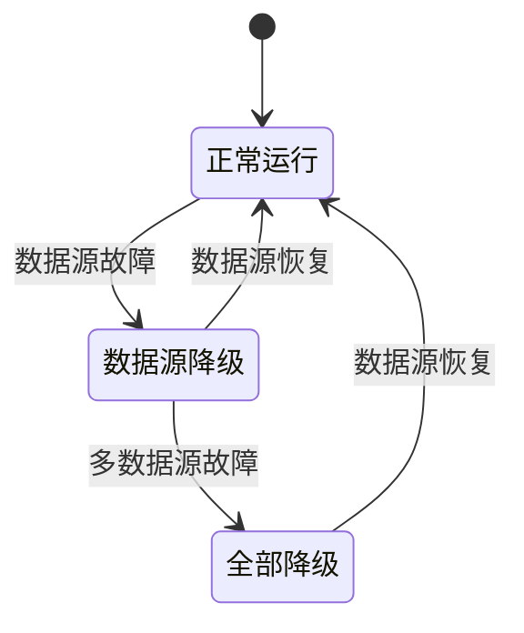
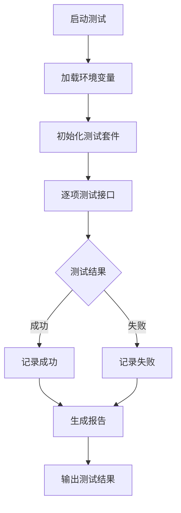

# 实时行情数据

<cite>
**本文档引用的文件**
- [stock_api.py](file://src/stock/stock_api.py)
- [AKShareAPI概括-A股.md](file://src/stock/AKShareAPI概括-A股.md)
- [AKShareAPI原始-A股.md](file://src/stock/AKShareAPI原始-A股.md)
- [fetch_stock_zh_a_spot_em_to_txt.py](file://src/stock/scripts/fetch_stock_zh_a_spot_em_to_txt.py)
- [test_akshare_api.py](file://src/stock/test/test_akshare_api.py)
- [stock_agent.py](file://src/agent/stock_agent.py)
- [requirements.txt](file://requirements.txt)
</cite>

## 目录
1. [引言](#引言)
2. [项目结构](#项目结构)
3. [核心组件](#核心组件)
4. [架构概览](#架构概览)
5. [详细组件分析](#详细组件分析)
6. [依赖关系分析](#依赖关系分析)
7. [性能考虑](#性能考虑)
8. [故障排除指南](#故障排除指南)
9. [结论](#结论)

## 引言

本文档深入分析了AI投资项目的实时行情数据模块，重点解释AKShare数据源在实时行情方面的集成实现。该模块提供了完整的A股实时行情数据获取能力，包括沪深京A股、沪A股、深A股、科创板等多个市场的实时数据接口。

实时行情数据模块采用多数据源回退机制，确保在某个数据源不可用时能够自动切换到其他可用的数据源，提高了系统的可靠性和稳定性。同时，模块还实现了完善的错误处理策略、重试机制和数据验证方法。

## 项目结构

实时行情数据模块位于项目的`src/stock`目录下，主要包含以下文件：



**图表来源**
- [stock_api.py](file://src/stock/stock_api.py#L1-L425)
- [stock_agent.py](file://src/agent/stock_agent.py#L1-L572)

**章节来源**
- [stock_api.py](file://src/stock/stock_api.py#L1-L425)
- [stock_agent.py](file://src/agent/stock_agent.py#L1-L572)

## 核心组件

### 实时行情API封装

实时行情模块的核心是`stock_api.py`文件，它提供了对AKShare库的统一封装，包含以下主要功能：

#### 实时行情接口
- `get_stock_zh_a_spot_em()`: 东方财富网-沪深京A股实时行情
- `get_stock_sh_a_spot_em()`: 沪A股实时行情
- `get_stock_sz_a_spot_em()`: 深A股实时行情
- `get_stock_bj_a_spot_em()`: 京A股实时行情
- `get_stock_new_a_spot_em()`: 新股实时行情
- `get_stock_cy_a_spot_em()`: 创业板实时行情
- `get_stock_kc_a_spot_em()`: 科创板实时行情

#### 数据格式标准化
模块实现了统一的股票代码格式化功能：
- `_normalize_symbol_em()`: 东方财富类格式标准化
- `_normalize_symbol_sina()`: 新浪/腾讯类格式标准化  
- `_normalize_symbol_xq()`: 雪球类格式标准化

**章节来源**
- [stock_api.py](file://src/stock/stock_api.py#L15-L63)
- [stock_api.py](file://src/stock/stock_api.py#L137-L190)

### 代理层封装

`stock_agent.py`文件提供了更高层次的代理封装，实现了：

#### 代理模式设计
- 统一的API调用入口
- 自动代理配置管理
- 多数据源回退机制
- 完善的日志记录

#### 关键特性
- `_without_proxy()`: 代理配置上下文管理
- `fetch_spot_em()`: 实时行情获取
- `_normalize_symbol()`: 股票代码标准化

**章节来源**
- [stock_agent.py](file://src/agent/stock_agent.py#L30-L226)

## 架构概览

实时行情数据模块采用了分层架构设计，确保了良好的可维护性和扩展性：



**图表来源**
- [stock_agent.py](file://src/agent/stock_agent.py#L19-L27)
- [stock_api.py](file://src/stock/stock_api.py#L137-L190)

## 详细组件分析

### 实时行情数据接口

#### 东方财富实时行情接口

东方财富作为主要的数据源，提供了最全面的实时行情数据：



**图表来源**
- [stock_agent.py](file://src/agent/stock_agent.py#L184-L226)
- [stock_api.py](file://src/stock/stock_api.py#L137-L142)

#### 各市场实时行情差异

| 接口名称 | 数据源 | 覆盖范围 | 特点 |
|---------|--------|----------|------|
| `get_stock_zh_a_spot_em()` | 东方财富 | 沪深京A股全市场 | 最全面的数据覆盖 |
| `get_stock_sh_a_spot_em()` | 东方财富 | 上海证券交易所 | 仅上海市场数据 |
| `get_stock_sz_a_spot_em()` | 东方财富 | 深圳证券交易所 | 仅深圳市场数据 |
| `get_stock_bj_a_spot_em()` | 东方财富 | 北京证券交易所 | 仅北京市场数据 |
| `get_stock_new_a_spot_em()` | 东方财富 | 新股上市 | 包含上市时间字段 |
| `get_stock_cy_a_spot_em()` | 东方财富 | 创业板 | 创业板专用接口 |
| `get_stock_kc_a_spot_em()` | 东方财富 | 科创板 | 科技创新板专用 |

**章节来源**
- [stock_api.py](file://src/stock/stock_api.py#L137-L190)
- [AKShareAPI概括-A股.md](file://src/stock/AKShareAPI概括-A股.md#L103-L142)

### 数据格式与字段说明

#### 实时行情数据字段

实时行情数据采用统一的字段命名规范，确保跨数据源的一致性：

| 字段名称 | 类型 | 单位 | 描述 |
|---------|------|------|------|
| 序号 | int64 | - | 股票排序编号 |
| 代码 | object | - | 股票代码 |
| 名称 | object | - | 股票名称 |
| 最新价 | float64 | 元 | 最新成交价格 |
| 涨跌幅 | float64 | % | 涨跌幅 |
| 涨跌额 | float64 | 元 | 涨跌金额 |
| 成交量 | float64 | 手 | 成交量 |
| 成交额 | float64 | 元 | 成交金额 |
| 振幅 | float64 | % | 价格波动幅度 |
| 最高 | float64 | 元 | 当日最高价 |
| 最低 | float64 | 元 | 当日最低价 |
| 今开 | float64 | 元 | 当日开盘价 |
| 昨收 | float64 | 元 | 昨日收盘价 |
| 量比 | float64 | - | 量比 |
| 换手率 | float64 | % | 换手率 |
| 市盈率-动态 | float64 | - | 动态市盈率 |
| 市净率 | float64 | - | 市净率 |
| 总市值 | float64 | 元 | 总市值 |
| 流通市值 | float64 | 元 | 流通市值 |
| 涨速 | float64 | - | 价格变化速度 |
| 5分钟涨跌 | float64 | % | 5分钟涨跌幅 |
| 60日涨跌幅 | float64 | % | 60日涨跌幅 |
| 年初至今涨跌幅 | float64 | % | 年初至今涨跌幅 |

**章节来源**
- [AKShareAPI概括-A股.md](file://src/stock/AKShareAPI概括-A股.md#L111-L134)

### 错误处理与重试机制

#### 多层级错误处理



**图表来源**
- [stock_agent.py](file://src/agent/stock_agent.py#L34-L54)
- [fetch_stock_zh_a_spot_em_to_txt.py](file://src/stock/scripts/fetch_stock_zh_a_spot_em_to_txt.py#L21-L28)

#### 代理配置管理

模块实现了智能的代理配置管理，支持多种代理环境变量：

| 环境变量 | 用途 | 默认值 |
|---------|------|--------|
| HTTP_PROXY | HTTP代理 | "" |
| HTTPS_PROXY | HTTPS代理 | "" |
| ALL_PROXY | 全局代理 | "" |
| http_proxy | 小写HTTP代理 | "" |
| https_proxy | 小写HTTPS代理 | "" |
| all_proxy | 小写全局代理 | "" |
| AKSHARE_DISABLE_PROXY | 禁用代理 | "0" |

**章节来源**
- [stock_agent.py](file://src/agent/stock_agent.py#L39-L46)
- [test_index_fallback.py](file://src/stock/test/test_index_fallback.py#L16)

### 数据验证与质量控制

#### 数据完整性验证

模块实现了多层次的数据验证机制：

1. **空数据检测**: 检测返回的DataFrame是否为空
2. **字段完整性**: 验证关键字段是否存在
3. **数据类型验证**: 确保数据类型符合预期
4. **范围验证**: 检查数值是否在合理范围内

#### 数据标准化流程


**图表来源**
- [stock_api.py](file://src/stock/stock_api.py#L15-L63)

**章节来源**
- [stock_api.py](file://src/stock/stock_api.py#L15-L63)

## 依赖关系分析

### 外部依赖

实时行情模块的主要依赖关系如下：



**图表来源**
- [requirements.txt](file://requirements.txt#L22-L23)
- [stock_api.py](file://src/stock/stock_api.py#L8-L10)

### 内部依赖关系

模块内部的依赖关系体现了清晰的分层架构：



**图表来源**
- [stock_agent.py](file://src/agent/stock_agent.py#L30-L572)
- [stock_api.py](file://src/stock/stock_api.py#L137-L190)

**章节来源**
- [requirements.txt](file://requirements.txt#L1-L41)
- [stock_agent.py](file://src/agent/stock_agent.py#L19-L27)

## 性能考虑

### 网络稳定性影响

实时行情数据获取受到网络环境的显著影响：

#### 常见网络问题
- **连接超时**: 数据源响应缓慢或网络中断
- **IP封禁**: 高频调用导致IP被临时封禁
- **数据源不可用**: 第三方数据源维护或故障
- **代理冲突**: 本地代理配置影响数据获取

#### 性能优化策略

1. **智能重试机制**: 最多重试5次，每次等待时间递增
2. **代理自动管理**: 根据环境变量自动配置代理
3. **数据缓存**: 对热点数据进行短期缓存
4. **批量处理**: 支持批量获取多个股票的实时数据

### 数据源可用性监控

模块实现了数据源可用性的监控机制：



### 调用频率限制

不同数据源有不同的调用频率限制：

| 数据源 | 调用限制 | 建议间隔 |
|--------|----------|----------|
| 东方财富 | 无明确限制 | 1秒/次 |
| 新浪财经 | 高频调用可能封IP | 5秒/次 |
| 腾讯证券 | 无明确限制 | 2秒/次 |
| 雪球财经 | 需要认证 | 10秒/次 |

**章节来源**
- [AKShareAPI概括-A股.md](file://src/stock/AKShareAPI概括-A股.md#L160-L163)
- [test_akshare_api.py](file://src/stock/test/test_akshare_api.py#L7-L12)

## 故障排除指南

### 常见问题诊断

#### 数据获取失败

**症状**: API调用返回空数据或抛出异常

**诊断步骤**:
1. 检查网络连接状态
2. 验证AKShare库版本
3. 确认代理配置
4. 查看错误日志

**解决方案**:
```python
# 示例：手动重试机制
import time
import akshare as ak

def robust_get_data(max_retries=3):
    for attempt in range(max_retries):
        try:
            return ak.stock_zh_a_spot_em()
        except Exception as e:
            if attempt < max_retries - 1:
                time.sleep(2 ** attempt)  # 指数退避
                continue
            raise e
```

#### IP封禁问题

**症状**: 访问被拒绝或返回空数据

**解决方法**:
1. 增加调用间隔
2. 使用代理服务器
3. 切换到备用数据源
4. 实施IP轮换机制

#### 数据格式不一致

**症状**: 不同数据源返回的数据格式差异

**解决方法**:
1. 使用统一的字段映射
2. 实施数据标准化流程
3. 添加数据验证逻辑

### 调试工具

#### 测试脚本

项目提供了完整的测试套件，用于验证各接口的可用性：



**图表来源**
- [test_akshare_api.py](file://src/stock/test/test_akshare_api.py#L96-L253)

**章节来源**
- [test_akshare_api.py](file://src/stock/test/test_akshare_api.py#L1-L253)

### 监控与日志

#### 日志记录策略

模块实现了详细的日志记录机制：

| 日志级别 | 用途 | 示例 |
|----------|------|------|
| DEBUG | 详细操作跟踪 | API调用详情 |
| INFO | 正常操作记录 | 数据获取成功 |
| WARNING | 警告信息 | 数据源降级 |
| ERROR | 错误信息 | API调用失败 |

#### 性能监控

建议实施以下监控指标：
- API调用成功率
- 平均响应时间
- 数据源可用性
- 错误率统计

## 结论

实时行情数据模块通过精心设计的架构和完善的错误处理机制，为AI投资系统提供了可靠的实时数据获取能力。模块的主要优势包括：

1. **多数据源支持**: 通过代理层实现数据源的自动切换
2. **智能错误处理**: 实现了多层次的容错机制
3. **统一数据格式**: 提供了一致的数据接口
4. **完善的测试覆盖**: 确保接口的稳定性和可靠性

该模块为后续的量化分析和投资决策提供了坚实的数据基础，是整个AI投资系统的重要组成部分。

未来可以考虑的改进方向：
- 实现更智能的数据缓存策略
- 增加更多的数据源支持
- 优化网络请求的并发处理
- 增强数据质量的自动检测能力