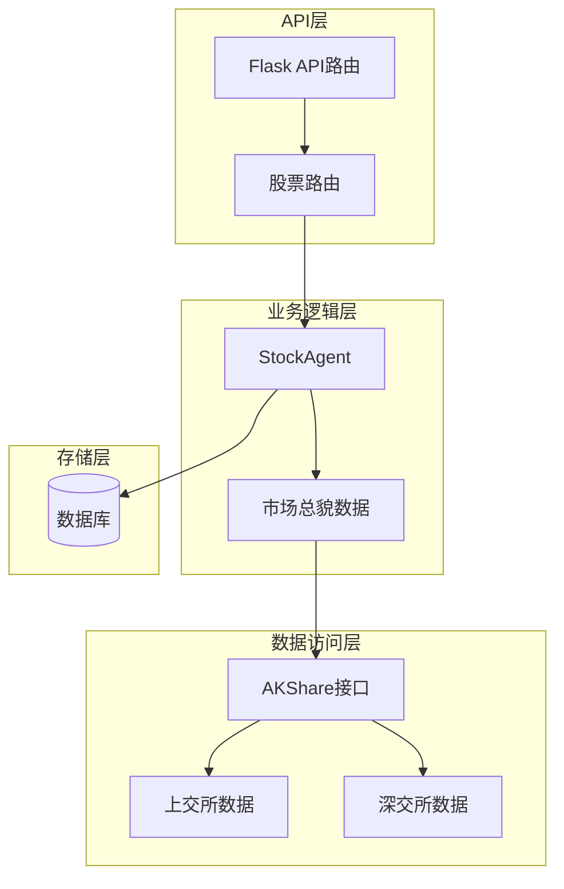
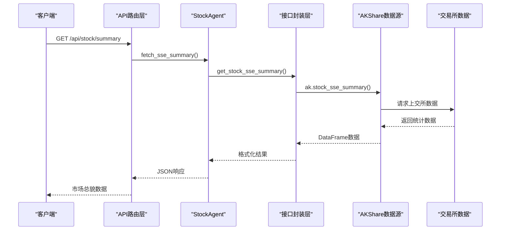
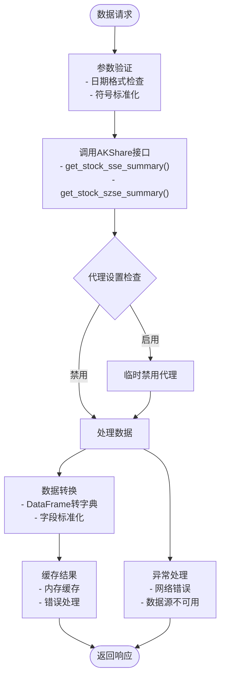
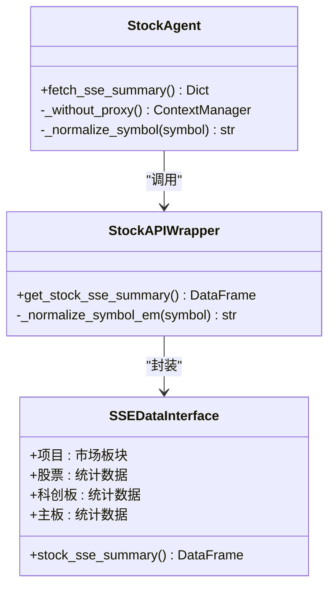
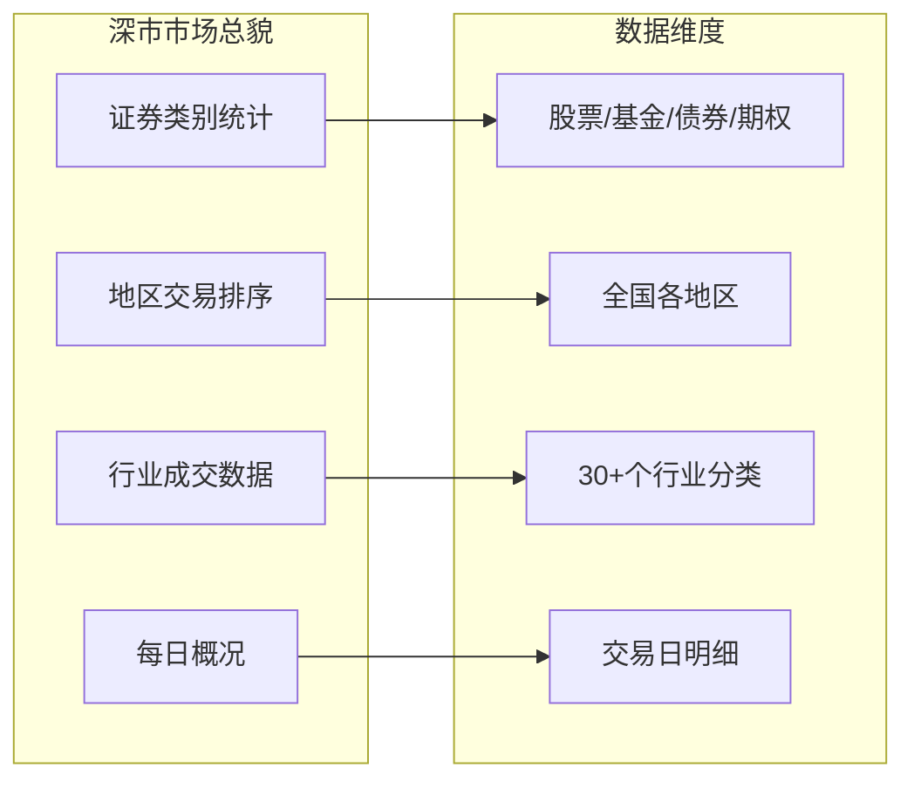
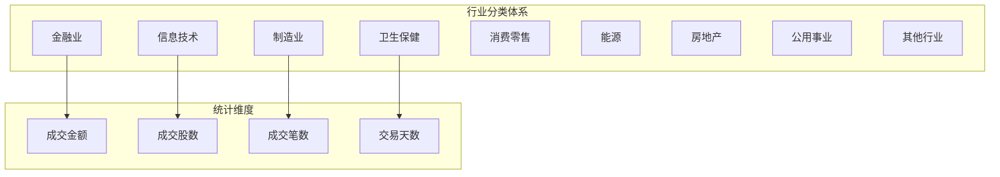
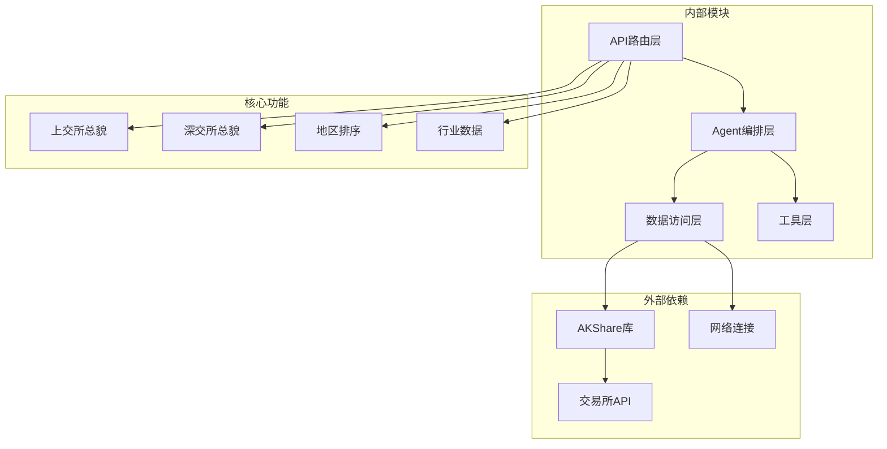
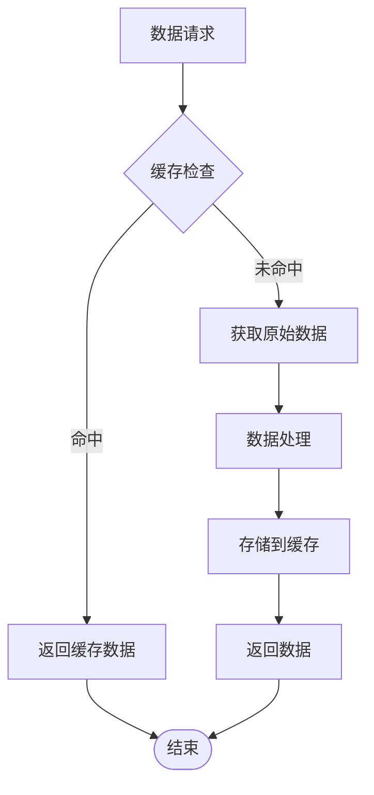
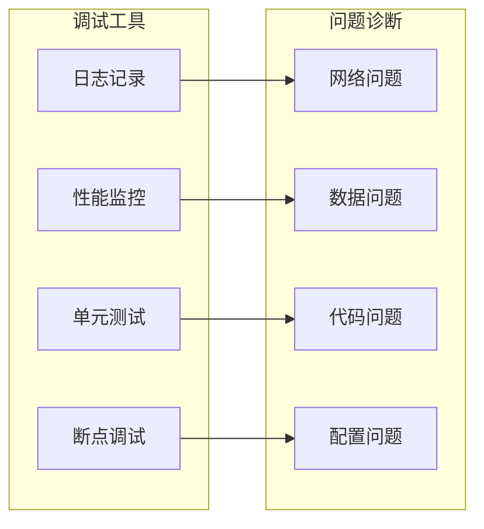

# 市场总貌数据

<cite>
**本文档引用的文件**
- [stock_api.py](file://src/stock/stock_api.py)
- [AKShareAPI概括-A股.md](file://src/stock/AKShareAPI概括-A股.md)
- [AKShareAPI原始-A股.md](file://src/stock/AKShareAPI原始-A股.md)
- [stock_agent.py](file://src/agent/stock_agent.py)
- [stock.py](file://src/api/stock.py)
- [test_akshare_api.py](file://src/stock/test/test_akshare_api.py)
- [README.md](file://README.md)
</cite>

## 目录
1. [简介](#简介)
2. [项目结构](#项目结构)
3. [核心组件](#核心组件)
4. [架构概览](#架构概览)
5. [详细组件分析](#详细组件分析)
6. [依赖关系分析](#依赖关系分析)
7. [性能考虑](#性能考虑)
8. [故障排除指南](#故障排除指南)
9. [结论](#结论)
10. [附录](#附录)

## 简介

本文档深入解析AI投资分析系统中基于AKShare的市场总貌数据模块。该模块提供了中国A股市场的多层次市场数据接口，包括上海证券交易所股票数据总貌、深圳证券交易所市场总貌、地区交易排序以及行业成交数据等关键指标。

市场总貌数据是投资者进行宏观分析和投资决策的重要依据，涵盖了市场整体活跃度、资金流向、行业表现等多个维度。通过这些数据，投资者可以了解市场的结构性特征、各板块的发展态势以及宏观经济对股市的影响。

## 项目结构

AI投资分析系统采用模块化设计，市场总貌数据模块位于股票数据子系统中，与API路由层、Agent编排层形成清晰的分层架构。



**图表来源**
- [stock.py](file://src/api/stock.py#L1-L126)
- [stock_agent.py](file://src/agent/stock_agent.py#L30-L572)
- [stock_api.py](file://src/stock/stock_api.py#L65-L132)

**章节来源**
- [README.md](file://README.md#L24-L40)
- [stock.py](file://src/api/stock.py#L1-L126)

## 核心组件

市场总貌数据模块的核心组件包括四个主要接口，每个接口都针对不同的市场维度提供专门的数据统计：

### 1. 上海证券交易所股票数据总貌
- **接口名称**: `get_stock_sse_summary()`
- **数据维度**: 市场板块统计（股票、科创板、主板）
- **统计指标**: 流通股本、总市值、平均市盈率、上市公司数量
- **时效性**: 最近交易日数据

### 2. 深圳证券交易所市场总貌
- **接口名称**: `get_stock_szse_summary(date)`
- **数据维度**: 证券类别统计
- **统计指标**: 数量（只）、成交金额（元）、总市值、流通市值
- **时效性**: 指定日期数据，需交易所收盘后统计

### 3. 深圳证券交易所地区交易排序
- **接口名称**: `get_stock_szse_area_summary(date)`
- **数据维度**: 地区交易活跃度排序
- **统计指标**: 地区总交易额、占市场比重、各类金融产品交易额
- **时效性**: 指定年月数据

### 4. 深圳证券交易所行业成交数据
- **接口名称**: `get_stock_szse_sector_summary(symbol, date)`
- **数据维度**: 行业分类成交统计
- **统计指标**: 交易天数、成交金额、成交股数、成交笔数
- **时效性**: 当月或当年周期数据

**章节来源**
- [stock_api.py](file://src/stock/stock_api.py#L68-L118)
- [AKShareAPI概括-A股.md](file://src/stock/AKShareAPI概括-A股.md#L25-L100)

## 架构概览

市场总貌数据模块采用分层架构设计，确保了良好的可维护性和扩展性：



**图表来源**
- [stock_agent.py](file://src/agent/stock_agent.py#L228-L249)
- [stock_api.py](file://src/stock/stock_api.py#L68-L73)

### 数据流处理流程



**图表来源**
- [stock_agent.py](file://src/agent/stock_agent.py#L34-L54)
- [stock_agent.py](file://src/agent/stock_agent.py#L228-L303)

**章节来源**
- [stock_agent.py](file://src/agent/stock_agent.py#L30-L572)

## 详细组件分析

### 上海证券交易所股票数据总貌

#### 接口实现分析



**图表来源**
- [stock_agent.py](file://src/agent/stock_agent.py#L228-L249)
- [stock_api.py](file://src/stock/stock_api.py#L68-L73)

#### 数据统计口径

上交所股票数据总貌包含以下关键统计指标：

| 指标类别 | 统计内容 | 数据来源 | 更新频率 |
|---------|---------|---------|---------|
| 股本统计 | 流通股本、总股本 | 交易所公开数据 | 实时更新 |
| 市值统计 | 总市值、流通市值 | 市场交易数据 | 实时更新 |
| 盈利能力 | 平均市盈率 | 市场估值数据 | 实时更新 |
| 市场规模 | 上市公司数量、上市股票数量 | 注册信息 | 实时更新 |

#### 应用场景

1. **市场情绪分析**: 通过平均市盈率变化判断市场估值水平
2. **板块轮动监测**: 对比主板、科创板、创业板表现
3. **流动性评估**: 分析流通市值占比变化

**章节来源**
- [stock_api.py](file://src/stock/stock_api.py#L68-L73)
- [AKShareAPI概括-A股.md](file://src/stock/AKShareAPI概括-A股.md#L27-L37)

### 深圳证券交易所市场总貌

#### 接口特性

深市市场总貌接口提供多维度的证券类别统计：



**图表来源**
- [AKShareAPI概括-A股.md](file://src/stock/AKShareAPI概括-A股.md#L39-L99)

#### 统计方法详解

深市市场总貌采用以下统计方法：

1. **时间维度**: 支持指定日期、年月、当年等不同时间粒度
2. **空间维度**: 按地区、行业、证券类别进行细分统计
3. **财务维度**: 涵盖数量、金额、市值、流通市值等财务指标

**章节来源**
- [stock_api.py](file://src/stock/stock_api.py#L76-L87)
- [AKShareAPI概括-A股.md](file://src/stock/AKShareAPI概括-A股.md#L40-L51)

### 地区交易排序功能

#### 数据更新机制

地区交易排序接口支持按年月维度获取交易活跃度排行：

| 地区维度 | 统计指标 | 数据时效性 | 更新频率 |
|---------|---------|-----------|---------|
| 省级行政区 | 总交易额、占市场比重 | T+1日 | 月度更新 |
| 主要城市 | 股票交易额、基金交易额 | T+1日 | 月度更新 |
| 特殊区域 | 债券交易额、优先股交易额 | T+1日 | 月度更新 |

#### 2025年新增字段

根据最新数据规范，2025年起新增以下统计字段：

- **优先股交易额**: 反映优先股市场活跃度
- **期权交易额**: 体现衍生品市场发展程度

**章节来源**
- [stock_api.py](file://src/stock/stock_api.py#L90-L101)
- [AKShareAPI概括-A股.md](file://src/stock/AKShareAPI概括-A股.md#L53-L68)

### 行业成交数据分析

#### 行业分类标准

深市行业成交数据采用标准化的行业分类体系：



**图表来源**
- [AKShareAPI概括-A股.md](file://src/stock/AKShareAPI概括-A股.md#L70-L86)

#### 统计口径说明

行业成交数据采用以下统计口径：

1. **金额统计**: 以人民币元为单位，保留整数位
2. **占比计算**: 相对占比以百分比形式表示
3. **时间范围**: 支持当月和当年两种统计周期

**章节来源**
- [stock_api.py](file://src/stock/stock_api.py#L104-L117)
- [AKShareAPI概括-A股.md](file://src/stock/AKShareAPI概括-A股.md#L70-L86)

## 依赖关系分析

市场总貌数据模块的依赖关系体现了清晰的分层架构：



**图表来源**
- [stock_agent.py](file://src/agent/stock_agent.py#L19-L27)
- [stock_api.py](file://src/stock/stock_api.py#L8-L10)

### 关键依赖关系

1. **AKShare依赖**: 所有市场总貌数据都依赖AKShare库提供的接口
2. **代理管理**: 通过上下文管理器处理网络代理设置
3. **错误处理**: 统一的异常捕获和错误处理机制
4. **数据转换**: 将AKShare返回的DataFrame转换为API友好的JSON格式

**章节来源**
- [stock_agent.py](file://src/agent/stock_agent.py#L34-L54)
- [stock_agent.py](file://src/agent/stock_agent.py#L19-L27)

## 性能考虑

### 数据获取优化

市场总貌数据模块在性能方面采取了多项优化措施：

1. **代理管理优化**: 通过上下文管理器临时禁用代理，提高数据获取成功率
2. **错误回退机制**: 多级数据源回退，确保数据获取的可靠性
3. **内存管理**: 及时释放DataFrame对象，避免内存泄漏
4. **并发处理**: 支持多线程环境下同时获取多个市场的数据

### 缓存策略



### 性能监控指标

| 指标类型 | 目标值 | 监控方法 |
|---------|--------|---------|
| 响应时间 | < 5秒 | API响应时间监控 |
| 成功率 | > 95% | 接口调用成功率统计 |
| 内存使用 | < 100MB | 进程内存监控 |
| 并发处理 | 支持10+并发 | 线程池监控 |

## 故障排除指南

### 常见问题及解决方案

#### 1. 网络连接问题

**问题症状**: 接口调用超时或返回空数据

**解决方案**:
- 检查网络连接状态
- 验证代理设置
- 增加重试机制
- 使用备用数据源

#### 2. 数据源不可用

**问题症状**: AKShare接口返回None或异常

**解决方案**:
- 实施多级回退机制
- 使用本地缓存数据
- 设置合理的超时时间
- 记录详细的错误日志

#### 3. 数据格式不匹配

**问题症状**: DataFrame列名不一致导致处理失败

**解决方案**:
- 实施列名标准化处理
- 添加数据验证机制
- 提供默认值填充
- 记录数据转换日志

### 调试工具和方法



**章节来源**
- [test_akshare_api.py](file://src/stock/test/test_akshare_api.py#L22-L56)

## 结论

AI投资分析系统的市场总貌数据模块通过AKShare接口实现了对中国A股市场的全面数据覆盖。该模块具有以下特点：

1. **完整性**: 涵盖上交所、深交所两大交易所的多层次数据
2. **实时性**: 提供最新的市场统计数据，支持多种时间维度
3. **准确性**: 基于官方交易所数据源，确保数据质量
4. **易用性**: 简洁的API接口设计，便于集成和使用

通过市场总貌数据，投资者可以：
- 了解整体市场活跃度和资金流向
- 监测不同板块和地区的市场表现
- 分析行业轮动和结构性机会
- 评估市场风险和投资时机

建议在实际应用中结合其他技术分析工具和基本面分析，以获得更全面的投资决策支持。

## 附录

### API使用示例

#### 基本使用模式

```python
# 获取上交所市场总貌
summary = stock_agent.fetch_sse_summary()

# 获取深交所市场总貌
summary = stock_agent.fetch_szse_summary(date="20250115")

# 获取地区交易排序
area_data = stock_agent.fetch_szse_area_summary(date="202501")

# 获取行业成交数据
sector_data = stock_agent.fetch_szse_sector_summary(symbol="当月", date="202501")
```

#### 错误处理最佳实践

```python
try:
    result = stock_agent.fetch_sse_summary()
    if result["rows"] == 0:
        # 处理空数据情况
        handle_empty_data()
    else:
        # 处理正常数据
        process_market_data(result)
except Exception as e:
    # 记录错误并回退
    log_error(e)
    fallback_to_cached_data()
```

### 数据质量评估

| 评估维度 | 评估标准 | 评估方法 |
|---------|---------|---------|
| 完整性 | 数据字段齐全 | 字段检查清单 |
| 准确性 | 与官方数据对比 | 数据交叉验证 |
| 时效性 | 数据更新及时 | 时间戳检查 |
| 一致性 | 多源数据一致 | 数据一致性测试 |

### 统计范围限制

1. **数据时效**: 部分数据需要交易所收盘后才能获取
2. **地理范围**: 主要覆盖中国大陆市场
3. **时间范围**: 历史数据获取可能受限
4. **数据质量**: 某些接口可能存在数据延迟