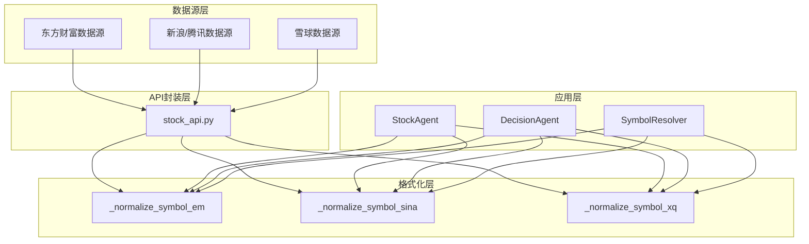
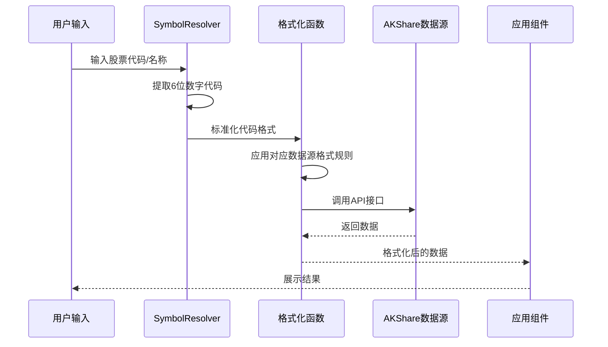
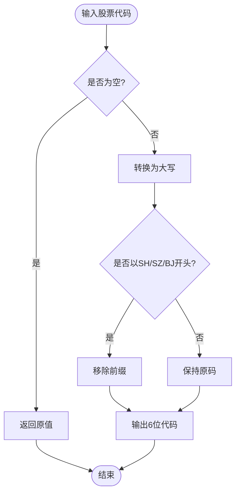
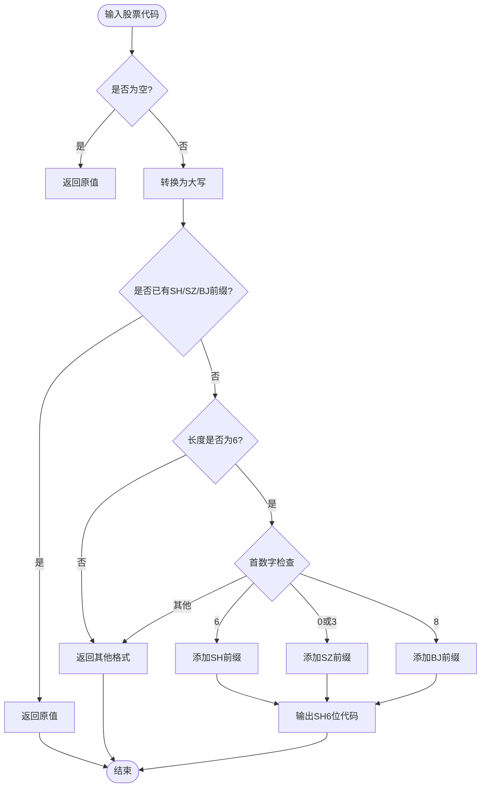
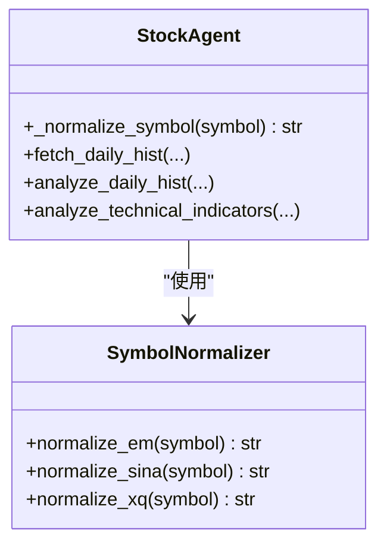
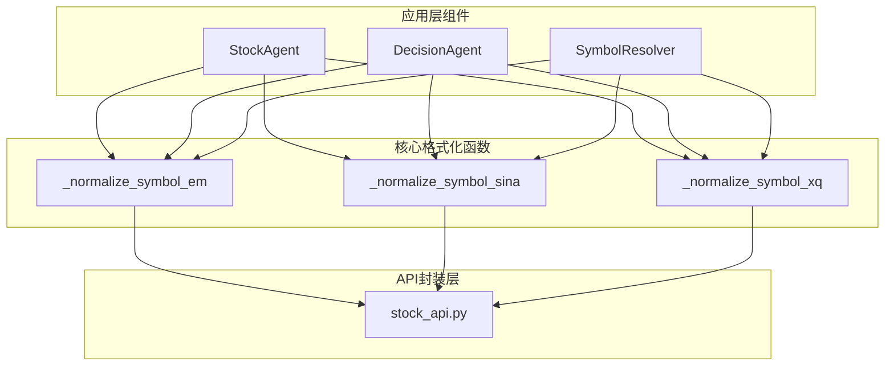

# 股票代码格式化

<cite>
**本文引用的文件**
- [stock_api.py](file://src/stock/stock_api.py)
- [stock_agent.py](file://src/agent/stock_agent.py)
- [decision_agent.py](file://src/agent/decision_agent.py)
- [symbol_resolver.py](file://src/agent/symbol_resolver.py)
- [test_akshare_api.py](file://src/stock/test/test_akshare_api.py)
- [.env.example](file://.env.example)
</cite>

## 目录
1. [引言](#引言)
2. [项目结构](#项目结构)
3. [核心组件](#核心组件)
4. [架构概览](#架构概览)
5. [详细组件分析](#详细组件分析)
6. [依赖关系分析](#依赖关系分析)
7. [性能考虑](#性能考虑)
8. [故障排除指南](#故障排除指南)
9. [结论](#结论)
10. [附录](#附录)

## 引言
本文档深入解析AI投资项目的股票代码格式化模块，重点阐述AKShare数据源中三种主要股票代码格式的规范化处理机制。该模块通过统一的代码格式化策略，确保不同数据源（东方财富、新浪/腾讯、雪球）之间的代码格式兼容性，为跨平台数据集成和API调用提供可靠的基础。

## 项目结构
该项目采用分层架构设计，股票代码格式化功能分布在多个组件中：
- 核心格式化模块：位于stock_api.py中的三个标准化函数
- 应用层格式化：位于stock_agent.py和decision_agent.py中的格式化方法
- 解析器组件：位于symbol_resolver.py中的代码提取和解析逻辑
- 测试验证：位于test_akshare_api.py中的格式化测试用例

**图表来源**
- [stock_api.py](file://src/stock/stock_api.py#L15-L62)
- [stock_agent.py](file://src/agent/stock_agent.py#L170-L182)
- [decision_agent.py](file://src/agent/decision_agent.py#L247-L254)
- [symbol_resolver.py](file://src/agent/symbol_resolver.py#L35-L39)

**章节来源**
- [stock_api.py](file://src/stock/stock_api.py#L1-L425)
- [stock_agent.py](file://src/agent/stock_agent.py#L1-L572)
- [decision_agent.py](file://src/agent/decision_agent.py#L1-L526)

## 核心组件
股票代码格式化模块由三个核心组件构成：

### 1. 东方财富格式标准化 (_normalize_symbol_em)
- **特点**：不带市场前缀的6位数字代码
- **处理逻辑**：将输入转换为大写，去除SH/SZ/BJ前缀
- **适用场景**：东方财富数据源的API调用

### 2. 新浪/腾讯格式标准化 (_normalize_symbol_sina)
- **特点**：小写市场前缀 (sh/sz/bj) + 6位代码
- **处理逻辑**：转换为小写，自动识别6位代码并添加相应前缀
- **适用场景**：新浪、腾讯等第三方数据源

### 3. 雪球格式标准化 (_normalize_symbol_xq)
- **特点**：大写市场前缀 (SH/SZ/BJ) + 6位代码
- **处理逻辑**：转换为大写，自动识别6位代码并添加相应前缀
- **适用场景**：雪球财经数据源

**章节来源**
- [stock_api.py](file://src/stock/stock_api.py#L15-L62)

## 架构概览
股票代码格式化在整个系统中的作用流程如下：

**图表来源**
- [symbol_resolver.py](file://src/agent/symbol_resolver.py#L35-L39)
- [stock_api.py](file://src/stock/stock_api.py#L15-L62)
- [stock_agent.py](file://src/agent/stock_agent.py#L170-L182)

## 详细组件分析

### 东方财富格式标准化 (_normalize_symbol_em)
东方财富格式的标准化处理具有以下特点：

#### 处理规则
1. **输入验证**：检查空值，直接返回原值
2. **大小写转换**：统一转换为大写
3. **前缀移除**：去除SH/SZ/BJ市场前缀
4. **输出格式**：纯6位数字代码

#### 转换逻辑流程

**图表来源**
- [stock_api.py](file://src/stock/stock_api.py#L15-L24)

#### 应用场景
- 东方财富个股信息查询
- 东方财富历史行情数据获取
- 东方财富实时行情数据处理

**章节来源**
- [stock_api.py](file://src/stock/stock_api.py#L15-L24)

### 新浪/腾讯格式标准化 (_normalize_symbol_sina)
新浪/腾讯格式的标准化处理具有以下特点：

#### 处理规则
1. **输入验证**：检查空值，直接返回原值
2. **大小写转换**：统一转换为小写
3. **前缀检查**：如果已包含sh/sz/bj前缀，直接返回
4. **6位代码识别**：
   - 以6开头：自动添加sh前缀
   - 以0或3开头：自动添加sz前缀
   - 以8开头：自动添加bj前缀
5. **输出格式**：sh/sz/bj + 6位代码

#### 转换逻辑流程

**图表来源**
- [stock_api.py](file://src/stock/stock_api.py#L27-L43)

#### 应用场景
- 新浪财经日线数据获取
- 腾讯证券历史数据查询
- 新浪分时数据获取

**章节来源**
- [stock_api.py](file://src/stock/stock_api.py#L27-L43)

### 雪球格式标准化 (_normalize_symbol_xq)
雪球格式的标准化处理具有以下特点：

#### 处理规则
1. **输入验证**：检查空值，直接返回原值
2. **大小写转换**：统一转换为大写
3. **前缀检查**：如果已包含SH/SZ/BJ前缀，直接返回
4. **6位代码识别**：
   - 以6开头：自动添加SH前缀
   - 以0或3开头：自动添加SZ前缀
   - 以8开头：自动添加BJ前缀
5. **输出格式**：SH/SZ/BJ + 6位代码

#### 转换逻辑流程

**图表来源**
- [stock_api.py](file://src/stock/stock_api.py#L46-L62)

#### 应用场景
- 雪球财经个股信息查询
- 雪球财经公司概况获取
- 雪球数据源API调用

**章节来源**
- [stock_api.py](file://src/stock/stock_api.py#L46-L62)

### 应用层格式化实现

#### StockAgent中的格式化方法
StockAgent实现了统一的代码格式化方法，用于内部处理：

**图表来源**
- [stock_agent.py](file://src/agent/stock_agent.py#L170-L182)
- [stock_api.py](file://src/stock/stock_api.py#L15-L62)

#### DecisionAgent中的格式化方法
DecisionAgent提供了更简洁的格式化方法：

**章节来源**
- [stock_agent.py](file://src/agent/stock_agent.py#L170-L182)
- [decision_agent.py](file://src/agent/decision_agent.py#L247-L254)

### 解析器组件的代码提取
SymbolResolver组件负责从自然语言中提取股票代码：

#### 代码提取逻辑
- 支持多种格式的6位数字代码识别
- 忽略大小写和特殊字符
- 自动去除市场后缀（如.SH/.SZ/.SS/.BJ）

**章节来源**
- [symbol_resolver.py](file://src/agent/symbol_resolver.py#L35-L39)

## 依赖关系分析

### 组件耦合度分析
股票代码格式化模块展现了良好的内聚性和低耦合性：

**图表来源**
- [stock_api.py](file://src/stock/stock_api.py#L15-L62)
- [stock_agent.py](file://src/agent/stock_agent.py#L170-L182)
- [decision_agent.py](file://src/agent/decision_agent.py#L247-L254)
- [symbol_resolver.py](file://src/agent/symbol_resolver.py#L35-L39)

### 外部依赖关系
- **AKShare库**：作为底层数据源访问接口
- **环境变量**：配置API密钥和代理设置
- **测试框架**：验证格式化逻辑的正确性

**章节来源**
- [test_akshare_api.py](file://src/stock/test/test_akshare_api.py#L105-L109)

## 性能考虑
股票代码格式化操作具有以下性能特征：

### 时间复杂度
- **格式化操作**：O(n)，其中n为输入字符串长度
- **正则表达式匹配**：O(m)，其中m为文本长度
- **整体复杂度**：O(n+m)，属于线性时间复杂度

### 空间复杂度
- **内存使用**：O(1)，只使用常量额外空间
- **字符串处理**：O(n)，创建新的字符串对象

### 优化建议
1. **缓存策略**：对频繁使用的格式化结果进行缓存
2. **批量处理**：支持批量代码格式化以提高效率
3. **预编译正则**：预编译正则表达式以提升匹配速度

## 故障排除指南

### 常见问题及解决方案

#### 1. 格式化失败
**问题**：代码格式化后无法识别
**解决方案**：
- 检查输入是否为有效的6位数字
- 确认市场前缀是否正确
- 验证代码是否存在于数据库中

#### 2. 数据源兼容性问题
**问题**：不同数据源返回格式不一致
**解决方案**：
- 使用对应的格式化函数
- 在API调用前统一格式化
- 实施降级策略

#### 3. 性能问题
**问题**：大量代码格式化导致性能下降
**解决方案**：
- 实施缓存机制
- 使用批量处理
- 优化正则表达式

### 错误处理策略
1. **输入验证**：检查空值和无效格式
2. **异常捕获**：捕获格式化过程中的异常
3. **降级处理**：提供默认值和回退方案
4. **日志记录**：记录格式化失败的原因

**章节来源**
- [stock_api.py](file://src/stock/stock_api.py#L15-L62)
- [test_akshare_api.py](file://src/stock/test/test_akshare_api.py#L22-L56)

## 结论
股票代码格式化模块通过标准化的格式化策略，有效解决了多数据源之间的代码格式兼容性问题。该模块具有以下优势：

1. **统一性**：提供一致的代码格式化标准
2. **兼容性**：支持多种数据源的格式要求
3. **可扩展性**：易于添加新的数据源支持
4. **可靠性**：完善的错误处理和降级机制

通过合理使用这些格式化函数，可以确保在不同数据源之间无缝切换，提高系统的整体稳定性和用户体验。

## 附录

### 最佳实践指南

#### 1. 代码格式化最佳实践
- 在API调用前始终进行格式化
- 根据数据源选择合适的格式化函数
- 实施输入验证和错误处理
- 使用缓存机制提升性能

#### 2. 常见应用场景
- **数据源切换**：在不同数据源间迁移时保持代码一致性
- **跨平台兼容**：确保代码在不同平台间的兼容性
- **API调用适配**：为不同API接口提供正确的参数格式

#### 3. 配置建议
- 设置适当的缓存策略
- 配置环境变量以支持代理和认证
- 实施监控和日志记录机制

**章节来源**
- [.env.example](file://.env.example#L1-L19)