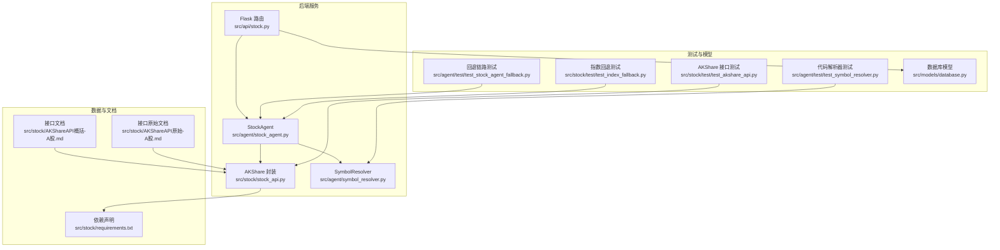
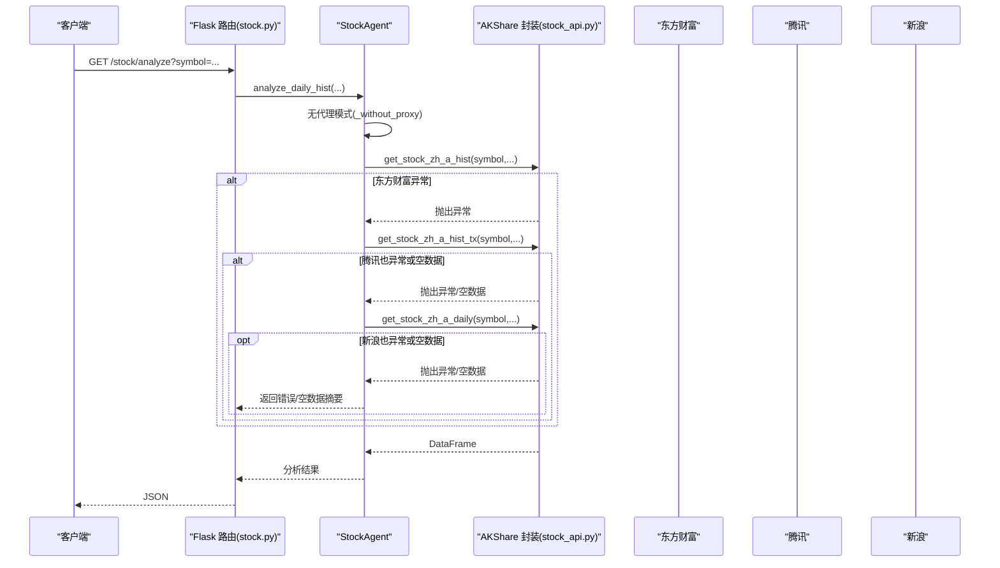
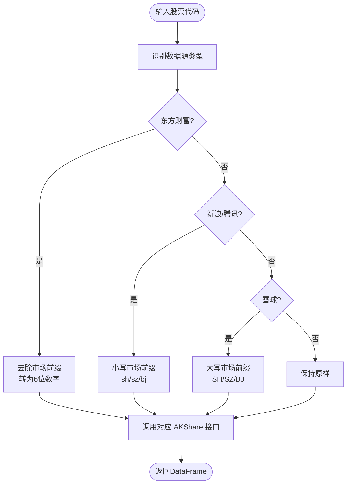
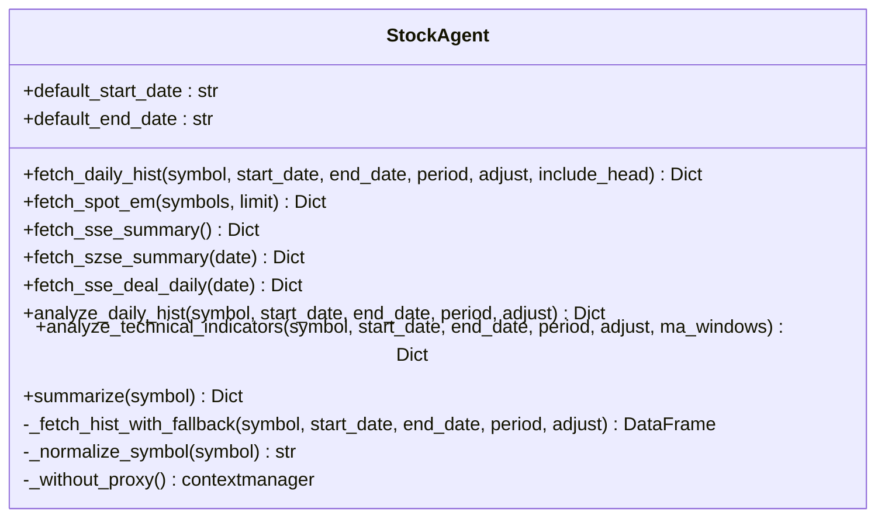
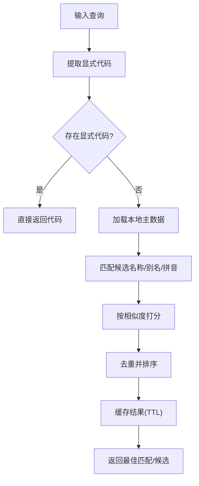
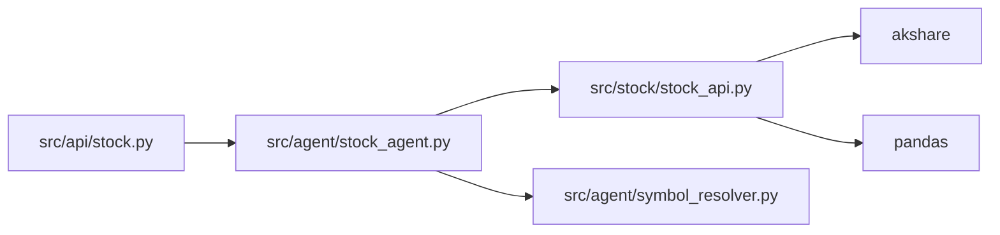

# 股票数据服务

<cite>
**本文引用的文件**
- [stock_api.py](file://src/stock/stock_api.py)
- [requirements.txt](file://src/stock/requirements.txt)
- [stock.py](file://src/api/stock.py)
- [stock_agent.py](file://src/agent/stock_agent.py)
- [symbol_resolver.py](file://src/agent/symbol_resolver.py)
- [test_akshare_api.py](file://src/stock/test/test_akshare_api.py)
- [test_index_fallback.py](file://src/stock/test/test_index_fallback.py)
- [test_stock_agent_fallback.py](file://src/agent/test/test_stock_agent_fallback.py)
- [test_symbol_resolver.py](file://src/agent/test/test_symbol_resolver.py)
- [AKShareAPI概括-A股.md](file://src/stock/AKShareAPI概括-A股.md)
- [AKShareAPI原始-A股.md](file://src/stock/AKShareAPI原始-A股.md)
- [README.md](file://README.md)
- [database.py](file://src/models/database.py)
</cite>

## 目录
1. [简介](#简介)
2. [项目结构](#项目结构)
3. [核心组件](#核心组件)
4. [架构总览](#架构总览)
5. [详细组件分析](#详细组件分析)
6. [依赖关系分析](#依赖关系分析)
7. [性能考虑](#性能考虑)
8. [故障排查指南](#故障排查指南)
9. [结论](#结论)
10. [附录](#附录)

## 简介
本文件面向“股票数据服务”的实现与使用，聚焦于 AKShare 数据源的集成与封装，涵盖以下方面：
- 股票数据获取接口类型：实时行情、历史行情、分时、盘前、日内分时等
- 股票代码格式规范化：统一不同数据源的代码格式（东方财富、新浪、雪球等）
- 数据质量保障：网络异常处理、数据源降级、错误回退链路
- 数据缓存与性能优化：批量获取、缓存策略、数据压缩存储建议
- 数据格式标准化：字段映射、数据验证与兼容性处理
- 扩展新数据源的开发指南与最佳实践

## 项目结构
该项目采用“模块化+分层”组织方式，股票数据服务主要位于 src/stock 与 src/agent 下，并通过 Flask 路由对外提供 API。

图表来源
- [stock.py](file://src/api/stock.py#L1-L126)
- [stock_agent.py](file://src/agent/stock_agent.py#L1-L572)
- [stock_api.py](file://src/stock/stock_api.py#L1-L425)
- [symbol_resolver.py](file://src/agent/symbol_resolver.py#L1-L244)
- [requirements.txt](file://src/stock/requirements.txt#L1-L2)
- [AKShareAPI概括-A股.md](file://src/stock/AKShareAPI概括-A股.md#L1-L530)
- [AKShareAPI原始-A股.md](file://src/stock/AKShareAPI原始-A股.md#L1-L200)
- [test_akshare_api.py](file://src/stock/test/test_akshare_api.py#L1-L253)
- [test_stock_agent_fallback.py](file://src/agent/test/test_stock_agent_fallback.py#L1-L83)
- [test_index_fallback.py](file://src/stock/test/test_index_fallback.py#L1-L32)
- [test_symbol_resolver.py](file://src/agent/test/test_symbol_resolver.py#L1-L38)
- [database.py](file://src/models/database.py#L1-L86)

章节来源
- [README.md](file://README.md#L1-L215)
- [stock.py](file://src/api/stock.py#L1-L126)
- [stock_agent.py](file://src/agent/stock_agent.py#L1-L572)
- [stock_api.py](file://src/stock/stock_api.py#L1-L425)
- [symbol_resolver.py](file://src/agent/symbol_resolver.py#L1-L244)
- [requirements.txt](file://src/stock/requirements.txt#L1-L2)
- [AKShareAPI概括-A股.md](file://src/stock/AKShareAPI概括-A股.md#L1-L530)
- [AKShareAPI原始-A股.md](file://src/stock/AKShareAPI原始-A股.md#L1-L200)
- [test_akshare_api.py](file://src/stock/test/test_akshare_api.py#L1-L253)
- [test_stock_agent_fallback.py](file://src/agent/test/test_stock_agent_fallback.py#L1-L83)
- [test_index_fallback.py](file://src/stock/test/test_index_fallback.py#L1-L32)
- [test_symbol_resolver.py](file://src/agent/test/test_symbol_resolver.py#L1-L38)
- [database.py](file://src/models/database.py#L1-L86)

## 核心组件
- AKShare 封装层（stock_api.py）
  - 提供统一接口，屏蔽不同数据源的参数与格式差异
  - 内置代码格式规范化函数，适配东方财富、新浪、雪球等
  - 暴露市场总貌、实时行情、历史行情、分时、盘前、日内分时、个股信息、报价、同行比较等接口
- 股票 Agent（stock_agent.py）
  - 对外提供高层分析与汇总能力
  - 实现历史行情数据的多数据源降级回退链路
  - 提供代理绕过代理（无代理模式）以规避网络问题
  - 统一股票代码格式，兼容多种输入形式
- 代码解析器（symbol_resolver.py）
  - 将公司名/别名解析为标准 6 位代码，优先使用本地主数据
  - 支持缓存与 TTL 控制，减少对外部接口依赖
- API 路由（stock.py）
  - 提供 /analyze、/technical、/history、/summary 等接口
  - 与 StockAgent 对接，返回结构化分析结果
- 测试与文档
  - 接口测试脚本验证各数据源可用性与稳定性
  - 回退链路测试确保主数据源异常时的容错
  - 代码解析器测试验证解析准确性
  - 文档文件提供接口参数、字段与示例

章节来源
- [stock_api.py](file://src/stock/stock_api.py#L1-L425)
- [stock_agent.py](file://src/agent/stock_agent.py#L1-L572)
- [symbol_resolver.py](file://src/agent/symbol_resolver.py#L1-L244)
- [stock.py](file://src/api/stock.py#L1-L126)
- [test_akshare_api.py](file://src/stock/test/test_akshare_api.py#L1-L253)
- [test_stock_agent_fallback.py](file://src/agent/test/test_stock_agent_fallback.py#L1-L83)
- [test_symbol_resolver.py](file://src/agent/test/test_symbol_resolver.py#L1-L38)
- [AKShareAPI概括-A股.md](file://src/stock/AKShareAPI概括-A股.md#L1-L530)

## 架构总览
下图展示从 API 请求到数据源调用与回退的整体流程：

图表来源
- [stock.py](file://src/api/stock.py#L16-L105)
- [stock_agent.py](file://src/agent/stock_agent.py#L68-L168)
- [stock_api.py](file://src/stock/stock_api.py#L212-L252)

章节来源
- [stock.py](file://src/api/stock.py#L1-L126)
- [stock_agent.py](file://src/agent/stock_agent.py#L1-L572)
- [stock_api.py](file://src/stock/stock_api.py#L1-L425)

## 详细组件分析

### 组件A：AKShare 封装层（stock_api.py）
- 职责
  - 对接 AKShare 各接口，提供统一调用入口
  - 规范化股票代码格式，适配不同数据源的输入要求
  - 暴露市场总貌、实时行情、历史行情、分时、盘前、日内分时、个股信息、报价、同行比较等接口
- 关键点
  - 代码格式规范化函数：_normalize_symbol_em、_normalize_symbol_sina、_normalize_symbol_xq
  - 推荐稳定接口列表：get_recommended_apis
  - 依赖版本：akshare、pandas
- 数据源差异处理
  - 东方财富：6 位纯数字代码
  - 新浪/腾讯：小写市场前缀 sh/sz/bj
  - 雪球：大写市场前缀 SH/SZ/BJ

图表来源
- [stock_api.py](file://src/stock/stock_api.py#L15-L62)
- [stock_api.py](file://src/stock/stock_api.py#L212-L283)

章节来源
- [stock_api.py](file://src/stock/stock_api.py#L1-L425)
- [requirements.txt](file://src/stock/requirements.txt#L1-L2)

### 组件B：StockAgent（股票 Agent）
- 职责
  - 对外提供分析与汇总能力：历史行情、实时行情、市场总貌、技术指标等
  - 实现历史行情多数据源降级回退链路：东方财富 -> 腾讯 -> 新浪
  - 统一股票代码格式，兼容多种输入形式（.SH/.SZ/.BJ 后缀、带/不带市场前缀）
  - 在无代理模式下发起请求，规避代理导致的网络问题
- 关键流程
  - fetch_daily_hist：获取历史行情并返回摘要
  - analyze_daily_hist：计算关键指标（涨跌幅、波动率、成交量/成交额均值等）
  - analyze_technical_indicators：计算均线、趋势、动量等技术指标
  - summarize：整合分析与技术指标结果
- 错误处理
  - 捕获异常并记录日志
  - 回退链路确保在主数据源失败时仍能获取数据

图表来源
- [stock_agent.py](file://src/agent/stock_agent.py#L30-L572)

章节来源
- [stock_agent.py](file://src/agent/stock_agent.py#L1-L572)

### 组件C：SymbolResolver（代码解析器）
- 职责
  - 将公司名/别名解析为标准 6 位股票代码
  - 优先使用本地主数据文件，支持 JSON/文本两种格式
  - 支持缓存与 TTL 控制，提升解析性能与稳定性
- 关键流程
  - 解析输入文本，提取显式代码与候选名称
  - 本地主数据去重与匹配，按相似度打分
  - 返回最佳匹配与候选列表，支持模糊选择

图表来源
- [symbol_resolver.py](file://src/agent/symbol_resolver.py#L18-L244)

章节来源
- [symbol_resolver.py](file://src/agent/symbol_resolver.py#L1-L244)

### 组件D：API 路由（stock.py）
- 职责
  - 对外暴露 /stock/analyze、/stock/technical、/stock/history、/stock/summary 等接口
  - 参数校验与错误处理，返回结构化 JSON
- 与 Agent 的交互
  - 调用 StockAgent 的分析与汇总方法
  - 将结果返回给客户端

章节来源
- [stock.py](file://src/api/stock.py#L1-L126)

### 组件E：测试与验证
- 接口可用性测试（test_akshare_api.py）
  - 覆盖市场总貌、历史行情、分时、盘前、日内分时、个股信息、报价等接口
  - 支持加载 .env 以启用雪球 token
- 回退链路测试（test_stock_agent_fallback.py）
  - 模拟主数据源异常与空数据场景，验证回退至腾讯/新浪
- 指数回退测试（test_index_fallback.py）
  - 验证指数代码的回退链路与无代理模式
- 代码解析器测试（test_symbol_resolver.py）
  - 验证显式代码解析、公司名解析与未知名称处理

章节来源
- [test_akshare_api.py](file://src/stock/test/test_akshare_api.py#L1-L253)
- [test_stock_agent_fallback.py](file://src/agent/test/test_stock_agent_fallback.py#L1-L83)
- [test_index_fallback.py](file://src/stock/test/test_index_fallback.py#L1-L32)
- [test_symbol_resolver.py](file://src/agent/test/test_symbol_resolver.py#L1-L38)

## 依赖关系分析
- 组件耦合
  - API 路由依赖 StockAgent
  - StockAgent 依赖 AKShare 封装层与 SymbolResolver
  - AKShare 封装层依赖 akshare/pandas
- 外部依赖
  - akshare>=1.0.0
  - pandas>=1.3.0
- 潜在风险
  - 数据源可用性波动（网络/风控/限流）
  - 不同数据源字段与命名差异
  - 代理配置不当导致请求失败

图表来源
- [stock.py](file://src/api/stock.py#L1-L126)
- [stock_agent.py](file://src/agent/stock_agent.py#L1-L572)
- [stock_api.py](file://src/stock/stock_api.py#L1-L425)
- [requirements.txt](file://src/stock/requirements.txt#L1-L2)

章节来源
- [stock.py](file://src/api/stock.py#L1-L126)
- [stock_agent.py](file://src/agent/stock_agent.py#L1-L572)
- [stock_api.py](file://src/stock/stock_api.py#L1-L425)
- [requirements.txt](file://src/stock/requirements.txt#L1-L2)

## 性能考虑
- 无代理模式
  - 在 StockAgent 中提供无代理上下文管理器，避免代理导致的超时与失败
- 代码解析缓存
  - SymbolResolver 支持缓存与 TTL，减少重复解析成本
- 数据源降级回退
  - 历史行情优先使用高质量数据源，失败时自动回退，提高成功率
- 字段标准化与兼容
  - 统一列名（日期/开盘/收盘/最高/最低/涨跌幅/成交量/成交额等），增强后续分析一致性
- 批量与压缩建议
  - 批量获取历史数据时，建议合并请求参数，减少往返次数
  - 存储阶段可采用压缩格式（如 parquet）与分区策略，提升读写效率

[本节为通用性能建议，无需特定文件引用]

## 故障排查指南
- 网络异常与代理问题
  - 使用 StockAgent 的无代理模式，设置环境变量以禁用代理
  - 指数回退测试脚本展示了如何强制无代理运行
- 数据源可用性
  - 接口可用性测试脚本可快速验证各接口状态
  - 若某接口返回空数据或抛出异常，检查参数格式与数据源可用性
- 代码格式问题
  - 使用 StockAgent 的统一代码规范化方法，兼容多种输入格式
  - SymbolResolver 可辅助从公司名解析到标准代码
- 回退链路验证
  - 回退链路测试脚本模拟主数据源异常与空数据场景，确保容错机制有效

章节来源
- [stock_agent.py](file://src/agent/stock_agent.py#L34-L54)
- [test_index_fallback.py](file://src/stock/test/test_index_fallback.py#L16-L27)
- [test_akshare_api.py](file://src/stock/test/test_akshare_api.py#L1-L253)
- [test_stock_agent_fallback.py](file://src/agent/test/test_stock_agent_fallback.py#L1-L83)

## 结论
本项目通过 AKShare 封装层与 StockAgent 的协同，实现了对多数据源的统一接入与容错回退，结合 SymbolResolver 的本地主数据与缓存机制，提升了系统的稳定性与性能。接口文档与测试脚本为使用者提供了清晰的使用路径与验证手段。建议在生产环境中配合缓存与压缩存储策略，进一步优化吞吐与延迟。

[本节为总结性内容，无需特定文件引用]

## 附录

### A. 接口类型与用途概览
- 市场总貌
  - 上交所/深交所/科创板等市场概况与统计
- 实时行情
  - 东方财富/新浪等数据源的实时快照
- 历史行情
  - 日线/周线/月线，支持前复权/后复权
- 分时与盘前
  - 分钟级数据与盘前数据
- 个股信息与报价
  - 公司基础信息与买卖盘报价
- 同行比较
  - 成长性、估值、杜邦分析、公司规模对比

章节来源
- [AKShareAPI概括-A股.md](file://src/stock/AKShareAPI概括-A股.md#L1-L530)
- [AKShareAPI原始-A股.md](file://src/stock/AKShareAPI原始-A股.md#L1-L200)

### B. 数据质量保证策略
- 网络异常处理
  - 无代理模式与异常捕获
- 数据源降级
  - 历史行情回退链路：东方财富 -> 腾讯 -> 新浪
- 错误重试机制
  - 建议在上层调用处增加指数回退测试脚本的思路，对关键接口进行重试与熔断

章节来源
- [stock_agent.py](file://src/agent/stock_agent.py#L129-L168)
- [test_stock_agent_fallback.py](file://src/agent/test/test_stock_agent_fallback.py#L22-L82)
- [test_index_fallback.py](file://src/stock/test/test_index_fallback.py#L21-L28)

### C. 数据缓存策略与性能优化建议
- 缓存
  - SymbolResolver 的 TTL 缓存
  - 历史数据可按日期/代码分区缓存
- 压缩存储
  - 使用 parquet 等列式存储格式
- 批量获取
  - 合理合并请求参数，减少网络往返
- 字段映射与验证
  - 统一列名与数据类型，便于后续分析与可视化

章节来源
- [symbol_resolver.py](file://src/agent/symbol_resolver.py#L21-L27)
- [stock_agent.py](file://src/agent/stock_agent.py#L363-L432)

### D. 扩展新数据源的开发指南与最佳实践
- 步骤
  - 在 AKShare 封装层新增接口函数，负责参数规范化与调用
  - 在 StockAgent 中补充回退链路或分析逻辑
  - 编写测试脚本验证可用性与稳定性
  - 更新推荐接口列表与文档
- 最佳实践
  - 保持统一的参数与返回格式
  - 优先使用高质量数据源作为主链路
  - 为每个新接口提供无代理模式与异常处理
  - 建立缓存与降级策略，提升鲁棒性

章节来源
- [stock_api.py](file://src/stock/stock_api.py#L1-L425)
- [stock_agent.py](file://src/agent/stock_agent.py#L1-L572)
- [test_akshare_api.py](file://src/stock/test/test_akshare_api.py#L1-L253)
- [AKShareAPI概括-A股.md](file://src/stock/AKShareAPI概括-A股.md#L1-L530)