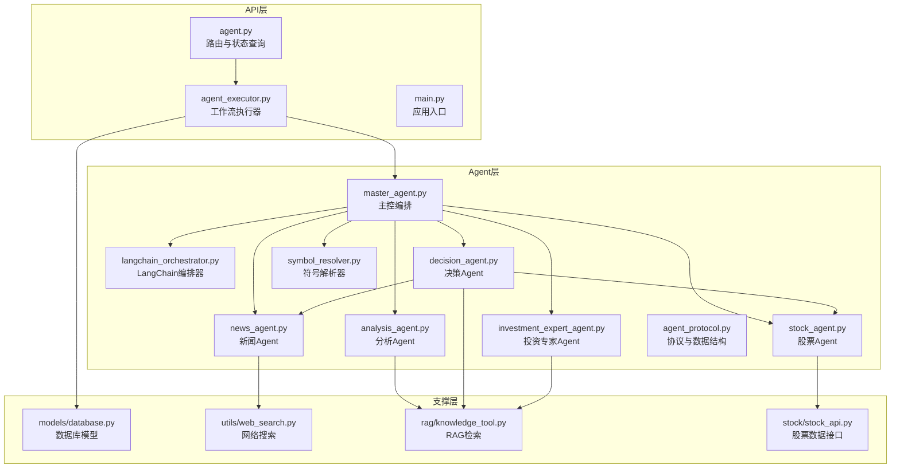
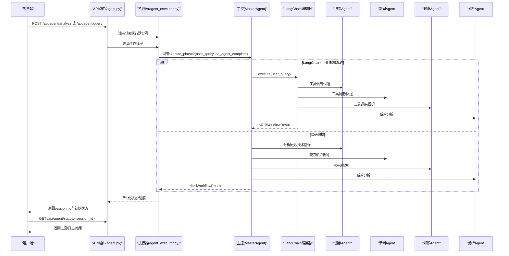
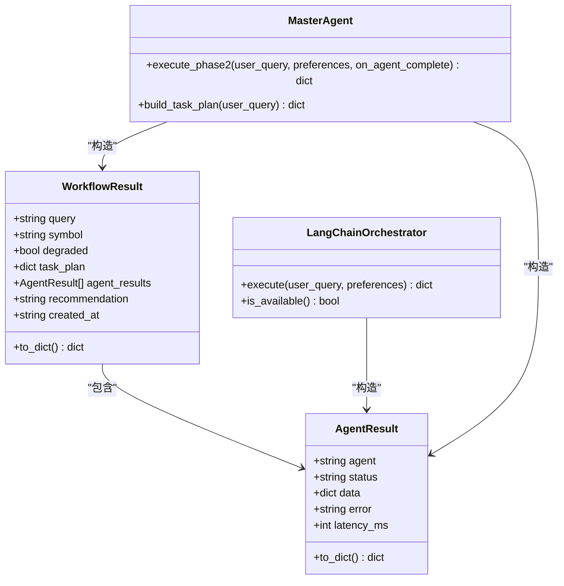
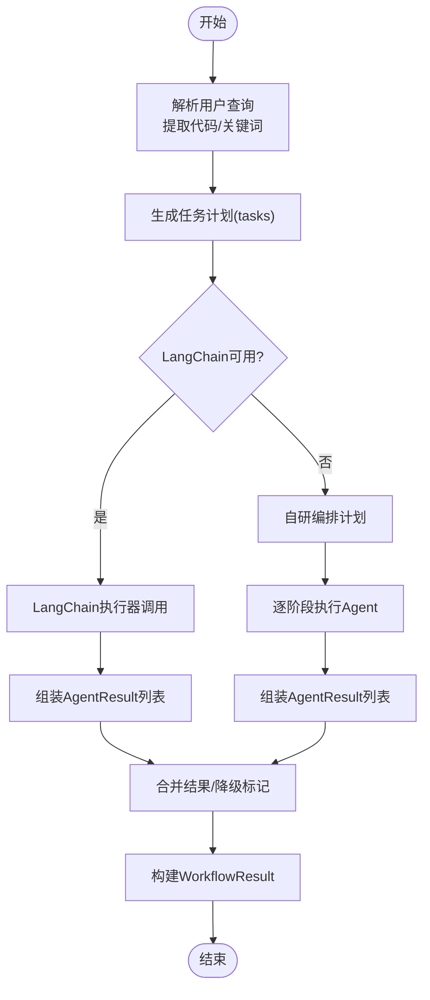
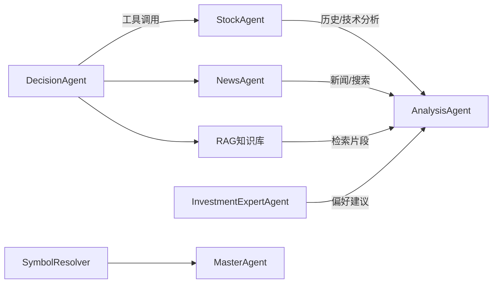
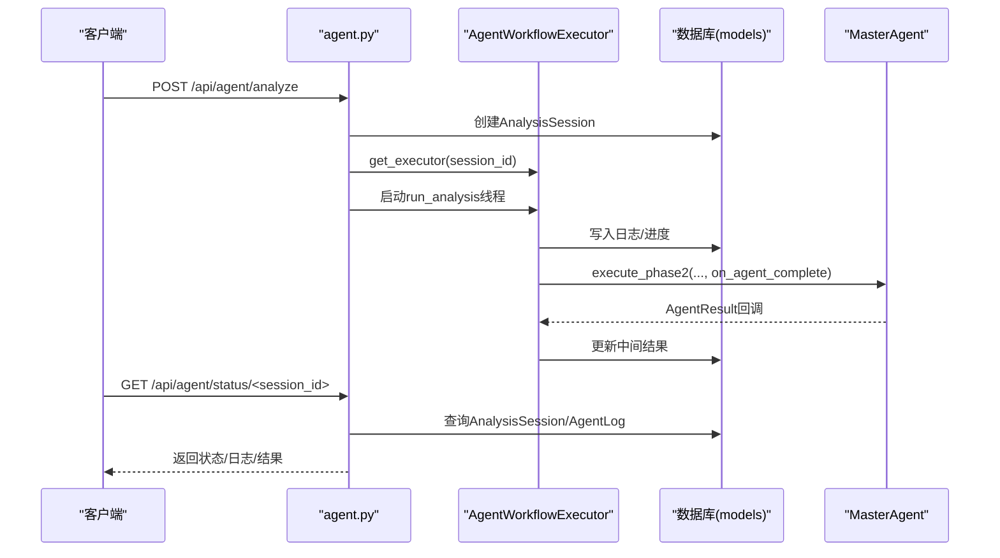
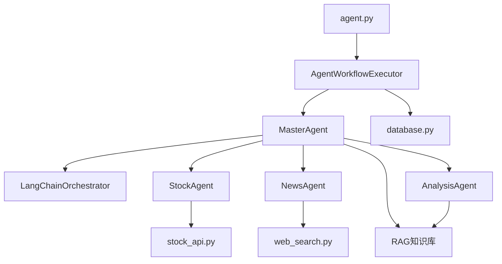

# Agent协议与通信

<cite>
**本文引用的文件**
- [agent_protocol.py](file://src/agent/agent_protocol.py)
- [langchain_orchestrator.py](file://src/agent/langchain_orchestrator.py)
- [master_agent.py](file://src/agent/master_agent.py)
- [stock_agent.py](file://src/agent/stock_agent.py)
- [news_agent.py](file://src/agent/news_agent.py)
- [analysis_agent.py](file://src/agent/analysis_agent.py)
- [symbol_resolver.py](file://src/agent/symbol_resolver.py)
- [decision_agent.py](file://src/agent/decision_agent.py)
- [investment_expert_agent.py](file://src/agent/investment_expert_agent.py)
- [agent_executor.py](file://src/api/agent_executor.py)
- [agent.py](file://src/api/agent.py)
- [main.py](file://src/api/main.py)
- [database.py](file://src/models/database.py)
- [web_search.py](file://src/utils/web_search.py)
- [knowledge_tool.py](file://src/rag/knowledge_tool.py)
- [stock_api.py](file://src/stock/stock_api.py)
- [test_master_agent.py](file://src/agent/test/test_master_agent.py)
</cite>

## 目录
1. [引言](#引言)
2. [项目结构](#项目结构)
3. [核心组件](#核心组件)
4. [架构总览](#架构总览)
5. [详细组件分析](#详细组件分析)
6. [依赖关系分析](#依赖关系分析)
7. [性能考量](#性能考量)
8. [故障排查指南](#故障排查指南)
9. [结论](#结论)
10. [附录](#附录)

## 引言
本文件聚焦“Agent协议与通信”主题，系统阐述智能体间通信协议、消息格式、状态同步、错误传播与降级策略，以及AgentResult与WorkflowResult的数据结构设计。同时，详解LangChain Orchestrator的集成方式与自定义编排器实现细节，覆盖Agent生命周期管理、资源调度与并发控制机制，并提供通信示例与协议扩展方法。

## 项目结构
本项目采用模块化分层组织：
- agent层：定义Agent协议、各专业Agent（股票、新闻、分析、决策、投资专家）、编排器与符号解析器
- api层：Flask路由与执行器，提供HTTP接口与状态查询
- models层：数据库模型，记录会话与日志
- rag/stock/utils：外部能力封装（RAG检索、股票数据、网络搜索）

图表来源
- [agent.py](file://src/api/agent.py#L1-L208)
- [agent_executor.py](file://src/api/agent_executor.py#L1-L353)
- [main.py](file://src/api/main.py#L1-L243)
- [master_agent.py](file://src/agent/master_agent.py#L1-L354)
- [langchain_orchestrator.py](file://src/agent/langchain_orchestrator.py#L1-L273)
- [stock_agent.py](file://src/agent/stock_agent.py#L1-L572)
- [news_agent.py](file://src/agent/news_agent.py#L1-L93)
- [analysis_agent.py](file://src/agent/analysis_agent.py#L1-L119)
- [decision_agent.py](file://src/agent/decision_agent.py#L1-L526)
- [investment_expert_agent.py](file://src/agent/investment_expert_agent.py#L1-L99)
- [symbol_resolver.py](file://src/agent/symbol_resolver.py#L1-L244)
- [agent_protocol.py](file://src/agent/agent_protocol.py#L1-L116)
- [database.py](file://src/models/database.py#L1-L86)
- [web_search.py](file://src/utils/web_search.py#L1-L80)
- [knowledge_tool.py](file://src/rag/knowledge_tool.py#L1-L273)
- [stock_api.py](file://src/stock/stock_api.py#L1-L425)

章节来源
- [main.py](file://src/api/main.py#L40-L57)
- [agent.py](file://src/api/agent.py#L1-L208)
- [agent_executor.py](file://src/api/agent_executor.py#L1-L353)

## 核心组件
- Agent协议与数据结构
  - AgentResult：统一Agent输出结构，包含agent标识、状态、数据载荷、错误信息与延迟毫秒数
  - WorkflowResult：统一工作流输出结构，包含查询、符号、降级标记、任务计划、Agent结果列表、最终建议与创建时间
  - JSON Schema：TASK_PLAN_SCHEMA、AGENT_RESULT_SCHEMA、WORKFLOW_RESULT_SCHEMA，用于结构化约束与校验
- 编排器
  - 自定义编排器：MasterAgent，支持自动/自研双模式，具备任务计划构建、阶段执行与降级处理
  - LangChain编排器：LangChainOrchestrator，基于工具调用的主控Agent，提供回退到自研编排的能力
- 专业Agent
  - 股票Agent：行情获取、历史回测、技术指标计算与汇总
  - 新闻Agent：联网搜索与标题筛选
  - 分析Agent：整合多Agent输出生成最终建议
  - 决策Agent：最小化主控Agent，支持工具缓存、并发与超时控制
  - 投资专家Agent：面向偏好输出建议
  - 符号解析器：离线主数据驱动的公司名到代码解析
- API与执行器
  - AgentWorkflowExecutor：线程安全的工作流执行器，支持回调实时更新、数据库持久化与进度追踪
  - 路由：/api/agent/analyze、/api/agent/query、/api/agent/status/<session_id>、/api/agent/sessions

章节来源
- [agent_protocol.py](file://src/agent/agent_protocol.py#L74-L116)
- [master_agent.py](file://src/agent/master_agent.py#L137-L321)
- [langchain_orchestrator.py](file://src/agent/langchain_orchestrator.py#L20-L273)
- [stock_agent.py](file://src/agent/stock_agent.py#L30-L572)
- [news_agent.py](file://src/agent/news_agent.py#L18-L93)
- [analysis_agent.py](file://src/agent/analysis_agent.py#L15-L119)
- [decision_agent.py](file://src/agent/decision_agent.py#L61-L526)
- [investment_expert_agent.py](file://src/agent/investment_expert_agent.py#L17-L99)
- [symbol_resolver.py](file://src/agent/symbol_resolver.py#L18-L244)
- [agent_executor.py](file://src/api/agent_executor.py#L25-L353)
- [agent.py](file://src/api/agent.py#L20-L208)

## 架构总览
系统采用“API路由 → 执行器 → 主控编排器 → 专业Agent”的流水线式架构。执行器负责会话生命周期管理、状态持久化与进度同步；主控编排器负责任务计划与阶段调度；专业Agent负责各自领域的数据获取与分析；LangChain编排器作为可选路径，提供工具调用与回退机制。

图表来源
- [agent.py](file://src/api/agent.py#L20-L168)
- [agent_executor.py](file://src/api/agent_executor.py#L191-L353)
- [master_agent.py](file://src/agent/master_agent.py#L155-L321)
- [langchain_orchestrator.py](file://src/agent/langchain_orchestrator.py#L151-L273)
- [stock_agent.py](file://src/agent/stock_agent.py#L305-L572)
- [news_agent.py](file://src/agent/news_agent.py#L69-L93)
- [analysis_agent.py](file://src/agent/analysis_agent.py#L27-L119)

## 详细组件分析

### Agent协议与数据结构
- AgentResult
  - 字段：agent、status（"completed"|"failed"|"skipped"）、data、error、latency_ms
  - 用途：标准化每个Agent阶段的输出，便于上层聚合与降级处理
  - 序列化：to_dict()统一为字典结构
- WorkflowResult
  - 字段：query、symbol、degraded、task_plan、agent_results（列表）、recommendation、created_at
  - 用途：工作流最终输出，承载完整分析过程与结论
  - 序列化：to_dict()统一为字典结构
- JSON Schema
  - TASK_PLAN_SCHEMA：任务计划结构约束
  - AGENT_RESULT_SCHEMA：Agent输出结构约束
  - WORKFLOW_RESULT_SCHEMA：工作流输出结构约束

图表来源
- [agent_protocol.py](file://src/agent/agent_protocol.py#L74-L116)
- [langchain_orchestrator.py](file://src/agent/langchain_orchestrator.py#L20-L273)
- [master_agent.py](file://src/agent/master_agent.py#L155-L321)

章节来源
- [agent_protocol.py](file://src/agent/agent_protocol.py#L38-L116)

### LangChain编排器集成与自定义编排器
- LangChain编排器
  - 工具封装：将StockAgent、NewsAgent、RAG知识检索封装为工具
  - 执行流程：构建AgentExecutor → 解析用户查询中的股票代码与关键词 → 调用工具 → 回退到自研实现 → 组装AgentResult与WorkflowResult
  - 容错：工具调用失败/未触发时回退至自研编排对应阶段
- 自定义编排器
  - 任务计划：根据是否识别到股票代码动态决定数据Agent阶段是否执行
  - 并发与超时：使用线程计时统计latency_ms，异常捕获转换为failed状态
  - 回调：on_agent_complete回调实时更新执行器内部状态与数据库

图表来源
- [langchain_orchestrator.py](file://src/agent/langchain_orchestrator.py#L151-L273)
- [master_agent.py](file://src/agent/master_agent.py#L155-L321)

章节来源
- [langchain_orchestrator.py](file://src/agent/langchain_orchestrator.py#L20-L273)
- [master_agent.py](file://src/agent/master_agent.py#L137-L321)

### 专业Agent职责与数据流
- 股票Agent
  - 功能：历史行情获取与回退、实时行情、技术指标计算、汇总
  - 性能：默认90天回溯周期，支持代理绕过与异常降级
- 新闻Agent
  - 功能：联网搜索与标题筛选，返回web结果
- 分析Agent
  - 功能：整合数据/新闻/知识Agent输出，生成最终建议
  - 安全：调试模式与使用模式切换，屏蔽内部调试字段
- 决策Agent
  - 功能：最小化主控Agent，工具注册与调用、缓存、并发与超时
- 投资专家Agent
  - 功能：面向偏好输出建议与简短回答
- 符号解析器
  - 功能：离线主数据驱动的公司名/别名到代码解析，带缓存与模糊匹配

图表来源
- [stock_agent.py](file://src/agent/stock_agent.py#L305-L572)
- [news_agent.py](file://src/agent/news_agent.py#L69-L93)
- [analysis_agent.py](file://src/agent/analysis_agent.py#L27-L119)
- [decision_agent.py](file://src/agent/decision_agent.py#L299-L526)
- [investment_expert_agent.py](file://src/agent/investment_expert_agent.py#L24-L99)
- [symbol_resolver.py](file://src/agent/symbol_resolver.py#L190-L244)
- [master_agent.py](file://src/agent/master_agent.py#L137-L153)

章节来源
- [stock_agent.py](file://src/agent/stock_agent.py#L30-L572)
- [news_agent.py](file://src/agent/news_agent.py#L18-L93)
- [analysis_agent.py](file://src/agent/analysis_agent.py#L15-L119)
- [decision_agent.py](file://src/agent/decision_agent.py#L61-L526)
- [investment_expert_agent.py](file://src/agent/investment_expert_agent.py#L17-L99)
- [symbol_resolver.py](file://src/agent/symbol_resolver.py#L18-L244)

### API与执行器：通信与状态同步
- 路由
  - /api/agent/analyze：启动分析工作流，返回session_id
  - /api/agent/query：启动查询工作流，返回session_id
  - /api/agent/status/<session_id>：获取进度/日志/结果
  - /api/agent/sessions：获取用户会话列表
- 执行器
  - 线程池：异步执行工作流，避免阻塞
  - 回调：on_agent_complete实时更新agent_results、进度与日志
  - 数据库：AnalysisSession与AgentLog持久化状态与中间结果
- 错误传播
  - 执行器捕获异常，设置状态为failed，记录错误信息
  - API层返回标准错误响应

图表来源
- [agent.py](file://src/api/agent.py#L20-L168)
- [agent_executor.py](file://src/api/agent_executor.py#L25-L353)
- [database.py](file://src/models/database.py#L53-L86)

章节来源
- [agent.py](file://src/api/agent.py#L20-L208)
- [agent_executor.py](file://src/api/agent_executor.py#L25-L353)
- [database.py](file://src/models/database.py#L53-L86)

## 依赖关系分析
- 组件耦合
  - MasterAgent依赖各专业Agent与LangChain编排器，耦合度适中，通过抽象接口与回调解耦
  - 执行器与API路由通过会话ID解耦，支持多实例并发
- 外部依赖
  - LangChain生态（可选）
  - AKShare（股票数据）
  - DuckDuckGo搜索（可选）
  - ChromaDB + SentenceTransformer + CrossEncoder（RAG检索）
- 循环依赖
  - 未发现循环导入；模块间通过函数/类调用与蓝图注册解耦

图表来源
- [master_agent.py](file://src/agent/master_agent.py#L24-L38)
- [langchain_orchestrator.py](file://src/agent/langchain_orchestrator.py#L20-L27)
- [stock_agent.py](file://src/agent/stock_agent.py#L19-L27)
- [news_agent.py](file://src/agent/news_agent.py#L15-L15)
- [analysis_agent.py](file://src/agent/analysis_agent.py#L12-L12)
- [agent_executor.py](file://src/api/agent_executor.py#L16-L21)
- [agent.py](file://src/api/agent.py#L14-L14)
- [database.py](file://src/models/database.py#L1-L86)
- [stock_api.py](file://src/stock/stock_api.py#L1-L425)
- [web_search.py](file://src/utils/web_search.py#L1-L80)
- [knowledge_tool.py](file://src/rag/knowledge_tool.py#L1-L273)

章节来源
- [master_agent.py](file://src/agent/master_agent.py#L24-L38)
- [agent_executor.py](file://src/api/agent_executor.py#L16-L21)
- [agent.py](file://src/api/agent.py#L14-L14)

## 性能考量
- 并发与超时
  - 决策Agent使用ThreadPoolExecutor与超时保护，避免单个工具调用阻塞
  - 执行器回调实时更新，前端可快速感知进度
- 缓存策略
  - 决策Agent工具缓存与全局缓存，支持TTL与容量上限
  - RAG知识库查询缓存，支持关键词与向量混合检索
- I/O降级
  - 股票Agent历史数据获取支持多数据源回退（东方财富→腾讯→新浪）
- 资源调度
  - 执行器按阶段分配权重（Stock:30%、News:50%、Knowledge:70%、Analysis:90%），便于UI展示

章节来源
- [decision_agent.py](file://src/agent/decision_agent.py#L77-L92)
- [decision_agent.py](file://src/agent/decision_agent.py#L413-L424)
- [stock_agent.py](file://src/agent/stock_agent.py#L129-L168)
- [knowledge_tool.py](file://src/rag/knowledge_tool.py#L153-L176)
- [agent_executor.py](file://src/api/agent_executor.py#L41-L46)

## 故障排查指南
- 常见问题
  - LangChain不可用：检查环境变量与依赖安装，编排器提供is_available检测
  - 股票数据为空：确认代码格式、日期范围与数据源可用性，查看回退逻辑
  - 联网搜索失败：检查代理配置与网络，确保DDGS可用
  - RAG检索失败：检查索引目录与模型加载，查看缓存与回退策略
- 日志与状态
  - 使用/status接口获取详细日志与中间结果
  - 执行器记录AgentLog，包含agent_name、step_name、status、progress_pct
- 回滚与降级
  - LangChain工具未触发时自动回退至自研实现
  - WorkflowResult.degraded标记指示是否存在失败阶段

章节来源
- [langchain_orchestrator.py](file://src/agent/langchain_orchestrator.py#L62-L69)
- [stock_agent.py](file://src/agent/stock_agent.py#L103-L114)
- [web_search.py](file://src/utils/web_search.py#L53-L78)
- [knowledge_tool.py](file://src/rag/knowledge_tool.py#L266-L272)
- [agent_executor.py](file://src/api/agent_executor.py#L155-L190)

## 结论
本系统通过统一的Agent协议与数据结构，实现了多Agent协作与状态同步；LangChain编排器提供可选的工具调用能力，并在失败时可靠回退至自研编排；API与执行器保障了会话生命周期管理、并发控制与进度可视化。整体架构清晰、扩展性强，适合在金融分析场景中持续演进。

## 附录
- 通信示例
  - 启动分析：POST /api/agent/analyze（携带symbol、preferences）
  - 启动查询：POST /api/agent/query（携带query、preferences）
  - 查询状态：GET /api/agent/status/<session_id>
  - 列出会话：GET /api/agent/sessions
- 协议扩展方法
  - 新增Agent：遵循AgentResult/WorkflowResult结构，提供to_dict序列化
  - 新增编排：实现execute方法，返回统一结构；在MasterAgent中注册
  - 新增工具：在LangChain编排器中注册工具函数，或在自研编排中添加分支
  - 新增路由：在agent.py中新增端点，使用AgentWorkflowExecutor执行

章节来源
- [agent.py](file://src/api/agent.py#L20-L208)
- [agent_executor.py](file://src/api/agent_executor.py#L25-L353)
- [master_agent.py](file://src/agent/master_agent.py#L155-L321)
- [langchain_orchestrator.py](file://src/agent/langchain_orchestrator.py#L77-L149)
- [test_master_agent.py](file://src/agent/test/test_master_agent.py#L21-L37)