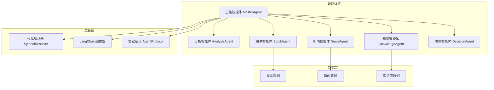
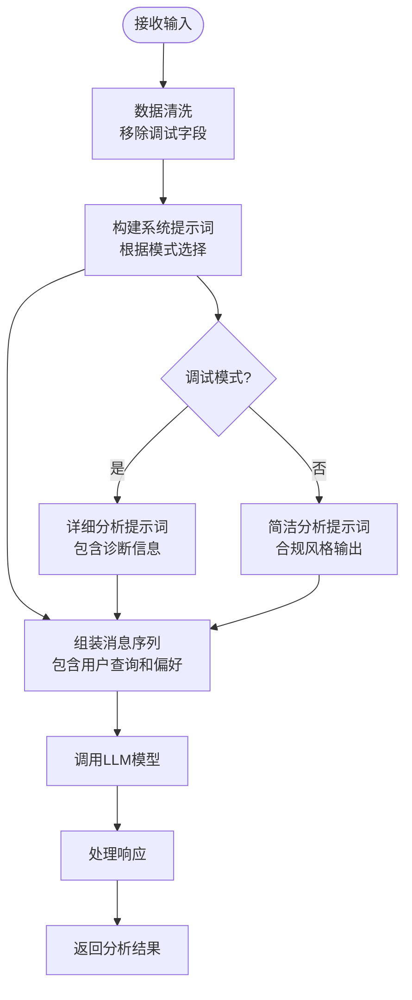
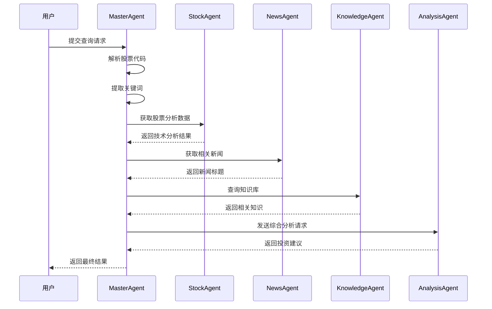
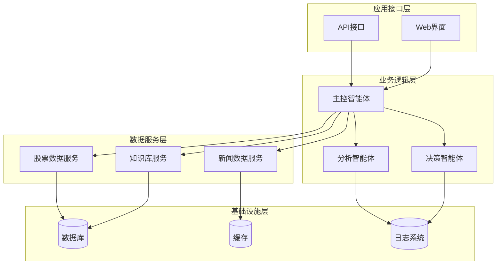
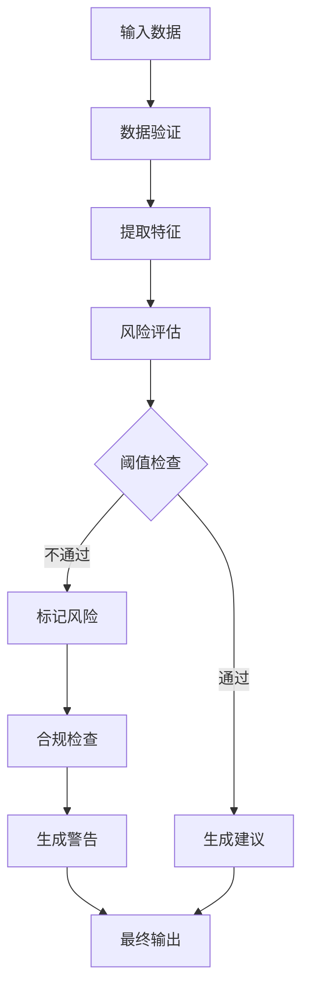
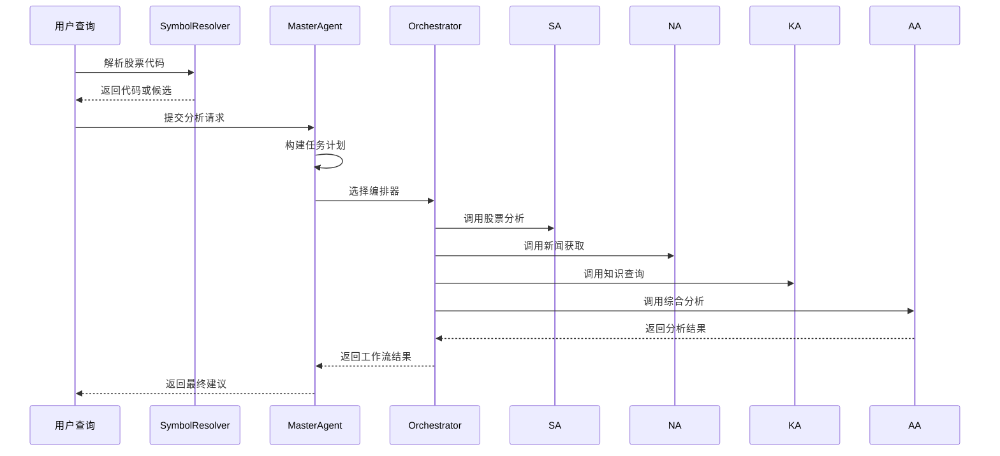
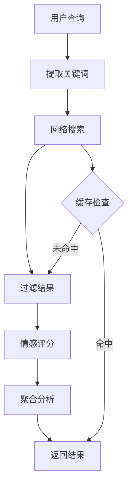
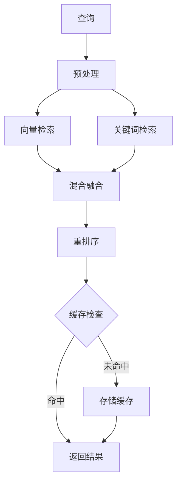
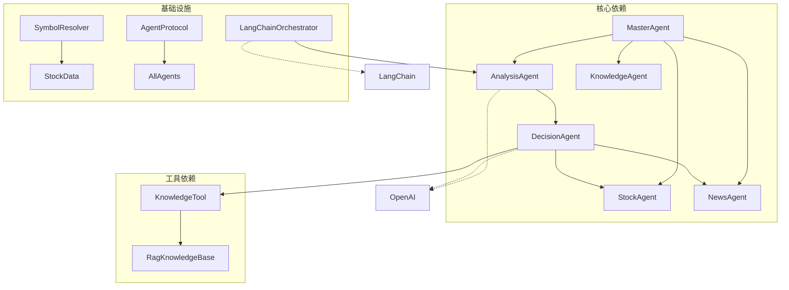
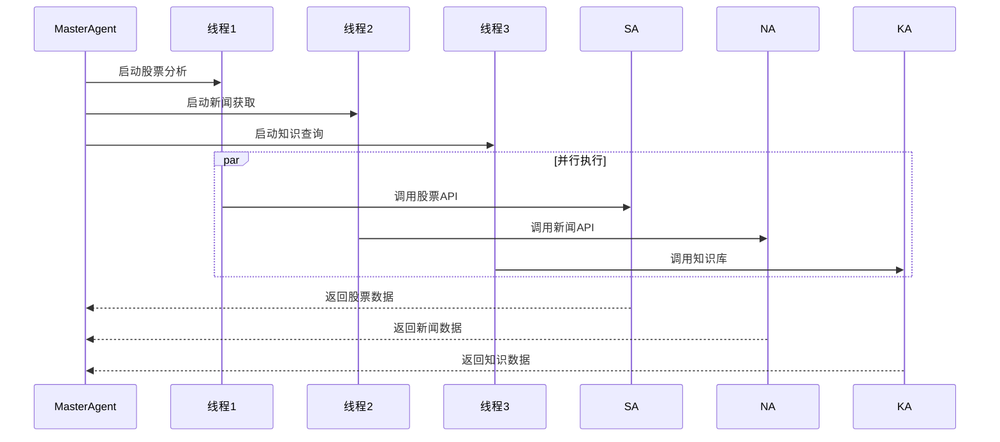

# AnalysisAgent分析智能体

<cite>
**本文档引用的文件**
- [analysis_agent.py](file://src/agent/analysis_agent.py)
- [master_agent.py](file://src/agent/master_agent.py)
- [stock_agent.py](file://src/agent/stock_agent.py)
- [news_agent.py](file://src/agent/news_agent.py)
- [knowledge_tool.py](file://src/rag/knowledge_tool.py)
- [decision_agent.py](file://src/agent/decision_agent.py)
- [symbol_resolver.py](file://src/agent/symbol_resolver.py)
- [langchain_orchestrator.py](file://src/agent/langchain_orchestrator.py)
- [agent_protocol.py](file://src/agent/agent_protocol.py)
- [rag_config.json](file://src/rag/config/rag_config.json)
- [web_search.py](file://src/utils/web_search.py)
- [.env.example](file://.env.example)
</cite>

## 目录
1. [简介](#简介)
2. [项目结构](#项目结构)
3. [核心组件](#核心组件)
4. [架构概览](#架构概览)
5. [详细组件分析](#详细组件分析)
6. [依赖关系分析](#依赖关系分析)
7. [性能考虑](#性能考虑)
8. [故障排除指南](#故障排除指南)
9. [结论](#结论)
10. [附录](#附录)

## 简介

AnalysisAgent分析智能体是AI投资决策系统中的核心分析组件，负责整合多源数据并生成最终的投资建议。该智能体采用多阶段分析流程，通过融合股票数据、新闻信息和知识库内容，提供全面、可解释的投资决策支持。

该智能体的核心特点包括：
- 多源数据融合：整合技术分析、基本面数据、新闻情感和专业知识
- 智能推理机制：基于LLM的综合分析和决策制定
- 风险评估体系：内置风险提示和合规约束
- 可解释性增强：提供清晰的分析过程和依据
- 不确定性量化：通过多种机制表达分析的不确定性

## 项目结构

AI投资决策系统采用模块化设计，主要包含以下核心模块：



**图表来源**
- [master_agent.py](file://src/agent/master_agent.py#L24-L38)
- [analysis_agent.py](file://src/agent/analysis_agent.py#L15-L26)
- [stock_agent.py](file://src/agent/stock_agent.py#L30-L31)
- [news_agent.py](file://src/agent/news_agent.py#L18-L19)

**章节来源**
- [master_agent.py](file://src/agent/master_agent.py#L1-L351)
- [analysis_agent.py](file://src/agent/analysis_agent.py#L1-L119)

## 核心组件

### AnalysisAgent分析智能体

AnalysisAgent是系统的核心分析组件，负责将来自各个子智能体的数据进行综合分析和推理。

#### 主要功能特性

1. **多模态数据融合**：整合技术分析数据、新闻情感分析和知识库信息
2. **智能推理引擎**：基于LLM的综合分析和决策制定
3. **合规输出控制**：确保输出符合金融监管要求
4. **调试模式支持**：提供详细的分析过程和内部状态

#### 核心算法设计



**图表来源**
- [analysis_agent.py](file://src/agent/analysis_agent.py#L27-L92)

**章节来源**
- [analysis_agent.py](file://src/agent/analysis_agent.py#L15-L119)

### MasterAgent主控智能体

MasterAgent作为系统的协调中心，负责任务规划、资源调度和结果整合。

#### 任务编排机制



**图表来源**
- [master_agent.py](file://src/agent/master_agent.py#L155-L318)

**章节来源**
- [master_agent.py](file://src/agent/master_agent.py#L24-L351)

### 数据源集成

#### 股票数据分析

StockAgent提供多层次的股票数据服务：

| 数据类型 | 分析维度 | 输出特征 |
|---------|---------|---------|
| 技术分析 | 移动平均线、趋势判断、动量指标 | 数值化的趋势信号 |
| 基本面分析 | 价格波动率、成交量分析 | 风险评估指标 |
| 市场总貌 | 交易所统计数据 | 整体市场环境 |

#### 新闻情感分析

NewsAgent通过多渠道新闻获取和筛选：

- **关键词提取**：从用户查询中提取相关关键词
- **多源新闻聚合**：整合多个新闻源的信息
- **实时性保障**：通过缓存机制平衡时效性和性能

#### 知识库检索

RAG知识库提供结构化的投资知识：

- **向量检索**：基于语义相似度的快速匹配
- **关键词混合**：结合关键词和向量检索的结果
- **重排序优化**：使用交叉编码器提升相关性排序

**章节来源**
- [stock_agent.py](file://src/agent/stock_agent.py#L305-L572)
- [news_agent.py](file://src/agent/news_agent.py#L18-L93)
- [knowledge_tool.py](file://src/rag/knowledge_tool.py#L22-L273)

## 架构概览

AI投资决策系统采用分层架构设计，确保了模块间的松耦合和高内聚。



**图表来源**
- [master_agent.py](file://src/agent/master_agent.py#L24-L38)
- [decision_agent.py](file://src/agent/decision_agent.py#L61-L76)

**章节来源**
- [master_agent.py](file://src/agent/master_agent.py#L1-L351)
- [decision_agent.py](file://src/agent/decision_agent.py#L1-L526)

## 详细组件分析

### AnalysisAgent深度分析

#### 数据预处理机制

AnalysisAgent实现了严格的数据清洗和验证机制：

```mermaid
classDiagram
class AnalysisAgent {
-client : OpenAI
-model : str
+analyze(user_query, data_payload, news_payload, knowledge_payload, preferences) str
+_sanitize_payload(payload) Dict
-_build_system_prompt(debug_mode) str
}
class PayloadSanitizer {
-blocked_keys : Set[str]
+walk(value) Any
+sanitize(payload) Dict
}
AnalysisAgent --> PayloadSanitizer : "使用"
note for AnalysisAgent : "负责多源数据融合\n生成最终投资建议"
note for PayloadSanitizer : "移除调试敏感字段\n确保合规输出"
```

**图表来源**
- [analysis_agent.py](file://src/agent/analysis_agent.py#L15-L119)

#### 分析算法设计

AnalysisAgent采用层次化的分析策略：

1. **数据完整性检查**：验证各数据源的有效性
2. **权重分配机制**：根据不同数据源的重要性分配权重
3. **阈值判定系统**：设置关键指标的阈值用于决策
4. **异常检测**：识别数据异常和不一致情况

#### 风险评估框架



**图表来源**
- [analysis_agent.py](file://src/agent/analysis_agent.py#L27-L92)

**章节来源**
- [analysis_agent.py](file://src/agent/analysis_agent.py#L15-L119)

### MasterAgent编排机制

#### 任务规划算法

MasterAgent实现了智能的任务规划和执行机制：



**图表来源**
- [master_agent.py](file://src/agent/master_agent.py#L137-L153)
- [langchain_orchestrator.py](file://src/agent/langchain_orchestrator.py#L151-L170)

#### 错误处理和降级策略

系统实现了多层次的容错机制：

1. **编排器降级**：LangChain失败时自动切换到自定义编排
2. **数据源回退**：股票数据获取失败时使用备用方案
3. **组件级降级**：单个智能体失败不影响整体流程
4. **渐进式恢复**：部分功能降级但仍提供基本服务

**章节来源**
- [master_agent.py](file://src/agent/master_agent.py#L155-L318)
- [langchain_orchestrator.py](file://src/agent/langchain_orchestrator.py#L20-L69)

### 数据源集成分析

#### 股票数据处理

StockAgent提供了完整的股票数据分析能力：

```mermaid
classDiagram
class StockAgent {
+analyze_daily_hist(symbol) Dict
+analyze_technical_indicators(symbol) Dict
+fetch_daily_hist(symbol) Dict
+summarize(symbol) Dict
-_fetch_hist_with_fallback(symbol) DataFrame
-_normalize_symbol(symbol) str
}
class TechnicalAnalysis {
+calculate_moving_averages() Dict
+assess_trend() str
+calculate_momentum() float
}
class RiskMetrics {
+calculate_volatility() float
+calculate_sharpe_ratio() float
+assess_drawdown_risk() Dict
}
StockAgent --> TechnicalAnalysis : "使用"
StockAgent --> RiskMetrics : "计算"
note for StockAgent : "提供技术分析和风险评估"
note for TechnicalAnalysis : "移动平均线、趋势判断"
note for RiskMetrics : "波动率、夏普比率"
```

**图表来源**
- [stock_agent.py](file://src/agent/stock_agent.py#L305-L572)

#### 新闻数据处理

NewsAgent实现了智能的新闻获取和筛选：



**图表来源**
- [news_agent.py](file://src/agent/news_agent.py#L69-L93)
- [web_search.py](file://src/utils/web_search.py#L39-L80)

**章节来源**
- [stock_agent.py](file://src/agent/stock_agent.py#L30-L572)
- [news_agent.py](file://src/agent/news_agent.py#L1-L93)
- [web_search.py](file://src/utils/web_search.py#L1-L80)

### 知识库检索机制

#### RAG检索算法

RAG知识库采用了先进的混合检索策略：



**图表来源**
- [knowledge_tool.py](file://src/rag/knowledge_tool.py#L177-L248)
- [rag_config.json](file://src/rag/config/rag_config.json#L43-L48)

**章节来源**
- [knowledge_tool.py](file://src/rag/knowledge_tool.py#L22-L273)
- [rag_config.json](file://src/rag/config/rag_config.json#L1-L58)

## 依赖关系分析

系统采用模块化设计，各组件间依赖关系清晰：



**图表来源**
- [master_agent.py](file://src/agent/master_agent.py#L14-L21)
- [decision_agent.py](file://src/agent/decision_agent.py#L17-L19)

**章节来源**
- [master_agent.py](file://src/agent/master_agent.py#L1-L351)
- [decision_agent.py](file://src/agent/decision_agent.py#L1-L526)

## 性能考虑

### 缓存策略

系统实现了多层次的缓存机制：

1. **工具调用缓存**：DecisionAgent内部缓存工具结果
2. **查询缓存**：RAG知识库支持查询结果缓存
3. **代理缓存**：全局工具调用缓存
4. **配置缓存**：RAG配置和索引缓存

### 并发处理



**图表来源**
- [decision_agent.py](file://src/agent/decision_agent.py#L489-L524)

### 超时和容错

系统实现了完善的超时和容错机制：

- **工具调用超时**：默认15秒超时保护
- **编排器降级**：LangChain失败自动切换
- **数据源回退**：多级数据获取策略
- **渐进式恢复**：部分失败不影响整体

## 故障排除指南

### 常见问题诊断

#### API调用失败

**症状**：分析结果为空或包含错误信息

**排查步骤**：
1. 检查API密钥配置
2. 验证网络连接
3. 查看代理设置
4. 检查服务可用性

#### 数据不一致

**症状**：不同数据源显示矛盾信息

**解决方案**：
1. 检查数据源配置
2. 验证时间范围设置
3. 确认数据标准化处理
4. 检查缓存一致性

#### 性能问题

**症状**：响应时间过长

**优化措施**：
1. 调整并发参数
2. 优化缓存策略
3. 检查网络延迟
4. 监控资源使用

**章节来源**
- [decision_agent.py](file://src/agent/decision_agent.py#L413-L424)
- [master_agent.py](file://src/agent/master_agent.py#L177-L182)

## 结论

AnalysisAgent分析智能体通过精心设计的多源数据融合架构，实现了高效、可靠的智能投资决策支持。系统的主要优势包括：

1. **模块化设计**：清晰的组件分离和职责划分
2. **多层容错**：完善的错误处理和降级策略
3. **性能优化**：并发处理和智能缓存机制
4. **合规保障**：严格的输出控制和风险提示
5. **可扩展性**：灵活的插件化架构

该智能体为投资者提供了全面的技术分析、基本面评估和市场洞察，是现代AI投资决策系统的重要组成部分。

## 附录

### 配置选项

系统支持丰富的配置选项：

| 配置项 | 默认值 | 描述 |
|--------|--------|------|
| OPENAI_MODEL | gpt-4 | LLM模型选择 |
| DEEPSEEK_MODEL | deepseek-chat | 备用模型 |
| AGENT_ORCHESTRATOR | auto | 编排器模式 |
| AGENT_TOOL_MAX_ROUNDS | 2 | 工具调用轮数 |
| AGENT_TOOL_TIMEOUT | 15 | 工具超时时间(秒) |
| AGENT_TOOL_CACHE_TTL | 300 | 缓存有效期(秒) |

### API参考

系统提供RESTful API接口，支持标准的HTTP请求响应模式。所有接口均遵循统一的响应格式，包含查询内容、分析结果和执行状态等信息。

**章节来源**
- [.env.example](file://.env.example#L1-L19)
- [agent_protocol.py](file://src/agent/agent_protocol.py#L16-L71)