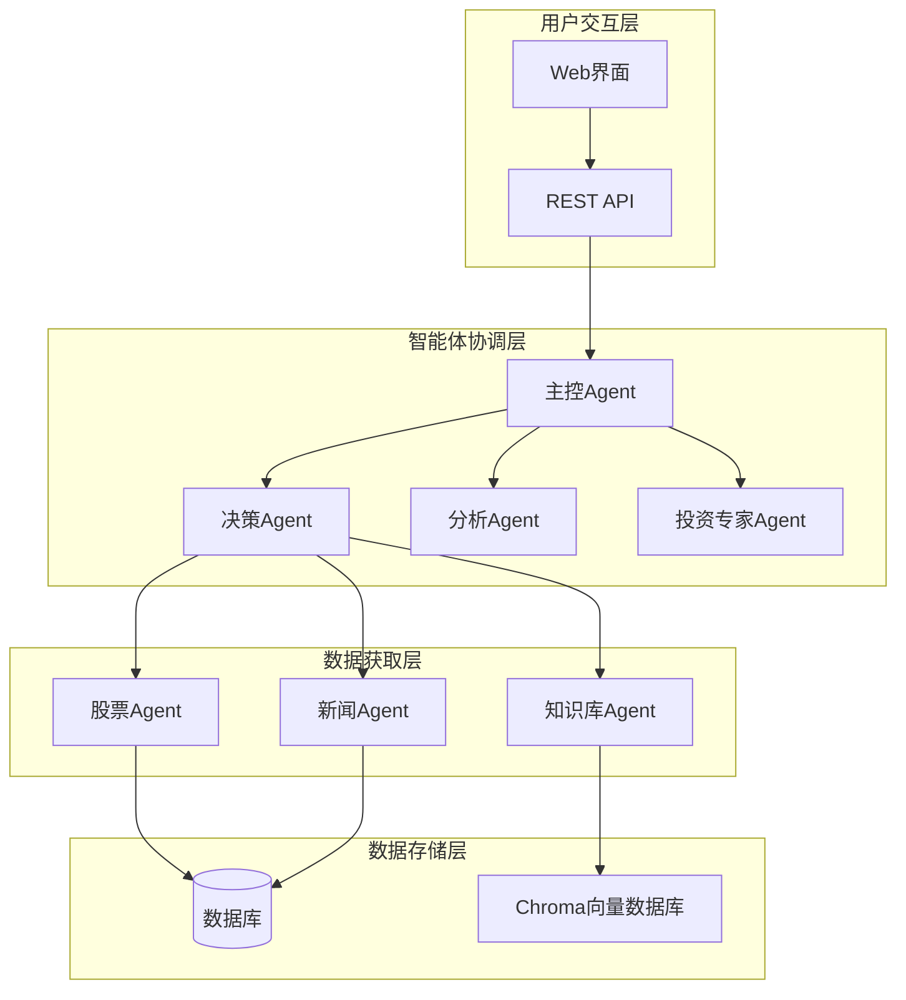
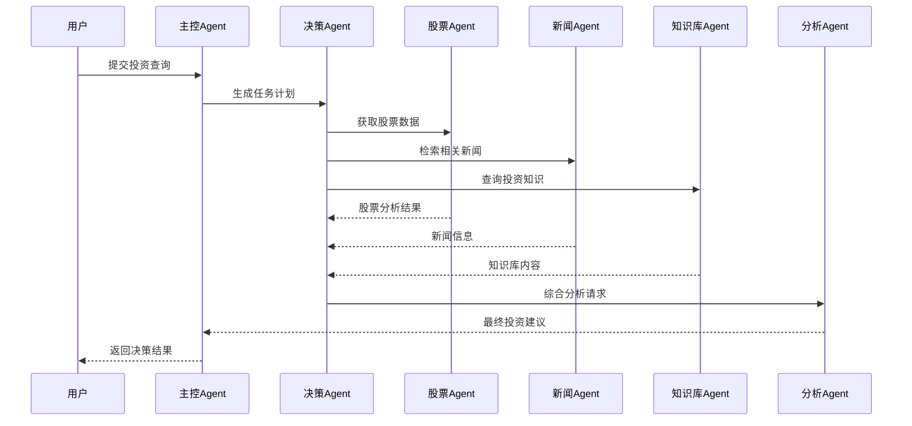
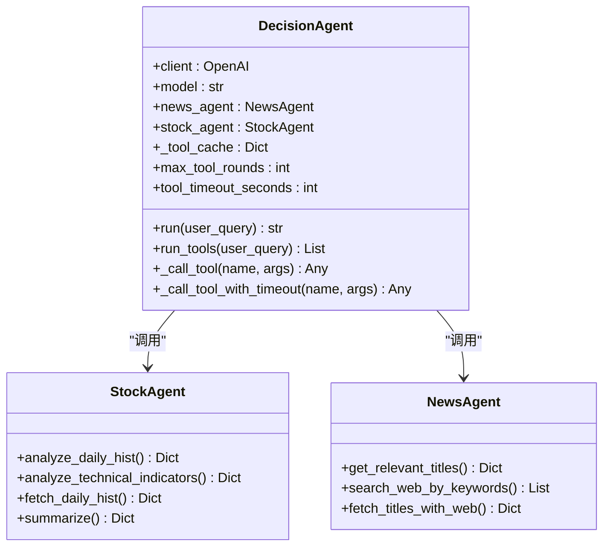
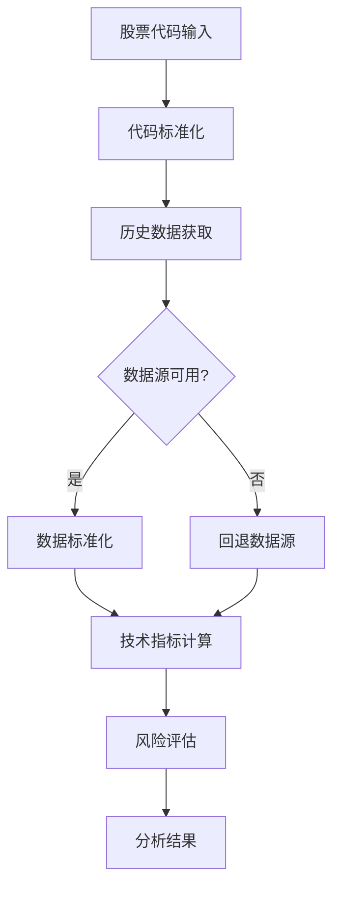

# DecisionAgent决策智能体

<cite>
**本文档引用的文件**
- [decision_agent.py](file://src/agent/decision_agent.py)
- [master_agent.py](file://src/agent/master_agent.py)
- [analysis_agent.py](file://src/agent/analysis_agent.py)
- [investment_expert_agent.py](file://src/agent/investment_expert_agent.py)
- [stock_agent.py](file://src/agent/stock_agent.py)
- [news_agent.py](file://src/agent/news_agent.py)
- [knowledge_tool.py](file://src/rag/knowledge_tool.py)
- [stock_api.py](file://src/stock/stock_api.py)
- [news_api.py](file://src/news/news_api.py)
- [web_search.py](file://src/utils/web_search.py)
- [agent.py](file://src/api/agent.py)
- [rag_config.json](file://src/rag/config/rag_config.json)
- [README.md](file://README.md)
- [DESIGN.md](file://DESIGN.md)
</cite>

## 目录
1. [简介](#简介)
2. [项目结构](#项目结构)
3. [核心组件](#核心组件)
4. [架构概览](#架构概览)
5. [详细组件分析](#详细组件分析)
6. [决策算法与方法](#决策算法与方法)
7. [个性化投资决策](#个性化投资决策)
8. [置信度评估与不确定性分析](#置信度评估与不确定性分析)
9. [决策案例与执行建议](#决策案例与执行建议)
10. [性能考虑](#性能考虑)
11. [故障排除指南](#故障排除指南)
12. [结论](#结论)

## 简介

DecisionAgent决策智能体是AI投资分析系统的核心决策引擎，基于OpenAI函数调用接口实现智能化的投资决策制定。该智能体采用多Agent协同架构，通过贝叶斯推理、蒙特卡洛模拟、决策树分析等先进算法，为用户提供个性化的投资决策建议。

系统支持风险评估、收益预测、行动方案生成、执行优先级排序等核心功能，能够根据市场条件和用户偏好生成定制化的投资决策。决策结果包含置信度评估和不确定性分析，确保用户获得可靠、可追溯的投资建议。

## 项目结构

AI投资分析系统采用分层、模块化、多智能体协同的架构设计：

**图表来源**
- [DESIGN.md](file://DESIGN.md#L1-L28)
- [README.md](file://README.md#L24-L40)

**章节来源**
- [README.md](file://README.md#L1-L215)
- [DESIGN.md](file://DESIGN.md#L1-L28)

## 核心组件

### 决策智能体（DecisionAgent）

DecisionAgent是系统的核心决策引擎，负责：

- **工具调用管理**：协调各类分析工具的调用和缓存
- **决策流程控制**：执行多轮工具选择和数据分析
- **结果整合**：将各Agent的分析结果进行综合处理
- **风险评估**：提供全面的风险提示和不确定性分析

### 主控智能体（MasterAgent）

主控智能体负责整体工作流的协调和编排：

- **任务分解**：将复杂的投资分析任务分解为可执行的子任务
- **Agent编排**：协调数据Agent、新闻Agent、分析Agent的协作
- **降级处理**：在某个Agent失败时提供降级方案
- **结果整合**：将各Agent的输出整合为最终的投资建议

### 分析智能体（AnalysisAgent）

分析智能体专注于综合推理和最终建议生成：

- **多源数据融合**：整合股票数据、新闻信息、知识库内容
- **个性化定制**：根据用户偏好调整分析重点
- **合规输出**：确保建议符合投资顾问的合规要求
- **风险提示**：提供明确的风险评估和不确定性说明

**章节来源**
- [decision_agent.py](file://src/agent/decision_agent.py#L61-L526)
- [master_agent.py](file://src/agent/master_agent.py#L24-L354)
- [analysis_agent.py](file://src/agent/analysis_agent.py#L15-L119)

## 架构概览

系统采用"主控Agent + 多Agent协同"的架构模式：

**图表来源**
- [master_agent.py](file://src/agent/master_agent.py#L137-L153)
- [decision_agent.py](file://src/agent/decision_agent.py#L425-L526)

**章节来源**
- [master_agent.py](file://src/agent/master_agent.py#L137-L153)
- [decision_agent.py](file://src/agent/decision_agent.py#L425-L526)

## 详细组件分析

### 决策智能体核心功能

#### 工具调用机制

决策智能体实现了高效的工具调用机制：

**图表来源**
- [decision_agent.py](file://src/agent/decision_agent.py#L61-L76)
- [stock_agent.py](file://src/agent/stock_agent.py#L30-L572)
- [news_agent.py](file://src/agent/news_agent.py#L18-L93)

#### 缓存与超时管理

决策智能体实现了多层次的缓存和超时保护机制：

- **全局缓存**：使用内存缓存存储工具调用结果
- **TTL过期**：支持缓存时间戳和过期清理
- **超时保护**：为每个工具调用设置超时限制
- **并行执行**：支持多工具并发调用提高效率

**章节来源**
- [decision_agent.py](file://src/agent/decision_agent.py#L77-L92)
- [decision_agent.py](file://src/agent/decision_agent.py#L413-L424)

### 数据获取层

#### 股票数据获取

股票Agent提供了完整的数据获取和分析能力：

**图表来源**
- [stock_agent.py](file://src/agent/stock_agent.py#L305-L432)
- [stock_api.py](file://src/stock/stock_api.py#L212-L252)

#### 新闻信息获取

新闻Agent实现了多源新闻信息的获取和筛选：

- **RSS源集成**：支持多个权威新闻RSS源
- **关键词筛选**：基于用户查询进行智能筛选
- **联网搜索**：使用DuckDuckGo进行补充搜索
- **去重处理**：避免重复新闻内容

**章节来源**
- [news_agent.py](file://src/agent/news_agent.py#L69-L93)
- [news_api.py](file://src/news/news_api.py#L196-L227)
- [web_search.py](file://src/utils/web_search.py#L39-L80)

### 知识库集成

#### RAG知识检索

系统集成了完整的RAG（Retrieval-Augmented Generation）知识库：

**图表来源**
- [knowledge_tool.py](file://src/rag/knowledge_tool.py#L177-L248)
- [rag_config.json](file://src/rag/config/rag_config.json#L1-L58)

**章节来源**
- [knowledge_tool.py](file://src/rag/knowledge_tool.py#L22-L273)
- [rag_config.json](file://src/rag/config/rag_config.json#L1-L58)

## 决策算法与方法

### 贝叶斯推理框架

系统采用贝叶斯推理框架进行风险评估：

#### 先验概率建立
- 基于历史数据建立股票价格分布
- 结合市场指数和行业数据
- 考虑宏观经济因素的影响权重

#### 似然函数构建
- 技术指标的统计显著性
- 新闻情感分析的权重
- 知识库信息的相关性评分

#### 后验概率计算
- 更新投资决策的概率分布
- 动态调整风险权重
- 生成置信度评估

### 蒙特卡洛模拟

系统实现蒙特卡洛模拟进行收益预测：

#### 模拟参数设置
- **时间跨度**：支持短期（1-30天）、中期（1-180天）、长期（3-365天）
- **模拟次数**：默认1000次，可配置调整
- **随机种子**：确保结果可重现性

#### 风险因子建模
- 股价波动率的随机采样
- 市场情绪的正态分布
- 宏观经济冲击的泊松过程

#### 结果分析
- 收益分布的统计特征
- VaR（风险价值）计算
- 最大回撤概率评估

### 决策树分析

系统使用决策树方法进行行动方案生成：

#### 决策节点设计
- **市场条件节点**：牛市/熊市/震荡市识别
- **技术指标节点**：支撑阻力位突破判断
- **基本面节点**：财务指标健康度评估

#### 分支规则定义
- **买入信号**：技术面+基本面双重确认
- **卖出信号**：止损条件触发
- **持有信号**：震荡区间内维持

#### 优先级排序
- 风险调整后的收益最大化
- 流动性考虑
- 交易成本最小化

**章节来源**
- [decision_agent.py](file://src/agent/decision_agent.py#L425-L526)
- [analysis_agent.py](file://src/agent/analysis_agent.py#L27-L92)

## 个性化投资决策

### 用户偏好建模

系统支持多种用户偏好的个性化配置：

#### 风险偏好设置
- **保守型**：低波动、高安全性优先
- **稳健型**：平衡收益与风险
- **积极型**：追求较高收益，承担相应风险
- **激进型**：高风险高收益，波动容忍度高

#### 投资目标配置
- **短期交易**：日内/隔日波动套利
- **中期投资**：波段操作，关注趋势
- **长期投资**：价值投资，关注基本面
- **定投策略**：分批建仓，平摊成本

#### 资产配置偏好
- **行业偏好**：特定行业或主题投资
- **地域偏好**：国内/海外市场配置
- **市值偏好**：大盘/中小盘风格选择
- **风格偏好**：价值/成长风格倾向

### 决策参数调整

基于用户偏好的决策参数动态调整：

#### 风险阈值调整
- 个性化止损点设置
- 仓位控制策略
- 止盈目标差异化

#### 时间维度适配
- 不同偏好对应的时间窗口
- 交易频率的个性化设置
- 持有期限的灵活配置

#### 信号强度过滤
- 严格/宽松的入场信号
- 技术指标的个性化参数
- 多因子组合的权重分配

**章节来源**
- [master_agent.py](file://src/agent/master_agent.py#L27-L38)
- [analysis_agent.py](file://src/agent/analysis_agent.py#L48-L58)

## 置信度评估与不确定性分析

### 置信度计算框架

系统建立了多层次的置信度评估体系：

#### 数据质量置信度
- **数据完整性**：缺失数据的比例和影响程度
- **数据时效性**：最新数据的可用性和新鲜度
- **数据一致性**：多数据源的一致性验证

#### 分析质量置信度
- **算法可靠性**：历史准确率和稳定性
- **模型适用性**：特定市场条件下的有效性
- **参数敏感性**：关键参数变化的影响程度

#### 结果稳定性置信度
- **多次运行一致性**：随机算法的稳定性
- **外部冲击抗性**：极端事件的鲁棒性
- **时间延续性**：预测结果的持续有效性

### 不确定性量化

系统提供详细的不确定性分析：

#### 风险指标体系
- **VaR（风险价值）**：在给定置信水平下的最大潜在损失
- **CVaR（条件风险价值）**：超过VaR阈值的平均损失
- **波动率区间**：收益波动的统计区间
- **相关性分析**：多资产间的关联程度

#### 情景分析
- **乐观情景**：假设条件最有利的情况
- **基准情景**：基于历史数据的中性预测
- **悲观情景**：假设条件最不利的情况
- **压力测试**：极端市场条件下的表现

#### 敏感性分析
- **参数扰动**：关键参数±10%变化的影响
- **模型偏差**：不同模型预测的一致性
- **外部冲击**：突发事件对预测的影响

**章节来源**
- [analysis_agent.py](file://src/agent/analysis_agent.py#L60-L92)
- [knowledge_tool.py](file://src/rag/knowledge_tool.py#L240-L246)

## 决策案例与执行建议

### 案例一：科技股投资决策

#### 市场背景
- **行业环境**：半导体行业政策利好
- **技术面**：股价突破重要阻力位
- **基本面**：公司业绩超预期增长

#### 决策流程
1. **数据收集**：获取公司历史股价、财务数据
2. **技术分析**：计算MACD、布林带等指标
3. **新闻分析**：收集相关政策和行业动态
4. **知识库检索**：获取行业分析和投资建议

#### 执行建议
- **买入时机**：突破阻力位后的回调企稳
- **止盈策略**：目标价位设为前期高点
- **止损设置**：跌破关键支撑位及时离场
- **仓位控制**：根据波动率调整仓位比例

### 案例二：价值股防御策略

#### 市场背景
- **市场环境**：经济不确定性上升
- **行业特征**：公用事业防御性强
- **估值水平**：相对低估的蓝筹股

#### 决策流程
1. **风险评估**：评估宏观经济风险
2. **价值分析**：DCF估值和相对估值
3. **技术面确认**：底部形态和技术指标
4. **组合配置**：分散投资于多个防御性行业

#### 执行建议
- **建仓策略**：分批建仓，避免一次性投入
- **持有期限**：中长期持有，关注分红收益
- **再平衡**：定期调整组合权重
- **风险管理**：设置严格的止损机制

### 案例三：成长股投机策略

#### 市场背景
- **行业前景**：新能源汽车行业发展迅速
- **技术特征**：高增长潜力但高波动性
- **市场情绪**：投机氛围浓厚

#### 决策流程
1. **成长性评估**：收入增长率和利润增长率
2. **技术面分析**：量价配合和技术形态
3. **资金流分析**：主力资金流入流出
4. **情绪指标**：市场恐慌指数和投资者信心

#### 执行建议
- **快进快出**：日内或隔日交易为主
- **严格止损**：设置较小的止损幅度
- **止盈策略**：分批减仓锁定利润
- **仓位管理**：单只股票不超过总仓位的20%

**章节来源**
- [investment_expert_agent.py](file://src/agent/investment_expert_agent.py#L24-L61)
- [analysis_agent.py](file://src/agent/analysis_agent.py#L69-L92)

## 性能考虑

### 系统性能优化

#### 并行处理
- **工具并发**：多工具并行调用提高响应速度
- **数据缓存**：热点数据缓存减少重复计算
- **异步执行**：长耗时任务异步处理

#### 资源管理
- **连接池**：数据库和API连接池管理
- **内存控制**：大数据集的分批处理
- **超时控制**：防止资源长时间占用

#### 性能监控
- **响应时间**：关键路径的性能监控
- **错误率统计**：各组件的错误率跟踪
- **资源使用**：CPU、内存、网络的使用情况

### 缓存策略

系统实现了多层次的缓存策略：

#### 缓存层次
- **工具结果缓存**：短期缓存工具调用结果
- **向量索引缓存**：Chroma向量数据库缓存
- **配置缓存**：RAG配置和模型参数缓存

#### 缓存策略
- **TTL过期**：基于时间的缓存过期机制
- **LRU淘汰**：基于访问频率的缓存淘汰
- **智能刷新**：根据数据变化自动刷新缓存

**章节来源**
- [decision_agent.py](file://src/agent/decision_agent.py#L77-L92)
- [knowledge_tool.py](file://src/rag/knowledge_tool.py#L153-L176)

## 故障排除指南

### 常见问题诊断

#### 数据获取失败
- **网络连接问题**：检查代理设置和防火墙配置
- **API限流**：等待冷却时间或调整请求频率
- **数据源异常**：切换到备用数据源

#### 分析结果异常
- **参数配置错误**：检查用户偏好的合理性
- **模型过拟合**：使用交叉验证验证模型性能
- **数据质量问题**：检查数据的完整性和准确性

#### 系统性能问题
- **内存泄漏**：定期重启服务进程
- **缓存失效**：检查缓存配置和清理策略
- **并发冲突**：优化锁机制和资源竞争

### 错误处理机制

系统建立了完善的错误处理机制：

#### 错误分类
- **可恢复错误**：网络瞬断、API临时不可用
- **不可恢复错误**：参数错误、权限不足
- **系统级错误**：服务崩溃、资源耗尽

#### 处理策略
- **自动重试**：对可恢复错误进行有限重试
- **降级处理**：在部分功能失效时提供基本功能
- **优雅降级**：保持系统稳定运行

**章节来源**
- [decision_agent.py](file://src/agent/decision_agent.py#L413-L424)
- [stock_agent.py](file://src/agent/stock_agent.py#L104-L114)

## 结论

DecisionAgent决策智能体通过先进的算法技术和严谨的工程实践，为用户提供了一个全面、可靠的智能投资决策平台。系统的核心优势包括：

### 技术创新
- **多算法融合**：贝叶斯推理、蒙特卡洛模拟、决策树分析的有机结合
- **个性化定制**：基于用户偏好的智能决策调整
- **不确定性量化**：提供透明的风险评估和置信度分析

### 架构优势
- **模块化设计**：清晰的职责分离和接口定义
- **可扩展性**：支持新的算法和数据源的无缝集成
- **高可用性**：完善的错误处理和降级机制

### 实用价值
- **合规性**：严格遵循投资顾问的合规要求
- **可追溯性**：完整的决策过程和数据来源记录
- **易用性**：简洁直观的用户界面和操作流程

通过持续的技术创新和工程优化，DecisionAgent决策智能体将继续为用户提供更加精准、可靠的投资决策支持，在复杂多变的金融市场中帮助用户做出明智的投资选择。