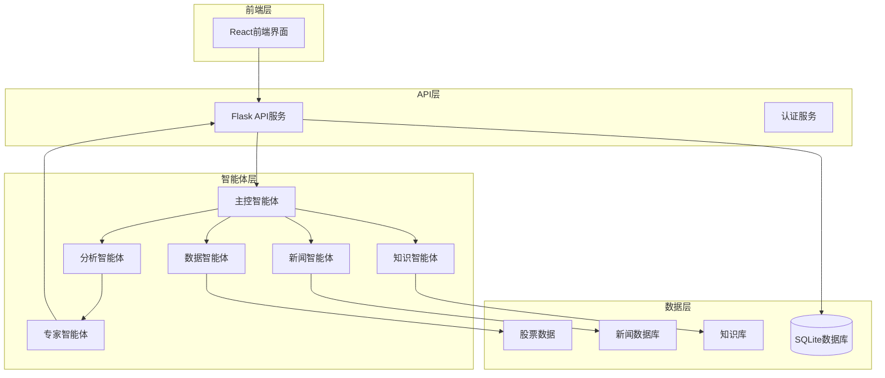
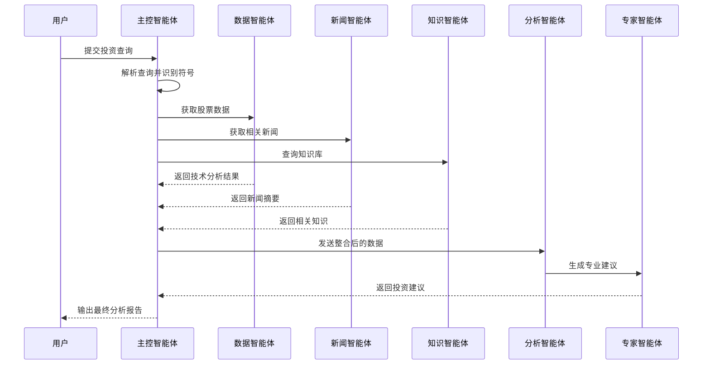
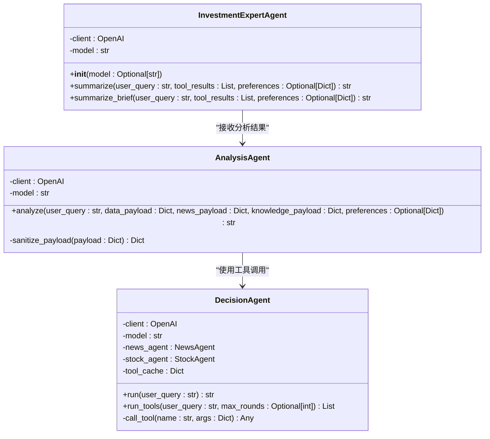
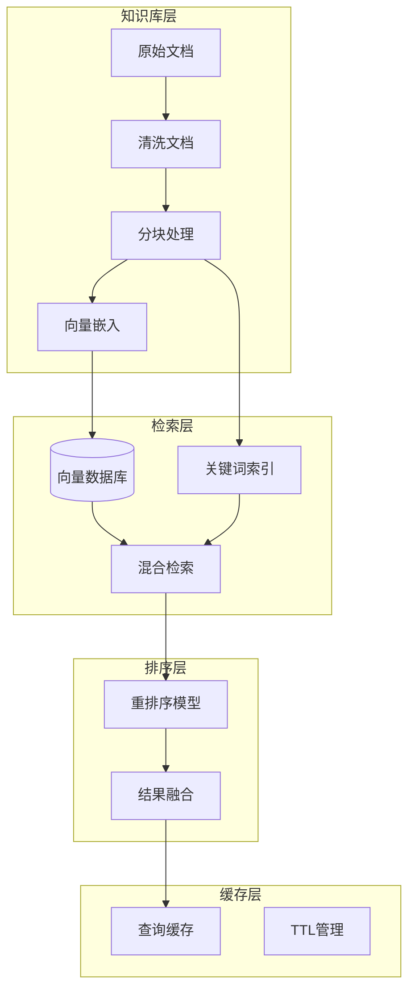
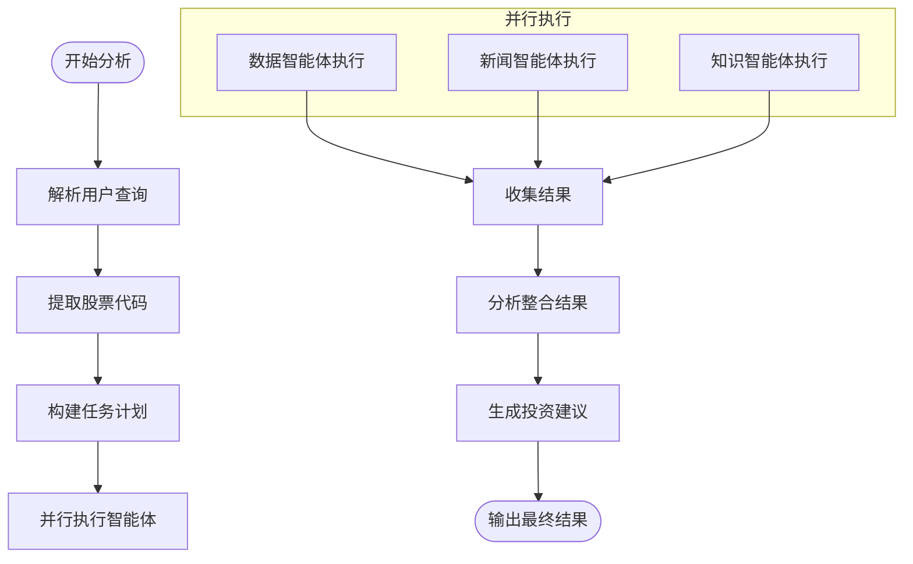
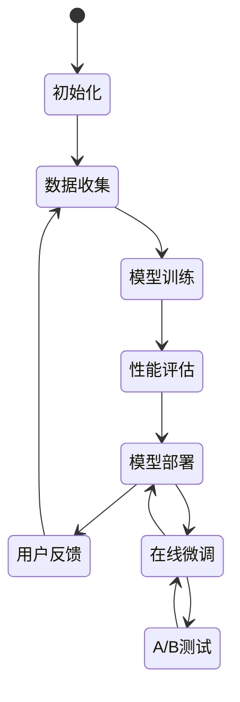
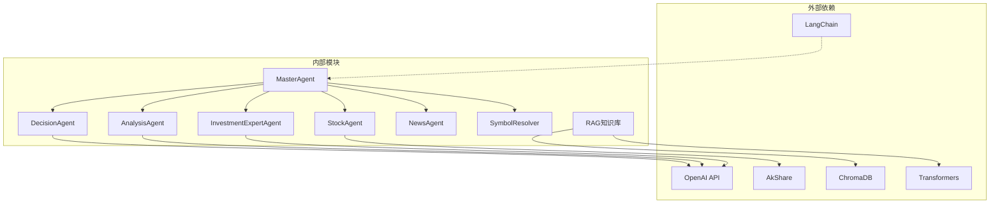
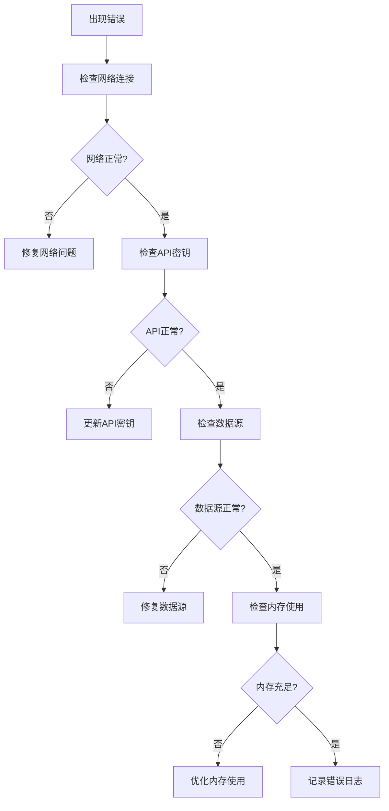

# InvestmentExpertAgent投资专家智能体

<cite>
**本文档引用的文件**
- [investment_expert_agent.py](file://src/agent/investment_expert_agent.py)
- [master_agent.py](file://src/agent/master_agent.py)
- [decision_agent.py](file://src/agent/decision_agent.py)
- [analysis_agent.py](file://src/agent/analysis_agent.py)
- [news_agent.py](file://src/agent/news_agent.py)
- [stock_agent.py](file://src/agent/stock_agent.py)
- [symbol_resolver.py](file://src/agent/symbol_resolver.py)
- [langchain_orchestrator.py](file://src/agent/langchain_orchestrator.py)
- [knowledge_tool.py](file://src/rag/knowledge_tool.py)
- [rag_config.json](file://src/rag/config/rag_config.json)
- [README.md](file://README.md)
- [requirements.txt](file://requirements.txt)
- [test_master_agent.py](file://src/agent/test/test_master_agent.py)
</cite>

## 目录
1. [简介](#简介)
2. [项目结构](#项目结构)
3. [核心组件](#核心组件)
4. [架构概览](#架构概览)
5. [详细组件分析](#详细组件分析)
6. [依赖关系分析](#依赖关系分析)
7. [性能考虑](#性能考虑)
8. [故障排除指南](#故障排除指南)
9. [结论](#结论)
10. [附录](#附录)

## 简介

InvestmentExpertAgent投资专家智能体是一个基于多智能体协作的投资分析系统的核心组件，专注于为用户提供专业化的投资建议和分析。该智能体结合了先进的大语言模型技术和专业的金融知识库，能够进行深入的投资策略制定、资产配置建议、风险管理分析和市场时机判断。

该系统采用模块化设计，通过多个专门的智能体协同工作，包括数据获取智能体、新闻分析智能体、知识库检索智能体和综合分析智能体，形成完整的投资分析闭环。每个智能体都有其特定的专业领域和职责分工，确保分析结果的准确性和全面性。

## 项目结构

项目采用清晰的分层架构设计，主要分为以下几个核心层次：

**图表来源**
- [master_agent.py](file://src/agent/master_agent.py#L24-L351)
- [investment_expert_agent.py](file://src/agent/investment_expert_agent.py#L17-L99)

**章节来源**
- [README.md](file://README.md#L24-L40)
- [requirements.txt](file://requirements.txt#L1-L41)

## 核心组件

### 投资专家智能体 (InvestmentExpertAgent)

投资专家智能体是整个系统的核心决策组件，负责将各个子智能体的分析结果整合为专业的投资建议。该智能体具有以下关键特性：

- **多模态信息融合**：能够处理来自不同数据源的信息，包括技术分析数据、基本面数据、市场新闻和专业知识库
- **个性化定制**：根据用户的投资偏好和风险承受能力提供个性化的投资建议
- **合规输出**：确保所有建议都符合金融监管要求，避免过度承诺收益
- **透明度保证**：明确标注数据来源和不确定性因素

### 主控智能体 (MasterAgent)

主控智能体负责协调各个子智能体的工作流程，实现智能体间的有效协作：

- **任务规划**：根据用户查询自动识别相关的分析任务
- **资源调度**：合理分配计算资源，优化执行效率
- **错误处理**：实现智能体间的故障转移和恢复机制
- **结果整合**：将各智能体的输出整合为统一的分析报告

### 数据智能体 (StockAgent)

数据智能体专注于股票市场的数据获取和分析：

- **多数据源支持**：支持多家数据提供商，确保数据的可靠性和完整性
- **技术分析**：提供多种技术指标和分析方法
- **历史数据**：支持长时间序列的历史数据分析
- **实时监控**：提供实时市场数据的获取和监控

**章节来源**
- [investment_expert_agent.py](file://src/agent/investment_expert_agent.py#L17-L99)
- [master_agent.py](file://src/agent/master_agent.py#L24-L351)
- [stock_agent.py](file://src/agent/stock_agent.py#L30-L572)

## 架构概览

系统采用分布式智能体架构，通过明确的职责分离和标准化的接口实现高度模块化的设计：

**图表来源**
- [master_agent.py](file://src/agent/master_agent.py#L155-L318)
- [analysis_agent.py](file://src/agent/analysis_agent.py#L27-L92)
- [investment_expert_agent.py](file://src/agent/investment_expert_agent.py#L24-L61)

## 详细组件分析

### 投资专家智能体详细分析

投资专家智能体的设计体现了专业化和模块化的理念，通过精心设计的提示工程和数据处理流程，确保输出高质量的投资建议。

#### 核心功能架构

**图表来源**
- [investment_expert_agent.py](file://src/agent/investment_expert_agent.py#L17-L99)
- [analysis_agent.py](file://src/agent/analysis_agent.py#L15-L119)
- [decision_agent.py](file://src/agent/decision_agent.py#L61-L526)

#### 数据处理流程

投资专家智能体采用严格的数据处理流程，确保分析结果的准确性和可靠性：

1. **输入验证**：对用户查询和工具结果进行格式验证和内容清洗
2. **偏好整合**：将用户的投资偏好转换为结构化数据
3. **上下文构建**：构建完整的分析上下文，包括数据覆盖范围和限制条件
4. **合规检查**：确保输出内容符合金融监管要求
5. **质量控制**：实施多层次的质量检查和验证机制

#### 专业分析能力

投资专家智能体具备以下专业分析能力：

- **投资策略制定**：基于多维度数据分析制定个性化的投资策略
- **资产配置建议**：提供跨市场、跨资产类别的配置建议
- **风险管理**：识别和量化潜在风险，提供风险缓解措施
- **市场时机判断**：结合技术分析和基本面分析判断市场时机
- **组合优化**：基于现代投资组合理论提供组合优化建议

**章节来源**
- [investment_expert_agent.py](file://src/agent/investment_expert_agent.py#L24-L99)

### 专家知识库构建与维护

系统采用RAG（Retrieval-Augmented Generation）架构构建专家知识库，实现了知识的结构化存储和智能化检索。

#### 知识库架构设计

**图表来源**
- [knowledge_tool.py](file://src/rag/knowledge_tool.py#L22-L273)
- [rag_config.json](file://src/rag/config/rag_config.json#L1-L58)

#### 知识构建流程

知识库的构建采用了多层次的处理流程：

1. **文档预处理**：对原始文档进行清洗、标准化和格式转换
2. **智能分块**：使用滑动窗口和语义边界相结合的方法进行文档分块
3. **向量化表示**：使用高效的嵌入模型生成文档向量表示
4. **索引构建**：构建向量数据库和关键词索引
5. **质量评估**：建立知识质量评估和更新机制

#### 维护机制

知识库的维护采用自动化和人工审核相结合的方式：

- **定期更新**：设置定期的知识更新机制，确保信息的时效性
- **质量监控**：建立知识质量评估指标和监控体系
- **版本管理**：实现知识版本控制和变更追踪
- **用户反馈**：收集用户反馈，持续改进知识质量

**章节来源**
- [knowledge_tool.py](file://src/rag/knowledge_tool.py#L22-L273)
- [rag_config.json](file://src/rag/config/rag_config.json#L1-L58)

### 多智能体协作机制

系统实现了复杂的多智能体协作机制，通过明确的任务分工和协调机制确保整体性能。

#### 智能体间通信协议

**图表来源**
- [master_agent.py](file://src/agent/master_agent.py#L137-L153)
- [langchain_orchestrator.py](file://src/agent/langchain_orchestrator.py#L151-L273)

#### 协调策略

系统采用多种协调策略确保智能体间的高效协作：

- **优先级调度**：根据任务的重要性和紧急程度分配执行优先级
- **负载均衡**：动态分配计算资源，避免单点过载
- **故障转移**：实现智能体间的故障检测和自动转移
- **结果验证**：建立结果交叉验证机制，提高准确性

**章节来源**
- [master_agent.py](file://src/agent/master_agent.py#L155-L318)
- [langchain_orchestrator.py](file://src/agent/langchain_orchestrator.py#L20-L273)

### 训练方法与持续学习

系统设计了完善的训练和持续学习机制，确保智能体能力的不断提升。

#### 在线学习机制

#### 学习策略

系统采用多层次的学习策略：

- **监督学习**：使用历史投资案例和专家建议进行监督训练
- **强化学习**：通过用户反馈和投资结果进行强化学习
- **迁移学习**：利用预训练模型的知识迁移到特定投资领域
- **集成学习**：结合多个模型的预测结果提高准确性

**章节来源**
- [decision_agent.py](file://src/agent/decision_agent.py#L425-L526)

## 依赖关系分析

系统具有清晰的依赖关系结构，通过模块化设计实现了高内聚低耦合。

**图表来源**
- [requirements.txt](file://requirements.txt#L25-L36)
- [master_agent.py](file://src/agent/master_agent.py#L14-L21)

**章节来源**
- [requirements.txt](file://requirements.txt#L1-L41)

## 性能考虑

系统在设计时充分考虑了性能优化，采用多种技术手段提升响应速度和处理能力。

### 并行处理优化

系统采用多线程和异步处理技术：

- **工具调用并行化**：使用线程池并发执行多个工具调用
- **智能体协作**：多个智能体并行执行各自的任务
- **缓存机制**：实现多层次缓存减少重复计算
- **资源池管理**：动态管理计算资源，避免资源浪费

### 缓存策略

系统实现了多层级的缓存策略：

- **工具调用缓存**：缓存智能体的工具调用结果
- **查询缓存**：缓存RAG检索结果
- **配置缓存**：缓存系统配置和参数
- **TTL管理**：实现智能的缓存过期管理

### 性能监控

系统建立了完善的性能监控体系：

- **延迟监控**：监控各组件的响应时间
- **吞吐量统计**：统计系统的处理能力
- **错误率跟踪**：跟踪系统的稳定性
- **资源使用率**：监控计算资源的使用情况

## 故障排除指南

系统提供了完善的故障排除机制和错误处理策略。

### 常见问题诊断

### 错误处理策略

系统采用多层次的错误处理策略：

- **降级处理**：在部分功能失效时提供降级服务
- **重试机制**：对临时性错误实施自动重试
- **超时控制**：防止长时间阻塞影响系统性能
- **异常隔离**：避免单个组件的故障影响整个系统

**章节来源**
- [decision_agent.py](file://src/agent/decision_agent.py#L413-L424)
- [master_agent.py](file://src/agent/master_agent.py#L177-L182)

## 结论

InvestmentExpertAgent投资专家智能体代表了现代AI投资分析系统的发展方向，通过专业的架构设计和先进的技术实现，为用户提供高质量的投资决策支持。

### 系统优势

- **专业性强**：深度整合金融专业知识和实践经验
- **准确性高**：多源数据融合和交叉验证确保分析准确性
- **适应性好**：支持个性化定制和持续学习
- **可靠性强**：完善的错误处理和故障转移机制
- **扩展性佳**：模块化设计便于功能扩展和维护

### 应用价值

该系统为投资者提供了：
- **决策支持**：基于数据驱动的专业投资建议
- **风险控制**：全面的风险识别和管理建议
- **效率提升**：自动化分析流程节省人工成本
- **知识传承**：专家经验的数字化保存和传播

## 附录

### 投资案例分析示例

系统支持多种类型的投资案例分析，以下是典型的应用场景：

#### 股票投资案例
- **案例描述**：分析特定股票的技术面和基本面特征
- **分析维度**：技术指标、财务状况、行业地位、市场情绪
- **建议内容**：买入/卖出时机、目标价位、止损设置

#### 资产配置案例
- **案例描述**：为不同风险偏好的投资者制定资产配置方案
- **分析维度**：风险承受能力、投资期限、收益预期
- **建议内容**：股票、债券、现金等各类资产的配置比例

#### 市场时机判断案例
- **案例描述**：分析宏观经济环境和市场技术形态
- **分析维度**：经济指标、政策变化、市场情绪、技术信号
- **建议内容**：市场趋势判断、操作策略、仓位管理

### API接口说明

系统提供RESTful API接口，支持外部系统集成：

- **分析接口**：`POST /api/agent/analyze` - 执行完整分析流程
- **查询接口**：`POST /api/agent/query` - 获取投资建议
- **聊天接口**：`POST /api/chat/ask` - 简答模式交互
- **健康检查**：`GET /api/health` - 系统状态检查

### 配置参数说明

系统支持丰富的配置参数：

- **模型参数**：API密钥、模型名称、基础URL
- **性能参数**：超时时间、并发数、缓存策略
- **功能参数**：编排模式、工具选择、输出格式
- **安全参数**：认证方式、权限控制、数据加密

**章节来源**
- [README.md](file://README.md#L132-L162)
- [test_master_agent.py](file://src/agent/test/test_master_agent.py#L21-L38)