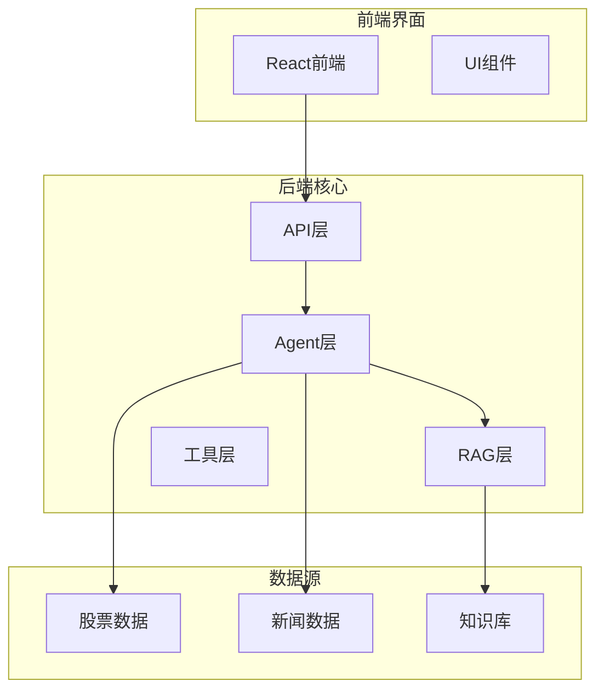
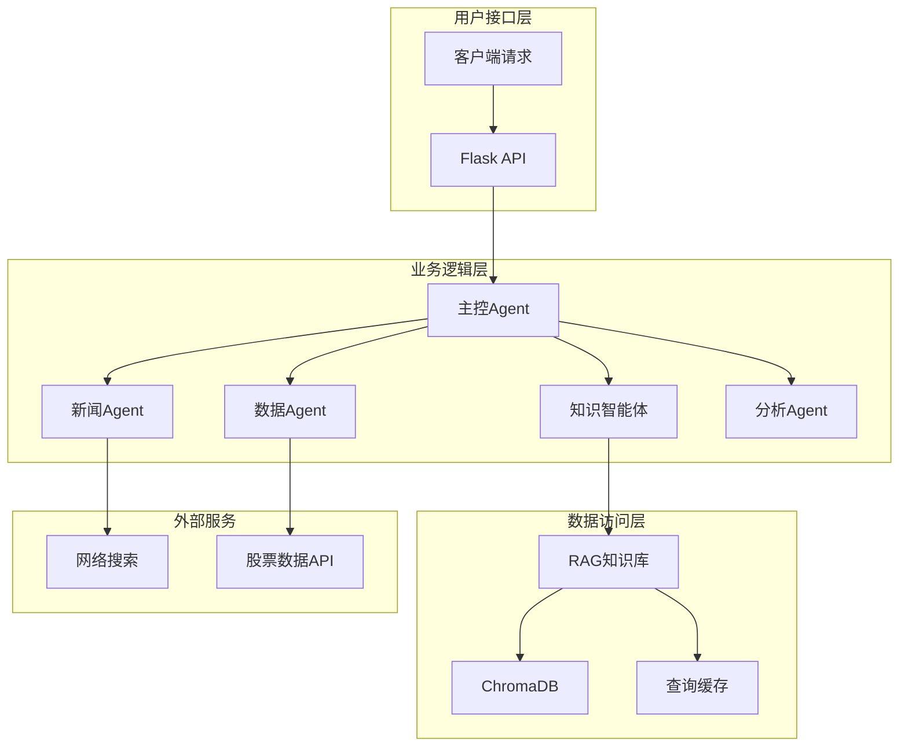
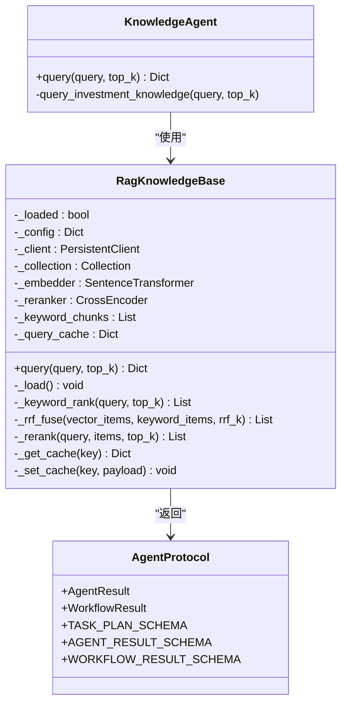
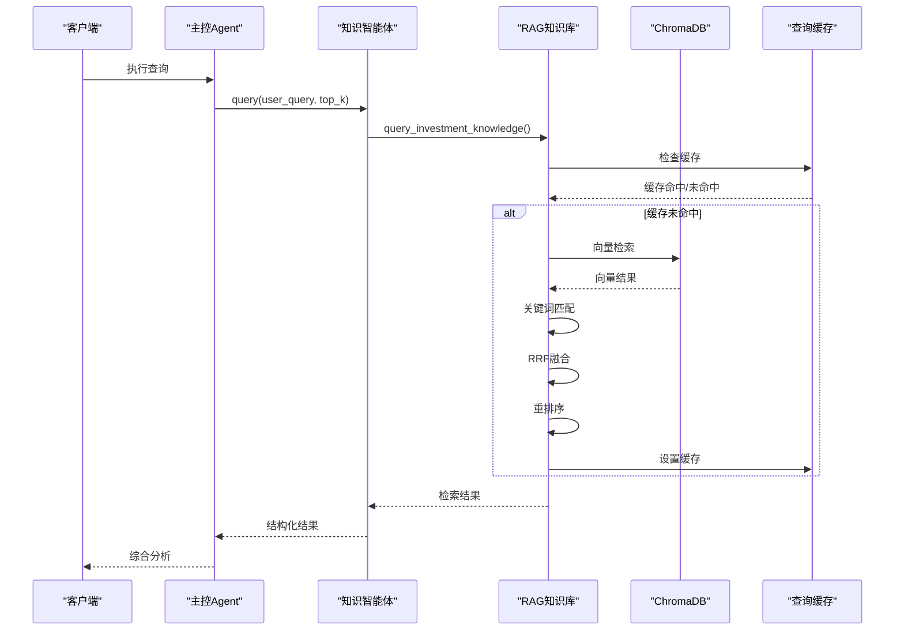
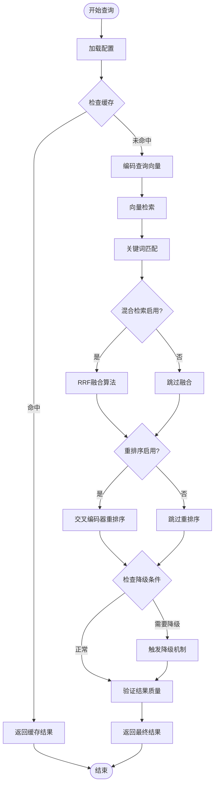
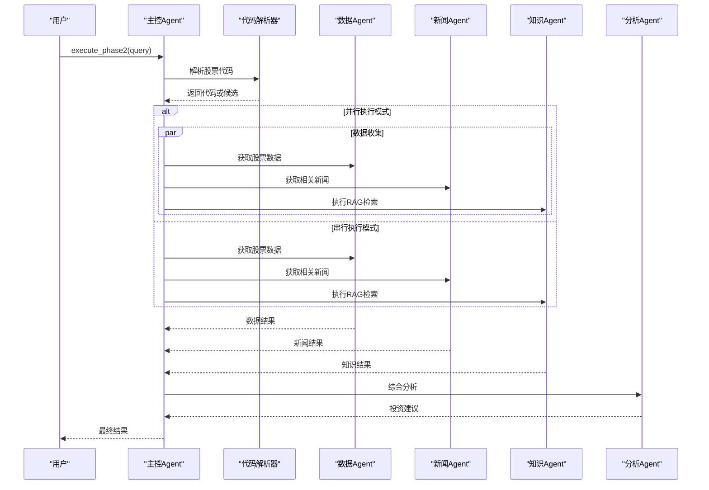
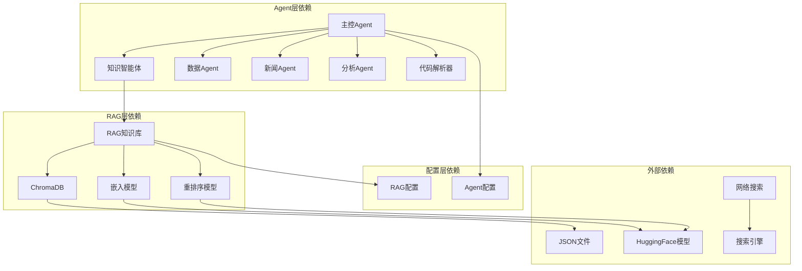

# KnowledgeAgent知识智能体

<cite>
**本文档引用的文件**
- [knowledge_agent.py](file://src/agent/knowledge_agent.py)
- [master_agent.py](file://src/agent/master_agent.py)
- [knowledge_tool.py](file://src/rag/knowledge_tool.py)
- [rag_config.json](file://src/rag/config/rag_config.json)
- [agent_protocol.py](file://src/agent/agent_protocol.py)
- [llm_common.py](file://src/agent/llm_common.py)
- [langchain_orchestrator.py](file://src/agent/langchain_orchestrator.py)
- [symbol_resolver.py](file://src/agent/symbol_resolver.py)
- [data_agent.py](file://src/agent/data_agent.py)
- [news_agent.py](file://src/agent/news_agent.py)
- [main.py](file://src/api/main.py)
- [README.md](file://README.md)
</cite>

## 目录
1. [简介](#简介)
2. [项目结构](#项目结构)
3. [核心组件](#核心组件)
4. [架构概览](#架构概览)
5. [详细组件分析](#详细组件分析)
6. [依赖关系分析](#依赖关系分析)
7. [性能考虑](#性能考虑)
8. [故障排除指南](#故障排除指南)
9. [结论](#结论)

## 简介

KnowledgeAgent知识智能体是AI投资分析系统中的核心组件，专门负责投资知识库的检索和RAG（Retrieval-Augmented Generation）能力。该智能体通过集成ChromaDB向量数据库、SentenceTransformer嵌入模型和CrossEncoder重排序算法，为用户提供精准的投资知识检索服务。

该项目采用多Agent协作架构，结合Flask后端服务和React前端界面，支持用户认证、股票数据分析、新闻聚合和RAG知识检索等多种功能。KnowledgeAgent作为其中的关键组件，为整个投资分析系统提供了强大的知识支撑能力。

## 项目结构

项目采用模块化的组织方式，主要分为以下几个核心模块：

**图表来源**
- [main.py:40-322](file://src/api/main.py#L40-L322)
- [README.md:24-40](file://README.md#L24-L40)

**章节来源**
- [README.md:24-40](file://README.md#L24-L40)
- [main.py:40-322](file://src/api/main.py#L40-L322)

## 核心组件

KnowledgeAgent知识智能体系统包含以下核心组件：

### 1. KnowledgeAgent核心类
- **职责**：封装RAG检索能力，提供统一的知识库查询接口
- **特点**：轻量级设计，专注于知识检索功能
- **接口**：提供query方法，支持自定义返回条数

### 2. RagKnowledgeBase知识库
- **职责**：管理ChromaDB向量数据库连接和查询
- **功能**：向量化检索、关键词匹配、重排序、缓存管理
- **特性**：支持混合检索（向量+关键词）、RRF融合算法

### 3. 配置管理系统
- **职责**：管理RAG配置参数
- **内容**：嵌入模型设置、索引配置、缓存策略、查询参数
- **灵活性**：支持热更新和环境变量配置

**章节来源**
- [knowledge_agent.py:13-28](file://src/agent/knowledge_agent.py#L13-L28)
- [knowledge_tool.py:22-273](file://src/rag/knowledge_tool.py#L22-L273)
- [rag_config.json:1-58](file://src/rag/config/rag_config.json#L1-L58)

## 架构概览

KnowledgeAgent知识智能体采用分层架构设计，确保了系统的可扩展性和维护性：

**图表来源**
- [master_agent.py:25-447](file://src/agent/master_agent.py#L25-L447)
- [knowledge_agent.py:13-28](file://src/agent/knowledge_agent.py#L13-L28)
- [knowledge_tool.py:22-273](file://src/rag/knowledge_tool.py#L22-L273)

## 详细组件分析

### KnowledgeAgent类分析

KnowledgeAgent是知识智能体的核心实现，采用了简洁的设计模式：

**图表来源**
- [knowledge_agent.py:13-28](file://src/agent/knowledge_agent.py#L13-L28)
- [knowledge_tool.py:22-273](file://src/rag/knowledge_tool.py#L22-L273)
- [agent_protocol.py:74-116](file://src/agent/agent_protocol.py#L74-L116)

#### 查询流程序列图

**图表来源**
- [master_agent.py:322-414](file://src/agent/master_agent.py#L322-L414)
- [knowledge_agent.py:16-27](file://src/agent/knowledge_agent.py#L16-L27)
- [knowledge_tool.py:177-248](file://src/rag/knowledge_tool.py#L177-L248)

**章节来源**
- [knowledge_agent.py:13-28](file://src/agent/knowledge_agent.py#L13-L28)
- [knowledge_tool.py:22-273](file://src/rag/knowledge_tool.py#L22-L273)

### RAG知识库算法分析

RAG知识库实现了复杂的检索算法，包括多层过滤和优化：

**图表来源**
- [knowledge_tool.py:177-248](file://src/rag/knowledge_tool.py#L177-L248)
- [rag_config.json:43-52](file://src/rag/config/rag_config.json#L43-L52)

#### 配置参数详解

| 参数类别 | 参数名称 | 默认值 | 作用 |
|---------|---------|--------|------|
| 嵌入模型 | model_name | BAAI/bge-small-zh-v1.5 | 文本向量化模型 |
| 重排序 | enabled | true | 启用交叉编码器重排序 |
| 重排序 | model_name | BAAI/bge-reranker-base | 重排序模型 |
| 缓存 | enabled | true | 启用查询结果缓存 |
| 缓存 | ttl_seconds | 300 | 缓存过期时间(秒) |
| 混合检索 | enabled | true | 启用向量+关键词混合 |
| 混合检索 | rrf_k | 60 | RRF融合参数 |

**章节来源**
- [rag_config.json:17-56](file://src/rag/config/rag_config.json#L17-L56)
- [knowledge_tool.py:177-248](file://src/rag/knowledge_tool.py#L177-L248)

### 主控Agent编排分析

主控Agent负责协调各个Agent的工作流程，实现了灵活的编排策略：

**图表来源**
- [master_agent.py:322-414](file://src/agent/master_agent.py#L322-L414)
- [master_agent.py:265-316](file://src/agent/master_agent.py#L265-L316)

**章节来源**
- [master_agent.py:25-447](file://src/agent/master_agent.py#L25-L447)

## 依赖关系分析

系统采用松耦合的设计，各组件间通过清晰的接口进行交互：

**图表来源**
- [master_agent.py:15-22](file://src/agent/master_agent.py#L15-L22)
- [knowledge_agent.py:10](file://src/agent/knowledge_agent.py#L10)
- [knowledge_tool.py:16-17](file://src/rag/knowledge_tool.py#L16-L17)

**章节来源**
- [master_agent.py:15-22](file://src/agent/master_agent.py#L15-L22)
- [knowledge_agent.py:8-10](file://src/agent/knowledge_agent.py#L8-L10)

## 性能考虑

### 缓存策略
- **查询缓存**：启用LRU缓存机制，默认缓存300秒
- **内存管理**：最大缓存256条记录，避免内存泄漏
- **失效机制**：基于TTL的时间戳检查

### 检索优化
- **向量检索**：使用BAAI/bge-small-zh-v1.5模型，支持中文语义理解
- **混合检索**：向量检索与关键词匹配相结合，提高召回率
- **重排序**：使用BAAI/bge-reranker-base提升相关性排序

### 并行处理
- **线程池**：最大3个工作线程，避免资源竞争
- **超时控制**：默认30秒超时，防止长时间阻塞
- **降级机制**：单个Agent失败不影响整体流程

## 故障排除指南

### 常见问题及解决方案

| 问题类型 | 症状描述 | 可能原因 | 解决方案 |
|---------|---------|---------|---------|
| 模块导入错误 | ImportError | Python路径配置问题 | 确保在项目根目录运行 |
| ChromaDB连接失败 | ConnectionError | 数据库文件损坏 | 删除index/chroma目录重新构建 |
| 模型下载失败 | DownloadError | 网络连接问题 | 检查代理设置，使用本地模型 |
| 检索结果为空 | Empty Results | 查询关键词不匹配 | 调整查询语句，增加关键词 |
| 性能缓慢 | High Latency | 缓存未命中 | 检查缓存配置，清理缓存 |

### 调试建议

1. **启用详细日志**：设置LOG_LEVEL=DEBUG查看详细执行过程
2. **检查配置文件**：验证rag_config.json参数设置
3. **监控资源使用**：关注内存和CPU使用情况
4. **测试独立功能**：分别测试各个Agent的功能完整性

**章节来源**
- [README.md:205-210](file://README.md#L205-L210)

## 结论

KnowledgeAgent知识智能体作为AI投资分析系统的核心组件，展现了优秀的架构设计和实现质量。其主要优势包括：

### 技术亮点
- **模块化设计**：清晰的职责分离和接口定义
- **高性能检索**：结合向量检索和关键词匹配的混合算法
- **智能缓存**：有效的查询结果缓存机制
- **灵活编排**：支持多种执行模式和降级策略

### 应用价值
- **投资决策支持**：为用户提供准确的投资知识检索服务
- **系统稳定性**：完善的错误处理和降级机制
- **扩展性强**：易于添加新的检索策略和数据源

### 发展方向
- **模型优化**：持续改进嵌入模型和重排序算法
- **功能扩展**：支持更多类型的金融数据检索
- **性能优化**：进一步提升检索速度和准确性

该知识智能体为整个AI投资分析系统奠定了坚实的技术基础，为用户提供高质量的投资知识服务。