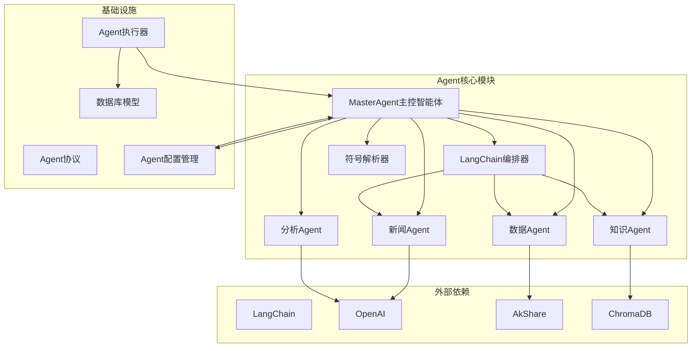
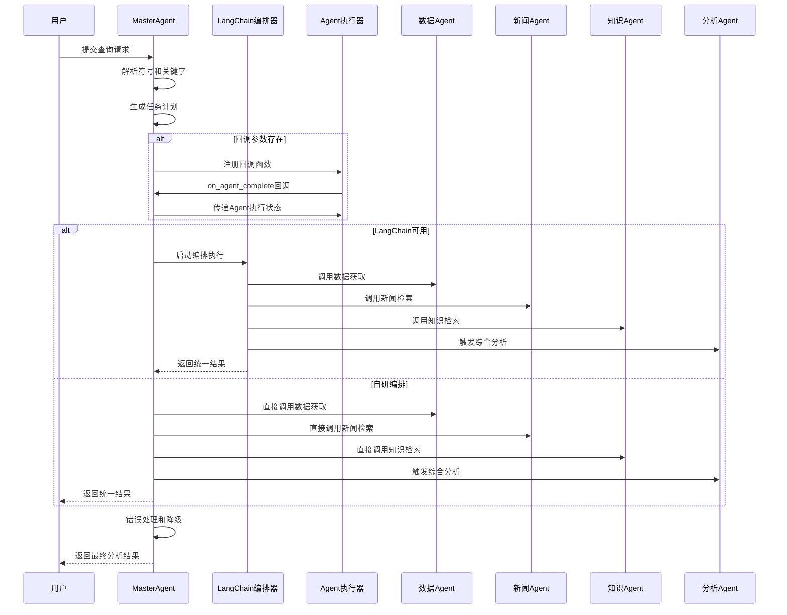
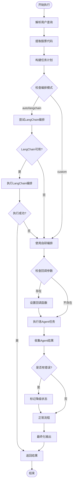
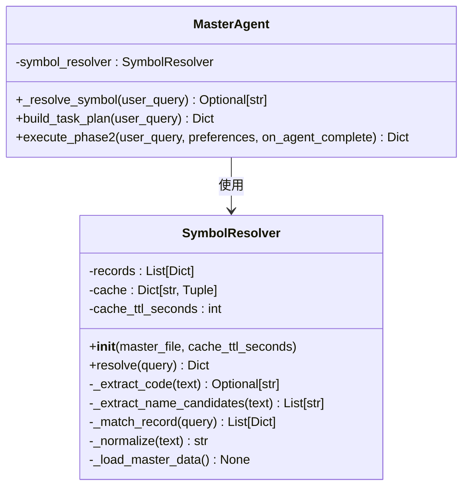
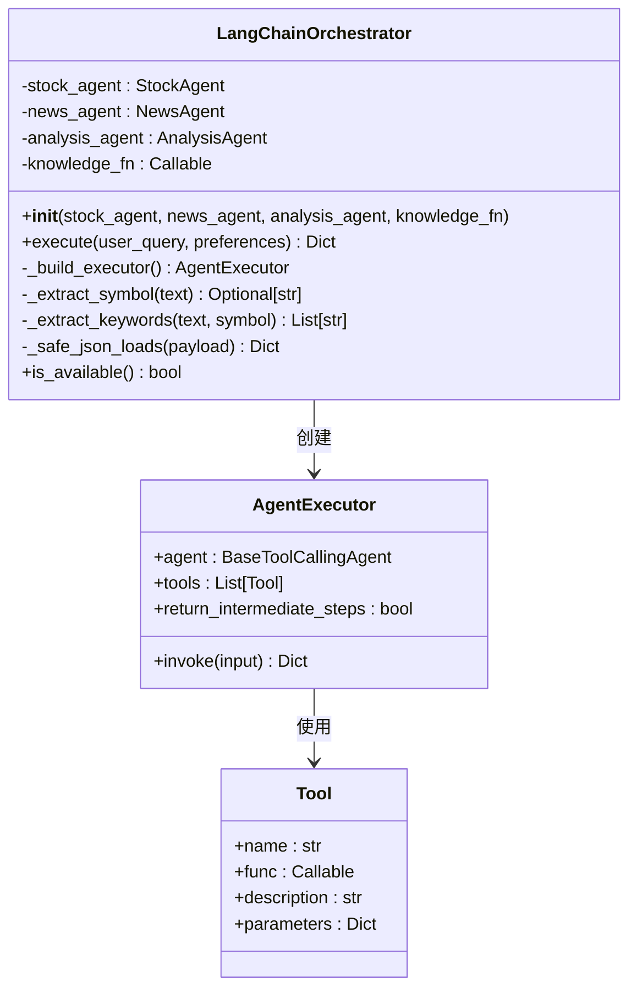
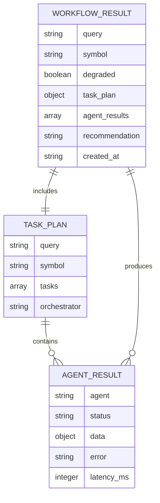
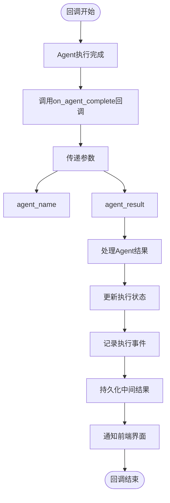
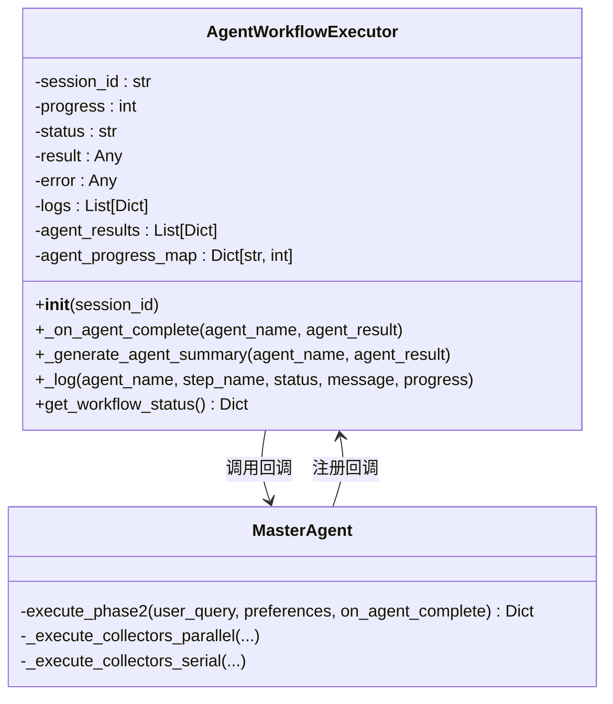

# MasterAgent主控智能体

<cite>
**本文档引用的文件**
- [master_agent.py](file://src/agent/master_agent.py)
- [langchain_orchestrator.py](file://src/agent/langchain_orchestrator.py)
- [symbol_resolver.py](file://src/agent/symbol_resolver.py)
- [agent_protocol.py](file://src/agent/agent_protocol.py)
- [llm_common.py](file://src/agent/llm_common.py)
- [agent_executor.py](file://src/api/agent_executor.py)
- [database.py](file://src/models/database.py)
- [App.jsx](file://src/web/src/App.jsx)
- [test_master_agent.py](file://src/agent/test/test_master_agent.py)
</cite>

## 目录
1. [简介](#简介)
2. [项目结构](#项目结构)
3. [核心组件](#核心组件)
4. [架构概览](#架构概览)
5. [详细组件分析](#详细组件分析)
6. [回调机制与实时监控](#回调机制与实时监控)
7. [依赖关系分析](#依赖关系分析)
8. [性能考虑](#性能考虑)
9. [故障排除指南](#故障排除指南)
10. [结论](#结论)
11. [附录](#附录)

## 简介

MasterAgent主控智能体是AI投资分析系统的核心协调器，负责管理多个专业Agent的协作执行。该系统采用双编排器架构，既支持基于LangChain的AgentExecutor编排，也提供自研编排器作为降级方案，确保在各种环境下都能稳定运行。

**最新更新**：系统现已增强回调机制和实时监控功能，支持在Agent执行过程中实时获取执行状态和中间结果。

系统的主要职责包括：
- **任务计划生成**：根据用户查询生成标准化的任务执行计划
- **符号解析**：识别和解析股票代码、公司名称等金融实体
- **关键字提取**：从用户查询中提取关键信息用于新闻和知识检索
- **多Agent编排协调**：协调数据Agent、新闻Agent、知识Agent和分析Agent的协同工作
- **错误处理与降级**：在编排器不可用时自动切换到自研编排器
- **实时回调监控**：支持在Agent执行过程中实时获取执行状态和中间结果

## 项目结构



**图表来源**
- [master_agent.py:25-41](file://src/agent/master_agent.py#L25-L41)
- [langchain_orchestrator.py:20-27](file://src/agent/langchain_orchestrator.py#L20-L27)
- [llm_common.py:49-80](file://src/agent/llm_common.py#L49-L80)
- [agent_executor.py:25-50](file://src/api/agent_executor.py#L25-L50)
- [database.py:54-87](file://src/models/database.py#L54-L87)

## 核心组件

### MasterAgent主控智能体

MasterAgent是整个系统的协调中心，负责：
- **编排模式控制**：通过环境变量控制编排器选择（auto/langchain/custom）
- **任务计划构建**：生成标准化的任务执行计划
- **执行流程管理**：协调各个Agent的执行顺序和数据传递
- **结果整合**：将各Agent的结果整合为统一的输出格式
- **回调机制支持**：支持在Agent执行过程中实时回调通知

### LangChain编排器

提供基于LangChain AgentExecutor的高级编排能力：
- **工具调用**：通过工具接口调用各个Agent的功能
- **中间步骤追踪**：记录工具调用的中间过程
- **自动回退机制**：当工具调用失败时自动回退到自研编排

### 符号解析器

专门负责金融实体的识别和解析：
- **本地主数据匹配**：优先使用本地股票主数据进行解析
- **模糊匹配算法**：支持公司名称、别名的模糊匹配
- **缓存机制**：提高解析效率和响应速度

### Agent配置管理

集中管理Agent的运行配置：
- **编排器模式**：支持auto、langchain、custom三种模式
- **并行执行控制**：控制数据收集Agent的并行执行
- **超时配置**：设置并行执行的超时时间

**章节来源**
- [master_agent.py:25-41](file://src/agent/master_agent.py#L25-L41)
- [langchain_orchestrator.py:20-27](file://src/agent/langchain_orchestrator.py#L20-L27)
- [symbol_resolver.py:18-244](file://src/agent/symbol_resolver.py#L18-L244)
- [llm_common.py:49-80](file://src/agent/llm_common.py#L49-L80)

## 架构概览



**图表来源**
- [master_agent.py:322-414](file://src/agent/master_agent.py#L322-L414)
- [agent_executor.py:103-132](file://src/api/agent_executor.py#L103-L132)

## 详细组件分析

### MasterAgent执行流程



**图表来源**
- [master_agent.py:322-414](file://src/agent/master_agent.py#L322-L414)

### 符号解析机制



**图表来源**
- [symbol_resolver.py:18-244](file://src/agent/symbol_resolver.py#L18-L244)
- [master_agent.py:96-129](file://src/agent/master_agent.py#L96-L129)

### LangChain编排器实现



**图表来源**
- [langchain_orchestrator.py:20-273](file://src/agent/langchain_orchestrator.py#L20-L273)

**章节来源**
- [master_agent.py:322-414](file://src/agent/master_agent.py#L322-L414)
- [langchain_orchestrator.py:71-149](file://src/agent/langchain_orchestrator.py#L71-L149)

### Agent协议与数据结构



**图表来源**
- [agent_protocol.py:16-116](file://src/agent/agent_protocol.py#L16-L116)

**章节来源**
- [agent_protocol.py:74-116](file://src/agent/agent_protocol.py#L74-L116)

## 回调机制与实时监控

### 回调函数设计

系统引入了强大的回调机制，支持在Agent执行过程中实时获取执行状态：



**图表来源**
- [master_agent.py:239-304](file://src/agent/master_agent.py#L239-L304)
- [agent_executor.py:103-132](file://src/api/agent_executor.py#L103-L132)

### 实时监控功能

Agent执行器实现了完整的实时监控功能：

| 监控维度 | 实现方式 | 数据结构 | 更新频率 |
|---------|----------|----------|----------|
| 进度跟踪 | 预设进度映射 | `_agent_progress_map` | 实时更新 |
| 日志记录 | 事件驱动记录 | `AgentLog`模型 | 每次回调 |
| 中间结果 | 数据库持久化 | `AnalysisSession` | 每次回调 |
| 前端同步 | WebSocket推送 | React组件 | 实时渲染 |

### Agent执行器架构



**图表来源**
- [agent_executor.py:25-132](file://src/api/agent_executor.py#L25-L132)
- [master_agent.py:322-414](file://src/agent/master_agent.py#L322-L414)

**章节来源**
- [master_agent.py:239-304](file://src/agent/master_agent.py#L239-L304)
- [agent_executor.py:103-132](file://src/api/agent_executor.py#L103-L132)
- [database.py:54-87](file://src/models/database.py#L54-L87)

## 依赖关系分析

```mermaid
graph TB
subgraph "核心依赖"
PY[Python 3.10+]
FLASK[Flask 3.0+]
OPENAI[OpenAI 1.0+]
LANGCHAIN[LangChain 0.2+]
SQLALCHEMY[SQLAlchemy 2.0+]
THREADING[Threading]
END
subgraph "数据处理"
PANDAS[Pandas 2.0+]
NUMPY[Numpy 1.24+]
AKSHARE[AkShare 1.0+]
end
subgraph "向量检索"
CHROMADB[ChromaDB 0.5+]
SENTENCE[Sentance-Transformers 2.2+]
end
subgraph "网络搜索"
DDGS[DuckDuckGo Search]
WEB[Requests]
end
subgraph "前端"
REACT[React 18+]
VITE[Vite]
TAILWIND[TailwindCSS]
end
MA[MasterAgent] --> OPENAI
MA --> LANGCHAIN
MA --> AKSHARE
MA --> CHROMADB
AE[Agent执行器] --> SQLALCHEMY
AE --> THREADING
SA[StockAgent] --> AKSHARE
NA[NewsAgent] --> DDGS
KA[RAG知识库] --> CHROMADB
KA --> SENTENCE
API[Flask API] --> MA
API --> AE
WEB_APP[React前端] --> API
```

**图表来源**
- [requirements.txt:1-41](file://requirements.txt#L1-L41)
- [master_agent.py:9-22](file://src/agent/master_agent.py#L9-L22)
- [agent_executor.py:1-21](file://src/api/agent_executor.py#L1-L21)

**章节来源**
- [requirements.txt:1-41](file://requirements.txt#L1-L41)
- [README.md:16-23](file://README.md#L16-L23)

## 性能考虑

### 编排器选择策略

系统提供了三种编排模式，每种都有不同的性能特征：

| 编排模式 | 优点 | 缺点 | 适用场景 |
|---------|------|------|----------|
| auto | 自动切换，稳定性好 | 首次启动可能较慢 | 生产环境推荐 |
| langchain | 功能强大，工具调用灵活 | 依赖复杂，内存占用高 | 高性能需求场景 |
| custom | 轻量级，启动快 | 功能相对简单 | 资源受限环境 |

### 缓存策略

系统实现了多层次的缓存机制：

1. **符号解析缓存**：SymbolResolver使用TTL缓存提高解析效率
2. **工具调用缓存**：DecisionAgent实现全局和本地缓存
3. **RAG查询缓存**：RagKnowledgeBase支持配置化的缓存策略

### 并行执行优化

- **线程池执行**：使用ThreadPoolExecutor并行执行多个Agent
- **超时保护**：为每个工具调用设置超时时间
- **资源限制**：通过环境变量控制最大并发数

### 回调机制性能优化

- **异步回调**：回调函数在独立线程中执行，不影响主流程
- **批量持久化**：定期批量写入数据库，减少I/O操作
- **进度映射**：预设Agent执行进度，避免重复计算

## 故障排除指南

### 常见问题及解决方案

#### 编排器不可用
**症状**：LangChain编排器初始化失败
**原因**：缺少LangChain依赖或配置错误
**解决方案**：
1. 检查requirements.txt中的依赖安装
2. 设置环境变量：`AGENT_ORCHESTRATOR=custom`
3. 验证OpenAI API密钥配置

#### 股票数据获取失败
**症状**：StockAgent调用失败
**原因**：网络问题或数据源不可用
**解决方案**：
1. 检查代理设置：`AKSHARE_DISABLE_PROXY=1`
2. 验证AkShare库版本
3. 查看日志中的具体错误信息

#### RAG检索效果不佳
**症状**：知识库查询结果质量差
**原因**：索引构建问题或配置不当
**解决方案**：
1. 重新构建索引：`src/rag/scripts/build_chroma_index.py`
2. 检查rag_config.json配置
3. 验证嵌入模型下载状态

#### 性能问题
**症状**：响应时间过长
**原因**：并发过高或缓存未生效
**解决方案**：
1. 调整环境变量：`AGENT_TOOL_MAX_WORKERS=3`
2. 设置缓存TTL：`AGENT_TOOL_CACHE_TTL=300`
3. 优化查询参数：减少返回结果数量

#### 回调机制问题
**症状**：实时监控功能失效
**原因**：回调函数未正确注册或数据库连接异常
**解决方案**：
1. 检查MasterAgent的execute_phase2方法是否传入回调参数
2. 验证数据库连接配置
3. 查看Agent执行器的日志输出

**章节来源**
- [master_agent.py:332-357](file://src/agent/master_agent.py#L332-L357)
- [agent_executor.py:103-132](file://src/api/agent_executor.py#L103-L132)
- [README.md:205-210](file://README.md#L205-L210)

## 结论

MasterAgent主控智能体通过其精心设计的双编排器架构和增强的回调机制，为AI投资分析系统提供了强大的协调能力和高可靠性。系统的核心优势包括：

1. **高可用性**：LangChain编排器不可用时自动降级到自研编排器
2. **灵活性**：支持多种编排模式，可根据环境动态调整
3. **可扩展性**：清晰的组件分离和标准化协议，便于功能扩展
4. **性能优化**：多层次缓存和并行执行机制
5. **实时监控**：强大的回调机制支持实时状态监控和中间结果展示
6. **用户体验**：完整的前后端交互，提供流畅的分析体验

该系统为投资分析领域提供了一个完整的解决方案，既保证了功能的完整性，又确保了在各种环境下的稳定运行和良好的用户体验。

## 附录

### 使用示例

#### 基本查询执行
```python
from agent.master_agent import MasterAgent

agent = MasterAgent()
result = agent.run_query("分析比亚迪的近期表现")
print(result)
```

#### 自定义偏好设置
```python
preferences = {
    "risk_tolerance": "medium",
    "investment_horizon": "long_term",
    "debug_mode": False
}
result = agent.run_query("分析某股票", preferences)
```

#### 实时回调监控
```python
def on_agent_complete(agent_name, agent_result):
    """Agent完成时的回调函数"""
    print(f"Agent {agent_name} 完成，状态: {agent_result['status']}")
    print(f"执行耗时: {agent_result['latency_ms']}ms")

result = agent.execute_phase2(
    "分析某股票",
    preferences=None,
    on_agent_complete=on_agent_complete
)
```

### 最佳实践

1. **编排器选择**：生产环境推荐使用`auto`模式
2. **缓存配置**：合理设置缓存TTL以平衡性能和准确性
3. **错误监控**：关注`degraded`标志以及时发现系统问题
4. **资源管理**：根据硬件条件调整并发参数
5. **回调使用**：在需要实时监控的场景下使用回调机制
6. **数据库配置**：确保数据库连接正常以支持实时监控功能

### 扩展指南

#### 添加新的Agent类型
1. 实现Agent类并遵循Agent协议
2. 在MasterAgent中注册新Agent
3. 更新任务计划生成逻辑
4. 添加相应的错误处理和降级策略

#### 自定义编排器
1. 继承基础编排器类
2. 实现execute方法
3. 遵循统一的返回格式
4. 添加必要的错误处理

#### 扩展回调机制
1. 在Agent执行器中添加新的回调类型
2. 实现相应的处理逻辑
3. 更新数据库模型以支持新的监控维度
4. 修改前端组件以展示新的监控信息

**章节来源**
- [test_master_agent.py:21-37](file://src/agent/test/test_master_agent.py#L21-L37)
- [master_agent.py:322-414](file://src/agent/master_agent.py#L322-L414)
- [agent_executor.py:103-132](file://src/api/agent_executor.py#L103-L132)