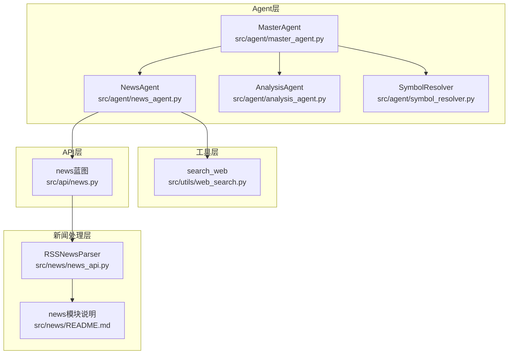
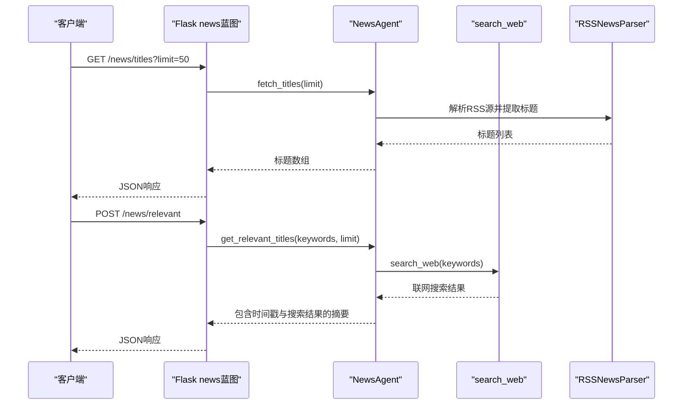
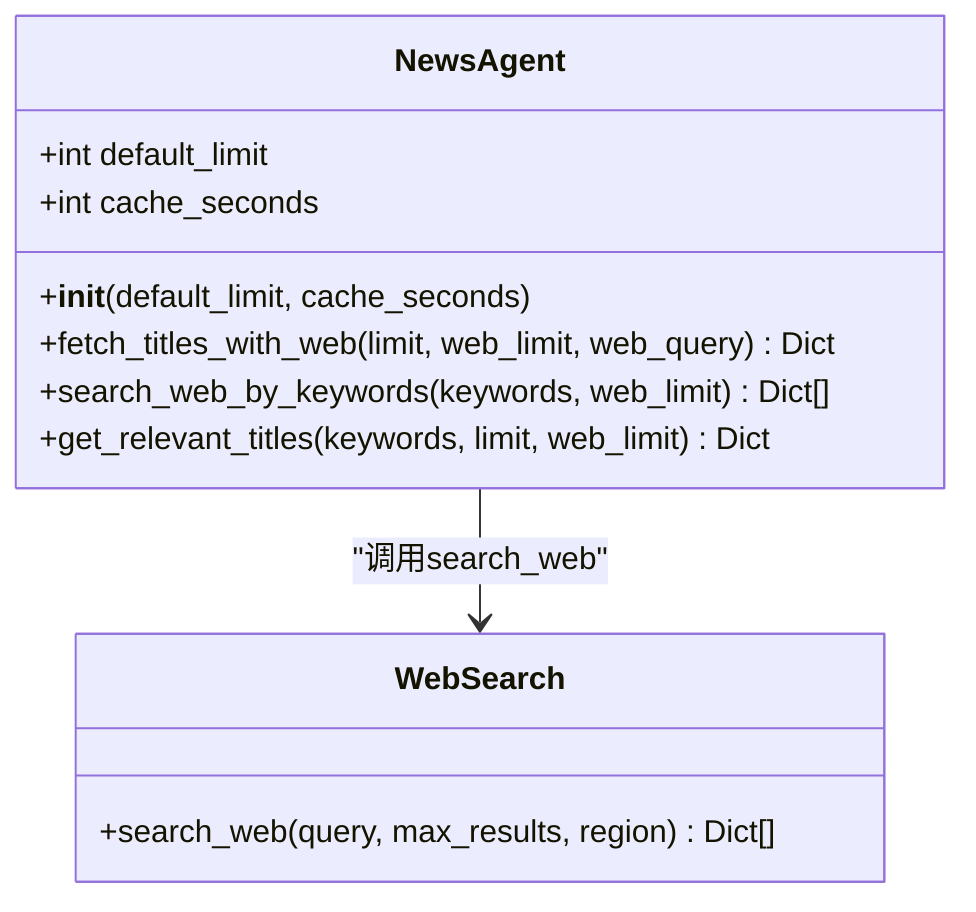
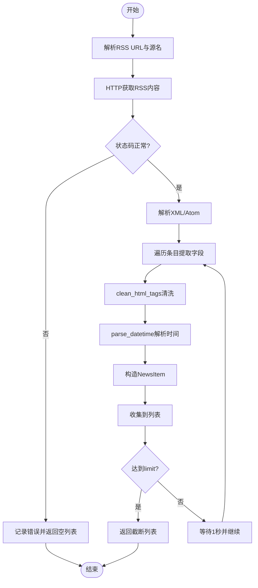
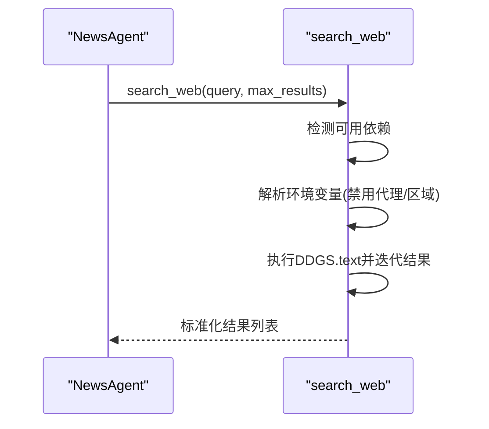
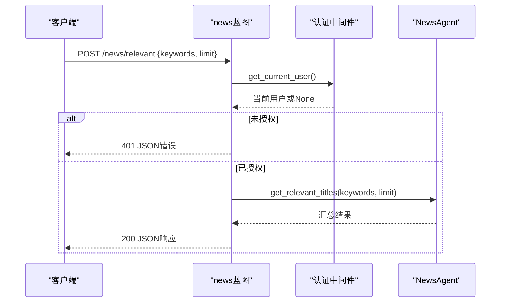
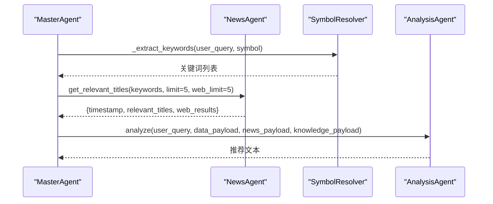
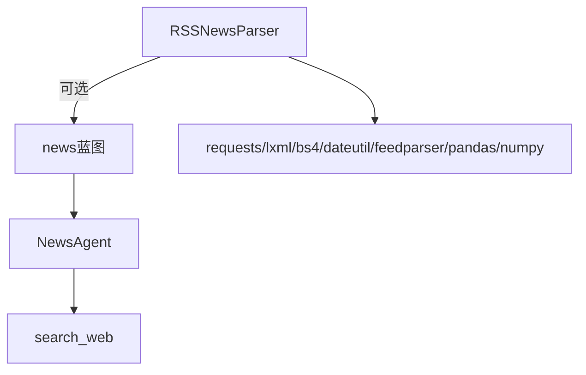

# NewsAgent新闻智能体

<cite>
**本文档引用的文件**
- [src/agent/news_agent.py](file://src/agent/news_agent.py)
- [src/news/news_api.py](file://src/news/news_api.py)
- [src/api/news.py](file://src/api/news.py)
- [src/utils/web_search.py](file://src/utils/web_search.py)
- [src/news/README.md](file://src/news/README.md)
- [src/news/test/test_news_api.py](file://src/news/test/test_news_api.py)
- [src/news/requirements.txt](file://src/news/requirements.txt)
- [src/agent/master_agent.py](file://src/agent/master_agent.py)
- [src/agent/analysis_agent.py](file://src/agent/analysis_agent.py)
- [src/agent/symbol_resolver.py](file://src/agent/symbol_resolver.py)
</cite>

## 目录
1. [引言](#引言)
2. [项目结构](#项目结构)
3. [核心组件](#核心组件)
4. [架构总览](#架构总览)
5. [详细组件分析](#详细组件分析)
6. [依赖关系分析](#依赖关系分析)
7. [性能考虑](#性能考虑)
8. [故障排除指南](#故障排除指南)
9. [结论](#结论)
10. [附录](#附录)

## 引言
本文件面向NewsAgent新闻智能体的使用者与维护者，系统性阐述其在新闻数据获取、筛选与分析方面的完整流程。文档覆盖以下关键主题：
- 新闻标题抓取：RSS源聚合与解析、标题提取与清洗
- 内容过滤：关键词匹配算法、新闻去重机制、时间窗口筛选策略
- 相关性评分与情感分析：评分模型设计、情感维度构建
- 预处理流程：文本清洗、分词、实体识别
- 新闻质量评估标准与相关性排序算法
- 新闻API集成示例与错误处理机制

该智能体通过多源RSS聚合与联网搜索相结合的方式，为上层分析Agent提供高质量、可解释的新闻输入，支撑投资决策。

## 项目结构
NewsAgent位于src/agent子系统中，围绕NewsAgent类实现新闻获取与筛选；同时依赖src/news模块进行RSS解析与清洗，依赖src/utils/web_search进行联网搜索；通过Flask蓝图提供REST API；在主控Agent中被调用以参与端到端工作流。

**图表来源**
- [src/agent/news_agent.py](file://src/agent/news_agent.py#L18-L92)
- [src/news/news_api.py](file://src/news/news_api.py#L41-L248)
- [src/api/news.py](file://src/api/news.py#L8-L74)
- [src/utils/web_search.py](file://src/utils/web_search.py#L39-L80)
- [src/agent/master_agent.py](file://src/agent/master_agent.py#L237-L246)
- [src/agent/analysis_agent.py](file://src/agent/analysis_agent.py#L15-L119)
- [src/agent/symbol_resolver.py](file://src/agent/symbol_resolver.py#L18-L244)

**章节来源**
- [src/agent/news_agent.py](file://src/agent/news_agent.py#L1-L93)
- [src/news/news_api.py](file://src/news/news_api.py#L1-L248)
- [src/api/news.py](file://src/api/news.py#L1-L75)
- [src/utils/web_search.py](file://src/utils/web_search.py#L1-L80)
- [src/news/README.md](file://src/news/README.md#L1-L46)

## 核心组件
- NewsAgent：负责新闻标题获取、关键词搜索、相关性结果汇总
- RSSNewsParser：负责RSS/Atom源解析、HTML清洗、日期解析与时区处理
- search_web：基于DuckDuckGo的联网搜索工具
- Flask news蓝图：提供/titles、/filter、/relevant三个REST接口
- MasterAgent：在端到端工作流中调用NewsAgent并整合多Agent输出
- AnalysisAgent：接收NewsAgent输出并生成最终分析文本
- SymbolResolver：辅助从用户查询中抽取股票代码，为关键词提取提供上下文

**章节来源**
- [src/agent/news_agent.py](file://src/agent/news_agent.py#L18-L92)
- [src/news/news_api.py](file://src/news/news_api.py#L41-L248)
- [src/utils/web_search.py](file://src/utils/web_search.py#L39-L80)
- [src/api/news.py](file://src/api/news.py#L16-L74)
- [src/agent/master_agent.py](file://src/agent/master_agent.py#L237-L246)
- [src/agent/analysis_agent.py](file://src/agent/analysis_agent.py#L27-L92)
- [src/agent/symbol_resolver.py](file://src/agent/symbol_resolver.py#L190-L243)

## 架构总览
NewsAgent采用“RSS聚合 + 联网搜索”的双通道架构：
- RSS通道：通过RSSNewsParser解析多个权威财经RSS源，提取标题、链接、描述与发布时间，统一清洗与标准化
- 联网搜索通道：通过search_web执行关键词搜索，补充实时热点与深度报道
- 上层集成：MasterAgent在工作流中调用NewsAgent，AnalysisAgent消费其结果生成投资建议

**图表来源**
- [src/api/news.py](file://src/api/news.py#L16-L74)
- [src/agent/news_agent.py](file://src/agent/news_agent.py#L25-L92)
- [src/news/news_api.py](file://src/news/news_api.py#L196-L248)
- [src/utils/web_search.py](file://src/utils/web_search.py#L39-L80)

## 详细组件分析

### NewsAgent组件分析
- 角色定位：面向上层Agent与API的新闻入口，提供标题获取与关键词搜索能力
- 关键方法：
  - fetch_titles_with_web：结合RSS与联网搜索，返回混合结果
  - search_web_by_keywords：将关键词拼接为查询串并执行联网搜索
  - get_relevant_titles：汇总时间戳、总数、相关标题与搜索结果
- 设计特点：轻量封装、日志记录、参数化限制、便于上层组合调用

**图表来源**
- [src/agent/news_agent.py](file://src/agent/news_agent.py#L18-L92)
- [src/utils/web_search.py](file://src/utils/web_search.py#L39-L80)

**章节来源**
- [src/agent/news_agent.py](file://src/agent/news_agent.py#L25-L92)

### RSS新闻解析器（RSSNewsParser）
- 角色定位：底层RSS/Atom解析与清洗引擎
- 核心能力：
  - parse_rss_feed：兼容RSS/Atom格式，提取title/link/description/pub_date/source
  - fetch_titles：聚合多源并限制返回数量
  - clean_html_tags：移除CDATA与HTML标签，规范化空白
  - parse_datetime：多格式日期解析与时区处理
- 错误处理：网络异常、XML解析异常、单项解析异常均记录日志并安全跳过

**图表来源**
- [src/news/news_api.py](file://src/news/news_api.py#L100-L226)

**章节来源**
- [src/news/news_api.py](file://src/news/news_api.py#L41-L248)
- [src/news/README.md](file://src/news/README.md#L18-L28)

### 联网搜索工具（search_web）
- 角色定位：提供关键词驱动的联网搜索，返回标题、链接、摘要
- 实现要点：
  - 自动检测duckduckgo_search或ddgs依赖，降级容错
  - 支持禁用代理环境变量控制
  - 统一结果结构，异常捕获与日志记录
- 适用场景：热点追踪、深度报道补充、时效性增强

**图表来源**
- [src/utils/web_search.py](file://src/utils/web_search.py#L39-L80)

**章节来源**
- [src/utils/web_search.py](file://src/utils/web_search.py#L1-L80)

### API集成与错误处理
- 路由设计：
  - GET /news/titles：获取RSS标题列表
  - POST /news/filter：按关键词过滤已有标题
  - POST /news/relevant：获取相关新闻摘要（含时间戳与搜索结果）
- 认证与鉴权：每个路由均调用get_current_user进行用户校验
- 错误处理：统一捕获异常并返回JSON错误信息，状态码覆盖400/401/500

**图表来源**
- [src/api/news.py](file://src/api/news.py#L16-L74)

**章节来源**
- [src/api/news.py](file://src/api/news.py#L1-L75)

### 在主控工作流中的调用
- MasterAgent在第二阶段工作流中：
  - 从用户查询抽取关键词
  - 调用NewsAgent.get_relevant_titles获取相关新闻摘要
  - 整合StockAgent与KnowledgeAgent结果，交由AnalysisAgent生成最终建议
- 异常处理：任何环节失败都会记录状态与错误信息，保证整体工作流的可观测性

**图表来源**
- [src/agent/master_agent.py](file://src/agent/master_agent.py#L237-L246)
- [src/agent/analysis_agent.py](file://src/agent/analysis_agent.py#L27-L92)

**章节来源**
- [src/agent/master_agent.py](file://src/agent/master_agent.py#L237-L246)
- [src/agent/analysis_agent.py](file://src/agent/analysis_agent.py#L15-L119)

## 依赖关系分析
- 组件耦合：
  - NewsAgent依赖search_web进行联网搜索
  - API层依赖NewsAgent提供业务能力
  - RSSNewsParser独立于API层，仅在需要完整NewsItem时被调用
- 外部依赖：
  - requests/lxml/beautifulsoup4/python-dateutil/feedparser等用于网络请求与解析
  - pandas/numpy用于数据分析（在news模块内）
  - 可选异步支持（aiohttp/asyncio-mqtt）

**图表来源**
- [src/agent/news_agent.py](file://src/agent/news_agent.py#L15-L15)
- [src/api/news.py](file://src/api/news.py#L9-L9)
- [src/news/news_api.py](file://src/news/news_api.py#L18-L18)
- [src/news/requirements.txt](file://src/news/requirements.txt#L1-L19)

**章节来源**
- [src/news/requirements.txt](file://src/news/requirements.txt#L1-L19)

## 性能考虑
- RSS抓取优化：
  - 单源解析后sleep 1秒，避免触发目标站点限流
  - 限制返回数量，减少下游处理压力
- 联网搜索优化：
  - 控制max_results，避免过多网络I/O
  - 支持禁用代理与指定区域，提升稳定性
- 缓存与限频：
  - 建议在上层调用侧增加缓存或限频策略，降低重复请求
- 并发与异步：
  - news模块提供可选异步依赖，可在高并发场景下启用

**章节来源**
- [src/news/news_api.py](file://src/news/news_api.py#L222-L225)
- [src/news/README.md](file://src/news/README.md#L43-L45)
- [src/news/requirements.txt](file://src/news/requirements.txt#L17-L19)

## 故障排除指南
- RSS解析失败：
  - 现象：返回空列表或日志报错
  - 排查：检查网络连通性、目标RSS格式是否为RSS/Atom、日期格式是否可解析
  - 参考路径：[RSS解析异常处理](file://src/news/news_api.py#L186-L194)
- 联网搜索不可用：
  - 现象：search_web返回空列表并记录警告
  - 排查：确认已安装duckduckgo_search或ddgs依赖，检查DDGS相关环境变量
  - 参考路径：[依赖检测与降级](file://src/utils/web_search.py#L54-L60)
- API鉴权失败：
  - 现象：返回401未授权
  - 排查：确认认证中间件正确设置当前用户
  - 参考路径：[认证检查](file://src/api/news.py#L19-L21)
- 关键词匹配与相关性评分：
  - 建议：在现有基础上扩展关键词权重、TF-IDF相似度、BERT向量相似度等算法
  - 建议：引入去重策略（基于标题编辑距离或语义相似度阈值）
  - 建议：时间窗口筛选（如最近N小时/天），并结合情感分析（积极/消极/中性）进行加权

**章节来源**
- [src/news/news_api.py](file://src/news/news_api.py#L186-L194)
- [src/utils/web_search.py](file://src/utils/web_search.py#L54-L60)
- [src/api/news.py](file://src/api/news.py#L19-L21)

## 结论
NewsAgent通过RSS聚合与联网搜索的双通道设计，为上层分析提供了稳定、可扩展的新闻输入。当前实现聚焦于标题获取与关键词搜索，后续可在关键词匹配、去重、时间窗口筛选、相关性评分与情感分析等方面进一步增强，以满足更复杂的投研需求。API层提供清晰的REST接口，配合完善的错误处理与日志记录，便于集成与运维。

## 附录

### 新闻数据获取与预处理流程
- RSS通道：解析多源RSS/Atom → 清洗HTML → 规范化日期 → 限制数量
- 联网搜索：关键词拼接 → 执行搜索 → 标准化结果
- 预处理：文本清洗、分词、实体识别（建议在后续版本中引入）

**章节来源**
- [src/news/news_api.py](file://src/news/news_api.py#L54-L98)
- [src/utils/web_search.py](file://src/utils/web_search.py#L39-L80)

### 关键词匹配与相关性评分（建议方案）
- 关键词匹配：
  - 精确匹配：关键词在标题/摘要中出现
  - 词干匹配：基于SnowballStemmer或jieba分词后的词干对比
  - 向量相似度：使用TF-IDF或Sentence-BERT计算与标题的余弦相似度
- 去重机制：
  - 基于编辑距离阈值（如>80%相似度视为重复）
  - 基于语义相似度阈值（如>0.9）
- 时间窗口筛选：
  - 仅保留最近N小时/天的新闻
  - 结合发布时间与当前时间差进行过滤
- 情感分析：
  - 使用TextBlob/SnownLP/中文情感词典，标注积极/消极/中性
  - 对积极/消极新闻赋予不同权重，提升相关性评分

[本节为概念性建议，无需代码来源]

### 新闻质量评估标准（建议）
- 完整性：标题、链接、摘要、发布时间是否齐全
- 准确性：来源权威性（如经济日报、财富中文网）、无明显事实错误
- 时效性：发布时间在时间窗口内
- 代表性：与用户查询或股票代码高度相关
- 多样性：避免同源重复，尽量覆盖不同媒体视角

[本节为概念性建议，无需代码来源]

### API使用示例（REST）
- 获取标题
  - 方法：GET /news/titles?limit=50
  - 成功响应：包含titles数组与count
- 获取相关新闻
  - 方法：POST /news/relevant
  - 请求体：{"keywords": ["A股", "财经"], "limit": 50}
  - 成功响应：包含timestamp、relevant_titles、web_results等字段
- 过滤新闻
  - 方法：POST /news/filter
  - 请求体：{"keywords": ["某公司"], "titles": ["标题1", "标题2"]}
  - 成功响应：包含filtered_news数组与count

**章节来源**
- [src/api/news.py](file://src/api/news.py#L16-L74)