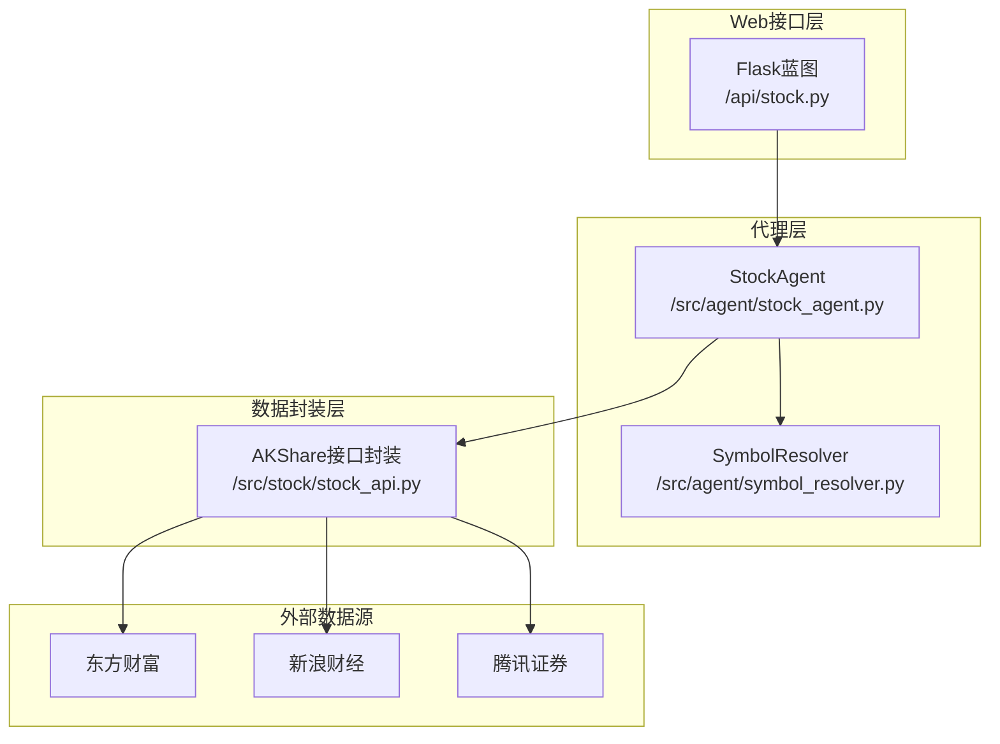
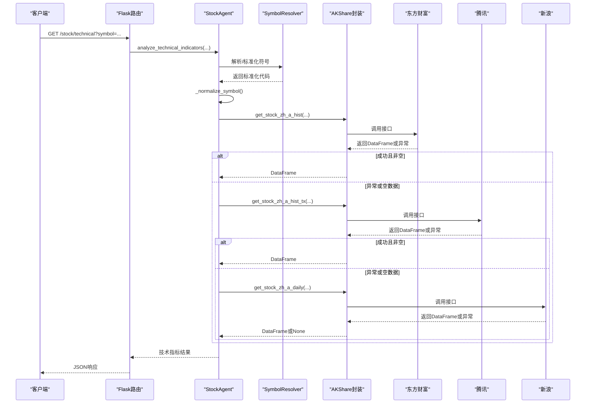
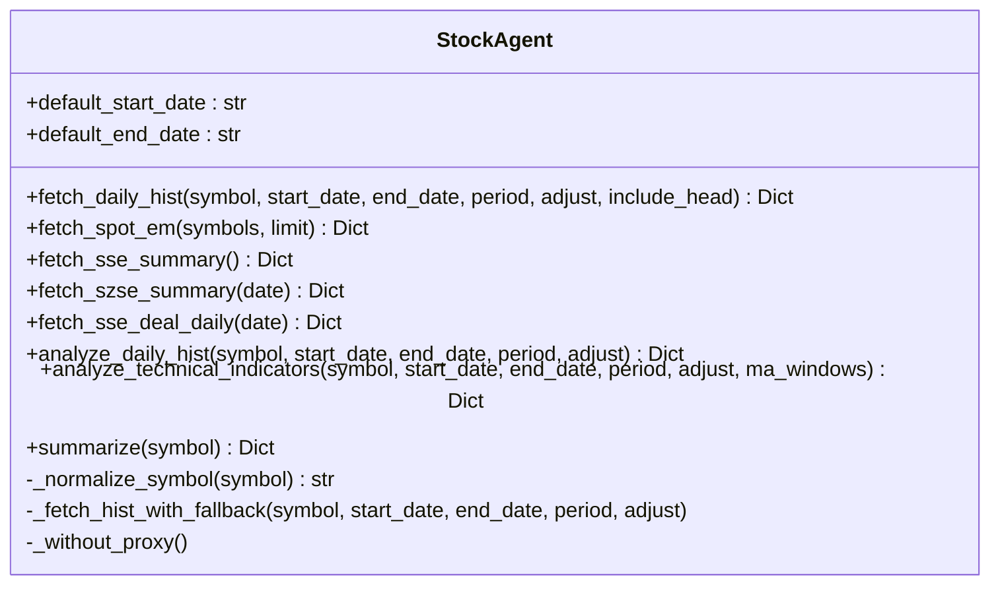
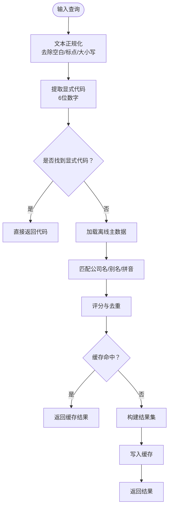
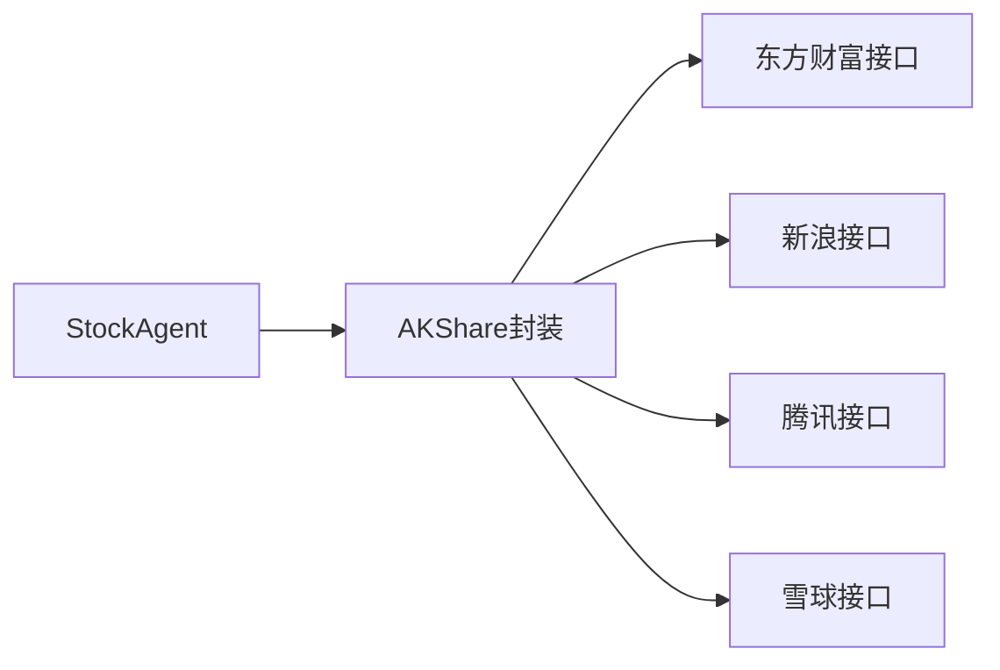
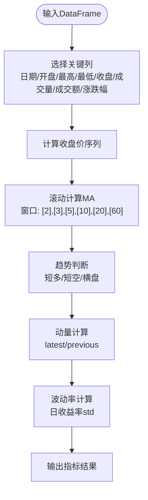
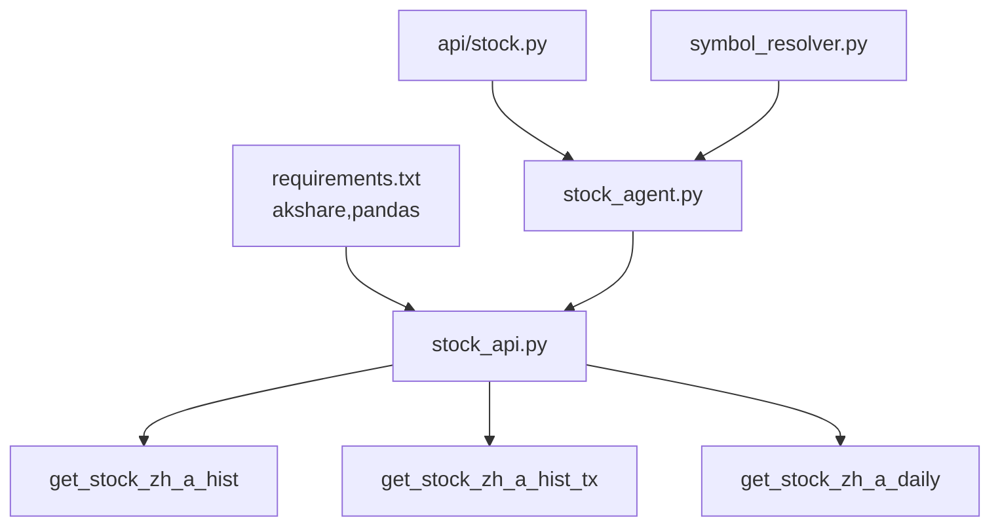

# StockAgent股票数据智能体

<cite>
**本文档引用的文件**
- [src/agent/stock_agent.py](file://src/agent/stock_agent.py)
- [src/agent/symbol_resolver.py](file://src/agent/symbol_resolver.py)
- [src/stock/stock_api.py](file://src/stock/stock_api.py)
- [src/api/stock.py](file://src/api/stock.py)
- [src/agent/test/test_stock_agent_fallback.py](file://src/agent/test/test_stock_agent_fallback.py)
- [src/agent/test/test_symbol_resolver.py](file://src/agent/test/test_symbol_resolver.py)
- [src/stock/test/test_index_fallback.py](file://src/stock/test/test_index_fallback.py)
- [src/stock/requirements.txt](file://src/stock/requirements.txt)
- [src/stock/AKShareAPI原始-A股.md](file://src/stock/AKShareAPI原始-A股.md)
- [src/stock/AKShareAPI概括-A股.md](file://src/stock/AKShareAPI概括-A股.md)
- [src/rag/data/clean/技术分析基础.md](file://src/rag/data/clean/技术分析基础.md)
</cite>

## 目录
1. [引言](#引言)
2. [项目结构](#项目结构)
3. [核心组件](#核心组件)
4. [架构概览](#架构概览)
5. [详细组件分析](#详细组件分析)
6. [依赖关系分析](#依赖关系分析)
7. [性能考量](#性能考量)
8. [故障排查指南](#故障排查指南)
9. [结论](#结论)
10. [附录](#附录)

## 引言
本文件全面阐述StockAgent股票数据智能体的设计与实现，涵盖从AKShare API集成、数据获取与清洗、技术指标计算到趋势分析的完整流程。文档重点解释符号解析机制、股票代码识别、数据格式化过程，并提供失败回退策略与性能优化建议。同时，结合RAG知识库中的技术分析基础，帮助读者理解移动平均线、MACD、RSI等常用指标的计算与应用。

## 项目结构
该项目采用分层架构，主要模块包括：
- 股票代理层：StockAgent负责统一调度数据获取、清洗与分析
- 符号解析层：SymbolResolver负责公司名/别名到股票代码的解析
- API封装层：stock_api.py封装AKShare接口，提供标准化调用
- Web接口层：Flask蓝图提供REST API
- 测试与文档：单元测试与技术分析知识库

图表来源
- [src/api/stock.py](file://src/api/stock.py#L1-L126)
- [src/agent/stock_agent.py](file://src/agent/stock_agent.py#L1-L572)
- [src/agent/symbol_resolver.py](file://src/agent/symbol_resolver.py#L1-L244)
- [src/stock/stock_api.py](file://src/stock/stock_api.py#L1-L425)

章节来源
- [src/api/stock.py](file://src/api/stock.py#L1-L126)
- [src/agent/stock_agent.py](file://src/agent/stock_agent.py#L1-L572)
- [src/agent/symbol_resolver.py](file://src/agent/symbol_resolver.py#L1-L244)
- [src/stock/stock_api.py](file://src/stock/stock_api.py#L1-L425)

## 核心组件
- StockAgent：统一的历史行情、实时行情、市场总貌与技术分析入口，内置代理绕过与回退机制
- SymbolResolver：离线主数据驱动的公司名/别名到代码解析器，支持缓存与歧义处理
- AKShare封装：标准化不同数据源的接口调用，提供代码格式规范化与错误处理
- Flask路由：对外暴露分析、技术指标、历史行情与汇总接口

章节来源
- [src/agent/stock_agent.py](file://src/agent/stock_agent.py#L30-L572)
- [src/agent/symbol_resolver.py](file://src/agent/symbol_resolver.py#L18-L244)
- [src/stock/stock_api.py](file://src/stock/stock_api.py#L1-L425)
- [src/api/stock.py](file://src/api/stock.py#L1-L126)

## 架构概览
StockAgent通过统一的代理与回退策略，优先使用高质量数据源（东方财富），在异常或空数据时自动切换至备选源（腾讯、新浪）。同时，SymbolResolver在上游解析阶段即完成符号标准化，减少下游处理成本。

图表来源
- [src/api/stock.py](file://src/api/stock.py#L46-L76)
- [src/agent/stock_agent.py](file://src/agent/stock_agent.py#L129-L168)
- [src/stock/stock_api.py](file://src/stock/stock_api.py#L212-L252)

## 详细组件分析

### StockAgent：统一数据获取与分析
- 代理绕过：支持通过环境变量禁用代理，避免网络代理导致的请求失败
- 回退链路：优先使用东方财富，其次腾讯，最后新浪，确保在单一数据源异常时仍能获取数据
- 符号标准化：统一去除前后缀与大小写差异，兼容.SH/.SZ/.BJ与SH/SZ/BJ格式
- 数据摘要：返回行数、列名与可选的头部记录，便于前端展示
- 技术分析：支持移动平均线、趋势判断与动量指标计算
- 汇总接口：整合基础分析与技术指标，形成统一视图

图表来源
- [src/agent/stock_agent.py](file://src/agent/stock_agent.py#L30-L572)

章节来源
- [src/agent/stock_agent.py](file://src/agent/stock_agent.py#L30-L572)

### SymbolResolver：符号解析与缓存
- 离线主数据：优先使用本地主数据文件进行公司名到代码的解析，降低对外部接口的依赖
- 正规化与提取：统一去除空白与标点，支持拼音与别名匹配
- 缓存策略：基于TTL的内存缓存，提升重复查询性能
- 评分与去重：对候选结果按匹配度评分并去重，处理歧义场景

图表来源
- [src/agent/symbol_resolver.py](file://src/agent/symbol_resolver.py#L18-L244)

章节来源
- [src/agent/symbol_resolver.py](file://src/agent/symbol_resolver.py#L18-L244)

### AKShare封装：接口标准化与错误处理
- 代码格式规范化：针对不同数据源（东方财富、新浪、腾讯、雪球）提供统一的代码格式转换
- 接口分类：市场总貌、实时行情、历史行情、分时数据、盘前/日内数据、个股信息、行情报价、同行比较
- 错误处理：捕获异常并返回空DataFrame，供上层回退逻辑使用
- 推荐接口：提供相对稳定的接口清单，便于生产使用

图表来源
- [src/stock/stock_api.py](file://src/stock/stock_api.py#L1-L425)

章节来源
- [src/stock/stock_api.py](file://src/stock/stock_api.py#L1-L425)

### 技术分析指标计算
StockAgent提供基础技术指标计算，包括：
- 移动平均线（MA）：根据窗口长度计算简单移动平均，支持多窗口组合判断趋势
- 趋势判断：通过短长期MA对比判断上行、下行或横盘
- 动量指标：基于最新与前一日收盘价计算动量百分比
- 波动率：基于日收益率的标准差衡量波动程度

图表来源
- [src/agent/stock_agent.py](file://src/agent/stock_agent.py#L434-L552)

章节来源
- [src/agent/stock_agent.py](file://src/agent/stock_agent.py#L434-L552)

### API使用示例
- 股票分析：GET /stock/analyze?symbol=000001&start_date=20240101&end_date=20240131&period=daily&adjust=
- 技术指标：GET /stock/technical?symbol=000001&ma_windows=5&ma_windows=10&ma_windows=20
- 历史行情：GET /stock/history?symbol=000001&period=daily&adjust=
- 汇总：GET /stock/summary?symbol=000001

章节来源
- [src/api/stock.py](file://src/api/stock.py#L16-L126)

## 依赖关系分析
- 外部依赖：akshare、pandas
- 内部耦合：StockAgent依赖AKShare封装；API路由依赖StockAgent；SymbolResolver独立于数据获取层
- 回退链路：AKShare封装提供多源接口，StockAgent在上层统一调度

图表来源
- [src/stock/requirements.txt](file://src/stock/requirements.txt#L1-L2)
- [src/stock/stock_api.py](file://src/stock/stock_api.py#L1-L425)
- [src/agent/stock_agent.py](file://src/agent/stock_agent.py#L1-L572)
- [src/api/stock.py](file://src/api/stock.py#L1-L126)
- [src/agent/symbol_resolver.py](file://src/agent/symbol_resolver.py#L1-L244)

章节来源
- [src/stock/requirements.txt](file://src/stock/requirements.txt#L1-L2)
- [src/stock/stock_api.py](file://src/stock/stock_api.py#L1-L425)
- [src/agent/stock_agent.py](file://src/agent/stock_agent.py#L1-L572)
- [src/api/stock.py](file://src/api/stock.py#L1-L126)
- [src/agent/symbol_resolver.py](file://src/agent/symbol_resolver.py#L1-L244)

## 性能考量
- 代理绕过：通过环境变量控制代理，避免不必要的网络延迟
- 缓存策略：SymbolResolver内置TTL缓存，减少重复解析开销
- 数据源选择：优先使用高质量数据源（东方财富），在异常时再回退，提高成功率
- 窗口自适应：MA窗口根据数据长度自动选择，避免无效计算
- 批量过滤：实时行情支持关键词过滤与限制返回条目，降低前端渲染压力

## 故障排查指南
- 数据源异常：检查环境变量AKSHARE_DISABLE_PROXY；确认网络连通性
- 回退链路验证：通过测试用例验证主数据源异常时的回退行为
- 符号解析失败：确认输入格式（支持.SH/.SZ/.BJ与SH/SZ/BJ）；检查本地主数据文件是否存在
- API调用失败：查看Flask路由返回的错误信息；核对参数格式与必填项

章节来源
- [src/agent/test/test_stock_agent_fallback.py](file://src/agent/test/test_stock_agent_fallback.py#L1-L83)
- [src/agent/test/test_symbol_resolver.py](file://src/agent/test/test_symbol_resolver.py#L1-L38)
- [src/stock/test/test_index_fallback.py](file://src/stock/test/test_index_fallback.py#L1-L32)
- [src/api/stock.py](file://src/api/stock.py#L16-L126)

## 结论
StockAgent通过标准化的符号解析、稳健的回退链路与清晰的接口封装，实现了从AKShare多数据源到统一分析结果的高效流转。结合RAG知识库中的技术分析基础，用户可基于StockAgent快速构建股票数据智能分析能力，并在生产环境中通过缓存与代理策略进一步优化性能与稳定性。

## 附录

### 技术分析指标速查
- 移动平均线（MA）：趋势跟踪，窗口自适应
- MACD：趋势与动量结合，关注金叉/死叉与背离
- RSI：震荡区间超买超卖判断
- KDJ：短期转折捕捉，适合震荡行情
- 成交量：量价配合确认趋势强度

章节来源
- [src/rag/data/clean/技术分析基础.md](file://src/rag/data/clean/技术分析基础.md#L125-L590)

### AKShare接口参考
- 历史行情：stock_zh_a_hist、stock_zh_a_daily、stock_zh_a_hist_tx
- 实时行情：stock_zh_a_spot_em、stock_sh_a_spot_em、stock_sz_a_spot_em、stock_bj_a_spot_em、stock_cy_a_spot_em、stock_kc_a_spot_em
- 市场总貌：stock_sse_summary、stock_szse_summary、stock_szse_area_summary、stock_szse_sector_summary、stock_sse_deal_daily
- 分时与盘前：stock_zh_a_minute、stock_zh_a_hist_min_em、stock_zh_a_hist_pre_min_em、stock_intraday_em、stock_intraday_sina
- 个股信息与报价：stock_individual_info_em、stock_individual_basic_info_xq、stock_bid_ask_em
- 同行比较：stock_zh_growth_comparison_em、stock_zh_valuation_comparison_em、stock_zh_dupont_comparison_em、stock_zh_scale_comparison_em

章节来源
- [src/stock/AKShareAPI原始-A股.md](file://src/stock/AKShareAPI原始-A股.md#L1-L800)
- [src/stock/AKShareAPI概括-A股.md](file://src/stock/AKShareAPI概括-A股.md#L1-L530)