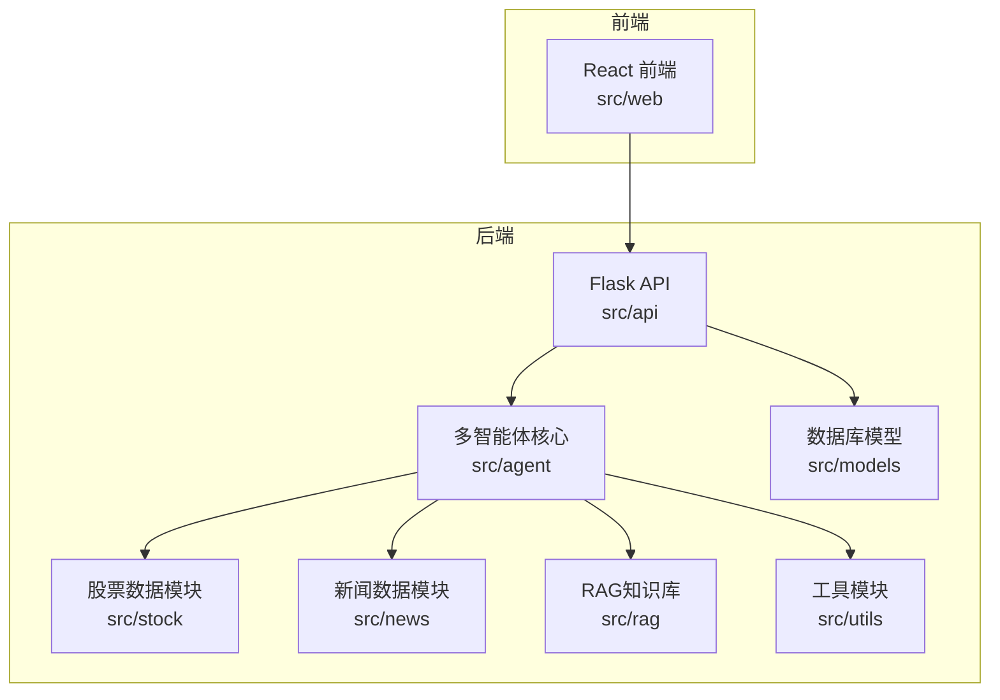
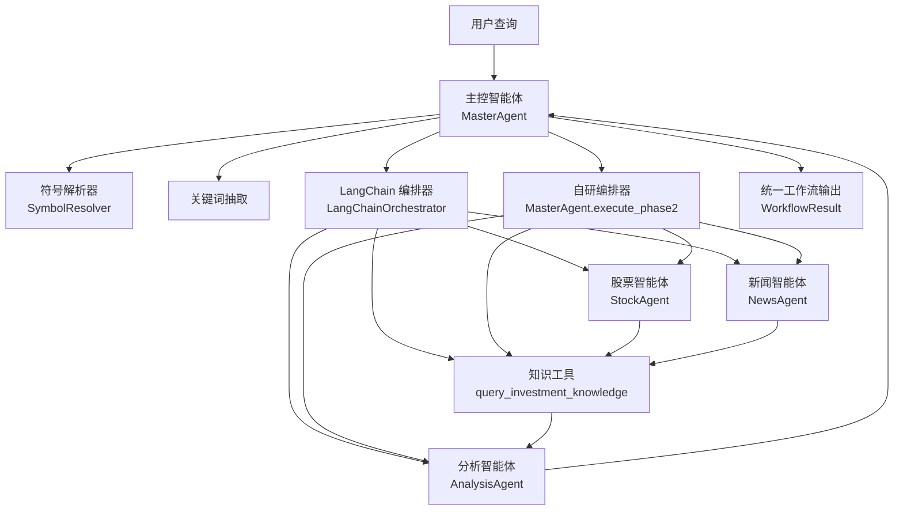
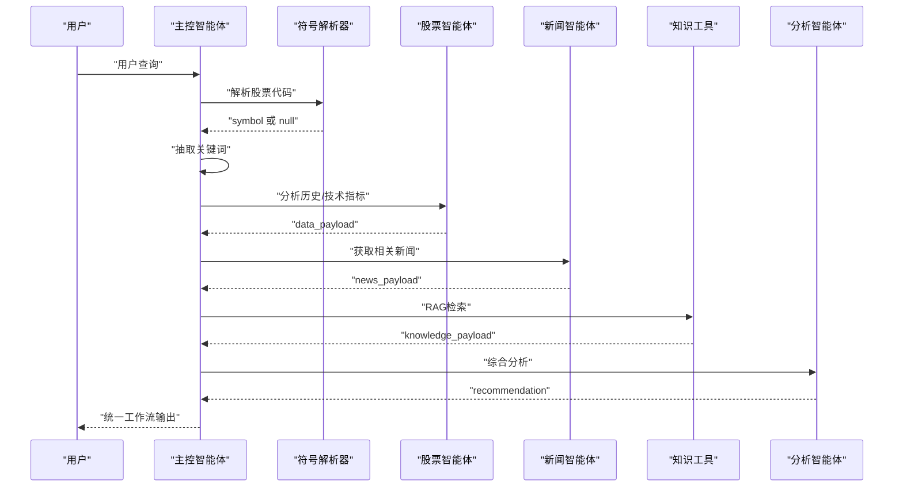
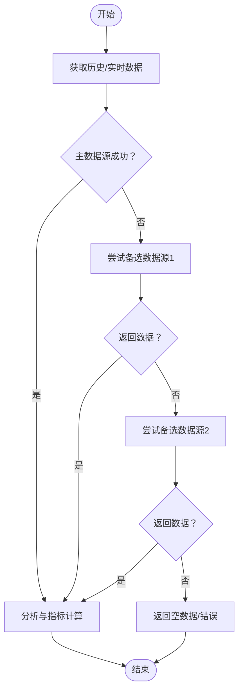
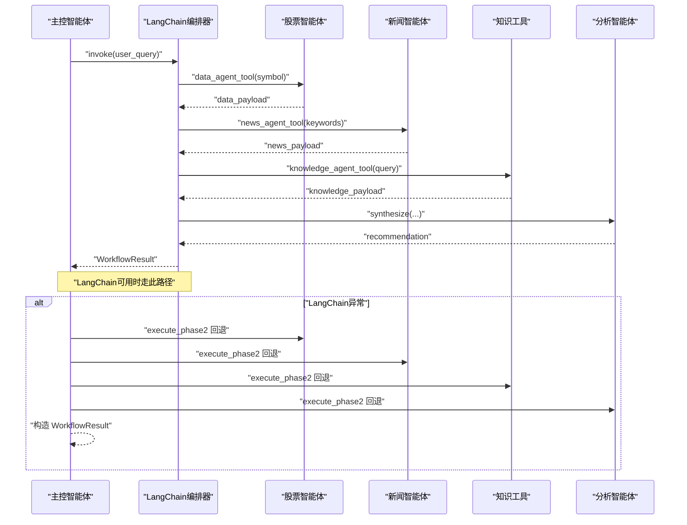
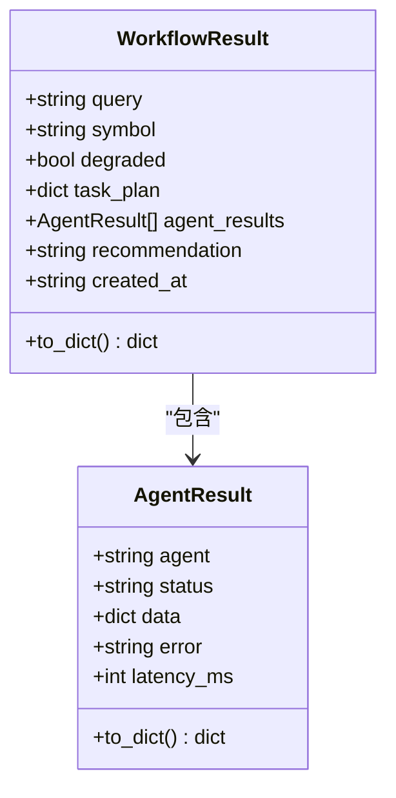
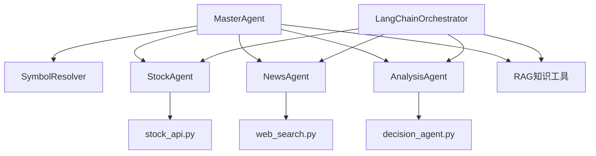
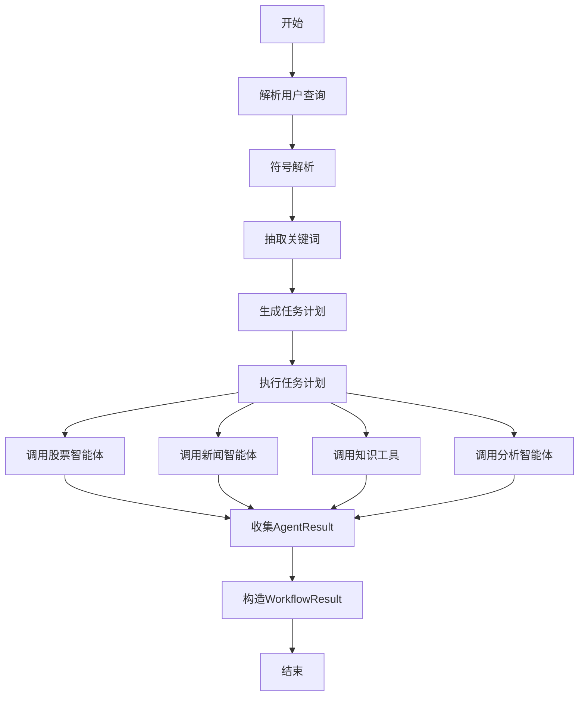
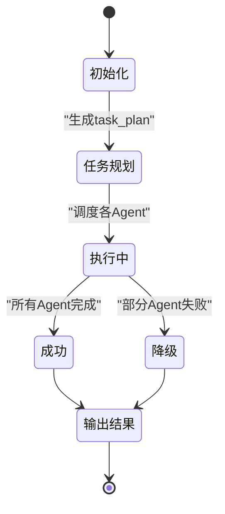

# 智能体系统

<cite>
**本文引用的文件**
- [master_agent.py](file://src/agent/master_agent.py)
- [stock_agent.py](file://src/agent/stock_agent.py)
- [news_agent.py](file://src/agent/news_agent.py)
- [analysis_agent.py](file://src/agent/analysis_agent.py)
- [investment_expert_agent.py](file://src/agent/investment_expert_agent.py)
- [langchain_orchestrator.py](file://src/agent/langchain_orchestrator.py)
- [agent_protocol.py](file://src/agent/agent_protocol.py)
- [symbol_resolver.py](file://src/agent/symbol_resolver.py)
- [decision_agent.py](file://src/agent/decision_agent.py)
- [knowledge_tool.py](file://src/rag/knowledge_tool.py)
- [web_search.py](file://src/utils/web_search.py)
- [stock_api.py](file://src/stock/stock_api.py)
- [news_api.py](file://src/news/news_api.py)
- [requirements.txt](file://requirements.txt)
- [README.md](file://README.md)
- [test_master_agent.py](file://src/agent/test/test_master_agent.py)
- [test_stock_agent_fallback.py](file://src/agent/test/test_stock_agent_fallback.py)
- [test_symbol_resolver.py](file://src/agent/test/test_symbol_resolver.py)
</cite>

## 目录
1. [简介](#简介)
2. [项目结构](#项目结构)
3. [核心组件](#核心组件)
4. [架构总览](#架构总览)
5. [详细组件分析](#详细组件分析)
6. [依赖关系分析](#依赖关系分析)
7. [性能考量](#性能考量)
8. [故障排查指南](#故障排查指南)
9. [结论](#结论)
10. [附录](#附录)

## 简介
本项目是一个基于 Flask + React + 多智能体协作的投资分析系统，支持用户认证、股票与新闻信息聚合、对话分析与 RAG 知识检索。系统采用“主控智能体 + 专用智能体”的多智能体协作架构，通过统一的 Agent 协议与可切换的编排器（LangChain AgentExecutor 与自研编排器）实现任务规划、并行执行与结果合成，最终输出合规、可读的投资建议。

## 项目结构
项目采用按功能域划分的模块化组织方式，核心目录与职责如下：
- src/agent：多智能体核心逻辑与编排器
- src/api：Flask API 路由与对外接口
- src/models：数据库模型与初始化
- src/stock：股票数据模块（AKShare 封装）
- src/news：新闻数据模块（RSS/联网搜索）
- src/rag：RAG 知识库检索与索引
- src/utils：通用工具（联网搜索等）
- src/web：React 前端界面
- requirements.txt：Python 依赖清单
- README.md：项目说明与快速开始

**图表来源**
- [README.md](file://README.md#L24-L40)
- [requirements.txt](file://requirements.txt#L1-L41)

**章节来源**
- [README.md](file://README.md#L1-L215)
- [requirements.txt](file://requirements.txt#L1-L41)

## 核心组件
- 主控智能体（MasterAgent）：负责任务规划、编排与结果合成，支持两种编排模式（LangChain 与自研）自动回退。
- 专用智能体：
  - 股票智能体（StockAgent）：获取与分析历史/实时行情、计算技术指标。
  - 新闻智能体（NewsAgent）：联网搜索与标题筛选。
  - 分析智能体（AnalysisAgent）：整合多源信息生成最终建议。
  - 投资专家智能体（InvestmentExpertAgent）：面向问答场景的简短总结。
- 编排器：
  - LangChainOrchestrator：基于 LangChain AgentExecutor 的可选编排器。
  - 自研编排器：在主控智能体内部实现的顺序/并行执行与回退策略。
- Agent 协议与通信：统一 AgentResult 与 WorkflowResult 结构，确保不同编排器与智能体间的数据交换一致。
- 符号解析器（SymbolResolver）：离线主数据驱动的公司名/别名到股票代码解析，降低在线依赖。
- 知识工具（RAG）：Chroma + 嵌入 + 重排序的混合检索，支持缓存与回退策略。

**章节来源**
- [master_agent.py](file://src/agent/master_agent.py#L24-L351)
- [stock_agent.py](file://src/agent/stock_agent.py#L30-L572)
- [news_agent.py](file://src/agent/news_agent.py#L18-L93)
- [analysis_agent.py](file://src/agent/analysis_agent.py#L15-L119)
- [investment_expert_agent.py](file://src/agent/investment_expert_agent.py#L17-L99)
- [langchain_orchestrator.py](file://src/agent/langchain_orchestrator.py#L20-L273)
- [agent_protocol.py](file://src/agent/agent_protocol.py#L74-L116)
- [symbol_resolver.py](file://src/agent/symbol_resolver.py#L18-L244)
- [knowledge_tool.py](file://src/rag/knowledge_tool.py#L22-L273)

## 架构总览
系统采用“主控智能体 + 专用智能体 + 编排器”的三层架构：
- 主控智能体：接收用户查询，解析符号，抽取关键词，生成任务计划，调度专用智能体并合成最终建议。
- 专用智能体：各自负责特定领域的数据获取与分析。
- 编排器：统一任务执行与回退策略，保证在 LangChain 不可用时自动切换至自研编排器。

**图表来源**
- [master_agent.py](file://src/agent/master_agent.py#L155-L318)
- [langchain_orchestrator.py](file://src/agent/langchain_orchestrator.py#L151-L273)
- [analysis_agent.py](file://src/agent/analysis_agent.py#L27-L92)
- [knowledge_tool.py](file://src/rag/knowledge_tool.py#L254-L273)

**章节来源**
- [master_agent.py](file://src/agent/master_agent.py#L155-L318)
- [langchain_orchestrator.py](file://src/agent/langchain_orchestrator.py#L151-L273)

## 详细组件分析

### 主控智能体（MasterAgent）
- 职责与机制
  - 符号解析：优先使用 SymbolResolver，其次通过 StockAgent 实时行情匹配候选。
  - 关键词抽取：清洗用户查询，提取中文/英文关键词，必要时附加股票代码。
  - 任务规划：生成 JSON Schema 的任务计划，包含数据、新闻、知识、分析四步。
  - 编排执行：根据环境变量选择编排器，优先 LangChain，不可用时自动回退自研编排。
  - 结果合成：收集各智能体 AgentResult，构造 WorkflowResult，输出最终 recommendation。
- 错误处理
  - LangChain 编排异常时记录 fallback_reason，并强制切换至自研编排。
  - 各智能体调用异常捕获并标记 failed，最终 recommendation 中体现降级状态。
- 性能特性
  - 自研编排按顺序串行执行，便于监控与调试；LangChain 编排支持工具调用与中间步骤回放。

**图表来源**
- [master_agent.py](file://src/agent/master_agent.py#L155-L318)
- [symbol_resolver.py](file://src/agent/symbol_resolver.py#L190-L244)
- [analysis_agent.py](file://src/agent/analysis_agent.py#L27-L92)
- [knowledge_tool.py](file://src/rag/knowledge_tool.py#L254-L273)

**章节来源**
- [master_agent.py](file://src/agent/master_agent.py#L95-L153)
- [master_agent.py](file://src/agent/master_agent.py#L155-L318)

### 股票智能体（StockAgent）
- 功能职责
  - 历史行情获取与分析：支持多数据源回退链路（东方财富 → 腾讯 → 新浪）。
  - 实时行情：获取沪深京 A 股实时快照。
  - 技术指标：计算均线、趋势、动量等基础指标。
  - 市场总貌：上交所/深交所统计信息。
- 错误处理与回退
  - 主数据源异常时自动回退到备选数据源；空数据时继续尝试下一个数据源。
  - 代理绕过：支持在特定环境下临时清除代理环境变量以提升稳定性。
- 性能特性
  - 默认时间窗与窗口大小自适应；对缺失字段进行稳健处理。

**图表来源**
- [stock_agent.py](file://src/agent/stock_agent.py#L129-L168)
- [stock_api.py](file://src/stock/stock_api.py#L212-L252)

**章节来源**
- [stock_agent.py](file://src/agent/stock_agent.py#L68-L572)
- [stock_api.py](file://src/stock/stock_api.py#L13-L425)

### 新闻智能体（NewsAgent）
- 功能职责
  - 联网搜索：基于 DuckDuckGo/duckduckgo_search 进行关键词搜索。
  - 标题筛选：按关键词组合生成搜索查询，返回结果摘要。
- 错误处理
  - 搜索库不可用时返回空结果；网络异常记录日志并返回空。
- 性能特性
  - 支持限制最大结果数与缓存秒数（当前类内字段存在，实际缓存逻辑在上层）。

**章节来源**
- [news_agent.py](file://src/agent/news_agent.py#L18-L93)
- [web_search.py](file://src/utils/web_search.py#L39-L80)

### 分析智能体（AnalysisAgent）
- 功能职责
  - 整合多源输入：数据、新闻、知识三类 payload。
  - 模型调用：根据环境变量选择模型，构造系统提示词与用户消息。
  - 输出净化：在使用模式下过滤内部调试字段，避免泄露异常细节。
- 错误处理
  - 模型调用异常时返回兜底建议文本。
- 性能特性
  - 支持调试模式与使用模式，分别输出更详细的诊断信息或用户友好结论。

**章节来源**
- [analysis_agent.py](file://src/agent/analysis_agent.py#L15-L119)

### 投资专家智能体（InvestmentExpertAgent）
- 功能职责
  - 面向问答场景的简短总结：控制输出长度，避免冗长分析。
  - 通用总结：在数据覆盖情况说明后，输出摘要、要点、风险提示与建议。
- 错误处理
  - 输入为空或异常时返回简洁说明。

**章节来源**
- [investment_expert_agent.py](file://src/agent/investment_expert_agent.py#L17-L99)

### 编排器（LangChainOrchestrator 与自研编排）
- LangChainOrchestrator
  - 工具封装：将 StockAgent、NewsAgent、RAG 封装为工具，供 AgentExecutor 调用。
  - 提示词设计：引导主控智能体优先识别股票代码并调用对应工具。
  - 中间步骤回放：记录工具调用与观察，补充未被调用工具的回退执行。
- 自研编排（MasterAgent.execute_phase2）
  - 顺序执行：按任务计划依次调用各智能体，记录 AgentResult。
  - 回退策略：若 LangChain 不可用或异常，则走自研路径。
  - 统一输出：构造 WorkflowResult，包含 task_plan、agent_results、recommendation。

**图表来源**
- [langchain_orchestrator.py](file://src/agent/langchain_orchestrator.py#L151-L273)
- [master_agent.py](file://src/agent/master_agent.py#L155-L318)

**章节来源**
- [langchain_orchestrator.py](file://src/agent/langchain_orchestrator.py#L71-L149)
- [master_agent.py](file://src/agent/master_agent.py#L155-L318)

### Agent 协议与通信（AgentResult/WorkflowResult）
- AgentResult：统一各智能体输出结构，包含 agent、status、data、error、latency_ms。
- WorkflowResult：统一工作流输出结构，包含 query、symbol、degraded、task_plan、agent_results、recommendation、created_at。
- Schema：提供 JSON Schema 校验结构，确保跨模块一致性与可替换性。

**图表来源**
- [agent_protocol.py](file://src/agent/agent_protocol.py#L74-L116)

**章节来源**
- [agent_protocol.py](file://src/agent/agent_protocol.py#L16-L116)

### 符号解析器（SymbolResolver）
- 功能职责
  - 离线主数据驱动：加载本地股票主数据，支持名称/别名/拼音匹配。
  - 缓存策略：按查询规范化键缓存解析结果，支持 TTL。
  - 置信度评分：对候选结果打分并去重，返回最佳匹配与候选列表。
- 错误处理
  - 未找到时返回空结果与 not_found 方法；歧义时返回 ambiguous_pick。

**章节来源**
- [symbol_resolver.py](file://src/agent/symbol_resolver.py#L18-L244)

### 知识工具（RAG）
- 功能职责
  - 混合检索：向量检索 + 关键词检索（可选）+ 重排序（可选）。
  - 缓存与回退：支持查询缓存与最小分数/条目回退策略。
- 性能特性
  - 支持本地模型文件与持久化 Chroma；可配置 top_k、融合参数与重排序阈值。

**章节来源**
- [knowledge_tool.py](file://src/rag/knowledge_tool.py#L22-L273)

## 依赖关系分析
- 模块耦合
  - MasterAgent 依赖 SymbolResolver、StockAgent、NewsAgent、AnalysisAgent 与 RAG 知识工具。
  - LangChainOrchestrator 依赖 OpenAI/LangChain 工具装饰器与 ChatOpenAI。
  - StockAgent 依赖 AKShare 接口封装与代理绕过逻辑。
  - NewsAgent 依赖联网搜索工具。
- 外部依赖
  - OpenAI/LangChain：模型调用与 AgentExecutor。
  - ChromaDB + SentenceTransformers：RAG 检索。
  - AKShare：股票数据源。
  - DuckDuckGo：联网搜索。

**图表来源**
- [master_agent.py](file://src/agent/master_agent.py#L14-L21)
- [langchain_orchestrator.py](file://src/agent/langchain_orchestrator.py#L23-L27)
- [stock_agent.py](file://src/agent/stock_agent.py#L19-L27)
- [news_agent.py](file://src/agent/news_agent.py#L15-L15)
- [analysis_agent.py](file://src/agent/analysis_agent.py#L12-L12)
- [decision_agent.py](file://src/agent/decision_agent.py#L17-L19)

**章节来源**
- [requirements.txt](file://requirements.txt#L25-L35)
- [master_agent.py](file://src/agent/master_agent.py#L14-L21)
- [langchain_orchestrator.py](file://src/agent/langchain_orchestrator.py#L72-L121)

## 性能考量
- 数据源回退链路：StockAgent 在主数据源异常时自动切换备选数据源，提升鲁棒性。
- 编排器选择：通过环境变量 AGENT_ORCHESTRATOR 控制优先级与回退策略，兼顾灵活性与稳定性。
- 缓存与并发：RAG 知识库与工具调用缓存减少重复请求；工具调用支持超时与并发执行。
- 输出净化：AnalysisAgent 在使用模式下过滤内部调试字段，避免泄露异常细节。

[本节为通用指导，无需具体文件分析]

## 故障排查指南
- LangChain 编排异常
  - 现象：编排器不可用或抛出异常。
  - 处理：检查环境变量 AGENT_ORCHESTRATOR 设置；查看 fallback_reason 字段；确认 OpenAI/LangChain 依赖是否安装。
- 股票数据异常
  - 现象：历史/实时数据为空或报错。
  - 处理：确认代理设置；验证 AKShare 接口可用性；检查回退链路是否生效。
- 联网搜索不可用
  - 现象：新闻智能体返回空结果。
  - 处理：确认 DuckDuckGo 库安装；检查代理设置；验证网络连通性。
- RAG 检索效果不佳
  - 现象：检索命中率低或无结果。
  - 处理：重建索引；检查混合检索与重排序配置；调整 top_k 与最小分数阈值。
- 单元测试参考
  - 主控智能体链路测试：[test_master_agent.py](file://src/agent/test/test_master_agent.py#L21-L37)
  - 股票智能体回退链路测试：[test_stock_agent_fallback.py](file://src/agent/test/test_stock_agent_fallback.py#L22-L83)
  - 符号解析器测试：[test_symbol_resolver.py](file://src/agent/test/test_symbol_resolver.py#L19-L37)

**章节来源**
- [test_master_agent.py](file://src/agent/test/test_master_agent.py#L21-L37)
- [test_stock_agent_fallback.py](file://src/agent/test/test_stock_agent_fallback.py#L22-L83)
- [test_symbol_resolver.py](file://src/agent/test/test_symbol_resolver.py#L19-L37)

## 结论
该智能体系统通过主控智能体统一编排多专用智能体，结合 LangChain 与自研编排器实现高可用与可替换的分析链路。Agent 协议确保了模块间的一致性与可观测性；符号解析器与 RAG 知识库进一步增强了系统对复杂查询的理解与支持。通过完善的错误处理与回退策略，系统在外部依赖不稳定时仍能保持基本功能与合规输出。

[本节为总结，无需具体文件分析]

## 附录

### Agent 执行流程图（自研编排）

**图表来源**
- [master_agent.py](file://src/agent/master_agent.py#L137-L318)

### 状态转换图（工作流状态）

**图表来源**
- [agent_protocol.py](file://src/agent/agent_protocol.py#L94-L116)
- [master_agent.py](file://src/agent/master_agent.py#L309-L318)

### Agent 扩展指南与自定义 Agent 开发方法
- 新增专用智能体
  - 实现智能体类，提供标准化方法（如 analyze、fetch 等）。
  - 在 Agent 协议中定义输出结构（AgentResult），确保与现有编排器兼容。
  - 在主控智能体的任务计划中加入新智能体的任务项。
- 自定义编排器
  - 若需替换 LangChain，可在主控智能体中扩展条件分支，实现自定义调度逻辑。
  - 保持统一的 AgentResult/WorkflowResult 输出，以便上层统一处理。
- 配置与环境变量
  - 通过环境变量控制编排器模式与模型参数，便于在不同部署环境中灵活切换。
- 测试与验证
  - 为新增智能体编写单元测试，覆盖正常路径与异常回退路径。
  - 使用现有测试样例（如主控链路、回退链路、符号解析）作为参考。

[本节为通用指导，无需具体文件分析]