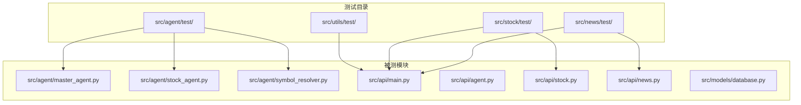
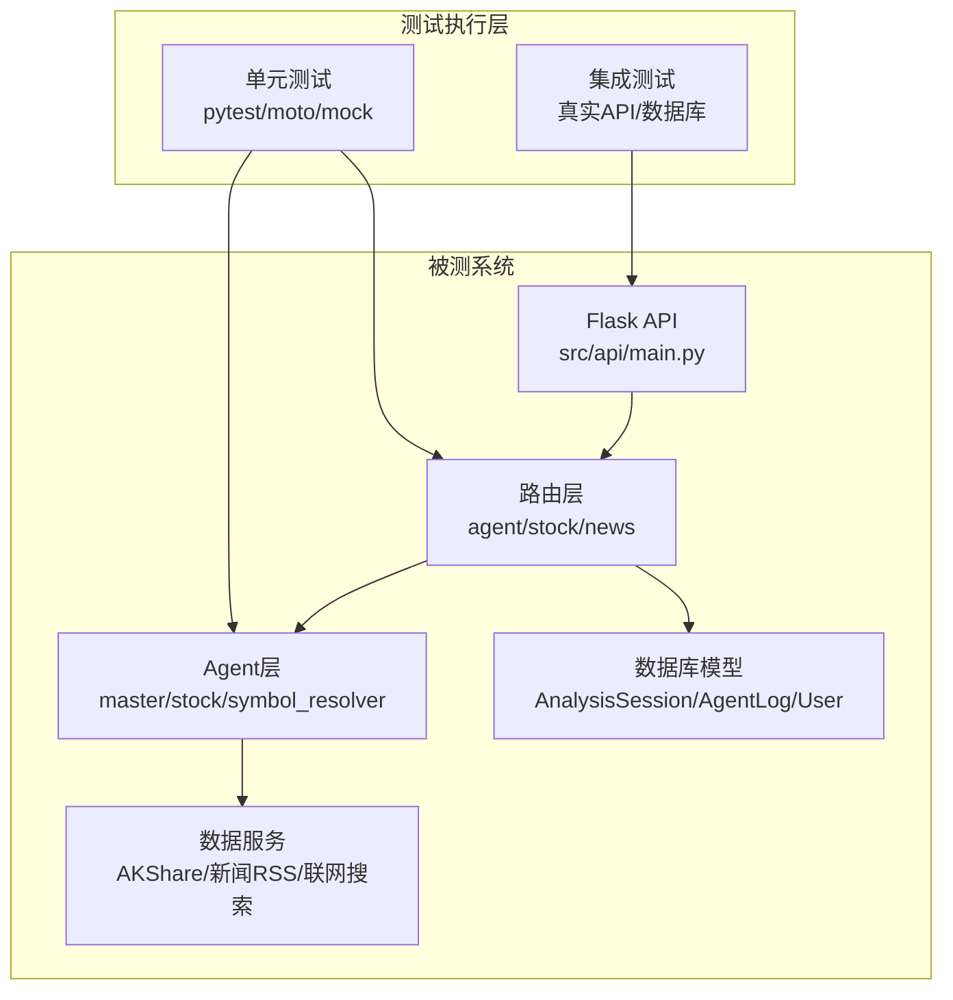
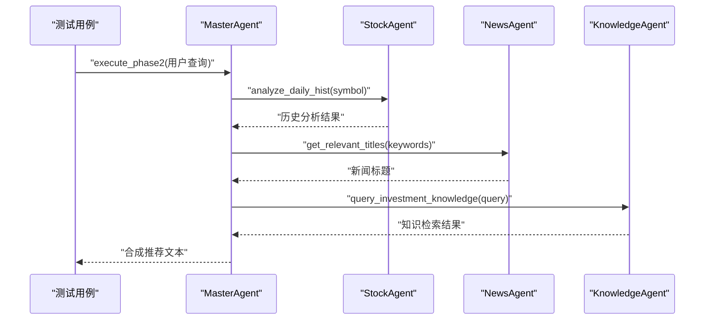
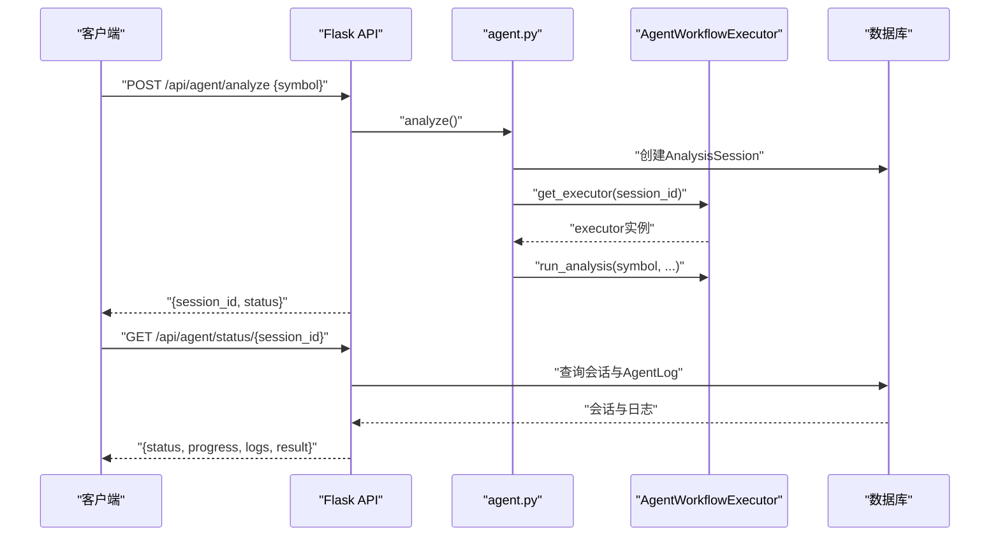
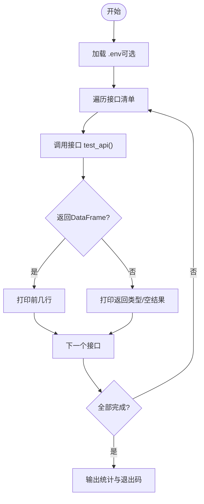
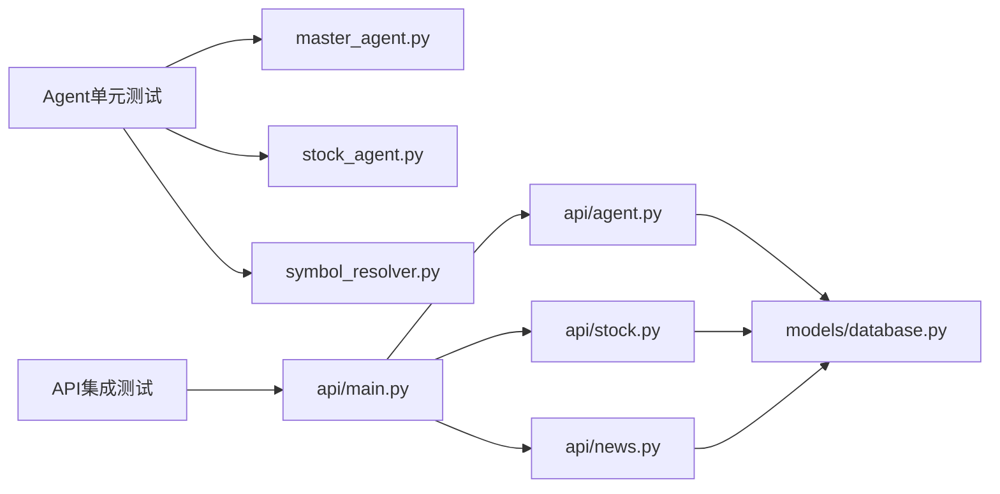

# 测试系统

<cite>
**本文引用的文件**   
- [run.py](file://run.py)
- [src/api/main.py](file://src/api/main.py)
- [src/api/agent.py](file://src/api/agent.py)
- [src/api/stock.py](file://src/api/stock.py)
- [src/api/news.py](file://src/api/news.py)
- [src/models/database.py](file://src/models/database.py)
- [src/agent/master_agent.py](file://src/agent/master_agent.py)
- [src/agent/stock_agent.py](file://src/agent/stock_agent.py)
- [src/agent/symbol_resolver.py](file://src/agent/symbol_resolver.py)
- [src/agent/test/test_master_agent.py](file://src/agent/test/test_master_agent.py)
- [src/agent/test/test_stock_agent_fallback.py](file://src/agent/test/test_stock_agent_fallback.py)
- [src/agent/test/test_symbol_resolver.py](file://src/agent/test/test_symbol_resolver.py)
- [src/news/test/test_news_api.py](file://src/news/test/test_news_api.py)
- [src/stock/test/test_akshare_api.py](file://src/stock/test/test_akshare_api.py)
- [src/stock/test/test_index_fallback.py](file://src/stock/test/test_index_fallback.py)
- [src/utils/test/test_web_search.py](file://src/utils/test/test_web_search.py)
- [requirements.txt](file://requirements.txt)
</cite>

## 目录
1. [引言](#引言)
2. [项目结构](#项目结构)
3. [核心组件](#核心组件)
4. [架构总览](#架构总览)
5. [详细组件分析](#详细组件分析)
6. [依赖关系分析](#依赖关系分析)
7. [性能考虑](#性能考虑)
8. [故障排查指南](#故障排查指南)
9. [结论](#结论)
10. [附录](#附录)

## 引言
本文件面向AI投资分析系统的测试体系，系统性梳理单元测试与集成测试框架，涵盖测试组织结构、命名规范、用例设计原则、测试数据准备；并针对Agent、API、数据服务与前端组件分别制定测试策略；提供测试执行指南（pytest配置、覆盖率分析、CI设置）、最佳实践（mock使用、异步测试、性能测试）、测试环境配置与调试技巧。

## 项目结构
测试文件主要分布在各功能模块的test目录下，采用“按功能域划分”的组织方式：
- Agent模块：主控Agent、股票Agent、符号解析器的测试脚本
- API模块：API路由层的端到端测试脚本
- 数据服务模块：新闻、股票数据接口的测试脚本
- 工具模块：联网搜索的测试脚本
- 启动器：run.py用于启动后端API服务，便于集成测试

**图表来源**
- [src/agent/test/test_master_agent.py](file://src/agent/test/test_master_agent.py#L1-L38)
- [src/agent/test/test_stock_agent_fallback.py](file://src/agent/test/test_stock_agent_fallback.py#L1-L83)
- [src/agent/test/test_symbol_resolver.py](file://src/agent/test/test_symbol_resolver.py#L1-L38)
- [src/news/test/test_news_api.py](file://src/news/test/test_news_api.py#L1-L19)
- [src/stock/test/test_akshare_api.py](file://src/stock/test/test_akshare_api.py#L1-L253)
- [src/stock/test/test_index_fallback.py](file://src/stock/test/test_index_fallback.py#L1-L32)
- [src/utils/test/test_web_search.py](file://src/utils/test/test_web_search.py#L1-L36)
- [src/api/main.py](file://src/api/main.py#L1-L243)
- [src/api/agent.py](file://src/api/agent.py#L1-L208)
- [src/api/stock.py](file://src/api/stock.py#L1-L126)
- [src/api/news.py](file://src/api/news.py#L1-L75)
- [src/models/database.py](file://src/models/database.py#L1-L86)

**章节来源**
- [run.py](file://run.py#L1-L60)
- [requirements.txt](file://requirements.txt#L1-L41)

## 核心组件
- 测试组织结构
  - 命名规范：以test_前缀+模块名，如test_master_agent.py、test_akshare_api.py
  - 文件职责：单元测试（mock与断言）、集成测试（真实API调用）
- 测试数据准备
  - 使用pandas DataFrame构造样本数据进行断言
  - 通过环境变量控制代理与回退逻辑（如AKSHARE_DISABLE_PROXY）
  - 通过.env文件注入第三方令牌（如雪球token）

**章节来源**
- [src/agent/test/test_stock_agent_fallback.py](file://src/agent/test/test_stock_agent_fallback.py#L22-L83)
- [src/stock/test/test_akshare_api.py](file://src/stock/test/test_akshare_api.py#L75-L113)
- [src/stock/test/test_index_fallback.py](file://src/stock/test/test_index_fallback.py#L16-L16)

## 架构总览
测试系统与被测系统的交互关系如下：

**图表来源**
- [src/api/main.py](file://src/api/main.py#L40-L235)
- [src/api/agent.py](file://src/api/agent.py#L20-L208)
- [src/api/stock.py](file://src/api/stock.py#L16-L126)
- [src/api/news.py](file://src/api/news.py#L16-L75)
- [src/models/database.py](file://src/models/database.py#L24-L86)
- [src/agent/master_agent.py](file://src/agent/master_agent.py#L24-L351)
- [src/agent/stock_agent.py](file://src/agent/stock_agent.py#L30-L572)
- [src/agent/symbol_resolver.py](file://src/agent/symbol_resolver.py#L18-L244)

## 详细组件分析

### Agent测试策略
- 主控Agent测试
  - 目标：验证多Agent编排链路与回退机制
  - 方法：构造查询，断言推荐文本非空；通过异常捕获验证降级路径
  - 关键点：LangChainOrchestrator可用性检测与降级
- 股票Agent回退测试
  - 目标：验证多数据源回退（东方财富→腾讯→新浪）
  - 方法：使用monkeypatch替换底层数据获取函数，断言返回记录数与字段
  - 关键点：mock不同数据源的异常与空值场景
- 符号解析器测试
  - 目标：验证公司名→代码解析、显式代码直接解析、未知名称处理
  - 方法：断言返回symbol与method字段

**图表来源**
- [src/agent/test/test_master_agent.py](file://src/agent/test/test_master_agent.py#L21-L37)
- [src/agent/master_agent.py](file://src/agent/master_agent.py#L155-L318)
- [src/agent/stock_agent.py](file://src/agent/stock_agent.py#L305-L432)

**章节来源**
- [src/agent/test/test_master_agent.py](file://src/agent/test/test_master_agent.py#L1-L38)
- [src/agent/test/test_stock_agent_fallback.py](file://src/agent/test/test_stock_agent_fallback.py#L22-L83)
- [src/agent/test/test_symbol_resolver.py](file://src/agent/test/test_symbol_resolver.py#L19-L37)
- [src/agent/master_agent.py](file://src/agent/master_agent.py#L155-L318)
- [src/agent/stock_agent.py](file://src/agent/stock_agent.py#L129-L168)
- [src/agent/symbol_resolver.py](file://src/agent/symbol_resolver.py#L190-L244)

### API测试策略
- 路由层测试
  - 目标：验证鉴权、参数校验、异步启动、状态查询
  - 方法：构造会话、启动分析线程、轮询状态接口、断言返回结构
- 股票路由测试
  - 目标：验证历史行情、技术指标、汇总接口
  - 方法：GET参数传入symbol/start_date等，断言返回字段
- 新闻路由测试
  - 目标：验证标题抓取、关键词筛选、相关性获取
  - 方法：POST JSON传入keywords/titles，断言过滤结果

**图表来源**
- [src/api/agent.py](file://src/api/agent.py#L20-L168)
- [src/api/main.py](file://src/api/main.py#L52-L56)
- [src/models/database.py](file://src/models/database.py#L53-L86)

**章节来源**
- [src/api/agent.py](file://src/api/agent.py#L20-L208)
- [src/api/stock.py](file://src/api/stock.py#L16-L126)
- [src/api/news.py](file://src/api/news.py#L16-L75)
- [src/models/database.py](file://src/models/database.py#L53-L86)

### 数据服务测试策略
- 新闻RSS测试
  - 目标：验证新闻标题抓取
  - 方法：调用get_news_titles并打印结果数量与示例
- AKShare接口测试
  - 目标：批量验证A股接口可用性
  - 方法：封装test_api函数，自动打印返回类型/行数；按需加载.env中的token
  - 关键点：跳过需要token的接口；对易封IP接口增加延迟
- 指数回退测试
  - 目标：验证指数代码兼容与回退
  - 方法：设置AKSHARE_DISABLE_PROXY=1，断言返回结构

**图表来源**
- [src/stock/test/test_akshare_api.py](file://src/stock/test/test_akshare_api.py#L22-L56)
- [src/stock/test/test_akshare_api.py](file://src/stock/test/test_akshare_api.py#L96-L239)

**章节来源**
- [src/news/test/test_news_api.py](file://src/news/test/test_news_api.py#L10-L18)
- [src/stock/test/test_akshare_api.py](file://src/stock/test/test_akshare_api.py#L1-L253)
- [src/stock/test/test_index_fallback.py](file://src/stock/test/test_index_fallback.py#L21-L31)

### 工具模块测试策略
- 联网搜索测试
  - 目标：验证搜索关键词返回与代理切换
  - 方法：先使用默认区域，失败则切换区域并重试

**章节来源**
- [src/utils/test/test_web_search.py](file://src/utils/test/test_web_search.py#L19-L35)

## 依赖关系分析
- 测试与被测模块的耦合
  - 单元测试通过monkeypatch隔离外部依赖，降低耦合
  - 集成测试依赖真实API与数据库，耦合度较高但更贴近生产
- 外部依赖
  - 数据源：AKShare、新闻RSS、联网搜索
  - 数据库：SQLAlchemy模型
  - Web框架：Flask蓝图注册

**图表来源**
- [src/agent/test/test_master_agent.py](file://src/agent/test/test_master_agent.py#L18-L22)
- [src/agent/test/test_stock_agent_fallback.py](file://src/agent/test/test_stock_agent_fallback.py#L45-L46)
- [src/agent/test/test_symbol_resolver.py](file://src/agent/test/test_symbol_resolver.py#L20-L21)
- [src/api/main.py](file://src/api/main.py#L52-L56)
- [src/api/agent.py](file://src/api/agent.py#L20-L60)
- [src/api/stock.py](file://src/api/stock.py#L16-L40)
- [src/api/news.py](file://src/api/news.py#L16-L30)
- [src/models/database.py](file://src/models/database.py#L53-L86)

**章节来源**
- [src/agent/master_agent.py](file://src/agent/master_agent.py#L1-L351)
- [src/agent/stock_agent.py](file://src/agent/stock_agent.py#L1-L572)
- [src/agent/symbol_resolver.py](file://src/agent/symbol_resolver.py#L1-L244)
- [src/api/main.py](file://src/api/main.py#L1-L243)
- [src/api/agent.py](file://src/api/agent.py#L1-L208)
- [src/api/stock.py](file://src/api/stock.py#L1-L126)
- [src/api/news.py](file://src/api/news.py#L1-L75)
- [src/models/database.py](file://src/models/database.py#L1-L86)

## 性能考虑
- 接口限流与稳定性
  - 对易封IP的数据源（如新浪财经）增加延迟，减少触发风控
- 回退策略
  - 股票Agent实现三段式回退（东方财富→腾讯→新浪），提升可用性
- 日志与可观测性
  - API层记录请求耗时与状态码，便于定位慢接口
- 并发与异步
  - API工作流通过线程池异步执行，避免阻塞请求

**章节来源**
- [src/stock/test/test_akshare_api.py](file://src/stock/test/test_akshare_api.py#L10-L12)
- [src/agent/stock_agent.py](file://src/agent/stock_agent.py#L129-L168)
- [src/api/main.py](file://src/api/main.py#L68-L83)
- [src/api/agent.py](file://src/api/agent.py#L52-L56)

## 故障排查指南
- 环境变量
  - AKSHARE_DISABLE_PROXY：禁用代理以绕过网络问题
  - XUEQIU_TOKEN：雪球接口访问令牌
  - FLASK_DEBUG/FLASK_USE_RELOADER：控制Flask调试模式
- 常见问题
  - 接口返回空：检查回退链路与数据源可用性
  - 未授权：确认鉴权中间件与用户上下文
  - 数据库异常：检查AnalysisSession/AgentLog表结构与权限
- 调试技巧
  - 使用run.py启动后端服务，结合日志级别调整
  - 在测试中打印关键中间结果（如DataFrame形状、字段）

**章节来源**
- [src/stock/test/test_index_fallback.py](file://src/stock/test/test_index_fallback.py#L16-L16)
- [src/stock/test/test_akshare_api.py](file://src/stock/test/test_akshare_api.py#L207-L215)
- [src/api/main.py](file://src/api/main.py#L31-L37)
- [src/api/agent.py](file://src/api/agent.py#L24-L25)
- [src/models/database.py](file://src/models/database.py#L53-L86)
- [run.py](file://run.py#L8-L17)

## 结论
本测试系统以“单元测试隔离外部依赖、集成测试贴近生产”为核心思想，覆盖Agent编排、API路由、数据服务与工具模块。通过mock与回退策略保障稳定性，借助日志与状态接口提升可观测性。建议在CI中引入pytest与覆盖率工具，完善自动化回归与性能基线。

## 附录

### 测试执行指南
- pytest配置与运行
  - 建议在项目根目录创建pytest.ini或pyproject.toml，配置插件与标记
  - 使用-x（失败即停）、-v（详细输出）、--tb=short（简要回溯）
  - 对API测试建议使用独立数据库或内存数据库（如sqlite）隔离
- 覆盖率分析
  - 使用coverage.py或pytest-cov，目标阈值建议≥70%
  - 关注关键分支（异常处理、回退链路、鉴权路径）
- 持续集成设置
  - 安装依赖：pip install -r requirements.txt
  - 设置环境变量：XUEQIU_TOKEN、AKSHARE_DISABLE_PROXY等
  - CI步骤建议：安装→依赖→单元测试→集成测试→覆盖率报告

**章节来源**
- [requirements.txt](file://requirements.txt#L1-L41)
- [src/stock/test/test_akshare_api.py](file://src/stock/test/test_akshare_api.py#L242-L253)

### 测试最佳实践
- 模拟对象使用
  - 使用pytest monkeypatch替换外部函数，确保输入输出可控
  - 对数据库操作使用事务回滚或临时表
- 异步测试处理
  - 对API工作流使用线程/进程模拟异步执行，断言最终状态
  - 使用超时与重试策略避免偶发性失败
- 性能测试方法
  - 对热点接口（如历史行情、技术指标）进行基准测试
  - 使用时间戳记录关键步骤耗时，绘制性能基线

**章节来源**
- [src/agent/test/test_stock_agent_fallback.py](file://src/agent/test/test_stock_agent_fallback.py#L41-L43)
- [src/api/agent.py](file://src/api/agent.py#L52-L56)
- [src/agent/stock_agent.py](file://src/agent/stock_agent.py#L305-L432)