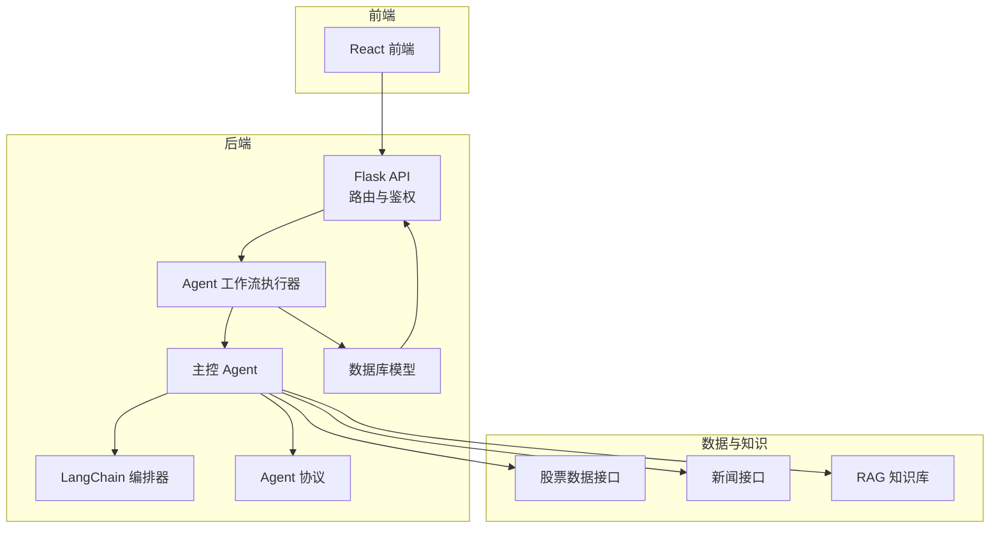
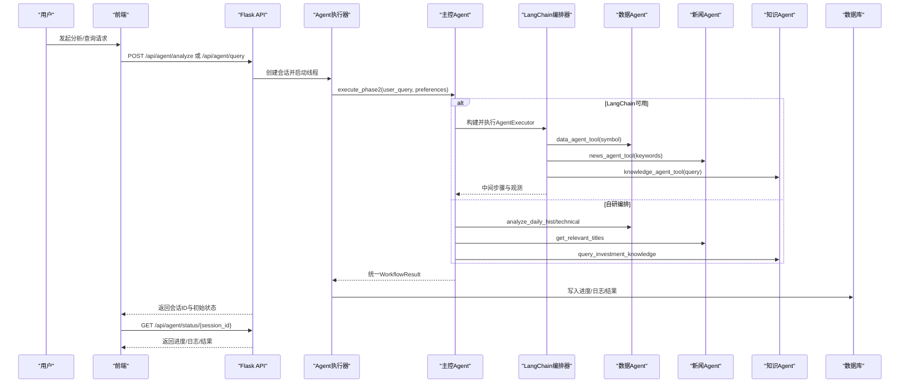
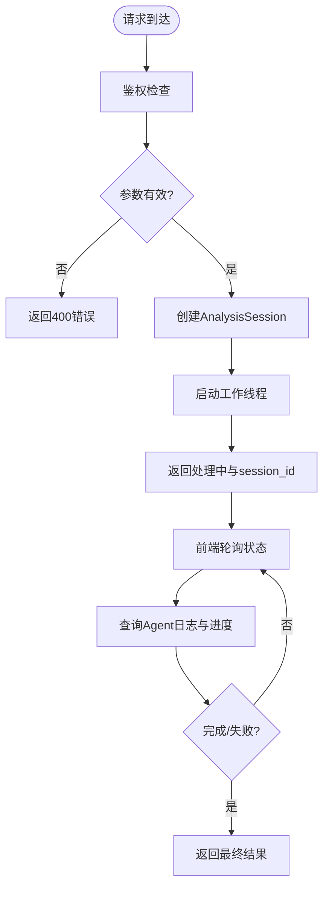
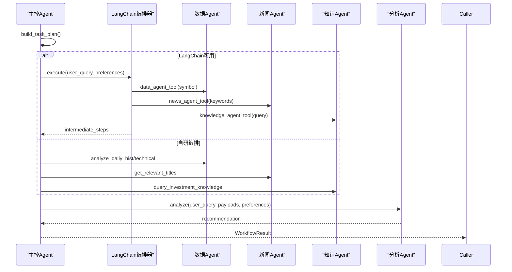
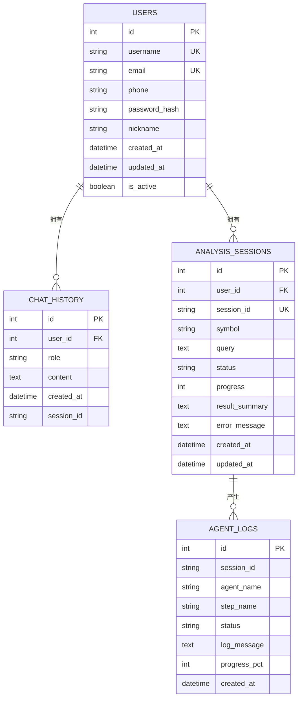
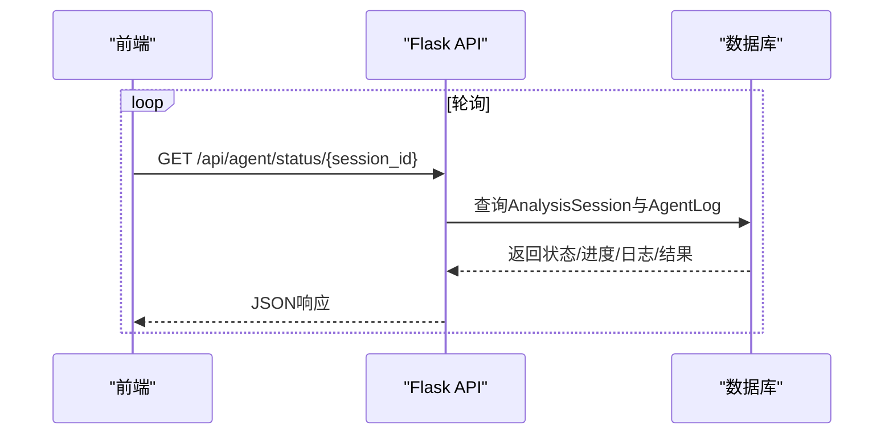
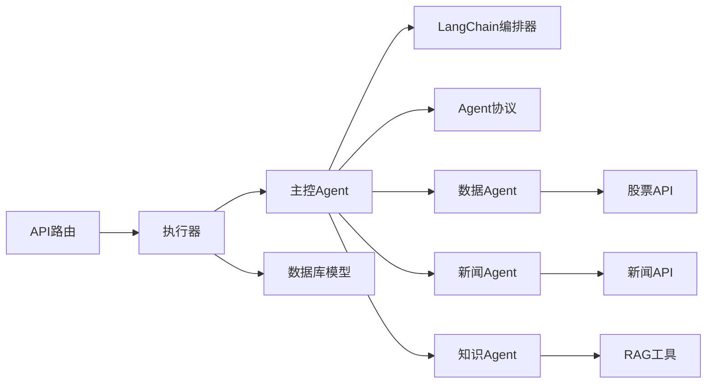

# 数据流设计

<cite>
**本文档引用的文件**
- [src/api/main.py](file://src/api/main.py)
- [src/api/agent.py](file://src/api/agent.py)
- [src/api/agent_executor.py](file://src/api/agent_executor.py)
- [src/agent/master_agent.py](file://src/agent/master_agent.py)
- [src/agent/langchain_orchestrator.py](file://src/agent/langchain_orchestrator.py)
- [src/agent/agent_protocol.py](file://src/agent/agent_protocol.py)
- [src/agent/analysis_agent.py](file://src/agent/analysis_agent.py)
- [src/agent/news_agent.py](file://src/agent/news_agent.py)
- [src/agent/stock_agent.py](file://src/agent/stock_agent.py)
- [src/models/database.py](file://src/models/database.py)
- [src/rag/knowledge_tool.py](file://src/rag/knowledge_tool.py)
- [src/stock/stock_api.py](file://src/stock/stock_api.py)
- [src/news/news_api.py](file://src/news/news_api.py)
- [DESIGN.md](file://DESIGN.md)
- [README.md](file://README.md)
</cite>

## 目录
1. [引言](#引言)
2. [项目结构](#项目结构)
3. [核心组件](#核心组件)
4. [架构总览](#架构总览)
5. [详细组件分析](#详细组件分析)
6. [依赖关系分析](#依赖关系分析)
7. [性能考量](#性能考量)
8. [故障排查指南](#故障排查指南)
9. [结论](#结论)
10. [附录](#附录)

## 引言
本文件面向AI投资分析系统，聚焦“数据流设计”。围绕用户请求处理、智能体协作、数据存储、结果返回四个环节，系统阐述数据在各模块间的传递方式（参数传递、状态共享、事件通知）、数据格式转换与验证、缓存策略与降级机制，并提供典型数据流图与时序图，帮助开发者与使用者准确把握系统行为。

## 项目结构
系统采用“后端API + 多智能体编排 + 数据与知识检索”的分层架构。后端通过Flask提供REST接口，前端通过React调用后端API；智能体层负责任务分解、并行执行与结果整合；数据与知识层提供股票行情、新闻与RAG检索能力；数据库层持久化用户、会话与日志。

图表来源
- [src/api/main.py](file://src/api/main.py#L40-L235)
- [src/api/agent.py](file://src/api/agent.py#L1-L208)
- [src/api/agent_executor.py](file://src/api/agent_executor.py#L1-L282)
- [src/agent/master_agent.py](file://src/agent/master_agent.py#L1-L351)
- [src/agent/langchain_orchestrator.py](file://src/agent/langchain_orchestrator.py#L1-L273)
- [src/agent/agent_protocol.py](file://src/agent/agent_protocol.py#L1-L116)
- [src/models/database.py](file://src/models/database.py#L1-L86)
- [src/stock/stock_api.py](file://src/stock/stock_api.py#L1-L425)
- [src/news/news_api.py](file://src/news/news_api.py#L1-L248)
- [src/rag/knowledge_tool.py](file://src/rag/knowledge_tool.py#L1-L273)

章节来源
- [README.md](file://README.md#L24-L40)
- [DESIGN.md](file://DESIGN.md#L1-L28)

## 核心组件
- API层：提供认证、用户信息、分析与查询、状态查询等路由，负责参数校验、鉴权与会话管理。
- 执行器：异步调度分析/查询工作流，维护进度与日志，持久化结果。
- 主控Agent：任务分解、编排与降级回退，统一Agent输出协议。
- 编排器：LangChain可选编排器，失败时自动回退至自研编排。
- 数据Agent：股票数据获取与指标计算。
- 新闻Agent：关键词检索与标题摘要。
- 知识Agent：RAG检索，支持缓存与重排。
- 数据库：用户、聊天历史、分析会话、Agent日志。
- 股票/新闻/RAG：外部数据与检索接口。

章节来源
- [src/api/main.py](file://src/api/main.py#L22-L56)
- [src/api/agent.py](file://src/api/agent.py#L1-L208)
- [src/api/agent_executor.py](file://src/api/agent_executor.py#L1-L282)
- [src/agent/master_agent.py](file://src/agent/master_agent.py#L1-L351)
- [src/agent/langchain_orchestrator.py](file://src/agent/langchain_orchestrator.py#L1-L273)
- [src/agent/agent_protocol.py](file://src/agent/agent_protocol.py#L1-L116)
- [src/models/database.py](file://src/models/database.py#L1-L86)
- [src/rag/knowledge_tool.py](file://src/rag/knowledge_tool.py#L1-L273)
- [src/stock/stock_api.py](file://src/stock/stock_api.py#L1-L425)
- [src/news/news_api.py](file://src/news/news_api.py#L1-L248)

## 架构总览
系统以“主控Agent + 多Agent编排 + 数据/知识检索 + 数据库存储”为核心，支持两种编排模式：LangChain编排器优先（可用时）与自研编排器回退。数据在Agent间以统一协议结构传递，执行器负责状态与日志持久化，前端通过API轮询状态并展示结果。

图表来源
- [src/api/agent.py](file://src/api/agent.py#L20-L108)
- [src/api/agent_executor.py](file://src/api/agent_executor.py#L93-L186)
- [src/agent/master_agent.py](file://src/agent/master_agent.py#L155-L318)
- [src/agent/langchain_orchestrator.py](file://src/agent/langchain_orchestrator.py#L151-L272)
- [src/models/database.py](file://src/models/database.py#L53-L86)

## 详细组件分析

### 用户请求处理流程
- 鉴权与参数校验：API路由对用户进行鉴权，校验symbol/query等必填参数。
- 会话创建：生成session_id，写入AnalysisSession，状态pending。
- 异步执行：启动线程调用AgentWorkflowExecutor.run_analysis或run_query。
- 状态返回：立即返回“处理中”状态与session_id，供前端轮询。

图表来源
- [src/api/agent.py](file://src/api/agent.py#L20-L108)
- [src/api/agent_executor.py](file://src/api/agent_executor.py#L93-L186)
- [src/models/database.py](file://src/models/database.py#L53-L71)

章节来源
- [src/api/agent.py](file://src/api/agent.py#L20-L108)
- [src/api/agent_executor.py](file://src/api/agent_executor.py#L93-L186)

### 智能体协作流程
- 任务分解：主控Agent根据用户查询抽取股票代码与关键词，生成任务计划。
- 并行执行：LangChain编排器优先，失败则回退自研编排；分别调用数据、新闻、知识Agent。
- 结果整合：统一AgentResult与WorkflowResult结构，生成recommendation。
- 降级策略：任一Agent失败不影响整体输出，标记degraded并保留可用信息。

图表来源
- [src/agent/master_agent.py](file://src/agent/master_agent.py#L137-L318)
- [src/agent/langchain_orchestrator.py](file://src/agent/langchain_orchestrator.py#L151-L272)
- [src/agent/analysis_agent.py](file://src/agent/analysis_agent.py#L27-L92)
- [src/agent/agent_protocol.py](file://src/agent/agent_protocol.py#L74-L116)

章节来源
- [src/agent/master_agent.py](file://src/agent/master_agent.py#L137-L318)
- [src/agent/langchain_orchestrator.py](file://src/agent/langchain_orchestrator.py#L151-L272)
- [src/agent/analysis_agent.py](file://src/agent/analysis_agent.py#L27-L92)
- [src/agent/agent_protocol.py](file://src/agent/agent_protocol.py#L74-L116)

### 数据存储流程
- 会话与日志：执行器在数据库中写入AnalysisSession与AgentLog，记录状态、进度与消息。
- 结果持久化：完成后将完整结果序列化保存到AnalysisSession.result_summary。
- 用户信息：用户profile相关接口读写User表。

图表来源
- [src/models/database.py](file://src/models/database.py#L24-L86)

章节来源
- [src/models/database.py](file://src/models/database.py#L24-L86)
- [src/api/agent_executor.py](file://src/api/agent_executor.py#L71-L92)
- [src/api/agent_executor.py](file://src/api/agent_executor.py#L159-L163)

### 结果返回流程
- 执行器在各阶段写入AgentLog并更新AnalysisSession进度。
- 前端轮询GET /api/agent/status/{session_id}，获取状态、进度、日志与最终结果。
- 若结果为字符串（recommendation），直接返回；若为结构化对象，包含task_plan、agent_results等。

图表来源
- [src/api/agent.py](file://src/api/agent.py#L111-L168)
- [src/api/agent_executor.py](file://src/api/agent_executor.py#L272-L281)
- [src/models/database.py](file://src/models/database.py#L53-L86)

章节来源
- [src/api/agent.py](file://src/api/agent.py#L111-L168)
- [src/api/agent_executor.py](file://src/api/agent_executor.py#L272-L281)

### 数据格式转换与验证
- 统一协议：AgentResult与WorkflowResult提供JSON Schema约束，确保跨Agent数据一致性。
- 参数规范化：股票Agent对symbol进行格式归一化，避免不同前缀与大小写导致的错误。
- 输入校验：API路由对必填字段进行校验，数据库层对唯一性与索引进行约束。
- 输出净化：分析Agent在使用模式下对payload进行敏感字段过滤，避免泄露内部细节。

章节来源
- [src/agent/agent_protocol.py](file://src/agent/agent_protocol.py#L16-L71)
- [src/agent/stock_agent.py](file://src/agent/stock_agent.py#L170-L183)
- [src/agent/analysis_agent.py](file://src/agent/analysis_agent.py#L94-L119)
- [src/api/agent.py](file://src/api/agent.py#L27-L34)

### 数据缓存与降级
- RAG缓存：RagKnowledgeBase内置查询缓存，支持TTL与容量淘汰，命中直接返回。
- 编排降级：LangChain不可用或异常时自动回退自研编排，记录fallback_reason。
- Agent降级：任一Agent失败不影响整体，标记degraded并保留可用信息。
- 代理绕过：股票Agent在特定环境下可临时禁用代理，提高稳定性。

章节来源
- [src/rag/knowledge_tool.py](file://src/rag/knowledge_tool.py#L153-L176)
- [src/agent/langchain_orchestrator.py](file://src/agent/langchain_orchestrator.py#L177-L183)
- [src/agent/master_agent.py](file://src/agent/master_agent.py#L177-L193)
- [src/agent/stock_agent.py](file://src/agent/stock_agent.py#L34-L54)

## 依赖关系分析
- 组件耦合：API层依赖执行器；执行器依赖主控Agent与数据库；主控Agent依赖数据/新闻/知识Agent与编排器；数据/新闻/知识Agent依赖各自外部接口。
- 外部依赖：股票数据依赖AKShare；新闻依赖RSS解析与网络搜索；RAG依赖Chroma与嵌入模型。
- 循环依赖：未发现循环导入；模块间通过蓝图与类实例化解耦。

图表来源
- [src/api/agent.py](file://src/api/agent.py#L1-L208)
- [src/api/agent_executor.py](file://src/api/agent_executor.py#L1-L282)
- [src/agent/master_agent.py](file://src/agent/master_agent.py#L1-L351)
- [src/agent/langchain_orchestrator.py](file://src/agent/langchain_orchestrator.py#L1-L273)
- [src/agent/agent_protocol.py](file://src/agent/agent_protocol.py#L1-L116)
- [src/stock/stock_api.py](file://src/stock/stock_api.py#L1-L425)
- [src/news/news_api.py](file://src/news/news_api.py#L1-L248)
- [src/rag/knowledge_tool.py](file://src/rag/knowledge_tool.py#L1-L273)
- [src/models/database.py](file://src/models/database.py#L1-L86)

章节来源
- [src/api/agent.py](file://src/api/agent.py#L1-L208)
- [src/api/agent_executor.py](file://src/api/agent_executor.py#L1-L282)
- [src/agent/master_agent.py](file://src/agent/master_agent.py#L1-L351)
- [src/agent/langchain_orchestrator.py](file://src/agent/langchain_orchestrator.py#L1-L273)
- [src/agent/agent_protocol.py](file://src/agent/agent_protocol.py#L1-L116)
- [src/stock/stock_api.py](file://src/stock/stock_api.py#L1-L425)
- [src/news/news_api.py](file://src/news/news_api.py#L1-L248)
- [src/rag/knowledge_tool.py](file://src/rag/knowledge_tool.py#L1-L273)
- [src/models/database.py](file://src/models/database.py#L1-L86)

## 性能考量
- 并行与回退：LangChain编排器可并行调用工具；失败回退自研编排，避免单点瓶颈。
- 缓存策略：RAG查询缓存显著降低重复检索开销；执行器阶段性持久化减少重跑成本。
- 数据预处理：股票Agent对symbol进行归一化，减少无效请求；技术指标按数据长度动态选择均线窗口。
- I/O优化：新闻Agent通过关键词搜索减少无关内容；RAG支持关键字与向量混合检索与重排。

## 故障排查指南
- 编排器异常：检查环境变量AGENT_ORCHESTRATOR与LangChain可用性；查看fallback_reason。
- 数据Agent失败：核对symbol格式与网络状态；关注代理设置；查看error字段。
- RAG检索异常：确认索引构建与持久化路径；检查嵌入与重排模型加载；查看缓存配置。
- 会话状态异常：通过GET /api/agent/status/{session_id}查看AgentLog与AnalysisSession；检查数据库连接与事务提交。

章节来源
- [src/agent/langchain_orchestrator.py](file://src/agent/langchain_orchestrator.py#L62-L69)
- [src/agent/master_agent.py](file://src/agent/master_agent.py#L177-L193)
- [src/rag/knowledge_tool.py](file://src/rag/knowledge_tool.py#L266-L272)
- [src/api/agent.py](file://src/api/agent.py#L111-L168)

## 结论
本系统通过统一的Agent协议与可切换的编排器，实现了从用户请求到结果返回的完整数据流闭环。数据在各Agent间以结构化形式传递，执行器负责状态与日志持久化，前端通过会话ID轮询获取进度与结果。RAG缓存、LangChain回退与Agent降级共同保障了系统的鲁棒性与可维护性。

## 附录
- API概览与链路说明可参考项目文档与设计文档。
- RAG索引构建与查询脚本位于src/rag/scripts目录。

章节来源
- [README.md](file://README.md#L132-L162)
- [DESIGN.md](file://DESIGN.md#L94-L114)