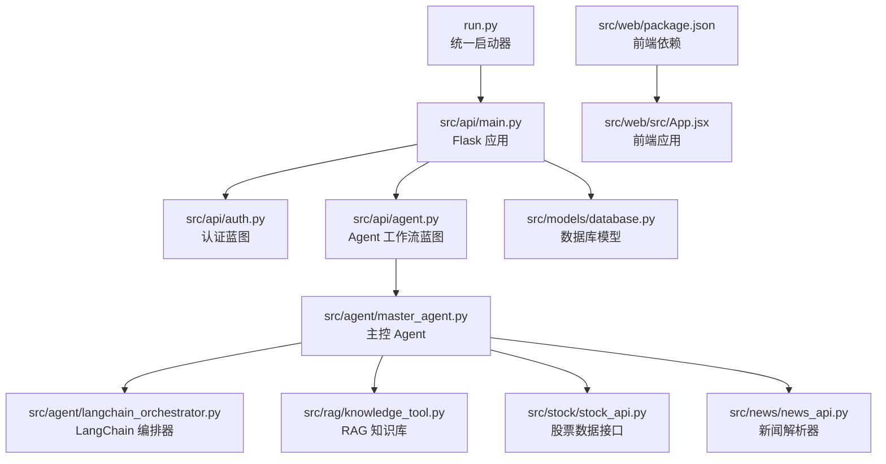
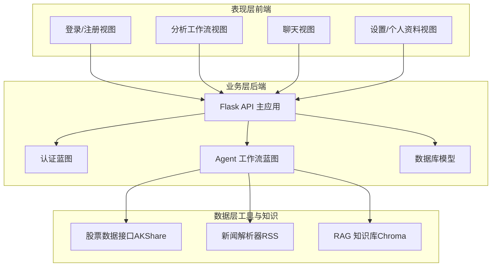
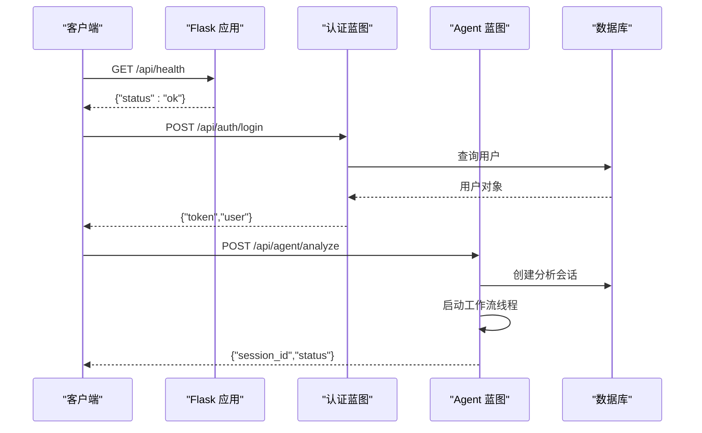
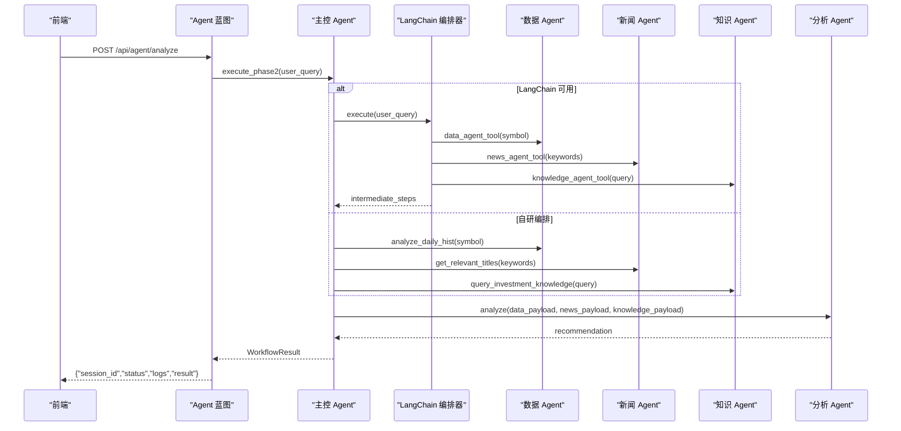
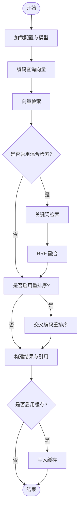
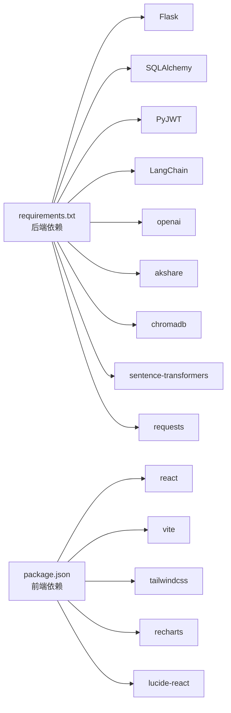

# 整体架构设计

<cite>
**本文档引用的文件**
- [run.py](file://run.py)
- [DESIGN.md](file://DESIGN.md)
- [README.md](file://README.md)
- [src/api/main.py](file://src/api/main.py)
- [src/api/auth.py](file://src/api/auth.py)
- [src/api/agent.py](file://src/api/agent.py)
- [src/models/database.py](file://src/models/database.py)
- [src/agent/master_agent.py](file://src/agent/master_agent.py)
- [src/agent/langchain_orchestrator.py](file://src/agent/langchain_orchestrator.py)
- [src/rag/knowledge_tool.py](file://src/rag/knowledge_tool.py)
- [src/stock/stock_api.py](file://src/stock/stock_api.py)
- [src/news/news_api.py](file://src/news/news_api.py)
- [src/web/package.json](file://src/web/package.json)
- [src/web/src/App.jsx](file://src/web/src/App.jsx)
- [requirements.txt](file://requirements.txt)
</cite>

## 目录
1. [引言](#引言)
2. [项目结构](#项目结构)
3. [核心组件](#核心组件)
4. [架构总览](#架构总览)
5. [详细组件分析](#详细组件分析)
6. [依赖关系分析](#依赖关系分析)
7. [性能考量](#性能考量)
8. [故障排查指南](#故障排查指南)
9. [结论](#结论)
10. [附录](#附录)

## 引言
本项目是一个基于 Flask + React + 多智能体 + RAG 的混合架构 AI 投资分析系统。系统采用分层与模块化设计，将复杂的投资决策过程拆解为多个专业 Agent，通过主控 Agent 协调执行，并结合 RAG 知识库提供方法论与规则支持。前端使用 React 构建交互界面，后端提供 REST API 与异步工作流，数据库持久化用户与分析会话数据。

## 项目结构
项目采用前后端分离与模块化组织，核心目录如下：
- run.py：统一启动器，支持后端、前端与并行启动
- src/api：Flask 路由与蓝图，提供认证、Agent 工作流、股票、新闻、聊天等接口
- src/agent：多智能体编排与执行逻辑（主控、数据、新闻、分析、知识）
- src/models：数据库模型与初始化
- src/rag：RAG 知识库检索与索引管理
- src/stock：A股数据接口封装（AKShare）
- src/news：新闻数据模块（RSS 解析器）
- src/web：React 前端应用
- requirements.txt：后端依赖清单

**图表来源**
- [run.py](file://run.py#L1-L60)
- [src/api/main.py](file://src/api/main.py#L40-L235)
- [src/api/auth.py](file://src/api/auth.py#L1-L136)
- [src/api/agent.py](file://src/api/agent.py#L1-L208)
- [src/models/database.py](file://src/models/database.py#L1-L86)
- [src/agent/master_agent.py](file://src/agent/master_agent.py#L1-L351)
- [src/agent/langchain_orchestrator.py](file://src/agent/langchain_orchestrator.py#L1-L273)
- [src/rag/knowledge_tool.py](file://src/rag/knowledge_tool.py#L1-L273)
- [src/stock/stock_api.py](file://src/stock/stock_api.py#L1-L425)
- [src/news/news_api.py](file://src/news/news_api.py#L1-L248)
- [src/web/package.json](file://src/web/package.json#L1-L33)
- [src/web/src/App.jsx](file://src/web/src/App.jsx#L1-L1085)

**章节来源**
- [README.md](file://README.md#L24-L40)
- [run.py](file://run.py#L1-L60)
- [src/api/main.py](file://src/api/main.py#L40-L235)

## 核心组件
- Flask API 层：提供认证、用户信息、Agent 工作流、股票、新闻、聊天等 REST 接口，注册蓝图并集中处理日志与错误
- 多智能体编排层：主控 Agent 负责任务分解与结果整合，数据/新闻/分析/知识 Agent 各司其职，支持 LangChain 编排器与自研编排双模式
- 数据与检索层：股票数据接口封装（AKShare）、新闻 RSS 解析器、RAG 知识库（Chroma + 嵌入 + 重排序）
- 前端交互层：React 应用，提供登录、分析工作流、聊天、设置与个人资料视图，支持进度与日志可视化

**章节来源**
- [src/api/main.py](file://src/api/main.py#L22-L56)
- [src/agent/master_agent.py](file://src/agent/master_agent.py#L24-L38)
- [src/agent/langchain_orchestrator.py](file://src/agent/langchain_orchestrator.py#L20-L28)
- [src/rag/knowledge_tool.py](file://src/rag/knowledge_tool.py#L22-L61)
- [src/stock/stock_api.py](file://src/stock/stock_api.py#L1-L425)
- [src/news/news_api.py](file://src/news/news_api.py#L41-L53)
- [src/web/src/App.jsx](file://src/web/src/App.jsx#L26-L74)

## 架构总览
系统采用三层架构与多智能体协同：
- 表现层（前端）：React 应用负责用户交互与结果展示
- 业务层（后端）：Flask API 路由与 Agent 工作流，异步执行分析任务并持久化状态
- 数据层（工具与知识）：股票/新闻数据源与 RAG 知识库

**图表来源**
- [src/web/src/App.jsx](file://src/web/src/App.jsx#L665-L764)
- [src/api/main.py](file://src/api/main.py#L40-L235)
- [src/api/auth.py](file://src/api/auth.py#L15-L15)
- [src/api/agent.py](file://src/api/agent.py#L17-L17)
- [src/models/database.py](file://src/models/database.py#L24-L86)
- [src/stock/stock_api.py](file://src/stock/stock_api.py#L137-L142)
- [src/news/news_api.py](file://src/news/news_api.py#L233-L248)
- [src/rag/knowledge_tool.py](file://src/rag/knowledge_tool.py#L254-L273)

## 详细组件分析

### Flask API 主应用与蓝图
- 初始化：设置 CORS、日志级别、SECRET_KEY，初始化数据库，注册认证、Agent、股票、新闻、聊天蓝图
- 路由：根路径返回服务信息，健康检查，用户信息读写，统一错误处理
- 中间件：请求前后日志记录，耗时统计

**图表来源**
- [src/api/main.py](file://src/api/main.py#L58-L83)
- [src/api/auth.py](file://src/api/auth.py#L78-L118)
- [src/api/agent.py](file://src/api/agent.py#L20-L64)

**章节来源**
- [src/api/main.py](file://src/api/main.py#L40-L235)
- [src/api/auth.py](file://src/api/auth.py#L1-L136)
- [src/api/agent.py](file://src/api/agent.py#L1-L208)

### 多智能体编排与主控 Agent
- 主控 Agent：负责符号解析、关键词提取、任务计划生成、LangChain/自研编排执行、结果整合
- 编排器：LangChain Orchestrator 将数据/新闻/知识工具注入 AgentExecutor，失败时回退至自研编排
- 执行链路：数据 Agent → 新闻 Agent → 知识库 Agent → 分析 Agent → 综合建议

**图表来源**
- [src/agent/master_agent.py](file://src/agent/master_agent.py#L155-L318)
- [src/agent/langchain_orchestrator.py](file://src/agent/langchain_orchestrator.py#L151-L273)
- [src/rag/knowledge_tool.py](file://src/rag/knowledge_tool.py#L254-L273)

**章节来源**
- [src/agent/master_agent.py](file://src/agent/master_agent.py#L1-L351)
- [src/agent/langchain_orchestrator.py](file://src/agent/langchain_orchestrator.py#L1-L273)

### RAG 知识库检索
- 知识库访问器：加载配置、连接 Chroma、初始化嵌入模型与重排序模型、关键词检索、RRF 融合、重排序、查询缓存
- 查询流程：向量化查询 → 向量检索 → 关键词检索（可选）→ RRF 融合 → 重排序 → 结果与引用

**图表来源**
- [src/rag/knowledge_tool.py](file://src/rag/knowledge_tool.py#L177-L248)

**章节来源**
- [src/rag/knowledge_tool.py](file://src/rag/knowledge_tool.py#L1-L273)

### 股票数据接口与新闻解析
- 股票接口：封装 AKShare 的多类接口，提供总貌、实时行情、历史数据、分时数据、公司信息、报价、同行比较等
- 新闻解析：RSS 解析器支持多种格式，清理 HTML、解析日期、合并标题列表

**章节来源**
- [src/stock/stock_api.py](file://src/stock/stock_api.py#L137-L425)
- [src/news/news_api.py](file://src/news/news_api.py#L100-L226)

### 前端应用与交互
- 视图：登录/注册、主页（分析工作流）、聊天、设置、个人资料
- 状态：用户认证状态、分析进度、Agent 日志、引用来源、聊天历史
- 工作流：启动分析 → 轮询状态 → 更新进度与日志 → 展示结果与引用

**章节来源**
- [src/web/src/App.jsx](file://src/web/src/App.jsx#L26-L74)
- [src/web/src/App.jsx](file://src/web/src/App.jsx#L184-L269)
- [src/web/src/App.jsx](file://src/web/src/App.jsx#L327-L339)
- [src/web/src/App.jsx](file://src/web/src/App.jsx#L585-L624)

## 依赖关系分析
- 后端依赖：Flask、SQLAlchemy、JWT、LangChain、OpenAI、AkShare、ChromaDB、SentenceTransformers、Requests 等
- 前端依赖：React、Vite、TailwindCSS、Recharts、Lucide React 等
- 模块耦合：API 蓝图与模型解耦，Agent 通过工具接口与数据/知识层交互，RAG 与 Chroma 紧耦合但可替换

**图表来源**
- [requirements.txt](file://requirements.txt#L1-L41)
- [src/web/package.json](file://src/web/package.json#L12-L31)

**章节来源**
- [requirements.txt](file://requirements.txt#L1-L41)
- [src/web/package.json](file://src/web/package.json#L1-L33)

## 性能考量
- 异步执行：Agent 工作流通过线程异步启动，避免阻塞 API 请求
- 缓存策略：RAG 查询缓存与 TTL 控制，减少重复检索开销
- 降级回退：LangChain 编排不可用时自动回退自研编排，保证系统可用性
- 数据质量：建议使用更稳定的 AKShare 接口集，避免高频受限接口
- 前端渲染：组件按需渲染与状态管理优化，避免重复请求

## 故障排查指南
- 启动问题：确认在项目根目录运行启动器；检查 Node.js 与 npm 是否安装；检查 Python 依赖是否安装
- 认证失败：检查 JWT 密钥与用户凭据；确认数据库中用户存在且激活
- 数据异常：检查网络与数据源可用性；查看 API 错误日志
- RAG 检索：重建索引并检查知识文件与配置；确认 Chroma 持久化目录存在
- Agent 执行：查看分析会话与 Agent 日志，定位失败步骤与错误信息

**章节来源**
- [README.md](file://README.md#L205-L215)
- [src/api/main.py](file://src/api/main.py#L222-L234)
- [src/rag/knowledge_tool.py](file://src/rag/knowledge_tool.py#L254-L273)

## 结论
本系统通过 Flask + React + 多智能体 + RAG 的混合架构实现了从数据采集、知识检索到综合分析与可视化的完整闭环。分层设计与模块化组织提升了可维护性与扩展性，LangChain 编排器与自研编排的双模式增强了鲁棒性。建议在生产环境中强化鉴权、限流、监控与缓存策略，并持续优化 Prompt 与知识库内容以提升分析质量。

## 附录
- 环境变量与配置：数据库 URL、JWT 密钥、Agent 编排器模式、日志级别等
- API 路由概览：认证、用户信息、Agent 工作流、股票、新闻、聊天等
- 前端开发：开发、构建、预览、代码检查命令

**章节来源**
- [README.md](file://README.md#L97-L131)
- [README.md](file://README.md#L132-L162)
- [README.md](file://README.md#L163-L178)