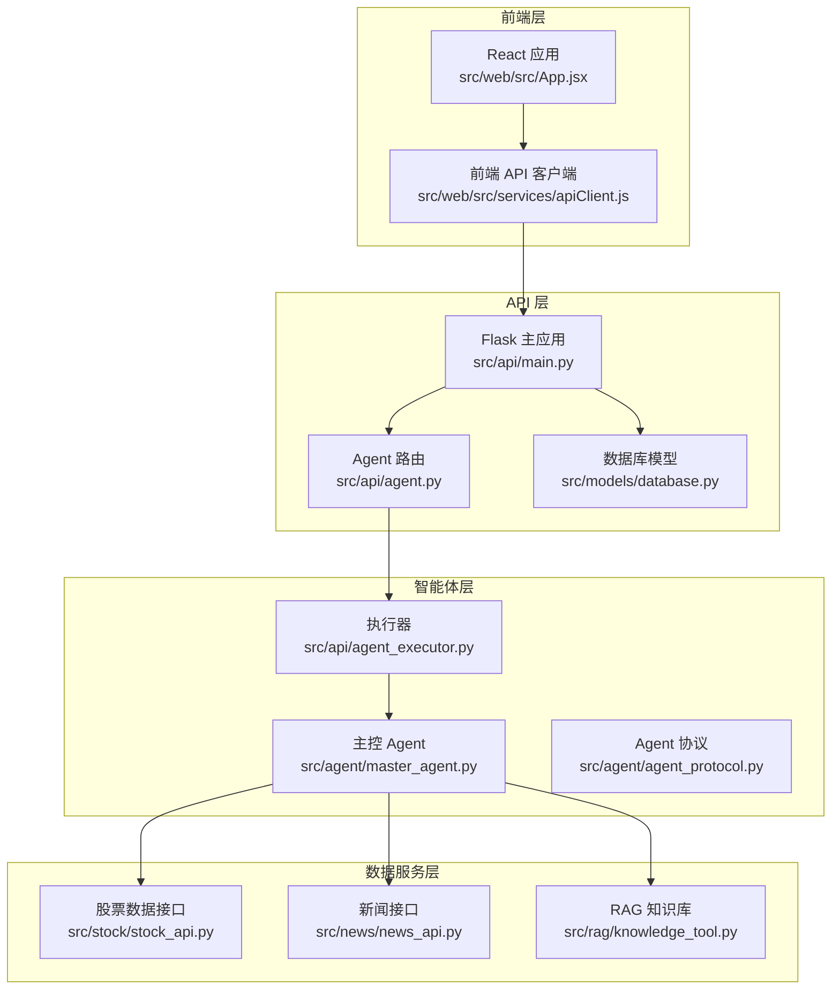
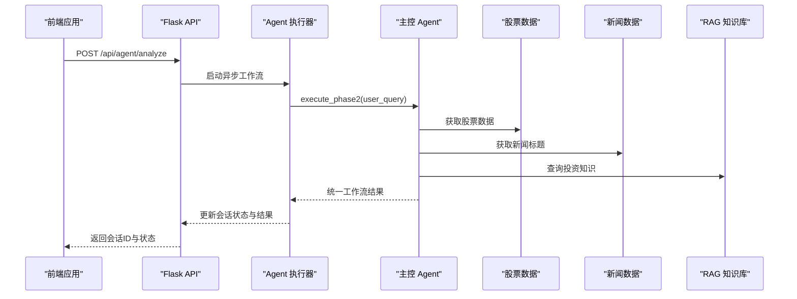
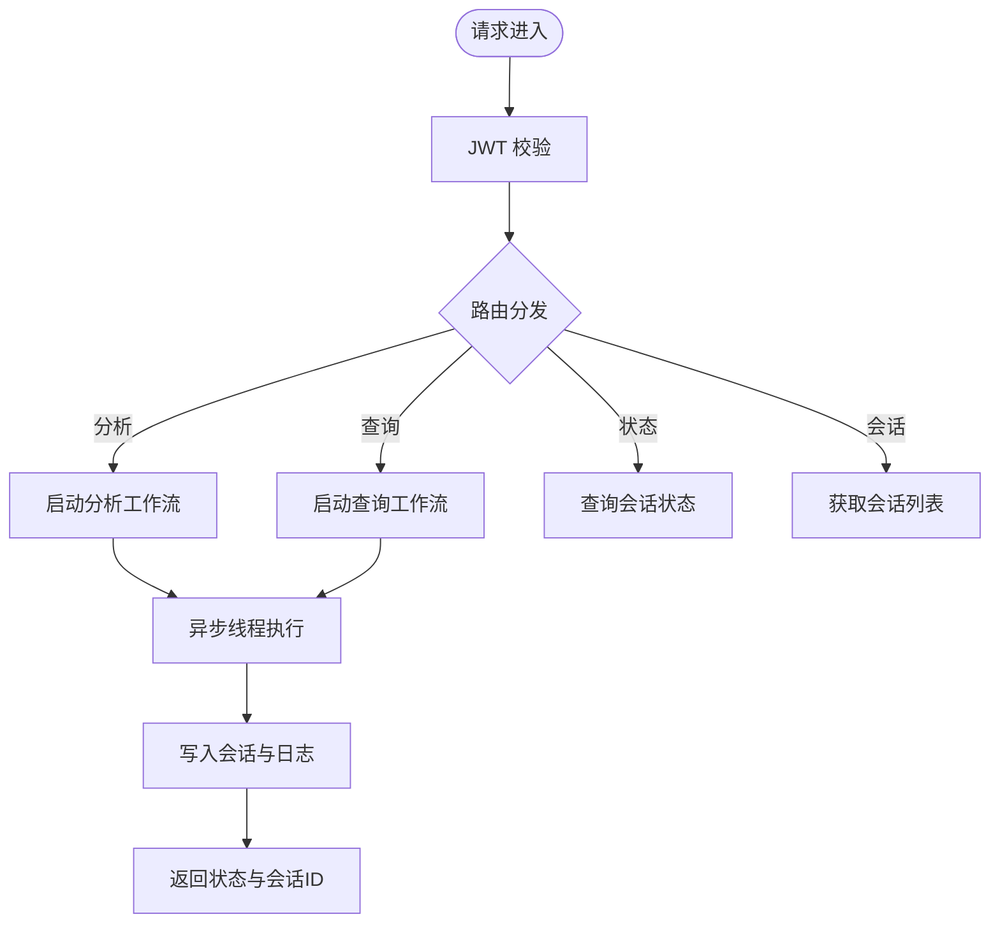
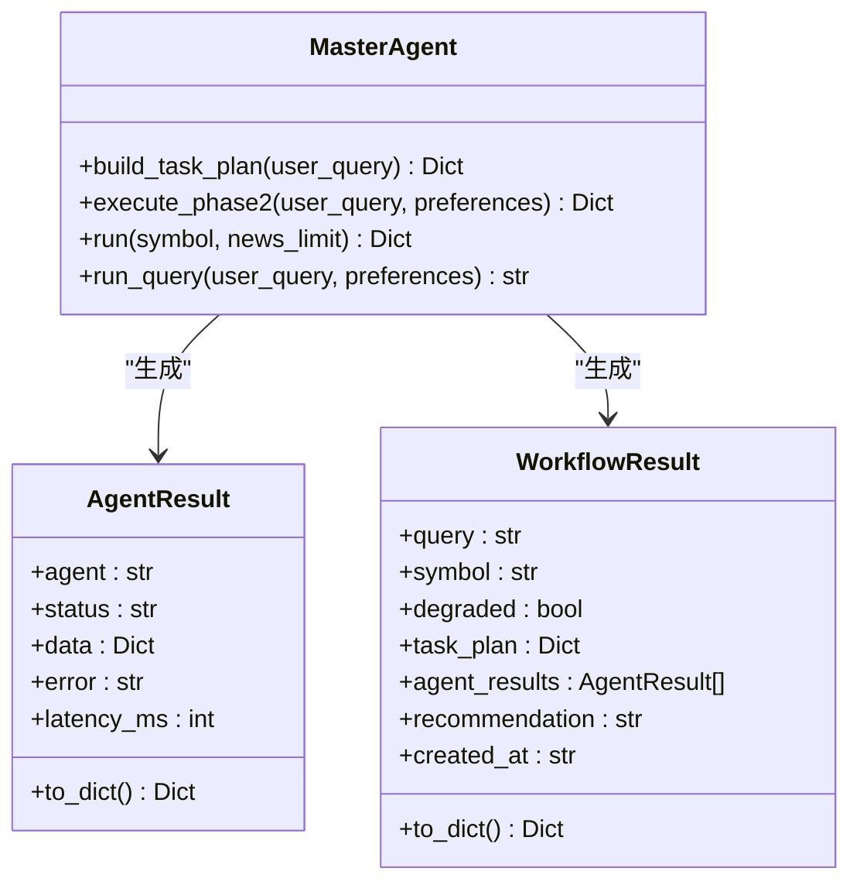
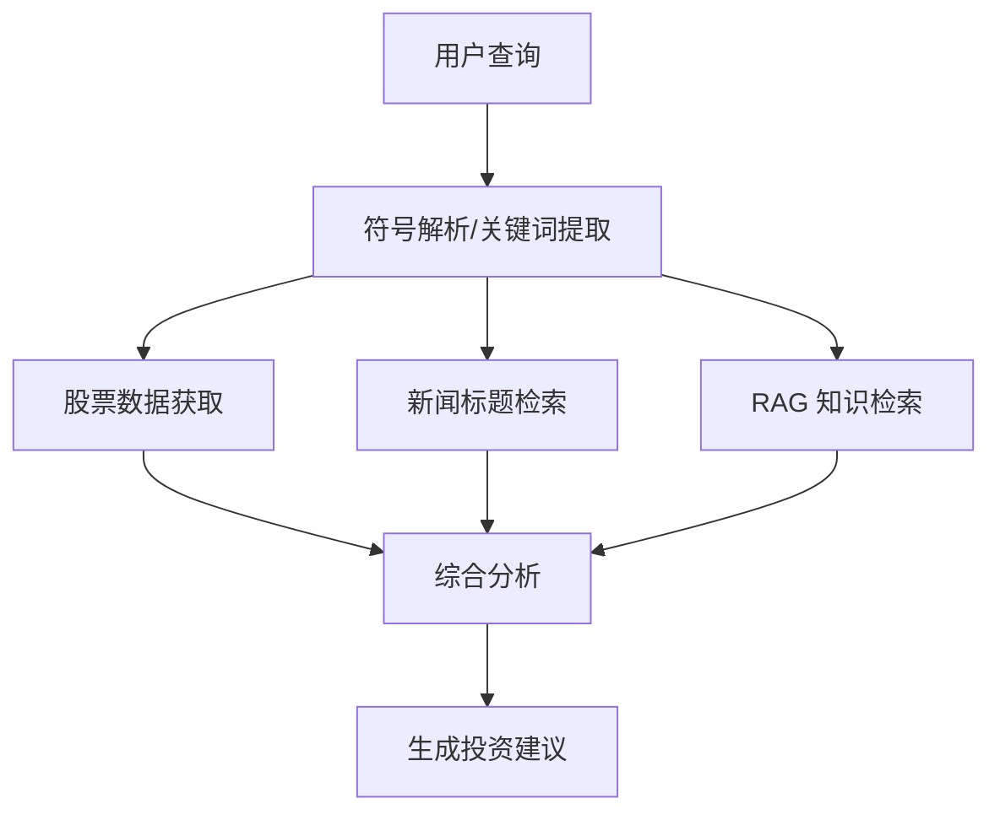
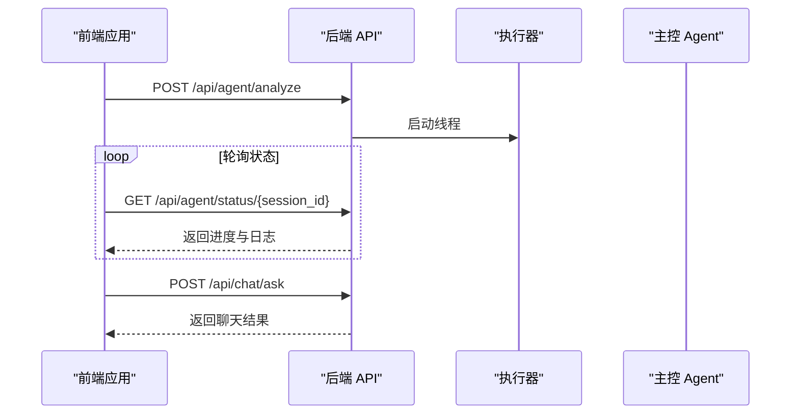
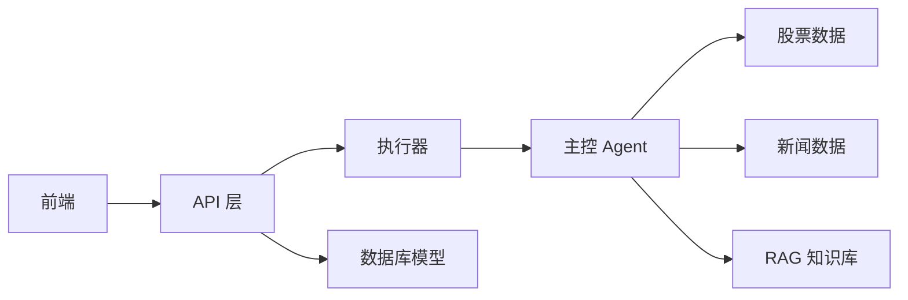

# 模块划分说明

<cite>
**本文档引用的文件**
- [src/api/main.py](file://src/api/main.py)
- [src/api/agent.py](file://src/api/agent.py)
- [src/api/agent_executor.py](file://src/api/agent_executor.py)
- [src/agent/master_agent.py](file://src/agent/master_agent.py)
- [src/agent/agent_protocol.py](file://src/agent/agent_protocol.py)
- [src/web/src/App.jsx](file://src/web/src/App.jsx)
- [src/web/src/services/apiClient.js](file://src/web/src/services/apiClient.js)
- [src/models/database.py](file://src/models/database.py)
- [src/rag/knowledge_tool.py](file://src/rag/knowledge_tool.py)
- [src/stock/stock_api.py](file://src/stock/stock_api.py)
- [src/news/news_api.py](file://src/news/news_api.py)
- [run.py](file://run.py)
- [DESIGN.md](file://DESIGN.md)
- [README.md](file://README.md)
</cite>

## 目录
1. [引言](#引言)
2. [项目结构](#项目结构)
3. [核心组件](#核心组件)
4. [架构总览](#架构总览)
5. [详细组件分析](#详细组件分析)
6. [依赖关系分析](#依赖关系分析)
7. [性能考量](#性能考量)
8. [故障排查指南](#故障排查指南)
9. [结论](#结论)
10. [附录](#附录)

## 引言
本项目是一个基于 Flask + React + 多 Agent 协作的 AI 投资分析系统，支持用户认证、股票与新闻信息聚合、对话分析与 RAG 知识检索。系统采用模块化设计，将复杂的投资决策过程拆解为多个专业 Agent，通过主控 Agent 协调并整合结果，形成可扩展、可维护、可降级的分析流水线。

## 项目结构
项目采用分层与模块化架构，主要分为：
- API 层：Flask 蓝图路由，提供 RESTful 接口
- 智能体层：多 Agent 协同，包含主控 Agent 与数据/新闻/分析 Agent
- 数据服务层：股票数据、新闻数据、RAG 知识库
- 前端层：React 应用，提供用户交互与可视化
- 数据模型层：SQLAlchemy ORM 模型，管理用户、会话、日志等

图表来源
- [src/web/src/App.jsx](file://src/web/src/App.jsx#L1-L800)
- [src/web/src/services/apiClient.js](file://src/web/src/services/apiClient.js#L1-L130)
- [src/api/main.py](file://src/api/main.py#L1-L243)
- [src/api/agent.py](file://src/api/agent.py#L1-L208)
- [src/api/agent_executor.py](file://src/api/agent_executor.py#L1-L282)
- [src/agent/master_agent.py](file://src/agent/master_agent.py#L1-L351)
- [src/agent/agent_protocol.py](file://src/agent/agent_protocol.py#L1-L116)
- [src/stock/stock_api.py](file://src/stock/stock_api.py#L1-L425)
- [src/news/news_api.py](file://src/news/news_api.py#L1-L248)
- [src/rag/knowledge_tool.py](file://src/rag/knowledge_tool.py#L1-L273)
- [src/models/database.py](file://src/models/database.py#L1-L86)

章节来源
- [README.md](file://README.md#L24-L40)
- [run.py](file://run.py#L1-L60)

## 核心组件
- API 模块：提供 RESTful 接口，负责用户认证、工作流启动、状态查询、会话管理等
- 智能体模块：包含主控 Agent、Agent 协议、执行器，负责任务分解、并行执行、结果整合
- 数据服务模块：封装股票数据、新闻数据、RAG 知识库访问，提供稳定的工具接口
- 前端模块：React 应用，负责用户交互、状态管理、与后端 API 通信

章节来源
- [src/api/main.py](file://src/api/main.py#L40-L235)
- [src/agent/master_agent.py](file://src/agent/master_agent.py#L24-L351)
- [src/agent/agent_protocol.py](file://src/agent/agent_protocol.py#L74-L116)
- [src/web/src/App.jsx](file://src/web/src/App.jsx#L1-L800)

## 架构总览
系统采用“前端 + API + 智能体 + 数据服务”的分层架构，通过统一的 Agent 协议与执行器实现模块解耦与可扩展性。主控 Agent 负责任务编排，数据/新闻/分析 Agent 各司其职，RAG 知识库提供决策依据。

图表来源
- [src/api/agent.py](file://src/api/agent.py#L20-L108)
- [src/api/agent_executor.py](file://src/api/agent_executor.py#L93-L186)
- [src/agent/master_agent.py](file://src/agent/master_agent.py#L155-L318)
- [src/rag/knowledge_tool.py](file://src/rag/knowledge_tool.py#L254-L273)
- [src/stock/stock_api.py](file://src/stock/stock_api.py#L212-L227)
- [src/news/news_api.py](file://src/news/news_api.py#L196-L226)

## 详细组件分析

### API 模块
职责边界
- 用户认证与权限校验
- 工作流启动与状态查询
- 用户信息管理（增删改查）
- 聊天与历史记录管理

接口定义
- 认证：POST /api/auth/register, POST /api/auth/login
- 用户：GET/PUT /api/user/profile, PUT /api/user/phone, PUT /api/user/password
- 工作流：POST /api/agent/analyze, POST /api/agent/query, GET /api/agent/status/{session_id}, GET /api/agent/sessions
- 聊天：POST /api/chat/send, POST /api/chat/ask, GET /api/chat/history

调用关系
- API 蓝图注册与路由转发
- 与执行器解耦，通过线程池异步执行
- 与数据库模型交互，持久化会话与日志

图表来源
- [src/api/main.py](file://src/api/main.py#L52-L56)
- [src/api/agent.py](file://src/api/agent.py#L20-L108)
- [src/api/agent_executor.py](file://src/api/agent_executor.py#L93-L186)

章节来源
- [src/api/main.py](file://src/api/main.py#L22-L235)
- [src/api/agent.py](file://src/api/agent.py#L1-L208)
- [src/models/database.py](file://src/models/database.py#L53-L86)

### 智能体模块
职责边界
- 主控 Agent：任务分解、编排、降级策略、统一输出协议
- Agent 协议：统一输入输出结构，便于替换与扩展
- 执行器：生命周期管理、日志记录、状态持久化

接口定义
- 主控接口：build_task_plan, execute_phase2, run, run_query
- 协议接口：AgentResult, WorkflowResult, JSON Schema 校验
- 执行器接口：get_executor, run_analysis, run_query, get_status

图表来源
- [src/agent/master_agent.py](file://src/agent/master_agent.py#L137-L351)
- [src/agent/agent_protocol.py](file://src/agent/agent_protocol.py#L74-L116)

章节来源
- [src/agent/master_agent.py](file://src/agent/master_agent.py#L1-L351)
- [src/agent/agent_protocol.py](file://src/agent/agent_protocol.py#L1-L116)

### 数据服务模块
职责边界
- 股票数据：封装 AKShare 接口，提供标准化的历史、实时、分时数据
- 新闻数据：RSS 解析器，提取标题与摘要
- RAG 知识库：Chroma + Embedding + 重排序，提供检索与引用

接口定义
- 股票：get_stock_zh_a_hist, get_stock_zh_a_spot_em 等
- 新闻：get_news_titles, RSSNewsParser
- RAG：query_investment_knowledge

图表来源
- [src/agent/master_agent.py](file://src/agent/master_agent.py#L95-L153)
- [src/stock/stock_api.py](file://src/stock/stock_api.py#L212-L227)
- [src/news/news_api.py](file://src/news/news_api.py#L196-L226)
- [src/rag/knowledge_tool.py](file://src/rag/knowledge_tool.py#L177-L248)

章节来源
- [src/stock/stock_api.py](file://src/stock/stock_api.py#L1-L425)
- [src/news/news_api.py](file://src/news/news_api.py#L1-L248)
- [src/rag/knowledge_tool.py](file://src/rag/knowledge_tool.py#L1-L273)

### 前端模块
职责边界
- 用户认证与会话管理
- 工作流启动与状态轮询
- 结果渲染与可视化
- 聊天与历史记录

接口定义
- 登录/注册：/api/auth/login, /api/auth/register
- 用户：/api/user/profile, /api/user/phone, /api/user/password
- 工作流：/api/agent/analyze, /api/agent/query, /api/agent/status/{session_id}
- 聊天：/api/chat/send, /api/chat/ask, /api/chat/history

图表来源
- [src/web/src/App.jsx](file://src/web/src/App.jsx#L184-L269)
- [src/web/src/services/apiClient.js](file://src/web/src/services/apiClient.js#L85-L129)
- [src/api/agent.py](file://src/api/agent.py#L111-L168)

章节来源
- [src/web/src/App.jsx](file://src/web/src/App.jsx#L1-L800)
- [src/web/src/services/apiClient.js](file://src/web/src/services/apiClient.js#L1-L130)

## 依赖关系分析
模块间依赖关系
- 前端依赖 API 层提供的 RESTful 接口
- API 层依赖执行器与数据库模型
- 执行器依赖主控 Agent 与数据服务
- 主控 Agent 依赖股票、新闻、RAG 服务
- 数据服务相互独立，通过主控 Agent 解耦

图表来源
- [src/web/src/services/apiClient.js](file://src/web/src/services/apiClient.js#L1-L130)
- [src/api/agent.py](file://src/api/agent.py#L1-L208)
- [src/api/agent_executor.py](file://src/api/agent_executor.py#L1-L282)
- [src/agent/master_agent.py](file://src/agent/master_agent.py#L1-L351)
- [src/models/database.py](file://src/models/database.py#L1-L86)

章节来源
- [DESIGN.md](file://DESIGN.md#L1-L191)

## 性能考量
- 异步执行：工作流通过线程池异步执行，避免阻塞 API 请求
- 进度与日志：细粒度进度与日志记录，便于监控与优化
- 缓存与降级：RAG 支持缓存与回退策略，主控 Agent 支持编排器自动回退
- 数据质量：建议引入数据缓存与重试机制，控制外部 API 调用成本

## 故障排查指南
常见问题
- 启动后端报模块导入错误：确认在项目根目录运行命令
- 前端无法启动：确认 Node.js 与 npm 已安装，且已执行 npm install
- 股票或新闻数据异常：可能与网络状态、数据源可用性有关
- RAG 检索效果不佳：先重新构建索引并检查知识库内容

章节来源
- [README.md](file://README.md#L205-L211)

## 结论
本系统通过模块化设计实现了清晰的职责边界与良好的解耦机制。API 模块提供稳定的接口，智能体模块负责复杂的编排与推理，数据服务模块提供可靠的数据与知识支持，前端模块专注于用户体验。统一的 Agent 协议与执行器为系统的扩展与维护提供了坚实基础。

## 附录
- 启动方式：支持仅启动后端、仅启动前端、同时启动
- 环境变量：可配置数据库 URL、Agent 编排器模式等
- 测试：包含多模块测试用例，便于验证功能正确性

章节来源
- [run.py](file://run.py#L35-L56)
- [README.md](file://README.md#L97-L131)
- [README.md](file://README.md#L194-L203)