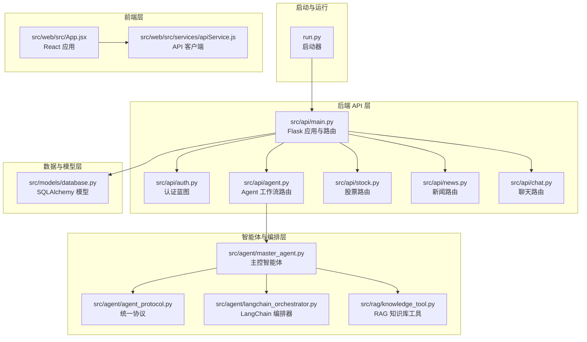
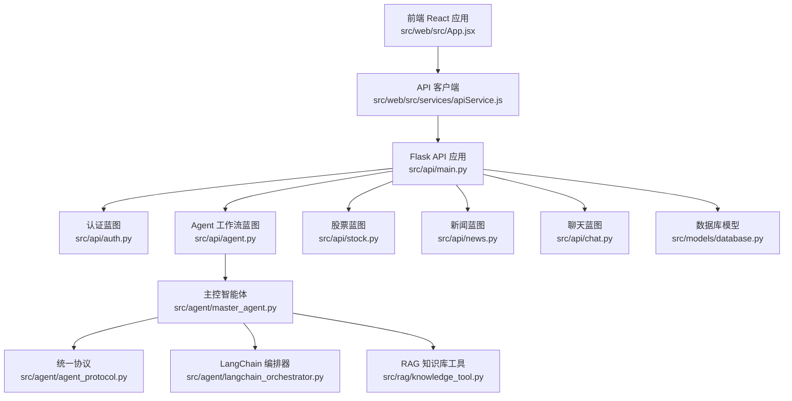
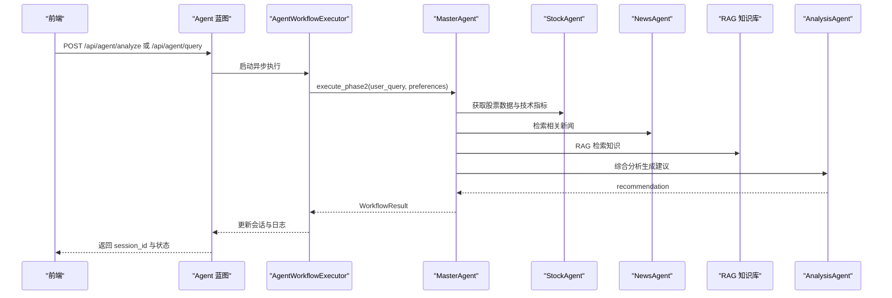
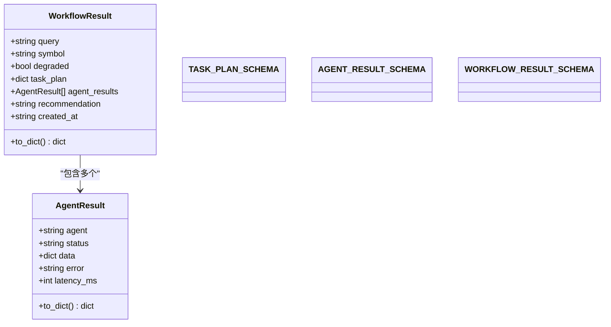
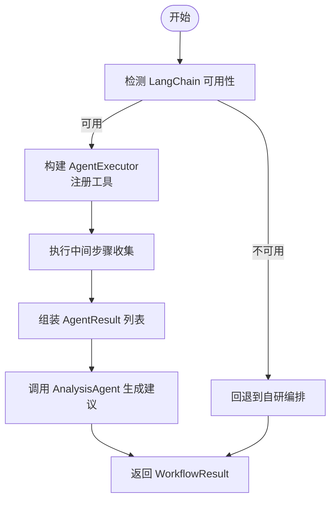
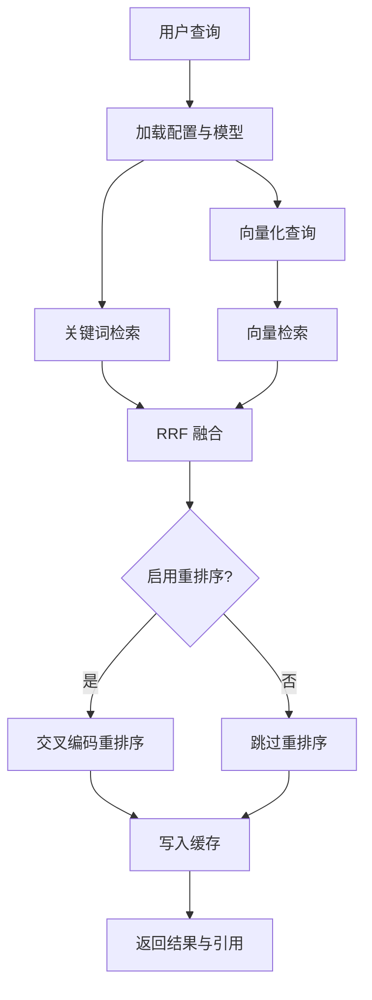
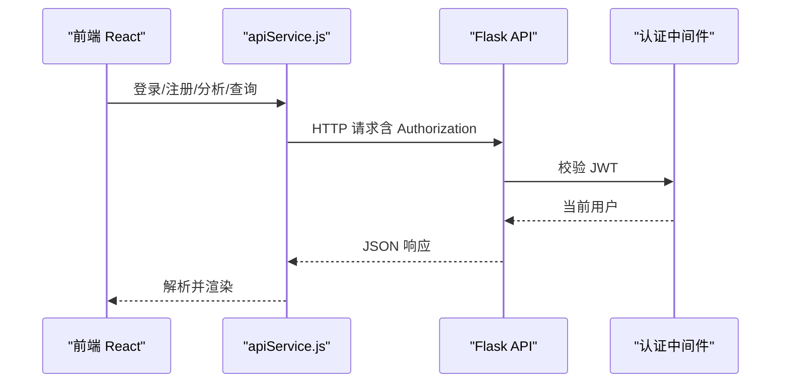
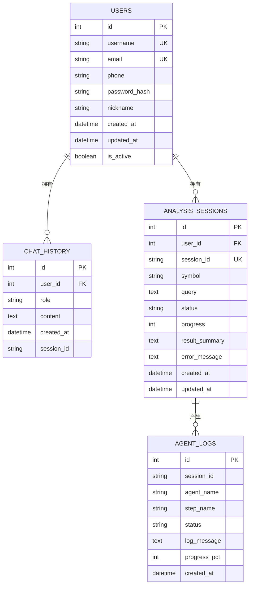
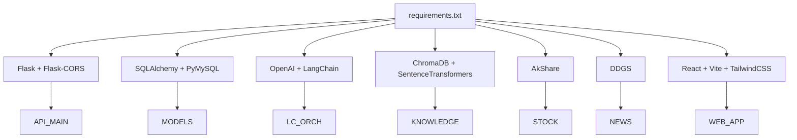

# 系统架构

<cite>
**本文引用的文件**
- [run.py](file://run.py)
- [DESIGN.md](file://DESIGN.md)
- [README.md](file://README.md)
- [src/api/main.py](file://src/api/main.py)
- [src/api/agent.py](file://src/api/agent.py)
- [src/agent/master_agent.py](file://src/agent/master_agent.py)
- [src/agent/agent_protocol.py](file://src/agent/agent_protocol.py)
- [src/agent/langchain_orchestrator.py](file://src/agent/langchain_orchestrator.py)
- [src/rag/knowledge_tool.py](file://src/rag/knowledge_tool.py)
- [src/models/database.py](file://src/models/database.py)
- [src/web/src/services/apiService.js](file://src/web/src/services/apiService.js)
- [src/web/src/App.jsx](file://src/web/src/App.jsx)
- [requirements.txt](file://requirements.txt)
</cite>

## 目录
1. [简介](#简介)
2. [项目结构](#项目结构)
3. [核心组件](#核心组件)
4. [架构总览](#架构总览)
5. [详细组件分析](#详细组件分析)
6. [依赖关系分析](#依赖关系分析)
7. [性能考量](#性能考量)
8. [故障排查指南](#故障排查指南)
9. [结论](#结论)
10. [附录](#附录)

## 简介
本系统是一个基于 Flask + React + 多智能体协作 + RAG 的 AI 投资分析平台，提供用户认证、股票与新闻信息聚合、对话分析与知识检索能力。系统采用前后端分离架构，后端通过 Flask 提供 REST API，前端使用 React 构建交互界面；在后端内部，通过多 Agent 协作实现任务分解、并行执行与结果整合，并支持可切换的编排器（LangChain AgentExecutor 或自研编排）。

## 项目结构
项目采用模块化分层设计：
- 启动与运行：run.py 提供一键启动前后端的便捷入口
- 后端 API：src/api 下按功能域划分蓝图（auth、agent、stock、news、chat）
- 智能体与编排：src/agent 下包含主控智能体、数据/新闻/分析/知识等 Agent，以及统一协议与可选 LangChain 编排器
- 数据与检索：src/rag 提供本地知识库（Chroma + 向量嵌入 + 重排序）与检索工具
- 数据模型：src/models 定义 SQLAlchemy 模型（用户、聊天历史、分析会话、Agent 日志）
- 前端：src/web 使用 Vite + React + TailwindCSS + Recharts 构建可视化界面

图表来源
- [run.py](file://run.py#L1-L60)
- [src/api/main.py](file://src/api/main.py#L40-L57)
- [src/api/agent.py](file://src/api/agent.py#L17-L17)
- [src/agent/master_agent.py](file://src/agent/master_agent.py#L24-L39)
- [src/agent/agent_protocol.py](file://src/agent/agent_protocol.py#L74-L116)
- [src/agent/langchain_orchestrator.py](file://src/agent/langchain_orchestrator.py#L20-L28)
- [src/rag/knowledge_tool.py](file://src/rag/knowledge_tool.py#L254-L273)
- [src/models/database.py](file://src/models/database.py#L24-L86)
- [src/web/src/App.jsx](file://src/web/src/App.jsx#L1-L800)
- [src/web/src/services/apiService.js](file://src/web/src/services/apiService.js#L1-L175)

章节来源
- [run.py](file://run.py#L1-L60)
- [README.md](file://README.md#L24-L40)

## 核心组件
- 启动器：run.py 提供后端/前端/全量启动选项，便于开发与调试
- Flask 应用：src/api/main.py 创建应用、注册蓝图、健康检查与通用路由
- 认证与用户管理：auth 蓝图提供注册/登录与用户资料更新
- Agent 工作流：agent 蓝图提供分析/查询启动与状态查询，异步执行由 AgentWorkflowExecutor 驱动
- 主控智能体：MasterAgent 负责任务分解、符号解析、并行调用子 Agent、结果整合与降级处理
- 统一协议：AgentResult/WorkflowResult 与 JSON Schema 确保跨 Agent 的数据一致性
- LangChain 编排器：可选的 AgentExecutor 封装工具调用，失败时回退至自研编排
- RAG 知识库：Chroma + 嵌入 + 重排序 + 关键词融合，提供检索与引用
- 数据模型：用户、聊天历史、分析会话、Agent 日志，支撑会话与审计
- 前端应用：React + Vite + TailwindCSS，提供登录、分析、聊天、会话管理等视图

章节来源
- [src/api/main.py](file://src/api/main.py#L40-L57)
- [src/api/agent.py](file://src/api/agent.py#L17-L17)
- [src/agent/master_agent.py](file://src/agent/master_agent.py#L24-L39)
- [src/agent/agent_protocol.py](file://src/agent/agent_protocol.py#L74-L116)
- [src/agent/langchain_orchestrator.py](file://src/agent/langchain_orchestrator.py#L20-L28)
- [src/rag/knowledge_tool.py](file://src/rag/knowledge_tool.py#L254-L273)
- [src/models/database.py](file://src/models/database.py#L24-L86)
- [src/web/src/App.jsx](file://src/web/src/App.jsx#L1-L800)
- [src/web/src/services/apiService.js](file://src/web/src/services/apiService.js#L1-L175)

## 架构总览
系统采用“前后端分离 + 多智能体编排 + RAG 知识检索”的混合架构：
- 前端：React 应用通过 apiService.js 调用后端 API，展示分析进度、Agent 输出与最终建议
- 后端：Flask 提供 REST API，认证中间件保障会话安全，蓝图按领域划分职责
- 智能体层：MasterAgent 作为编排中枢，协调数据/新闻/知识/分析 Agent 并统一输出
- 数据与检索：SQLite 默认存储用户与会话数据；Chroma 本地向量库支撑 RAG 检索

图表来源
- [src/web/src/App.jsx](file://src/web/src/App.jsx#L1-L800)
- [src/web/src/services/apiService.js](file://src/web/src/services/apiService.js#L1-L175)
- [src/api/main.py](file://src/api/main.py#L40-L57)
- [src/api/agent.py](file://src/api/agent.py#L17-L17)
- [src/agent/master_agent.py](file://src/agent/master_agent.py#L24-L39)
- [src/agent/agent_protocol.py](file://src/agent/agent_protocol.py#L74-L116)
- [src/agent/langchain_orchestrator.py](file://src/agent/langchain_orchestrator.py#L20-L28)
- [src/rag/knowledge_tool.py](file://src/rag/knowledge_tool.py#L254-L273)
- [src/models/database.py](file://src/models/database.py#L24-L86)

## 详细组件分析

### 主控智能体（MasterAgent）与编排
- 职责：任务分解、符号解析、并行调用子 Agent、结果整合、降级输出
- 编排模式：支持 LangChain AgentExecutor 与自研编排双通道，失败自动回退
- 统一协议：AgentResult/WorkflowResult 与 JSON Schema 确保跨 Agent 的数据一致性
- 关键流程：解析用户查询 -> 识别股票代码 -> 生成任务计划 -> 并行执行 -> 综合分析 -> 生成最终建议

图表来源
- [src/api/agent.py](file://src/api/agent.py#L20-L108)
- [src/agent/master_agent.py](file://src/agent/master_agent.py#L155-L318)
- [src/agent/agent_protocol.py](file://src/agent/agent_protocol.py#L74-L116)
- [src/rag/knowledge_tool.py](file://src/rag/knowledge_tool.py#L254-L273)

章节来源
- [src/agent/master_agent.py](file://src/agent/master_agent.py#L24-L351)
- [src/agent/agent_protocol.py](file://src/agent/agent_protocol.py#L74-L116)
- [src/agent/langchain_orchestrator.py](file://src/agent/langchain_orchestrator.py#L20-L273)

### 统一协议与数据结构
- AgentResult：统一 Agent 输出结构，包含 agent、status、data、error、latency_ms
- WorkflowResult：统一工作流输出结构，包含 query、symbol、degraded、task_plan、agent_results、recommendation、created_at
- JSON Schema：约束任务计划与结果结构，便于替换与降级

图表来源
- [src/agent/agent_protocol.py](file://src/agent/agent_protocol.py#L74-L116)

章节来源
- [src/agent/agent_protocol.py](file://src/agent/agent_protocol.py#L16-L71)

### LangChain 编排器（可选）
- 功能：封装工具调用（数据/新闻/知识），通过 AgentExecutor 执行
- 回退策略：当 LangChain 不可用或异常时，自动回退到自研编排
- 配置：从环境变量读取模型与密钥，支持 OpenAI 或兼容 API

图表来源
- [src/agent/langchain_orchestrator.py](file://src/agent/langchain_orchestrator.py#L62-L69)
- [src/agent/langchain_orchestrator.py](file://src/agent/langchain_orchestrator.py#L151-L273)

章节来源
- [src/agent/langchain_orchestrator.py](file://src/agent/langchain_orchestrator.py#L20-L273)

### RAG 知识库检索
- 架构：Chroma 持久化向量库 + SentenceTransformer 嵌入 + 可选 CrossEncoder 重排序
- 特性：关键词融合（RRF）、查询缓存、降级提示、引用来源
- 工具：query_investment_knowledge 提供统一检索接口

图表来源
- [src/rag/knowledge_tool.py](file://src/rag/knowledge_tool.py#L177-L248)

章节来源
- [src/rag/knowledge_tool.py](file://src/rag/knowledge_tool.py#L22-L273)

### 前后端分离与 API 设计
- 后端：Flask 蓝图划分领域，统一鉴权中间件，提供健康检查与通用用户资料接口
- 前端：React 应用通过 apiService.js 统一发起请求，支持登录态管理与错误处理
- 通信协议：RESTful API，JSON 请求/响应，Authorization 头携带 JWT

图表来源
- [src/web/src/services/apiService.js](file://src/web/src/services/apiService.js#L14-L35)
- [src/api/main.py](file://src/api/main.py#L85-L151)

章节来源
- [src/web/src/services/apiService.js](file://src/web/src/services/apiService.js#L1-L175)
- [src/api/main.py](file://src/api/main.py#L85-L151)

### 数据库设计模式
- 用户表：用户名、邮箱唯一索引、昵称、密码哈希、活跃状态
- 聊天历史表：外键关联用户，记录角色、内容、会话标识
- 分析会话表：用户外键、会话标识、标的/查询、状态、进度、结果摘要、错误信息
- Agent 日志表：会话标识、Agent 名称、步骤、状态、日志消息、进度百分比

图表来源
- [src/models/database.py](file://src/models/database.py#L24-L86)

章节来源
- [src/models/database.py](file://src/models/database.py#L24-L86)

## 依赖关系分析
- 后端依赖：Flask、Flask-CORS、SQLAlchemy、PyMySQL、OpenAI/LangChain、ChromaDB、SentenceTransformers、AkShare、DDGS 等
- 前端依赖：React、ReactDOM、TailwindCSS、Recharts、Vite 插件等
- 智能体与检索：MasterAgent 依赖 StockAgent/NewsAgent/AnalysisAgent 与 RAG 工具；LangChain 编排器可选

图表来源
- [requirements.txt](file://requirements.txt#L1-L41)
- [src/api/main.py](file://src/api/main.py#L8-L30)
- [src/agent/langchain_orchestrator.py](file://src/agent/langchain_orchestrator.py#L72-L121)
- [src/rag/knowledge_tool.py](file://src/rag/knowledge_tool.py#L16-L17)
- [src/web/src/services/apiService.js](file://src/web/src/services/apiService.js#L1-L33)

章节来源
- [requirements.txt](file://requirements.txt#L1-L41)

## 性能考量
- 编排器选择：通过环境变量控制编排器模式（auto/langchain/custom），在可用性与稳定性之间权衡
- 缓存与降级：RAG 工具内置查询缓存与降级提示；MasterAgent 在子 Agent 失败时仍可输出降级结果
- 异步执行：Agent 工作流通过线程异步执行，避免阻塞 API 响应
- 数据库连接：统一通过 get_db 管理事务，异常时回滚，减少脏数据风险
- 前端渲染：React 组件按需渲染，避免不必要的重绘

## 故障排查指南
- 启动问题：确认在项目根目录运行 run.py；检查 Node.js 与 npm 是否安装；查看后端日志级别
- 认证问题：确认 JWT 密钥配置与会话状态；检查用户是否存在与邮箱唯一性
- 数据异常：检查股票/新闻 API 可用性与网络状态；关注 RAG 索引构建是否完成
- 编排异常：若 LangChain 不可用，系统会自动回退到自研编排；可在日志中查看回退原因
- 数据库问题：默认 SQLite 文件路径与权限；可通过环境变量切换为 MySQL 等

章节来源
- [README.md](file://README.md#L205-L215)
- [src/api/main.py](file://src/api/main.py#L222-L234)

## 结论
本系统通过“前后端分离 + 多智能体编排 + RAG 知识检索”的技术组合，实现了从用户查询到最终建议的完整闭环。主控智能体承担任务分解与结果整合，LangChain 编排器提供可选的工具调用链路，RAG 知识库增强分析的可解释性与权威性。数据库模型支撑会话与审计，前端提供直观的可视化与交互体验。整体架构在可扩展性、可维护性与工程化方面具备良好基础。

## 附录
- 系统边界与集成模式
  - 系统边界：后端 API 与前端应用之间的 REST 接口；Agent 工作流与外部数据源（股票/新闻/RAG）之间的调用边界
  - 集成模式：通过 Flask 蓝图与工具函数进行模块化集成；RAG 通过 Chroma 与嵌入模型进行本地检索；外部数据源通过 AkShare 与 DDGS 等工具接入
- 技术选型与权衡
  - Flask + React：开发效率高、生态成熟，适合快速迭代与原型验证
  - 多智能体协作：职责清晰、易于替换与扩展，适合复杂推理与多源信息融合
  - RAG：提升分析的可解释性与权威性，本地化部署降低对外部服务依赖
  - SQLite：开发与演示友好，生产环境可平滑迁移到 MySQL 等关系型数据库