# 组件通信协议

<cite>
**本文档引用的文件**
- [agent_protocol.py](file://src/agent/agent_protocol.py)
- [main.py](file://src/api/main.py)
- [auth.py](file://src/api/auth.py)
- [jwt_utils.py](file://src/utils/jwt_utils.py)
- [apiClient.js](file://src/web/src/services/apiClient.js)
- [agent.py](file://src/api/agent.py)
- [master_agent.py](file://src/agent/master_agent.py)
- [agent_executor.py](file://src/api/agent_executor.py)
- [langchain_orchestrator.py](file://src/agent/langchain_orchestrator.py)
- [news.py](file://src/api/news.py)
- [stock.py](file://src/api/stock.py)
- [database.py](file://src/models/database.py)
- [geminiService.js](file://src/web/src/services/geminiService.js)
- [chat.py](file://src/api/chat.py)
</cite>

## 目录
1. [引言](#引言)
2. [项目结构](#项目结构)
3. [核心组件](#核心组件)
4. [架构概览](#架构概览)
5. [详细组件分析](#详细组件分析)
6. [依赖关系分析](#依赖关系分析)
7. [性能考虑](#性能考虑)
8. [故障排除指南](#故障排除指南)
9. [结论](#结论)
10. [附录](#附录)

## 引言

本文件详细说明AI投资分析系统中各组件间的通信机制，涵盖智能体间的消息传递协议、API接口规范、认证授权机制、错误处理协议。文档重点解释Agent协议的设计原理和实现细节，包括消息格式、序列化方式、异步通信模式，并描述JWT认证流程和权限控制机制，说明跨模块调用的安全保障措施。

## 项目结构

系统采用前后端分离架构，后端基于Flask提供RESTful API，前端使用Vite+React构建用户界面。核心组件包括：

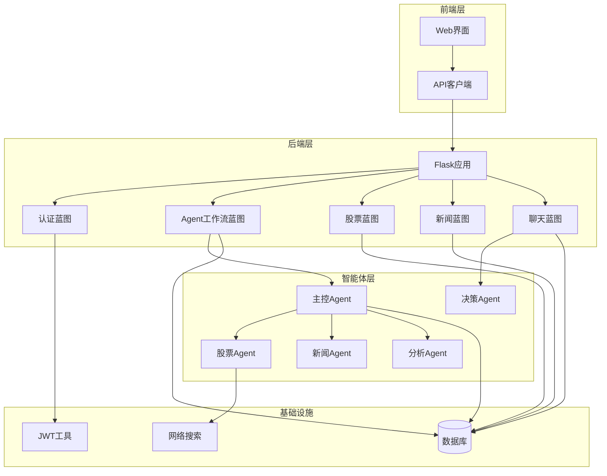

**图表来源**
- [main.py](file://src/api/main.py#L40-L56)
- [auth.py](file://src/api/auth.py#L15)
- [agent.py](file://src/api/agent.py#L17)
- [stock.py](file://src/api/stock.py#L12)
- [news.py](file://src/api/news.py#L12)
- [chat.py](file://src/api/chat.py#L17)

**章节来源**
- [main.py](file://src/api/main.py#L40-L56)
- [database.py](file://src/models/database.py#L24-L86)

## 核心组件

### Agent协议设计

系统实现了统一的Agent通信协议，确保不同Agent间的互操作性和可替换性：

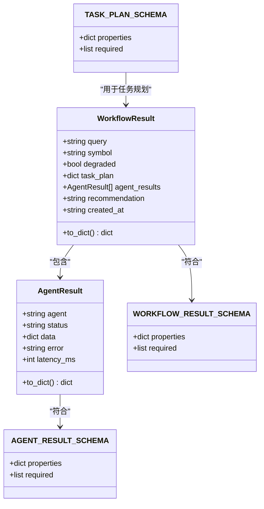

**图表来源**
- [agent_protocol.py](file://src/agent/agent_protocol.py#L74-L116)

协议特点：
- **标准化输出格式**：所有Agent必须返回统一的AgentResult结构
- **工作流聚合**：WorkflowResult将多个Agent的结果整合为最终输出
- **Schema验证**：提供JSON Schema确保数据结构一致性
- **降级处理**：支持部分Agent失败时的降级模式

**章节来源**
- [agent_protocol.py](file://src/agent/agent_protocol.py#L16-L116)

### 认证授权机制

系统采用JWT（JSON Web Token）进行身份认证和授权控制：

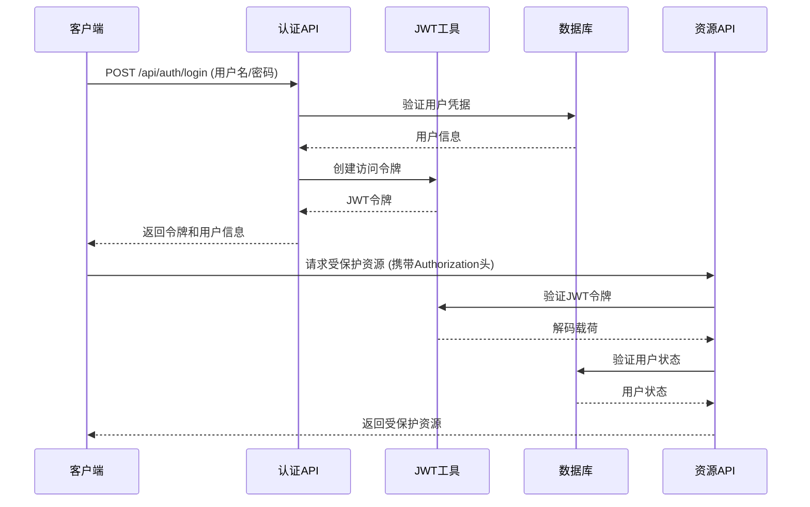

**图表来源**
- [auth.py](file://src/api/auth.py#L78-L118)
- [jwt_utils.py](file://src/utils/jwt_utils.py#L18-L35)

**章节来源**
- [auth.py](file://src/api/auth.py#L18-L136)
- [jwt_utils.py](file://src/utils/jwt_utils.py#L1-L36)

## 架构概览

系统采用多层架构设计，确保组件间的松耦合和高内聚：

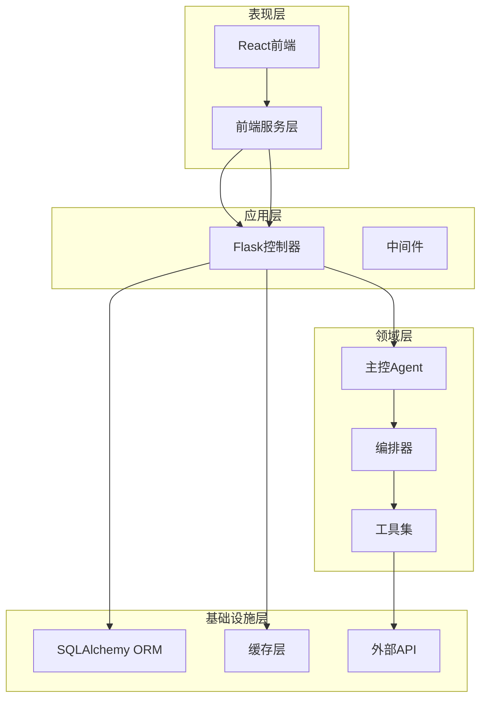

**图表来源**
- [master_agent.py](file://src/agent/master_agent.py#L24-L40)
- [agent_executor.py](file://src/api/agent_executor.py#L25-L40)

## 详细组件分析

### Agent工作流执行器

AgentWorkflowExecutor负责管理异步工作流的执行和状态跟踪：

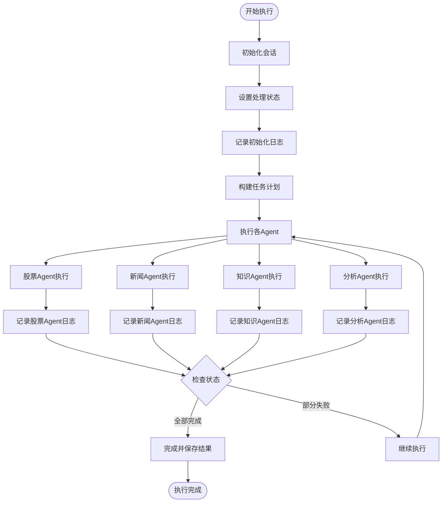

**图表来源**
- [agent_executor.py](file://src/api/agent_executor.py#L93-L186)
- [agent_executor.py](file://src/api/agent_executor.py#L187-L271)

**章节来源**
- [agent_executor.py](file://src/api/agent_executor.py#L25-L282)

### 主控Agent编排

MasterAgent负责协调各个专业Agent的工作：

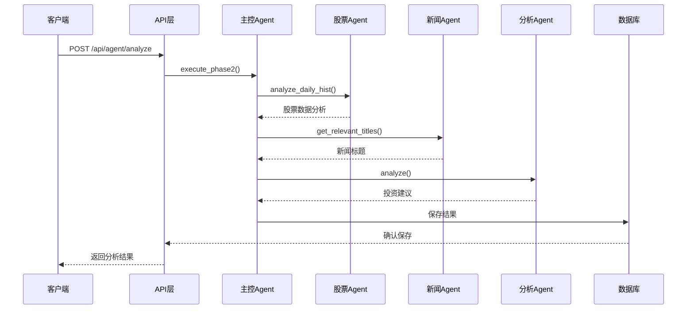

**图表来源**
- [master_agent.py](file://src/agent/master_agent.py#L155-L318)
- [agent_executor.py](file://src/api/agent_executor.py#L111-L151)

**章节来源**
- [master_agent.py](file://src/agent/master_agent.py#L24-L351)

### LangChain编排器

可选的LangChain编排器提供了更高级的Agent协作能力：

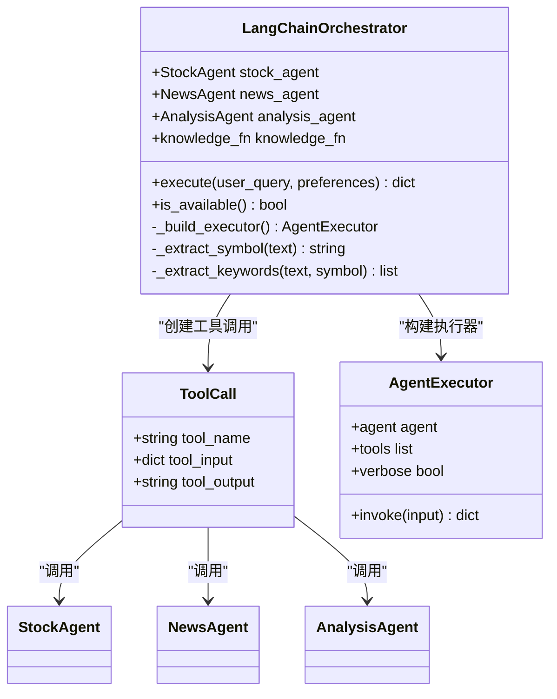

**图表来源**
- [langchain_orchestrator.py](file://src/agent/langchain_orchestrator.py#L20-L273)

**章节来源**
- [langchain_orchestrator.py](file://src/agent/langchain_orchestrator.py#L20-L273)

### 前端API客户端

前端使用统一的API客户端封装所有HTTP请求：

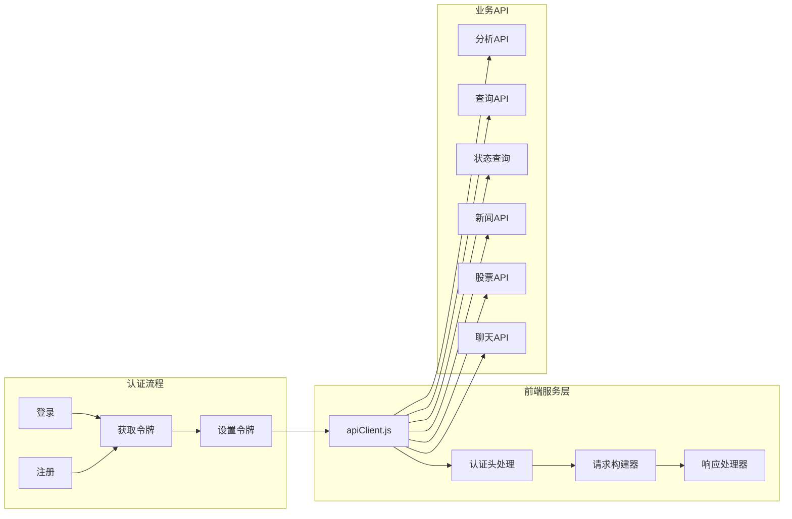

**图表来源**
- [apiClient.js](file://src/web/src/services/apiClient.js#L20-L130)

**章节来源**
- [apiClient.js](file://src/web/src/services/apiClient.js#L1-L130)

## 依赖关系分析

系统组件间的依赖关系呈现清晰的层次结构：

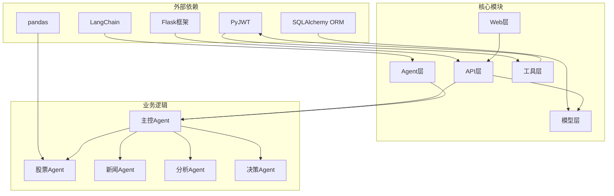

**图表来源**
- [main.py](file://src/api/main.py#L8-L30)
- [database.py](file://src/models/database.py#L8-L21)

**章节来源**
- [main.py](file://src/api/main.py#L8-L30)
- [database.py](file://src/models/database.py#L8-L21)

## 性能考虑

系统在设计时充分考虑了性能优化：

### 异步处理
- 使用Python线程池处理长时间运行的任务
- 支持非阻塞的API调用
- 实现渐进式状态更新

### 缓存策略
- 股票Agent内置数据缓存机制
- 新闻Agent支持结果缓存
- 数据库连接池优化

### 错误恢复
- 多级数据源降级回退
- Agent执行状态持久化
- 失败重试机制

## 故障排除指南

### 常见错误类型

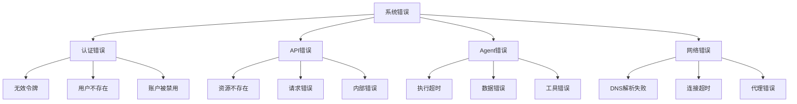

### 错误处理流程

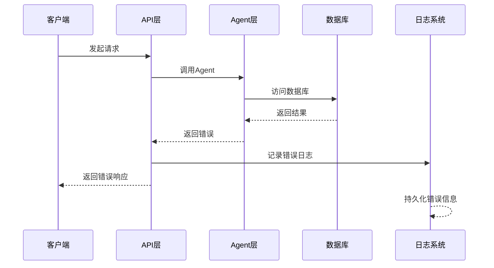

**章节来源**
- [main.py](file://src/api/main.py#L222-L234)
- [auth.py](file://src/api/auth.py#L95-L99)

## 结论

AI投资分析系统的组件通信协议设计体现了现代微服务架构的最佳实践。通过统一的Agent协议、完善的认证授权机制、健壮的错误处理体系，系统实现了高度模块化的智能体协作。JWT认证确保了跨模块调用的安全性，而异步工作流执行器则提供了良好的用户体验。

系统的关键优势包括：
- **标准化协议**：统一的Agent通信格式确保了组件间的互操作性
- **安全可靠**：完整的认证授权和错误处理机制
- **高性能**：异步处理和缓存策略优化了系统性能
- **可扩展**：模块化设计支持新功能的快速集成

## 附录

### API接口规范

#### 认证相关接口
- `POST /api/auth/register` - 用户注册
- `POST /api/auth/login` - 用户登录
- `GET /api/user/profile` - 获取用户信息
- `PUT /api/user/profile` - 更新用户信息

#### Agent工作流接口
- `POST /api/agent/analyze` - 启动分析工作流
- `POST /api/agent/query` - 启动查询工作流
- `GET /api/agent/status/{session_id}` - 获取工作流状态
- `GET /api/agent/sessions` - 获取会话列表

#### 股票相关接口
- `GET /api/stock/analyze` - 股票分析
- `GET /api/stock/technical` - 技术指标
- `GET /api/stock/history` - 历史行情
- `GET /api/stock/summary` - 股票汇总

#### 新闻相关接口
- `GET /api/news/titles` - 获取新闻标题
- `POST /api/news/filter` - 按关键词筛选新闻
- `POST /api/news/relevant` - 获取相关新闻

#### 聊天相关接口
- `POST /api/chat/send` - 发送消息
- `GET /api/chat/history` - 获取聊天历史
- `GET /api/chat/sessions` - 获取会话列表
- `DELETE /api/chat/clear` - 清空聊天历史
- `POST /api/chat/ask` - 简短问答

### 数据模型

系统使用SQLAlchemy ORM定义数据模型：

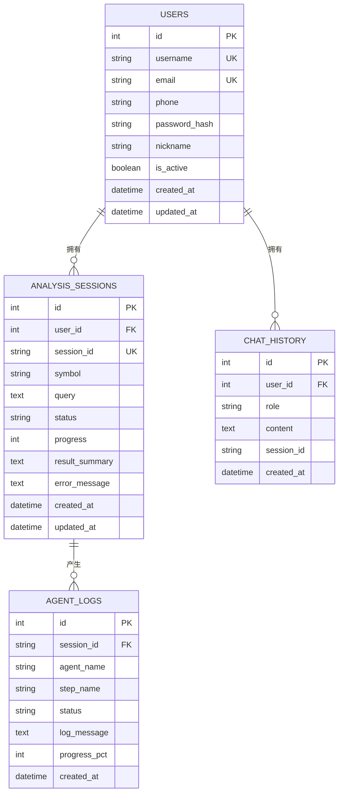

**图表来源**
- [database.py](file://src/models/database.py#L24-L86)

### 配置参数

系统支持多种环境配置：

| 参数名 | 类型 | 默认值 | 描述 |
|--------|------|--------|------|
| JWT_SECRET_KEY | string | "your-secret-key-change-in-production" | JWT密钥 |
| AGENT_ORCHESTRATOR | string | "auto" | Agent编排器模式 |
| AKSHARE_DISABLE_PROXY | string | "0" | 禁用代理标志 |
| OPENAI_MODEL | string | "deepseek-chat" | OpenAI模型名称 |
| DEEPSEEK_API_KEY | string | "" | DeepSeek API密钥 |
| LOG_LEVEL | string | "INFO" | 日志级别 |