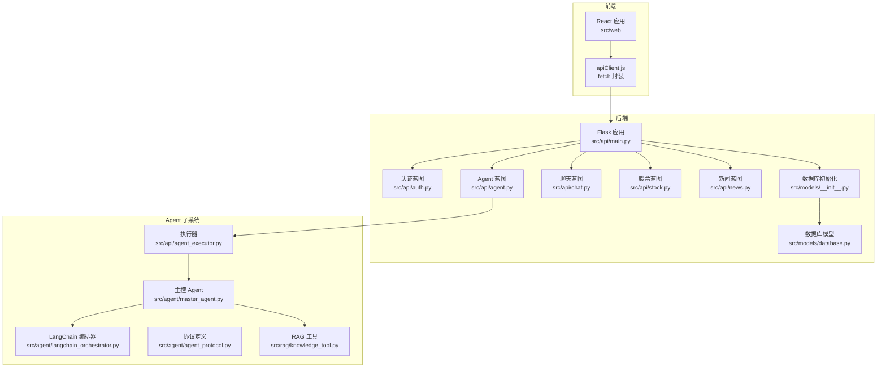
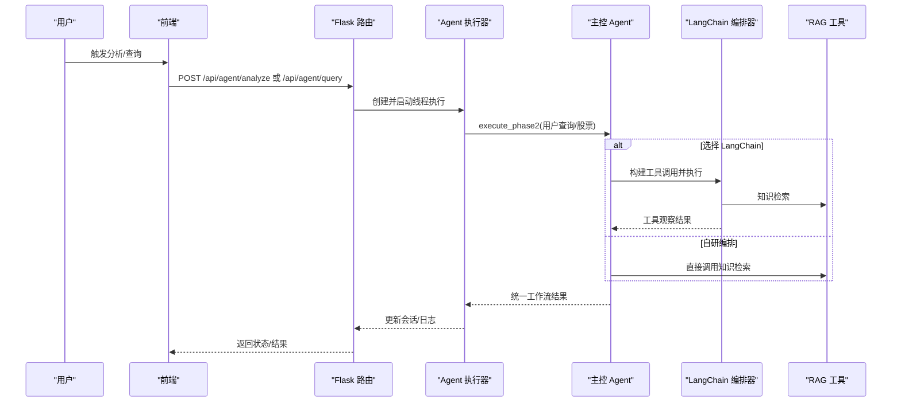
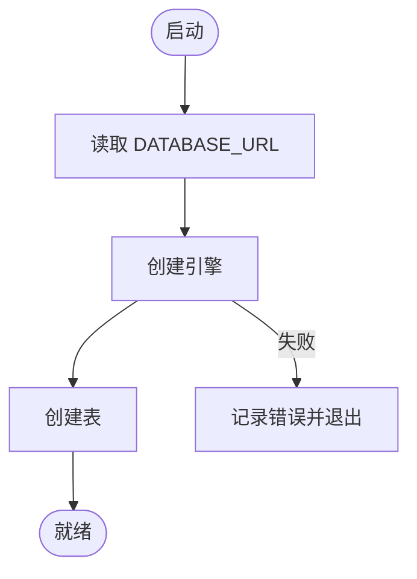
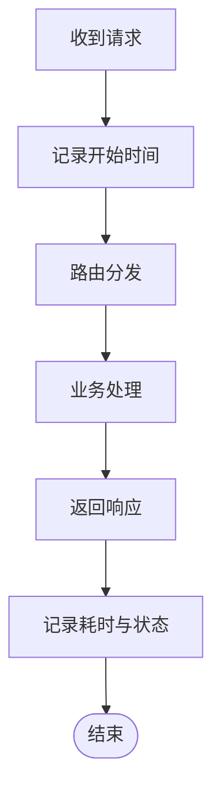
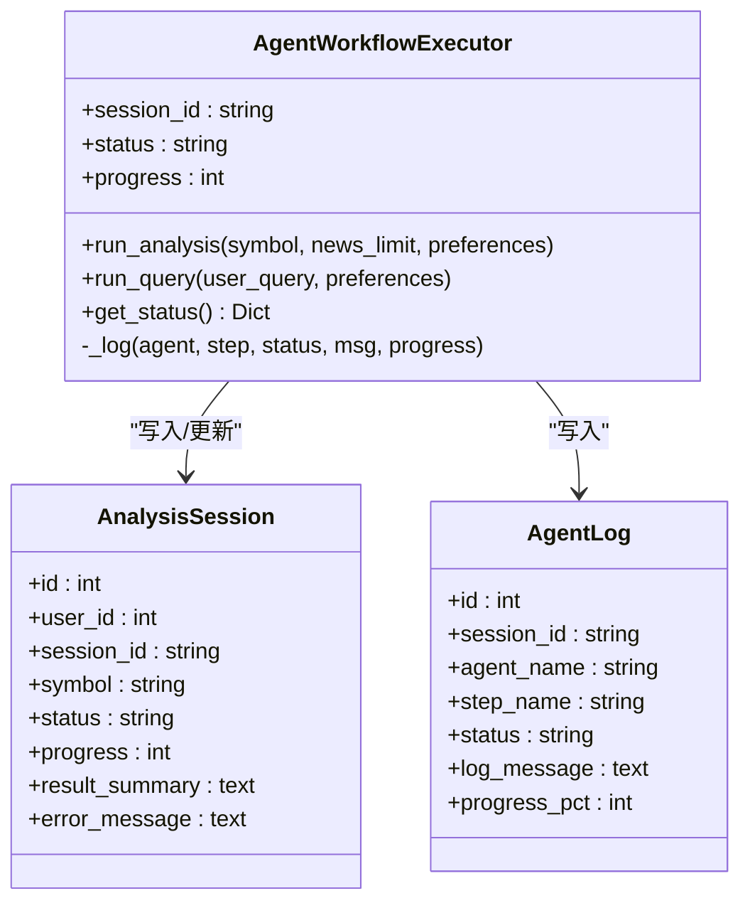
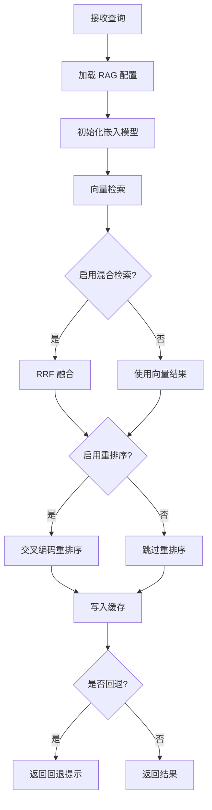
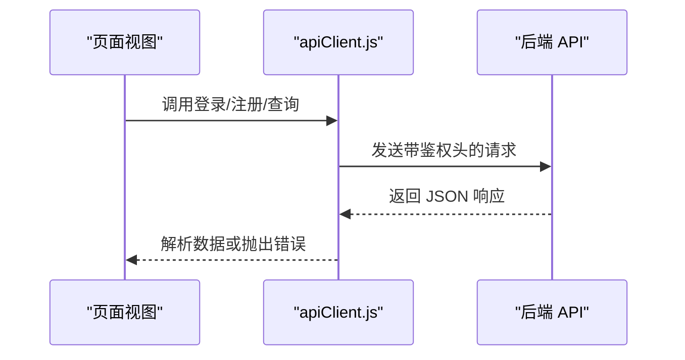
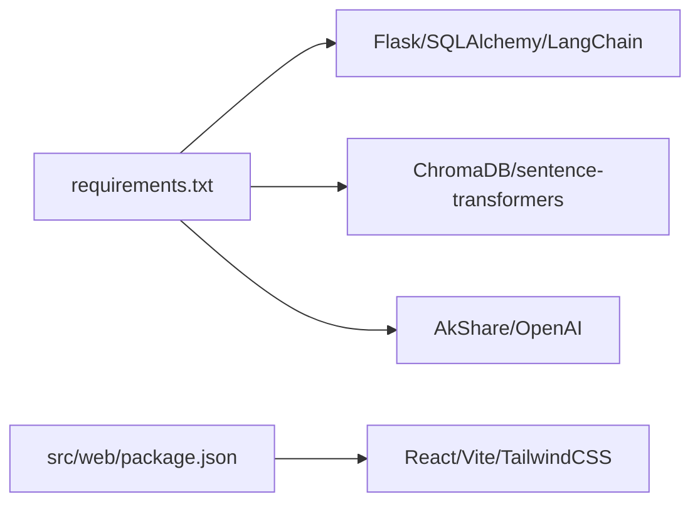

# 故障排除

<cite>
**本文引用的文件**
- [README.md](file://README.md)
- [run.py](file://run.py)
- [requirements.txt](file://requirements.txt)
- [src/models/__init__.py](file://src/models/__init__.py)
- [src/models/database.py](file://src/models/database.py)
- [src/api/main.py](file://src/api/main.py)
- [src/api/agent.py](file://src/api/agent.py)
- [src/api/agent_executor.py](file://src/api/agent_executor.py)
- [src/agent/master_agent.py](file://src/agent/master_agent.py)
- [src/agent/langchain_orchestrator.py](file://src/agent/langchain_orchestrator.py)
- [src/agent/agent_protocol.py](file://src/agent/agent_protocol.py)
- [src/rag/knowledge_tool.py](file://src/rag/knowledge_tool.py)
- [.env.example](file://.env.example)
- [src/web/src/services/apiClient.js](file://src/web/src/services/apiClient.js)
- [src/web/package.json](file://src/web/package.json)
</cite>

## 目录
1. [简介](#简介)
2. [项目结构](#项目结构)
3. [核心组件](#核心组件)
4. [架构总览](#架构总览)
5. [详细组件分析](#详细组件分析)
6. [依赖关系分析](#依赖关系分析)
7. [性能考虑](#性能考虑)
8. [故障排除指南](#故障排除指南)
9. [结论](#结论)
10. [附录](#附录)

## 简介
本手册面向运维与开发人员，围绕数据库连接、API 接口异常、Agent 执行错误、前端资源加载失败等常见问题，提供系统化的定位与修复路径。同时给出调试工具使用建议、性能瓶颈分析方法、应急响应流程与灾难恢复策略，帮助快速恢复系统稳定运行。

## 项目结构
系统采用“Flask 后端 + React 前端 + 多 Agent 分析链路”的分层架构。后端负责认证、路由、数据库与 Agent 工作流调度；前端负责用户交互与 API 调用；Agent 子系统负责数据/新闻/RAG/分析的协同编排；RAG 使用 ChromaDB 与向量嵌入进行本地知识检索。

图表来源
- [src/api/main.py](file://src/api/main.py#L40-L56)
- [src/api/agent.py](file://src/api/agent.py#L17-L17)
- [src/api/agent_executor.py](file://src/api/agent_executor.py#L25-L40)
- [src/agent/master_agent.py](file://src/agent/master_agent.py#L24-L39)
- [src/agent/langchain_orchestrator.py](file://src/agent/langchain_orchestrator.py#L20-L28)
- [src/rag/knowledge_tool.py](file://src/rag/knowledge_tool.py#L22-L61)
- [src/models/__init__.py](file://src/models/__init__.py#L8-L22)
- [src/models/database.py](file://src/models/database.py#L24-L86)
- [src/web/src/services/apiClient.js](file://src/web/src/services/apiClient.js#L1-L41)

章节来源
- [README.md](file://README.md#L24-L40)
- [src/api/main.py](file://src/api/main.py#L40-L56)

## 核心组件
- 数据库层：通过 SQLAlchemy 初始化与管理 SQLite/MySQL 等后端，提供上下文化会话与模型定义。
- API 层：Flask 蓝图组织认证、Agent、聊天、股票、新闻等路由，统一错误处理与健康检查。
- Agent 执行层：异步线程驱动的工作流执行器，记录会话与日志，支持 LangChain/自研编排回退。
- RAG 层：Chroma 持久化索引 + 嵌入模型 + 重排序，支持混合检索与缓存。
- 前端层：React/Vite 应用，封装 fetch 请求、鉴权头与错误提示。

章节来源
- [src/models/__init__.py](file://src/models/__init__.py#L8-L33)
- [src/models/database.py](file://src/models/database.py#L24-L86)
- [src/api/main.py](file://src/api/main.py#L22-L37)
- [src/api/agent_executor.py](file://src/api/agent_executor.py#L25-L92)
- [src/rag/knowledge_tool.py](file://src/rag/knowledge_tool.py#L22-L61)
- [src/web/src/services/apiClient.js](file://src/web/src/services/apiClient.js#L1-L41)

## 架构总览
系统通过 Flask 提供 REST API，前端通过 apiClient.js 发起请求。Agent 工作流由执行器异步启动，主控 Agent 根据配置选择 LangChain 或自研编排器，最终汇总分析结果并写入数据库会话与日志表。

图表来源
- [src/api/agent.py](file://src/api/agent.py#L20-L108)
- [src/api/agent_executor.py](file://src/api/agent_executor.py#L93-L186)
- [src/agent/master_agent.py](file://src/agent/master_agent.py#L155-L318)
- [src/agent/langchain_orchestrator.py](file://src/agent/langchain_orchestrator.py#L151-L272)
- [src/rag/knowledge_tool.py](file://src/rag/knowledge_tool.py#L254-L272)

## 详细组件分析

### 数据库连接与初始化
- 初始化：根据环境变量 DATABASE_URL 创建引擎与会话工厂，首次运行自动建表。
- 连接失败常见原因：URL 格式错误、权限不足、MySQL 服务未启动、SQLite 文件被占用。
- 建议：在本地验证数据库连通性，确保权限与网络可达；生产环境使用独立数据库实例。

图表来源
- [src/models/__init__.py](file://src/models/__init__.py#L14-L22)

章节来源
- [src/models/__init__.py](file://src/models/__init__.py#L14-L33)
- [.env.example](file://.env.example#L17-L18)

### API 路由与错误处理
- 健康检查：/api/health 返回服务状态。
- 统一日志：记录请求耗时与状态码，便于定位慢请求与异常。
- 错误处理：404/500/401 统一返回 JSON 错误信息，便于前端展示。

图表来源
- [src/api/main.py](file://src/api/main.py#L68-L83)

章节来源
- [src/api/main.py](file://src/api/main.py#L64-L83)
- [src/api/main.py](file://src/api/main.py#L222-L234)

### Agent 工作流与日志
- 会话管理：每个分析/查询创建唯一 session_id，写入 AnalysisSession。
- 日志记录：Agent 执行过程写入 AgentLog，包含 agent、step、status、progress、message。
- 回退机制：LangChain 可用则优先使用，否则回退至自研编排，失败原因记录在任务计划中。

图表来源
- [src/api/agent_executor.py](file://src/api/agent_executor.py#L25-L92)
- [src/models/database.py](file://src/models/database.py#L53-L86)

章节来源
- [src/api/agent.py](file://src/api/agent.py#L20-L168)
- [src/api/agent_executor.py](file://src/api/agent_executor.py#L93-L186)
- [src/models/database.py](file://src/models/database.py#L53-L86)

### RAG 检索与回退
- 检索流程：加载配置 → 初始化 Chroma/Embedder/Reranker → 向量检索 → 关键词融合 → 重排序 → 缓存命中。
- 回退策略：当结果数不足或最高分低于阈值时标记 fallback 并提示知识库覆盖不足。
- 常见问题：索引未构建、嵌入模型下载失败、磁盘空间不足、缓存配置不当。

图表来源
- [src/rag/knowledge_tool.py](file://src/rag/knowledge_tool.py#L177-L248)

章节来源
- [src/rag/knowledge_tool.py](file://src/rag/knowledge_tool.py#L254-L272)

### 前端资源加载与 API 调用
- 基础 URL：从 VITE_API_BASE_URL 读取，默认 http://localhost:5000。
- 鉴权头：Bearer Token 写入 Authorization，本地存储令牌。
- 错误处理：非 2xx 响应抛出错误，前端捕获并提示。

图表来源
- [src/web/src/services/apiClient.js](file://src/web/src/services/apiClient.js#L1-L41)

章节来源
- [src/web/src/services/apiClient.js](file://src/web/src/services/apiClient.js#L1-L130)
- [src/web/package.json](file://src/web/package.json#L1-L33)

## 依赖关系分析
- 后端依赖：Flask、SQLAlchemy、LangChain、OpenAI、ChromaDB、sentence-transformers、AkShare 等。
- 前端依赖：React、Recharts、TailwindCSS、Vite 等。
- 环境变量：JWT 密钥、API Key、编排器模式、数据库 URL 等。

图表来源
- [requirements.txt](file://requirements.txt#L1-L41)
- [src/web/package.json](file://src/web/package.json#L12-L31)

章节来源
- [requirements.txt](file://requirements.txt#L1-L41)
- [.env.example](file://.env.example#L1-L19)
- [src/web/package.json](file://src/web/package.json#L1-L33)

## 性能考虑
- 慢查询优化
  - 后端：开启数据库日志（echo）定位慢 SQL；为高频查询字段建立索引；避免 N+1 查询。
  - RAG：合理设置 top_k 与向量/关键词检索比例；启用重排序与缓存；评估嵌入模型与磁盘 IO。
- 内存泄漏检测
  - 关注长生命周期对象（单例 RAG 客户端、全局编排器）；定期重启服务清理异常内存。
  - 前端：避免重复订阅/定时器未清理；使用 React DevTools Profiler 检测组件重渲染。
- 并发问题排查
  - Agent 执行器使用线程池/锁保护共享状态；避免阻塞操作；监控队列积压。
  - 前端：并发请求去重与节流；统一错误处理与 loading 状态。

[本节为通用指导，无需特定文件引用]

## 故障排除指南

### 一、数据库连接失败
- 症状
  - 启动时报错无法连接数据库或建表失败。
- 诊断步骤
  - 检查 DATABASE_URL 是否正确（SQLite 文件路径、MySQL 连接串）。
  - 检查数据库服务状态与网络连通性。
  - 检查权限与磁盘空间。
- 解决方案
  - 修正 .env 中 DATABASE_URL；确保服务端口开放；为 SQLite 文件赋予写权限。
  - 如使用 MySQL，确认驱动版本与防火墙设置。

章节来源
- [src/models/__init__.py](file://src/models/__init__.py#L14-L22)
- [.env.example](file://.env.example#L17-L18)

### 二、API 接口异常（404/500/401）
- 症状
  - 访问 /api/* 返回 404；内部错误返回 500；未授权返回 401。
- 诊断步骤
  - 查看后端日志中的请求耗时与状态码。
  - 确认路由前缀与端点是否存在。
  - 检查 JWT 令牌是否有效与过期。
- 解决方案
  - 修复路由映射；补充缺失的蓝图；校验鉴权中间件；完善异常捕获与回滚。

章节来源
- [src/api/main.py](file://src/api/main.py#L222-L234)
- [src/api/main.py](file://src/api/main.py#L64-L83)

### 三、Agent 执行错误
- 症状
  - 分析/查询无响应或报错；会话状态停留在 pending/processing；日志显示某阶段失败。
- 诊断步骤
  - 通过 /api/agent/status/{session_id} 获取会话与日志详情。
  - 检查编排器模式（auto/langchain/custom），确认 LangChain 可用性。
  - 检查 RAG 检索是否触发回退与错误信息。
- 解决方案
  - 切换编排器模式；修复 LangChain 依赖与 API Key；重建 RAG 索引；优化超时与重试。

章节来源
- [src/api/agent.py](file://src/api/agent.py#L111-L168)
- [src/api/agent_executor.py](file://src/api/agent_executor.py#L93-L186)
- [src/agent/master_agent.py](file://src/agent/master_agent.py#L155-L318)
- [src/agent/langchain_orchestrator.py](file://src/agent/langchain_orchestrator.py#L62-L69)
- [src/rag/knowledge_tool.py](file://src/rag/knowledge_tool.py#L254-L272)

### 四、前端资源加载失败
- 症状
  - 页面空白、静态资源 404、跨域错误、登录后无响应。
- 诊断步骤
  - 检查 VITE_API_BASE_URL 是否指向正确的后端地址。
  - 检查浏览器 Network 面板与 Console 错误。
  - 确认后端 CORS 已启用。
- 解决方案
  - 设置正确的 API 基础地址；检查代理与端口转发；确保静态资源构建产物存在。

章节来源
- [src/web/src/services/apiClient.js](file://src/web/src/services/apiClient.js#L1-L41)
- [src/api/main.py](file://src/api/main.py#L42-L46)

### 五、调试工具使用指南
- Python 调试器
  - 在关键函数入口设置断点，逐步检查参数与返回值；关注数据库事务与异常回滚。
- 网络抓包工具
  - 使用 Wireshark/Fiddler/Charles 抓取 HTTP 请求，核对 Authorization 头与响应体。
- 浏览器开发者工具
  - Network 面板查看请求/响应；Console 查看错误堆栈；Application 查看 LocalStorage 令牌。

[本节为通用指导，无需特定文件引用]

### 六、性能瓶颈分析方法
- 慢查询优化
  - 后端：结合日志耗时定位慢接口；数据库层面添加索引与查询计划分析。
  - RAG：降低 top_k、关闭重排序、启用缓存；评估嵌入模型与磁盘 IO。
- 内存泄漏检测
  - 服务端：监控进程内存曲线，定期重启；检查长生命周期对象。
  - 前端：使用 Profiler 检测组件重渲染与事件监听泄漏。
- 并发问题排查
  - 服务端：限制并发、增加队列与限流；避免阻塞 I/O。
  - 前端：请求去重、节流与防抖；统一 loading 状态。

[本节为通用指导，无需特定文件引用]

### 七、应急响应流程
- 快速评估
  - 确认服务状态（/api/health）、日志级别与错误数量。
- 降级与回退
  - 切换编排器模式为 custom；关闭 LangChain；启用自研链路。
  - 对 RAG 启用回退提示，保证基本功能可用。
- 修复与验证
  - 修复数据库/网络/API Key 等基础问题；验证接口与 Agent 执行。
- 复盘与改进
  - 补充告警阈值、完善自动化测试与灰度发布。

[本节为通用流程，无需特定文件引用]

### 八、灾难恢复策略
- 数据库
  - 定期备份 SQLite/MySQL；生产使用只读副本与主从切换。
- 依赖
  - 固化依赖版本；离线镜像与私有仓库；LangChain 依赖不可用时自动回退。
- 前端
  - 构建产物缓存与 CDN；回滚到上一个稳定版本。
- 监控与告警
  - 健康检查、错误率、延迟、资源使用率阈值告警；自动拉起与扩缩容。

[本节为通用策略，无需特定文件引用]

## 结论
通过明确的组件边界、完善的日志与会话记录、可回退的编排策略与前端统一错误处理，本系统具备较好的可观测性与可维护性。建议在生产环境中强化数据库高可用、依赖治理与监控告警体系，配合本文提供的故障排除与应急流程，实现快速定位与恢复。

## 附录
- 启动与环境
  - 后端默认地址：http://127.0.0.1:5000；前端默认地址：http://127.0.0.1:5173。
  - 环境变量示例：JWT_SECRET_KEY、OPENAI_*、DEEPSEEK_*、AGENT_ORCHESTRATOR、DATABASE_URL。
- 常用命令
  - 后端：python run.py --backend
  - 前端：python run.py --frontend
  - 构建：npm run build

章节来源
- [README.md](file://README.md#L66-L95)
- [.env.example](file://.env.example#L1-L19)
- [run.py](file://run.py#L35-L56)