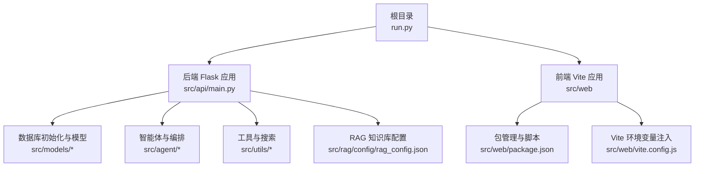
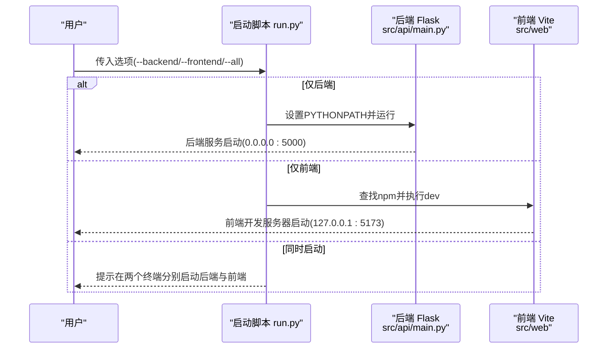
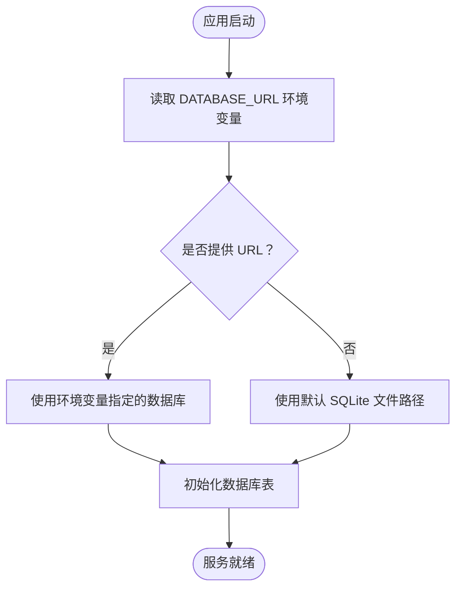
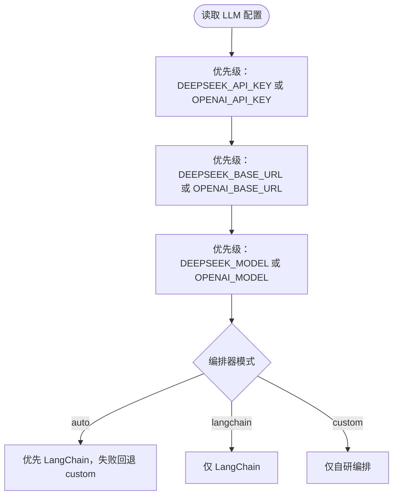
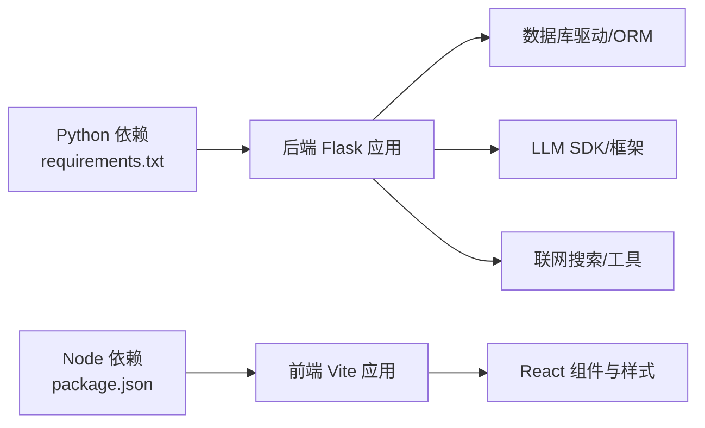

# 环境配置

<cite>
**本文引用的文件**
- [README.md](file://README.md)
- [run.py](file://run.py)
- [requirements.txt](file://requirements.txt)
- [src/api/main.py](file://src/api/main.py)
- [src/models/__init__.py](file://src/models/__init__.py)
- [src/models/database.py](file://src/models/database.py)
- [src/agent/README.md](file://src/agent/README.md)
- [src/agent/decision_agent.py](file://src/agent/decision_agent.py)
- [src/agent/langchain_orchestrator.py](file://src/agent/langchain_orchestrator.py)
- [src/utils/jwt_utils.py](file://src/utils/jwt_utils.py)
- [src/utils/web_search.py](file://src/utils/web_search.py)
- [src/web/package.json](file://src/web/package.json)
- [src/web/vite.config.js](file://src/web/vite.config.js)
- [.env.example](file://.env.example)
- [.env](file://.env)
- [src/rag/config/rag_config.json](file://src/rag/config/rag_config.json)
</cite>

## 目录
1. [简介](#简介)
2. [项目结构](#项目结构)
3. [核心组件](#核心组件)
4. [架构总览](#架构总览)
5. [详细组件分析](#详细组件分析)
6. [依赖关系分析](#依赖关系分析)
7. [性能考虑](#性能考虑)
8. [故障排查指南](#故障排查指南)
9. [结论](#结论)
10. [附录](#附录)

## 简介
本指南面向首次部署与运行 AI 投资分析系统的用户，提供从零开始的环境准备、依赖安装、配置与启动的完整流程。重点涵盖：
- 环境变量配置：数据库连接、API 密钥、LLM 服务、编排器模式等
- Python 虚拟环境创建与依赖安装
- Node.js 与前端依赖配置
- 不同操作系统（Windows、Linux、macOS）的差异与注意事项
- 最佳实践与安全建议

## 项目结构
该系统采用“后端 Flask + 前端 React/Vite”的双端分离架构，并通过统一的启动脚本进行快速启动。

图表来源
- [run.py](file://run.py#L1-L60)
- [src/api/main.py](file://src/api/main.py#L1-L243)
- [src/models/__init__.py](file://src/models/__init__.py#L1-L32)
- [src/rag/config/rag_config.json](file://src/rag/config/rag_config.json#L1-L58)
- [src/web/package.json](file://src/web/package.json#L1-L33)
- [src/web/vite.config.js](file://src/web/vite.config.js#L1-L14)

章节来源
- [README.md](file://README.md#L24-L47)
- [run.py](file://run.py#L1-L60)

## 核心组件
- 后端服务入口与运行参数：Flask 应用通过环境变量控制调试模式与热重载，监听 0.0.0.0:5000。
- 数据库初始化：通过环境变量 DATABASE_URL 指定数据库连接，默认使用 SQLite 文件数据库。
- LLM 与编排器：支持多种大模型供应商（OpenAI、DeepSeek、Zhipu、Gemini、HuggingFace），并通过环境变量切换编排器模式。
- 前端开发服务器：通过 npm 启动 Vite 开发服务器，监听 127.0.0.1:5173。
- 环境变量：提供示例与实际配置文件，便于在不同环境中切换。

章节来源
- [src/api/main.py](file://src/api/main.py#L238-L243)
- [src/models/__init__.py](file://src/models/__init__.py#L14-L22)
- [src/agent/README.md](file://src/agent/README.md#L40-L45)
- [run.py](file://run.py#L8-L32)
- [.env.example](file://.env.example#L1-L19)
- [.env](file://.env#L1-L41)

## 架构总览
系统启动流程分为两类：仅后端、仅前端；以及同时启动（需两个终端）。后端通过 run.py 设置 PYTHONPATH 并调用 Flask 入口；前端通过 run.py 查找 npm 并执行开发脚本。

图表来源
- [run.py](file://run.py#L35-L56)
- [src/api/main.py](file://src/api/main.py#L238-L243)
- [src/web/package.json](file://src/web/package.json#L6-L11)

章节来源
- [run.py](file://run.py#L35-L56)
- [README.md](file://README.md#L66-L96)

## 详细组件分析

### 环境变量与配置文件
- 示例配置：.env.example 展示了 JWT、OpenAI/DeepSeek、编排器模式、数据库 URL 等关键键名。
- 实际配置：.env 提供更丰富的模型与服务配置，包含温度、上下文压缩、数据库与 MySQL URL 等。
- 前端注入：Vite 通过 loadEnv 加载 .env 中的 GEMINI_API_KEY，并将其注入到构建产物中。

章节来源
- [.env.example](file://.env.example#L1-L19)
- [.env](file://.env#L1-L41)
- [src/web/vite.config.js](file://src/web/vite.config.js#L1-L14)

### 数据库配置
- 默认 SQLite：sqlite:///ai_investment.db
- 可通过 DATABASE_URL 覆盖，支持 MySQL（示例使用 mysql+pymysql 协议）
- 初始化：init_db 在启动时创建所有表

图表来源
- [src/models/__init__.py](file://src/models/__init__.py#L14-L22)
- [src/models/database.py](file://src/models/database.py#L1-L86)

章节来源
- [README.md](file://README.md#L99-L112)
- [src/models/__init__.py](file://src/models/__init__.py#L14-L22)
- [src/models/database.py](file://src/models/database.py#L1-L86)

### LLM 与编排器配置
- 支持多供应商：OpenAI、DeepSeek、Zhipu、Gemini、HuggingFace
- 编排器模式：auto（优先 LangChain，失败回退）、langchain（强制 LangChain）、custom（仅自研）
- 环境变量键：OPENAI_*、DEEPSEEK_*、ZHIPU_*、GEMINI_*、HUGGINGFACE_*、AGENT_ORCHESTRATOR 等

图表来源
- [src/agent/decision_agent.py](file://src/agent/decision_agent.py#L52-L77)
- [src/agent/langchain_orchestrator.py](file://src/agent/langchain_orchestrator.py#L109-L121)
- [src/agent/README.md](file://src/agent/README.md#L40-L45)

章节来源
- [src/agent/README.md](file://src/agent/README.md#L40-L45)
- [src/agent/decision_agent.py](file://src/agent/decision_agent.py#L52-L77)
- [src/agent/langchain_orchestrator.py](file://src/agent/langchain_orchestrator.py#L109-L121)

### JWT 与安全
- JWT 密钥来自环境变量 JWT_SECRET_KEY，默认值仅用于开发
- 建议生产环境替换为强随机密钥并妥善保管

章节来源
- [src/utils/jwt_utils.py](file://src/utils/jwt_utils.py#L13-L15)
- [README.md](file://README.md#L113-L117)

### 前端与 Node.js 环境
- Node.js 版本要求：18+
- npm 版本要求：9+
- 启动方式：run.py 会检测 npm 并执行 npm run dev
- 包管理：package.json 定义依赖与脚本

章节来源
- [README.md](file://README.md#L42-L47)
- [run.py](file://run.py#L20-L32)
- [src/web/package.json](file://src/web/package.json#L1-L33)

### RAG 知识库配置
- 数据目录：raw、clean、chunks
- 索引目录：index/chroma
- 嵌入模型与重排序模型、缓存 TTL、混合检索参数等均在 rag_config.json 中定义

章节来源
- [src/rag/config/rag_config.json](file://src/rag/config/rag_config.json#L1-L58)

## 依赖关系分析
- 后端依赖：requests、lxml、beautifulsoup4、feedparser、sqlalchemy、pymysql、cryptography、pandas、numpy、aiohttp、akshare、openai、langchain、chromadb、sentence-transformers、ddgs、flask、flask-cors、pyjwt 等
- 前端依赖：react、react-dom、recharts、vite、tailwindcss、eslint 等

图表来源
- [requirements.txt](file://requirements.txt#L1-L41)
- [src/web/package.json](file://src/web/package.json#L12-L31)

章节来源
- [requirements.txt](file://requirements.txt#L1-L41)
- [src/web/package.json](file://src/web/package.json#L12-L31)

## 性能考虑
- 数据库连接：优先使用本地 SQLite 进行开发，生产建议使用高性能 MySQL 并配置连接池
- LLM 调用：合理设置温度与最大令牌数，避免过长上下文导致延迟增加
- 编排器：auto 模式可在 LangChain 不可用时自动回退，提升稳定性
- 前端：开发阶段启用热更新，生产构建使用最小化与缓存策略

## 故障排查指南
- 后端模块导入错误：确保在项目根目录执行启动命令，run.py 会设置 PYTHONPATH
- 前端无法启动：确认已安装 Node.js 与 npm，并在 src/web 目录执行 npm install
- 股票或新闻数据异常：检查网络状态与数据源可用性
- RAG 检索效果不佳：先重新构建索引并检查知识库数据目录

章节来源
- [README.md](file://README.md#L205-L210)

## 结论
通过本指南，您可以在 Windows、Linux、macOS 上完成环境准备、依赖安装与系统启动。建议在生产环境替换默认密钥、使用专用数据库与稳定的 LLM 服务，并根据业务需求调整编排器模式与检索参数。

## 附录

### 环境变量清单与用途
- JWT_SECRET_KEY：JWT 密钥（生产必须替换）
- OPENAI_* / DEEPSEEK_* / ZHIPU_* / GEMINI_* / HUGGINGFACE_*：各 LLM 供应商的 API Key、Base URL、Model 名称
- AGENT_ORCHESTRATOR：编排器模式（auto/langchain/custom）
- DATABASE_URL：数据库连接 URL（默认 sqlite）
- FLASK_DEBUG / FLASK_USE_RELOADER：Flask 调试与热重载
- LOG_LEVEL：日志级别
- DDGS_DISABLE_PROXY / DDGS_REGION：联网搜索代理与区域
- 其他：上下文压缩、模型参数、MySQL URL 等

章节来源
- [.env.example](file://.env.example#L1-L19)
- [.env](file://.env#L1-L41)
- [src/api/main.py](file://src/api/main.py#L31-L46)
- [src/utils/web_search.py](file://src/utils/web_search.py#L63-L64)
- [src/agent/README.md](file://src/agent/README.md#L40-L45)

### 操作系统差异与注意事项
- Windows
  - 使用 set 或 PowerShell $env: 语法设置环境变量
  - 注意路径分隔符与大小写敏感性
- Linux/macOS
  - 使用 export 设置环境变量
  - 注意 shell 类型（bash/zsh）与配置文件位置（~/.bashrc、~/.zshrc）
- 通用
  - 建议使用 Python 虚拟环境隔离依赖
  - 前端开发前在 src/web 目录执行 npm install

章节来源
- [README.md](file://README.md#L111-L112)

### 安全与最佳实践
- 生产环境必须设置强随机 JWT_SECRET_KEY
- 将 API Key 存储在受控环境变量中，避免硬编码
- 限制数据库访问权限，使用专用账号与最小权限原则
- 对外暴露的服务应启用 HTTPS 与访问控制
- 定期轮换密钥与升级依赖版本