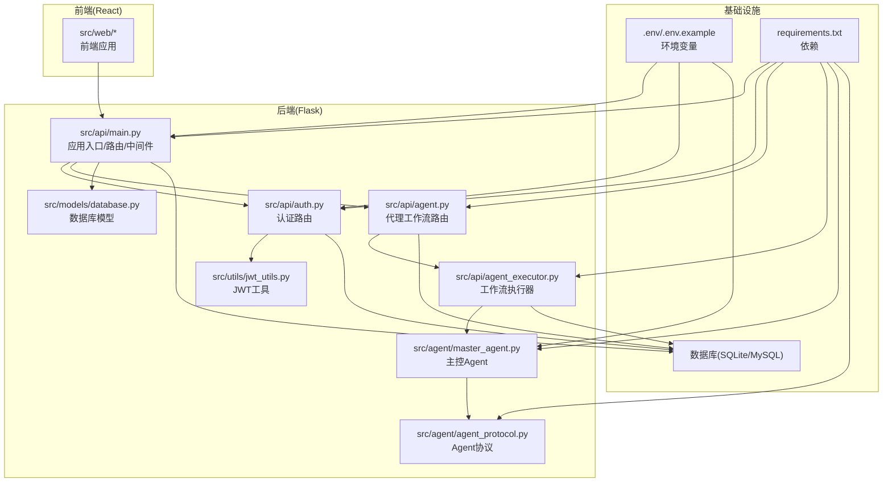
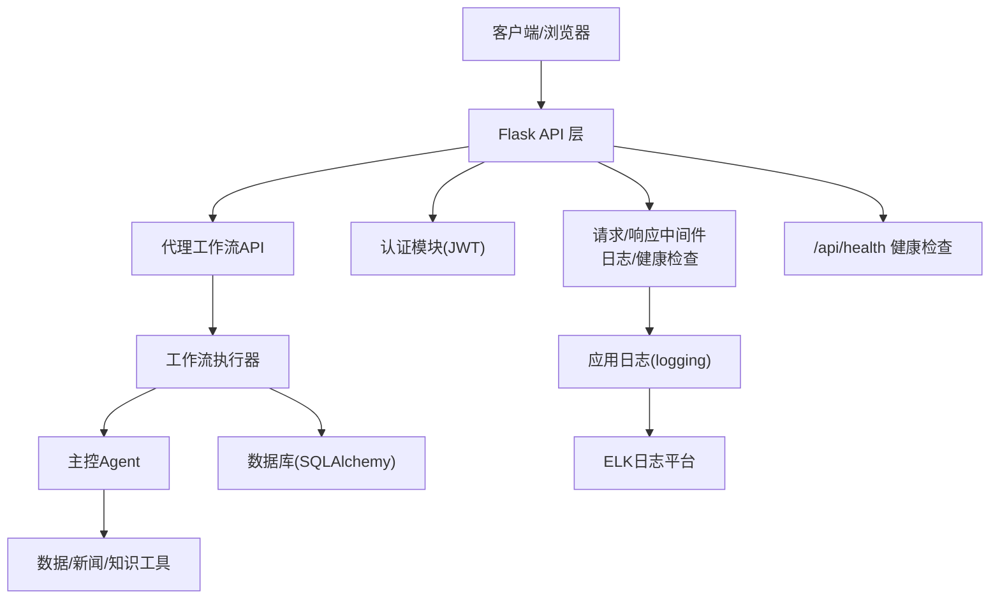
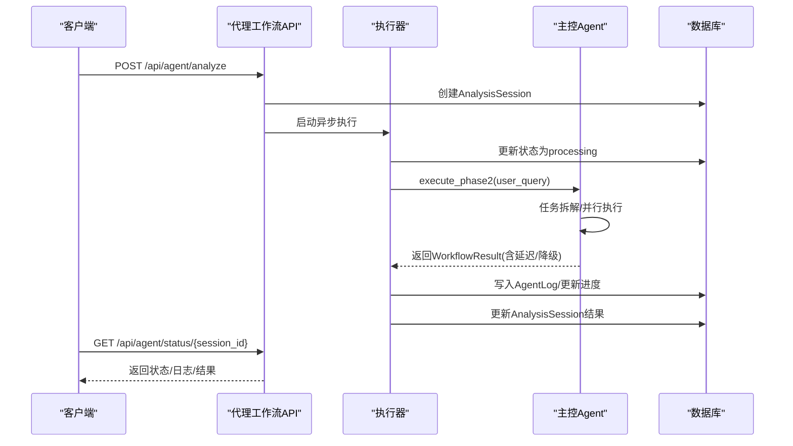
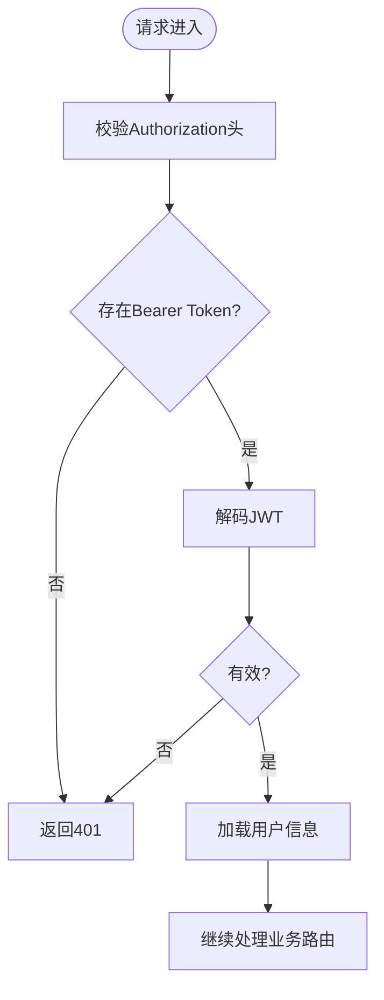
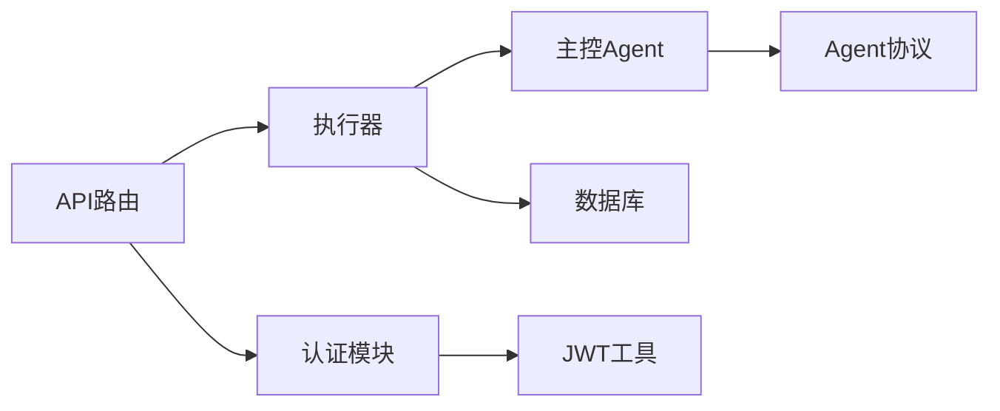

# 监控与日志

<cite>
**本文档引用的文件**
- [run.py](file://run.py)
- [src/api/main.py](file://src/api/main.py)
- [src/models/database.py](file://src/models/database.py)
- [requirements.txt](file://requirements.txt)
- [.env.example](file://.env.example)
- [src/api/agent.py](file://src/api/agent.py)
- [src/api/auth.py](file://src/api/auth.py)
- [src/utils/jwt_utils.py](file://src/utils/jwt_utils.py)
- [src/agent/master_agent.py](file://src/agent/master_agent.py)
- [src/agent/agent_protocol.py](file://src/agent/agent_protocol.py)
- [src/api/agent_executor.py](file://src/api/agent_executor.py)
- [README.md](file://README.md)
- [DESIGN.md](file://DESIGN.md)
</cite>

## 目录
1. [简介](#简介)
2. [项目结构](#项目结构)
3. [核心组件](#核心组件)
4. [架构总览](#架构总览)
5. [详细组件分析](#详细组件分析)
6. [依赖关系分析](#依赖关系分析)
7. [性能考量](#性能考量)
8. [故障排查指南](#故障排查指南)
9. [结论](#结论)
10. [附录](#附录)

## 简介
本指南聚焦于系统监控与日志管理，围绕应用性能监控指标（API响应时间、内存使用率、CPU负载、数据库连接数等）、日志级别与轮转、错误追踪机制，以及Prometheus指标采集、Grafana仪表板配置、ELK日志分析平台集成方案展开。同时提供告警规则配置思路、健康检查接口说明与性能基准测试方法，帮助实现可观测性与可维护性。

## 项目结构
后端基于Flask提供REST API，包含认证、代理工作流、股票与新闻等业务路由；前端为React应用；数据库采用SQLAlchemy与SQLite/MySQL；日志通过Python标准库logging实现；JWT用于鉴权；Agent编排层支持多Agent协同与降级输出。

图表来源
- [src/api/main.py](file://src/api/main.py#L40-L90)
- [src/api/auth.py](file://src/api/auth.py#L1-L136)
- [src/api/agent.py](file://src/api/agent.py#L1-L208)
- [src/models/database.py](file://src/models/database.py#L1-L86)
- [src/utils/jwt_utils.py](file://src/utils/jwt_utils.py#L1-L36)
- [src/api/agent_executor.py](file://src/api/agent_executor.py#L173-L210)
- [src/agent/master_agent.py](file://src/agent/master_agent.py#L1-L351)
- [src/agent/agent_protocol.py](file://src/agent/agent_protocol.py#L1-L116)

章节来源
- [README.md](file://README.md#L1-L215)
- [run.py](file://run.py#L1-L60)

## 核心组件
- 应用入口与中间件：创建Flask应用、注册蓝图、健康检查、请求日志与异常处理。
- 认证与鉴权：JWT生成与校验、用户信息获取。
- 代理工作流：会话管理、状态查询、日志持久化。
- 数据库模型：用户、聊天历史、分析会话、Agent日志。
- Agent编排：统一协议、任务计划、降级输出与延迟统计。
- 日志与环境：日志级别配置、日志格式、环境变量。

章节来源
- [src/api/main.py](file://src/api/main.py#L40-L90)
- [src/api/auth.py](file://src/api/auth.py#L1-L136)
- [src/api/agent.py](file://src/api/agent.py#L1-L208)
- [src/models/database.py](file://src/models/database.py#L24-L86)
- [src/agent/agent_protocol.py](file://src/agent/agent_protocol.py#L1-L116)

## 架构总览
下图展示了监控与日志在系统中的位置与交互：

图表来源
- [src/api/main.py](file://src/api/main.py#L64-L83)
- [src/api/auth.py](file://src/api/auth.py#L121-L136)
- [src/api/agent.py](file://src/api/agent.py#L111-L168)
- [src/api/agent_executor.py](file://src/api/agent_executor.py#L173-L210)
- [src/agent/master_agent.py](file://src/agent/master_agent.py#L155-L318)

## 详细组件分析

### 1) 应用性能监控指标
- API响应时间
  - 实现：在请求进入与离开时记录时间戳，计算毫秒级耗时并写入日志。
  - 指标用途：衡量接口吞吐与延迟，辅助容量规划与性能优化。
  - 代码参考：[请求中间件与日志](file://src/api/main.py#L68-L83)

- 内存使用率与CPU负载
  - 当前实现：未内置指标导出。
  - 建议：结合操作系统监控工具或第三方库（如psutil）在进程侧采集并上报Prometheus。

- 数据库连接数
  - 当前实现：未内置指标导出。
  - 建议：通过SQLAlchemy事件钩子或数据库驱动监控连接池状态，上报连接数、等待时间等指标。

- 业务指标（可扩展）
  - 工作流成功率、平均耗时、Agent节点延迟、会话进度等。
  - 代码参考：[Agent协议与延迟统计](file://src/agent/agent_protocol.py#L74-L116)、[主控Agent延迟统计](file://src/agent/master_agent.py#L200-L307)

章节来源
- [src/api/main.py](file://src/api/main.py#L68-L83)
- [src/agent/agent_protocol.py](file://src/agent/agent_protocol.py#L74-L116)
- [src/agent/master_agent.py](file://src/agent/master_agent.py#L200-L307)

### 2) 日志级别设置与日志轮转
- 日志级别
  - 通过环境变量设置，默认INFO；可调整为DEBUG/INFO/WARNING/ERROR/CRITICAL。
  - 代码参考：[日志级别配置](file://src/api/main.py#L31-L37)

- 日志格式
  - 标准格式包含时间、模块名、级别与消息。
  - 代码参考：[日志格式配置](file://src/api/main.py#L32-L36)

- 日志轮转
  - 当前未集成轮转配置。
  - 建议：使用Python标准库RotatingFileHandler或第三方库（如watchtower）对接云日志服务。

- 错误追踪
  - 500错误统一捕获并记录异常堆栈。
  - 代码参考：[异常处理](file://src/api/main.py#L226-L229)

章节来源
- [src/api/main.py](file://src/api/main.py#L31-L37)
- [src/api/main.py](file://src/api/main.py#L226-L229)

### 3) 健康检查接口
- 路由：GET /api/health
- 返回：{"status":"ok"}
- 作用：容器编排与负载均衡探活。

章节来源
- [src/api/main.py](file://src/api/main.py#L64-L66)

### 4) 代理工作流与状态追踪
- 会话管理
  - 创建会话、记录状态与进度，支持查询与列表。
  - 代码参考：[会话查询](file://src/api/agent.py#L111-L168)、[会话列表](file://src/api/agent.py#L171-L208)

- 日志持久化
  - 将Agent执行步骤、状态、进度与消息写入数据库。
  - 代码参考：[Agent日志模型](file://src/models/database.py#L73-L86)

- 执行器
  - 异步执行工作流，更新会话状态与错误信息。
  - 代码参考：[执行器状态更新](file://src/api/agent_executor.py#L173-L210)

- 主控Agent与协议
  - 统一Agent输入输出协议，记录延迟与降级状态。
  - 代码参考：[Agent协议](file://src/agent/agent_protocol.py#L74-L116)、[主控Agent执行](file://src/agent/master_agent.py#L155-L318)

图表来源
- [src/api/agent.py](file://src/api/agent.py#L20-L64)
- [src/api/agent_executor.py](file://src/api/agent_executor.py#L173-L210)
- [src/agent/master_agent.py](file://src/agent/master_agent.py#L155-L318)
- [src/models/database.py](file://src/models/database.py#L53-L86)

章节来源
- [src/api/agent.py](file://src/api/agent.py#L20-L64)
- [src/api/agent.py](file://src/api/agent.py#L111-L168)
- [src/api/agent.py](file://src/api/agent.py#L171-L208)
- [src/api/agent_executor.py](file://src/api/agent_executor.py#L173-L210)
- [src/models/database.py](file://src/models/database.py#L53-L86)
- [src/agent/master_agent.py](file://src/agent/master_agent.py#L155-L318)
- [src/agent/agent_protocol.py](file://src/agent/agent_protocol.py#L74-L116)

### 5) 认证与鉴权日志
- JWT签发与校验，失败时返回401。
- 代码参考：[登录/注册](file://src/api/auth.py#L78-L118)、[获取当前用户](file://src/api/auth.py#L121-L136)、[JWT工具](file://src/utils/jwt_utils.py#L18-L36)

图表来源
- [src/api/auth.py](file://src/api/auth.py#L121-L136)
- [src/utils/jwt_utils.py](file://src/utils/jwt_utils.py#L29-L36)

章节来源
- [src/api/auth.py](file://src/api/auth.py#L78-L118)
- [src/api/auth.py](file://src/api/auth.py#L121-L136)
- [src/utils/jwt_utils.py](file://src/utils/jwt_utils.py#L18-L36)

## 依赖关系分析
- 组件耦合
  - API层依赖认证模块与工作流执行器；执行器依赖主控Agent与数据库；主控Agent依赖工具与协议。
- 外部依赖
  - Flask、SQLAlchemy、PyJWT、OpenAI/LangChain（可选）等。

图表来源
- [src/api/main.py](file://src/api/main.py#L22-L56)
- [src/api/auth.py](file://src/api/auth.py#L8-L15)
- [src/api/agent.py](file://src/api/agent.py#L8-L17)
- [src/api/agent_executor.py](file://src/api/agent_executor.py#L1-L20)
- [src/agent/master_agent.py](file://src/agent/master_agent.py#L14-L22)
- [src/agent/agent_protocol.py](file://src/agent/agent_protocol.py#L1-L14)
- [src/utils/jwt_utils.py](file://src/utils/jwt_utils.py#L8-L13)

章节来源
- [src/api/main.py](file://src/api/main.py#L22-L56)
- [src/api/auth.py](file://src/api/auth.py#L8-L15)
- [src/api/agent.py](file://src/api/agent.py#L8-L17)
- [src/api/agent_executor.py](file://src/api/agent_executor.py#L1-L20)
- [src/agent/master_agent.py](file://src/agent/master_agent.py#L14-L22)
- [src/agent/agent_protocol.py](file://src/agent/agent_protocol.py#L1-L14)
- [src/utils/jwt_utils.py](file://src/utils/jwt_utils.py#L8-L13)

## 性能考量
- 请求耗时统计
  - 已内置毫秒级耗时记录，可用于性能基线与回归分析。
  - 代码参考：[请求耗时计算](file://src/api/main.py#L68-L83)

- 工作流延迟
  - 主控Agent对各Agent节点进行延迟统计，便于定位瓶颈。
  - 代码参考：[延迟统计](file://src/agent/master_agent.py#L200-L307)

- 数据库性能
  - 建议：为高频查询字段建立索引（如用户ID、会话ID、创建时间）；使用连接池与事务批量提交。
  - 代码参考：[模型索引](file://src/models/database.py#L29-L37)

- 并发与异步
  - 工作流通过线程异步执行，注意线程安全与异常回滚。
  - 代码参考：[异步执行](file://src/api/agent.py#L50-L64)

- 建议的性能基准测试方法
  - 基准场景：单接口吞吐、并发用户数、数据库写入压力、工作流端到端耗时。
  - 工具：Locust/JMeter/自定义脚本。
  - 指标：P50/P95/P99延迟、错误率、吞吐量、资源占用。

章节来源
- [src/api/main.py](file://src/api/main.py#L68-L83)
- [src/agent/master_agent.py](file://src/agent/master_agent.py#L200-L307)
- [src/models/database.py](file://src/models/database.py#L29-L37)
- [src/api/agent.py](file://src/api/agent.py#L50-L64)

## 故障排查指南
- 健康检查
  - 访问 /api/health 确认服务存活。
  - 代码参考：[健康检查](file://src/api/main.py#L64-L66)

- 认证失败
  - 检查Authorization头是否为Bearer Token；核对JWT密钥与过期时间。
  - 代码参考：[获取当前用户](file://src/api/auth.py#L121-L136)、[JWT工具](file://src/utils/jwt_utils.py#L18-L36)

- 工作流异常
  - 查看会话状态与Agent日志，定位失败节点与错误信息。
  - 代码参考：[状态查询](file://src/api/agent.py#L111-L168)、[日志模型](file://src/models/database.py#L73-L86)

- 数据库问题
  - 检查连接字符串与权限；确认表结构与索引。
  - 代码参考：[数据库模型](file://src/models/database.py#L24-L86)

- 日志定位
  - 设置更高日志级别（DEBUG）以获取详细信息；检查日志输出位置。
  - 代码参考：[日志级别配置](file://src/api/main.py#L31-L37)

章节来源
- [src/api/main.py](file://src/api/main.py#L64-L66)
- [src/api/auth.py](file://src/api/auth.py#L121-L136)
- [src/utils/jwt_utils.py](file://src/utils/jwt_utils.py#L18-L36)
- [src/api/agent.py](file://src/api/agent.py#L111-L168)
- [src/models/database.py](file://src/models/database.py#L73-L86)
- [src/models/database.py](file://src/models/database.py#L24-L86)
- [src/api/main.py](file://src/api/main.py#L31-L37)

## 结论
本项目已具备基础的请求耗时统计、健康检查与工作流状态追踪能力。为进一步完善可观测性，建议补充：
- Prometheus指标采集（响应时间、数据库连接数、业务指标）
- Grafana仪表板与告警规则
- ELK日志平台接入与轮转
- 性能基准测试与容量规划

## 附录

### A. 环境变量与配置
- JWT密钥、数据库URL、Agent编排器模式等。
- 代码参考：[示例环境变量](file://.env.example#L1-L19)、[JWT工具](file://src/utils/jwt_utils.py#L13-L15)

章节来源
- [.env.example](file://.env.example#L1-L19)
- [src/utils/jwt_utils.py](file://src/utils/jwt_utils.py#L13-L15)

### B. 依赖清单
- Flask、SQLAlchemy、PyJWT、LangChain/OpenAI、ChromaDB、pandas/numpy、aiohttp等。
- 代码参考：[依赖清单](file://requirements.txt#L1-L41)

章节来源
- [requirements.txt](file://requirements.txt#L1-L41)

### C. 启动与运行
- 后端启动入口与前后端启动脚本。
- 代码参考：[启动器](file://run.py#L8-L56)、[API入口](file://src/api/main.py#L238-L243)

章节来源
- [run.py](file://run.py#L8-L56)
- [src/api/main.py](file://src/api/main.py#L238-L243)