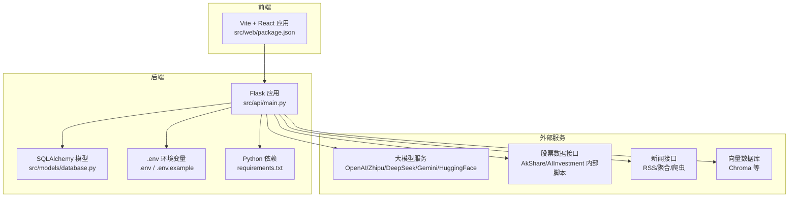
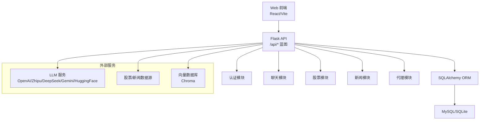
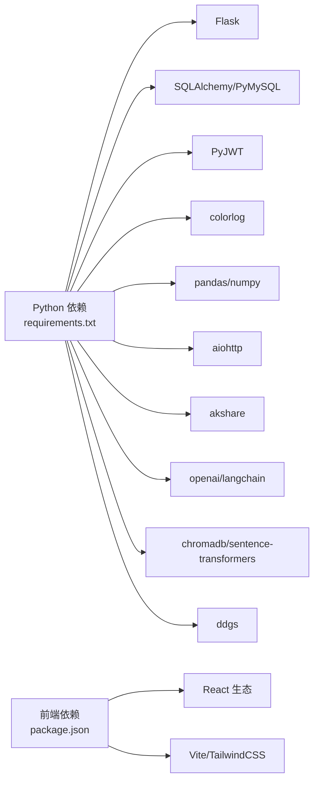

# 部署与运维

<cite>
**本文引用的文件**
- [run.py](file://run.py)
- [DESIGN.md](file://DESIGN.md)
- [.env.example](file://.env.example)
- [.env](file://.env)
- [requirements.txt](file://requirements.txt)
- [src/api/main.py](file://src/api/main.py)
- [src/models/database.py](file://src/models/database.py)
- [src/web/package.json](file://src/web/package.json)
</cite>

## 目录
1. [简介](#简介)
2. [项目结构](#项目结构)
3. [核心组件](#核心组件)
4. [架构总览](#架构总览)
5. [详细组件分析](#详细组件分析)
6. [依赖关系分析](#依赖关系分析)
7. [性能考量](#性能考量)
8. [故障排除指南](#故障排除指南)
9. [结论](#结论)
10. [附录](#附录)

## 简介
本指南面向将 AI 投资分析系统部署到生产环境的工程师与运维人员，围绕部署配置、容器化与编排、监控与日志、故障排除以及版本与发布流程展开。系统采用 Python + Flask 后端、React 前端、SQLAlchemy 数据模型与多种外部服务（LLM、股票/新闻数据、向量数据库）。部署目标是在保证安全性、稳定性与可观测性的前提下，实现可扩展、可回滚、可灰度的线上交付。

## 项目结构
- 后端 API：基于 Flask，提供认证、聊天、股票、新闻与代理相关接口，并内置健康检查与请求日志。
- 前端：基于 Vite + React 的 Web 应用，提供仪表盘与交互界面。
- 数据层：使用 SQLAlchemy 建模，包含用户、聊天历史、分析会话与 Agent 执行日志等表。
- 配置与依赖：通过 .env 文件集中管理密钥与服务地址，requirements.txt 管理 Python 依赖。
- 启动器：run.py 提供统一的启动入口，支持分别启动后端与前端。

图表来源
- [src/api/main.py](file://src/api/main.py#L40-L235)
- [src/models/database.py](file://src/models/database.py#L24-L86)
- [.env.example](file://.env.example#L1-L19)
- [.env](file://.env#L1-L41)
- [requirements.txt](file://requirements.txt#L1-L41)
- [src/web/package.json](file://src/web/package.json#L1-L33)

章节来源
- [run.py](file://run.py#L1-L60)
- [DESIGN.md](file://DESIGN.md#L1-L191)

## 核心组件
- Flask API 主应用：提供认证、聊天、股票、新闻与代理接口蓝图，内置健康检查、请求耗时日志与错误处理。
- 数据模型：用户、聊天历史、分析会话、Agent 执行日志，支撑用户态与分析过程的持久化。
- 启动器：run.py 统一入口，支持后端与前端分别启动，便于开发与调试。
- 前端：Vite 构建产物，生产环境可由 Nginx 或静态托管提供。
- 配置：.env/.env.example 管理 JWT、LLM 与数据库连接等关键参数。

章节来源
- [src/api/main.py](file://src/api/main.py#L40-L235)
- [src/models/database.py](file://src/models/database.py#L24-L86)
- [run.py](file://run.py#L35-L60)
- [src/web/package.json](file://src/web/package.json#L1-L33)
- [.env.example](file://.env.example#L1-L19)
- [.env](file://.env#L1-L41)

## 架构总览
系统采用“前端 + 后端 API + 外部服务”的三层架构。后端通过蓝图组织功能域，数据库用于用户与分析过程数据存储，外部服务包括 LLM、股票/新闻数据与向量数据库。整体工作流强调“任务分解 + 多 Agent 协同 + RAG 知识增强”。

图表来源
- [src/api/main.py](file://src/api/main.py#L52-L56)
- [src/models/database.py](file://src/models/database.py#L24-L86)
- [DESIGN.md](file://DESIGN.md#L94-L129)

## 详细组件分析

### 部署配置清单
- 环境变量
  - JWT 密钥：用于签发与校验令牌，生产环境必须随机且保密。
  - LLM 适配：支持 OpenAI、DeepSeek、Zhipu、Gemini、HuggingFace 等，需配置对应 API Key、Base URL 与 Model。
  - 编排器模式：可选 auto/langchain/custom，影响代理执行策略。
  - 数据库：支持 SQLite 与 MySQL，生产建议使用 MySQL 并配置连接池与只读副本。
- 日志级别：通过 LOG_LEVEL 控制，建议生产设为 INFO 或更高。
- Flask 运行参数：host、port、debug、use_reloader 由环境变量控制，生产禁用自动重载与调试。

章节来源
- [.env.example](file://.env.example#L1-L19)
- [.env](file://.env#L1-L41)
- [src/api/main.py](file://src/api/main.py#L31-L47)
- [src/api/main.py](file://src/api/main.py#L240-L243)

### 数据库配置与迁移
- 模型定义：用户、聊天历史、分析会话、Agent 执行日志。
- 连接字符串：支持 SQLite 与 MySQL，生产环境建议使用 MySQL 并启用 SSL、连接池与只读副本。
- 初始化：应用启动时初始化数据库并注册蓝图，确保表存在。

章节来源
- [src/models/database.py](file://src/models/database.py#L24-L86)
- [src/api/main.py](file://src/api/main.py#L50-L50)

### 安全配置
- 认证与授权：后端提供认证蓝图与当前用户获取逻辑，建议在生产中启用 HTTPS、强密码策略与速率限制。
- 令牌管理：JWT 密钥需定期轮换，建议使用密钥管理服务（KMS）。
- CORS：开发默认开启，生产需限定来源与方法。

章节来源
- [src/api/main.py](file://src/api/main.py#L24-L29)
- [src/api/main.py](file://src/api/main.py#L43-L43)

### 性能调优
- 日志与监控：内置请求耗时日志，建议接入结构化日志与指标系统（如 Prometheus/OpenTelemetry）。
- LLM 调用：启用上下文压缩与摘要阈值，控制温度与最大 Token，避免过度消耗。
- 数据访问：使用连接池、索引优化与只读副本，减少热点查询压力。
- 前端构建：生产构建产物交由静态服务器提供，启用 gzip/HTTP2/CDN。

章节来源
- [.env](file://.env#L34-L37)
- [src/api/main.py](file://src/api/main.py#L68-L83)
- [src/web/package.json](file://src/web/package.json#L8-L8)

### 容器化与编排
- Docker 镜像
  - 基础镜像：使用官方 Python 运行时，安装系统依赖与 Python 包。
  - 工作目录：设置项目根目录，复制 requirements.txt 并安装依赖。
  - 健康检查：暴露 /api/health，返回状态码 200。
  - 端口：映射 5000。
  - 环境变量：通过 .env 注入，生产使用密钥管理服务注入敏感参数。
- Kubernetes 部署
  - Deployment：副本数、滚动更新策略、就绪/存活探针。
  - Service：ClusterIP/LoadBalancer，暴露 5000 端口。
  - ConfigMap：存放非敏感配置（如 LOG_LEVEL、AGENT_ORCHESTRATOR）。
  - Secret：存放 JWT 密钥、数据库密码、LLM API Key。
  - Ingress/NLB：前置负载均衡，启用 TLS 与 WAF。
- 负载均衡
  - 前置 Nginx/ALB：静态资源直出、HTTPS 终止、限流与健康检查。
  - 后端：多实例水平扩展，配合数据库只读副本与缓存层。

章节来源
- [requirements.txt](file://requirements.txt#L1-L41)
- [src/api/main.py](file://src/api/main.py#L64-L66)
- [src/api/main.py](file://src/api/main.py#L240-L243)

### 监控与日志
- 应用监控
  - 健康检查：/api/health，返回 ok。
  - 指标：请求总量、错误率、P95/P99 延迟、LLM 调用次数与费用估算。
  - 告警：阈值触发（错误率、延迟、资源使用率）。
- 日志管理
  - 结构化日志：包含时间戳、级别、模块、请求 ID、路径、状态码、耗时。
  - 分层：应用日志、访问日志、错误日志分离存储与轮转。
  - 集中化：ELK/ECS/Cloud Logging 收集与检索。
- 错误追踪
  - 异常捕获：全局错误处理器记录异常堆栈。
  - 链路追踪：为关键请求生成 trace_id，贯穿前端、API、外部服务。

章节来源
- [src/api/main.py](file://src/api/main.py#L64-L66)
- [src/api/main.py](file://src/api/main.py#L222-L234)
- [src/api/main.py](file://src/api/main.py#L228-L228)

### 故障排除手册
- 常见问题
  - 404：资源不存在，检查路由与权限。
  - 401：未授权，检查 JWT 令牌与签名密钥。
  - 500：服务器内部错误，查看异常日志与堆栈。
  - 数据库连接失败：核对 DATABASE_URL、网络连通性与凭据。
  - LLM 调用失败：检查 API Key、Base URL 与网络代理。
- 性能瓶颈
  - CPU/内存：排查慢查询、未释放的外部连接、LLM 调用阻塞。
  - 网络：外部 API 延迟与限流，引入重试与熔断。
  - 存储：索引缺失导致查询缓慢，补充必要索引。
- 应急响应
  - 快速降级：关闭非关键功能（如新闻/知识库），优先保障核心分析链路。
  - 回滚：使用蓝绿/金丝雀策略回滚到上一个稳定版本。
  - 清洗：清理异常数据与缓存，重启受影响实例。

章节来源
- [src/api/main.py](file://src/api/main.py#L222-L234)
- [src/api/main.py](file://src/api/main.py#L228-L228)

### 版本管理与发布流程
- CI/CD
  - 触发：push/tag 触发流水线，分支策略（main/release/hotfix）。
  - 步骤：代码检查、单元测试、构建镜像、推送仓库、部署到预发布环境、自动化测试、审批发布、部署到生产。
- 滚动更新与回滚
  - 滚动更新：逐步替换 Pod，确保最小中断。
  - 回滚：记录版本号与镜像标签，一键回滚。
- 发布策略
  - 灰度发布：按百分比流量切换，监控指标与告警。
  - 金丝雀：新版本与旧版本并行，逐步扩大流量。

章节来源
- [DESIGN.md](file://DESIGN.md#L180-L189)

## 依赖关系分析
- 后端依赖
  - Flask、Flask-CORS、PyJWT、SQLAlchemy、PyMySQL、cryptography、colorlog、pandas/numpy、aiohttp、akshare、openai、langchain、chromadb、sentence-transformers、ddgs。
- 前端依赖
  - React、React DOM、Recharts、TailwindCSS、Vite、ESLint 等。
- 外部服务
  - LLM 服务（OpenAI/Zhipu/DeepSeek/Gemini/HuggingFace）、股票/新闻数据、向量数据库（Chroma）。

图表来源
- [requirements.txt](file://requirements.txt#L1-L41)
- [src/web/package.json](file://src/web/package.json#L12-L31)

章节来源
- [requirements.txt](file://requirements.txt#L1-L41)
- [src/web/package.json](file://src/web/package.json#L1-L33)

## 性能考量
- 启动与运行
  - 生产禁用 Flask 自动重载与调试，避免额外开销。
  - 使用进程/线程池与异步客户端处理外部服务调用。
- 数据访问
  - 启用连接池，设置超时与重试；对高频查询建立索引。
- LLM 与外部 API
  - 控制上下文长度与温度，启用缓存与摘要；对失败进行指数退避重试。
- 前端
  - 生产构建，启用静态资源缓存与 CDN 加速。

章节来源
- [src/api/main.py](file://src/api/main.py#L240-L243)
- [.env](file://.env#L34-L37)
- [src/web/package.json](file://src/web/package.json#L8-L8)

## 故障排除指南
- 启动失败
  - 检查 PYTHONPATH 与后端入口文件是否存在。
  - 确认 Node.js 与 npm 可用，前端开发服务器可正常启动。
- 运行期错误
  - 查看应用日志与访问日志，定位具体路由与耗时。
  - 核对 .env 中的密钥与数据库连接串。
- 外部服务异常
  - LLM：检查 API Key、Base URL 与网络代理。
  - 股票/新闻：确认接口可用性与限流策略。
  - 向量库：验证 Chroma 数据目录与磁盘空间。

章节来源
- [run.py](file://run.py#L8-L32)
- [src/api/main.py](file://src/api/main.py#L222-L234)

## 结论
通过规范的环境变量管理、数据库与安全配置、容器化与编排、可观测性与告警体系，以及完善的 CI/CD 与回滚策略，AI 投资分析系统可在生产环境中实现稳定、可扩展与可维护的交付。建议在上线前完成压测与演练，确保在峰值流量下的 SLA 达标。

## 附录
- 启动与调试
  - 后端：python run.py --backend
  - 前端：python run.py --frontend
  - 默认启动前端开发服务器，如需同时启动需在不同终端分别执行。
- 健康检查
  - GET /api/health 返回状态码 200，表示服务健康。

章节来源
- [run.py](file://run.py#L35-L60)
- [src/api/main.py](file://src/api/main.py#L58-L66)