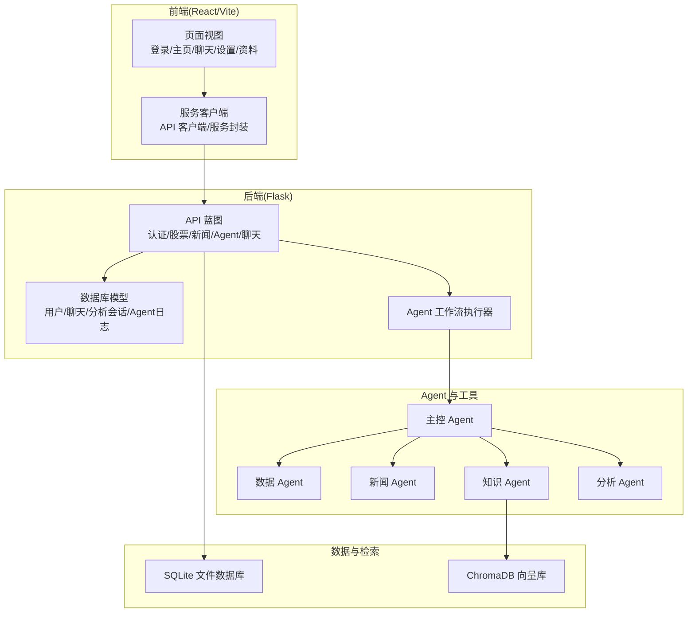
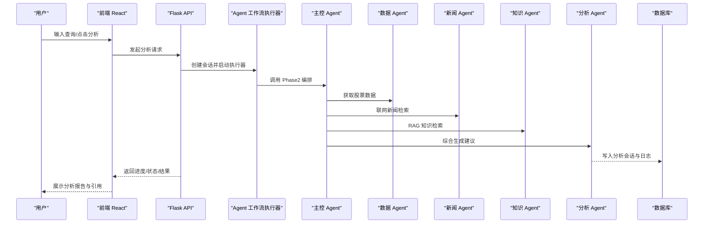
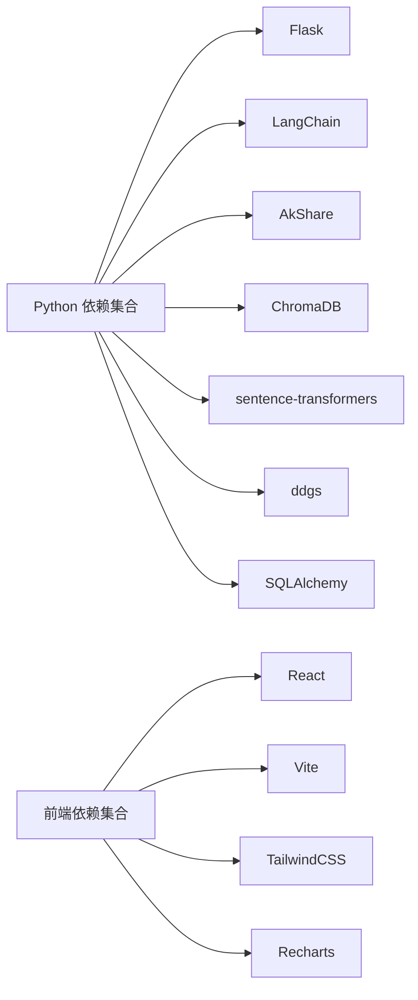

# 快速开始指南

<cite>
**本文引用的文件**
- [README.md](file://README.md)
- [requirements.txt](file://requirements.txt)
- [run.py](file://run.py)
- [.env.example](file://.env.example)
- [src/api/main.py](file://src/api/main.py)
- [src/models/database.py](file://src/models/database.py)
- [src/web/package.json](file://src/web/package.json)
- [src/web/vite.config.js](file://src/web/vite.config.js)
- [src/agent/README.md](file://src/agent/README.md)
- [src/api/agent.py](file://src/api/agent.py)
- [DESIGN.md](file://DESIGN.md)
</cite>

## 目录
1. [简介](#简介)
2. [项目结构](#项目结构)
3. [核心组件](#核心组件)
4. [架构总览](#架构总览)
5. [详细组件分析](#详细组件分析)
6. [依赖关系分析](#依赖关系分析)
7. [性能注意事项](#性能注意事项)
8. [故障排查指南](#故障排查指南)
9. [结论](#结论)
10. [附录](#附录)

## 简介
本指南面向首次接触 AI 投资分析系统的开发者与使用者，提供从环境准备、安装部署到多模式启动的完整流程，帮助你在最短时间内完成本地开发环境搭建并成功运行系统。系统采用后端 Flask + 前端 React/Vite 的双端架构，配合多 Agent 协同与 RAG 知识检索，支持股票与新闻信息聚合、对话分析与会话持久化。

## 项目结构
项目采用前后端分离与模块化设计：
- 后端：Flask 应用，提供认证、股票、新闻、Agent 工作流与聊天等 API。
- 前端：React + Vite，提供登录、分析、聊天、设置与个人资料等页面。
- Agent 与编排：多 Agent 协同分析，支持 LangChain 编排器与自研编排回退。
- 数据与检索：SQLite 默认数据库，ChromaDB + sentence-transformers 支持 RAG 索引与检索。
- 资源与脚本：RAG 索引构建脚本、股票数据抓取脚本、测试脚本等。

图表来源
- [src/api/main.py](file://src/api/main.py#L40-L56)
- [src/models/database.py](file://src/models/database.py#L24-L86)
- [src/agent/README.md](file://src/agent/README.md#L1-L59)
- [src/api/agent.py](file://src/api/agent.py#L1-L208)

章节来源
- [README.md](file://README.md#L24-L40)

## 核心组件
- 后端 Flask 应用：提供健康检查、用户认证、分析会话管理、Agent 工作流路由等。
- 前端 React 应用：提供登录、分析、聊天、设置与个人资料页面，通过服务客户端与后端交互。
- Agent 协同：主控 Agent 负责任务分解与编排，数据/新闻/知识/分析 Agent 各司其职，支持可切换编排器（LangChain 或自研）。
- 数据与检索：默认 SQLite，支持通过环境变量切换数据库；RAG 使用 ChromaDB 与 sentence-transformers。
- 启动器：run.py 提供统一启动入口，支持仅后端、仅前端、默认前端三种模式。

章节来源
- [src/api/main.py](file://src/api/main.py#L40-L56)
- [src/api/agent.py](file://src/api/agent.py#L1-L208)
- [src/agent/README.md](file://src/agent/README.md#L1-L59)
- [run.py](file://run.py#L35-L56)

## 架构总览
系统采用“前端页面 + 后端 API + 多 Agent 协同 + 数据与检索”的分层架构。前端通过服务客户端发起请求，后端 API 注册蓝图并处理业务逻辑，Agent 工作流执行器异步调度各 Agent 完成分析任务，结果写入数据库并通过 API 返回。

图表来源
- [src/api/agent.py](file://src/api/agent.py#L20-L108)
- [src/agent/README.md](file://src/agent/README.md#L19-L59)
- [src/api/main.py](file://src/api/main.py#L85-L221)

## 详细组件分析

### 环境要求与安装
- 环境要求
  - Python 3.10+（建议 3.11）
  - Node.js 18+
  - npm 9+
- 安装步骤
  - 安装后端依赖：在项目根目录执行安装命令。
  - 安装前端依赖：进入前端目录执行安装命令。
- 启动方式
  - 默认启动前端：运行启动器，默认启动前端开发服务器。
  - 仅启动后端：运行启动器的后端参数，后端默认地址为 http://127.0.0.1:5000。
  - 仅启动前端：运行启动器的前端参数，前端默认地址为 http://127.0.0.1:5173。
  - 前后端同时启动：在两个终端分别运行后端与前端启动命令。

章节来源
- [README.md](file://README.md#L42-L96)
- [run.py](file://run.py#L35-L56)

### 环境变量配置
- 数据库配置
  - 默认使用 SQLite，本地文件数据库地址为 sqlite:///ai_investment.db。
  - 可通过环境变量覆盖数据库连接字符串。
- 密钥与安全
  - JWT 密钥在代码中为默认值，仅适用于开发环境；生产环境请务必改为环境变量并关闭 debug。
- Agent 编排器切换
  - 通过环境变量控制主分析链路编排方式：
    - auto：优先使用 LangChain 编排，不可用时自动回退自研编排。
    - langchain：优先 LangChain（异常时仍回退并记录原因）。
    - custom：仅使用自研编排。

章节来源
- [README.md](file://README.md#L97-L131)
- [.env.example](file://.env.example#L1-L19)
- [src/api/main.py](file://src/api/main.py#L238-L243)

### 后端 API 概览
- 服务入口：Flask 应用创建与路由注册。
- 健康检查：/api/health。
- 认证：/api/auth/register、/api/auth/login、用户资料相关路由。
- 业务路由：
  - Agent 工作流：/api/agent/analyze、/api/agent/query、/api/agent/status、/api/agent/sessions。
  - 股票：/api/stock/*。
  - 新闻：/api/news/*。
  - 聊天：/api/chat/ask、聊天历史等。

章节来源
- [README.md](file://README.md#L132-L153)
- [src/api/main.py](file://src/api/main.py#L58-L101)
- [src/api/agent.py](file://src/api/agent.py#L20-L208)

### 前端开发与构建
- 进入前端目录：cd src/web。
- 常用命令：开发、构建、预览、代码检查。
- Vite 配置：加载环境变量并注入全局常量。

章节来源
- [README.md](file://README.md#L163-L178)
- [src/web/package.json](file://src/web/package.json#L1-L33)
- [src/web/vite.config.js](file://src/web/vite.config.js#L1-L15)

### 数据库模型与初始化
- 用户表、聊天历史表、分析会话表、Agent 执行日志表。
- 初始化：应用启动时调用数据库初始化函数。

章节来源
- [src/models/database.py](file://src/models/database.py#L24-L86)
- [src/api/main.py](file://src/api/main.py#L50-L50)

### Agent 编排与链路
- 主分析链路：POST /api/agent/analyze 与 /api/agent/query，由 AgentWorkflowExecutor 异步启动，调用 MasterAgent.execute_phase2() 进行多 Agent 编排，输出包含 task_plan、agent_results、degraded、recommendation。
- 聊天简答链路：POST /api/chat/ask，由 DecisionAgent.run_tools(max_rounds=1) + InvestmentExpertAgent.summarize_brief() 组成。
- 编排器切换：通过环境变量控制，支持 auto/langchain/custom。

章节来源
- [README.md](file://README.md#L154-L162)
- [src/agent/README.md](file://src/agent/README.md#L19-L59)
- [src/api/agent.py](file://src/api/agent.py#L20-L108)

## 依赖关系分析
- 后端依赖：requests、lxml、beautifulsoup4、sqlalchemy、pymysql、cryptography、colorlog、pandas、numpy、aiohttp、asyncio-mqtt、akshare、openai、langchain、langchain-openai、chromadb、sentence-transformers、ddgs、flask、flask-cors、pyjwt。
- 前端依赖：react、react-dom、recharts、lucide-react、@vitejs/plugin-react-swc、tailwindcss、vite 等。

图表来源
- [requirements.txt](file://requirements.txt#L1-L41)
- [src/web/package.json](file://src/web/package.json#L12-L31)

章节来源
- [requirements.txt](file://requirements.txt#L1-L41)
- [src/web/package.json](file://src/web/package.json#L12-L31)

## 性能注意事项
- 数据与检索：RAG 索引构建与查询可能较慢，建议在开发阶段提前构建索引并缓存常用查询结果。
- API 调用：股票与新闻数据源可能存在网络延迟或限流，建议增加重试与超时控制。
- 前端渲染：分析结果较大时，建议分页或懒加载，避免一次性渲染过多节点。
- 编排器选择：LangChain 编排器在复杂链路下可能带来额外开销，可根据实际需求选择 auto/langchain/custom。

## 故障排查指南
- 启动后端报模块导入错误：请确认在项目根目录运行命令，确保 PYTHONPATH 正确设置。
- 前端无法启动：请确认 Node.js 与 npm 已安装，且已在前端目录执行 npm install。
- 股票或新闻数据异常：可能与网络状态、数据源可用性有关，建议检查代理与 API 密钥配置。
- RAG 检索效果不佳：请先重新构建索引并检查 src/rag/data/ 内容。
- 数据库连接失败：检查 DATABASE_URL 环境变量是否正确，或确认 SQLite 文件权限。
- JWT 密钥问题：生产环境请更换默认密钥并关闭 debug 模式。

章节来源
- [README.md](file://README.md#L205-L211)
- [src/api/main.py](file://src/api/main.py#L238-L243)

## 结论
通过本指南，你可以快速完成环境准备、安装依赖与启动系统。建议先以默认启动方式体验完整功能，随后根据需要切换到仅后端或仅前端模式进行开发调试。遇到问题时，优先检查环境变量、网络与依赖安装情况，并参考故障排查指南逐项排除。

## 附录

### 命令行示例与预期输出
- 安装后端依赖
  - 示例命令：pip install -r requirements.txt
  - 预期输出：依赖安装成功，出现安装进度与完成提示。
- 安装前端依赖
  - 示例命令：cd src/web && npm install
  - 预期输出：前端依赖安装成功，出现安装进度与完成提示。
- 默认启动前端
  - 示例命令：python run.py
  - 预期输出：前端开发服务器启动，浏览器打开 http://127.0.0.1:5173。
- 仅启动后端
  - 示例命令：python run.py --backend
  - 预期输出：后端 API 服务启动，监听 http://127.0.0.1:5000。
- 仅启动前端
  - 示例命令：python run.py --frontend
  - 预期输出：前端开发服务器启动，监听 http://127.0.0.1:5173。
- 前后端同时启动
  - 示例命令：终端1运行 python run.py --backend；终端2运行 python run.py --frontend
  - 预期输出：后端与前端分别启动，分别监听 5000 与 5173 端口。

章节来源
- [README.md](file://README.md#L48-L96)
- [run.py](file://run.py#L35-L56)