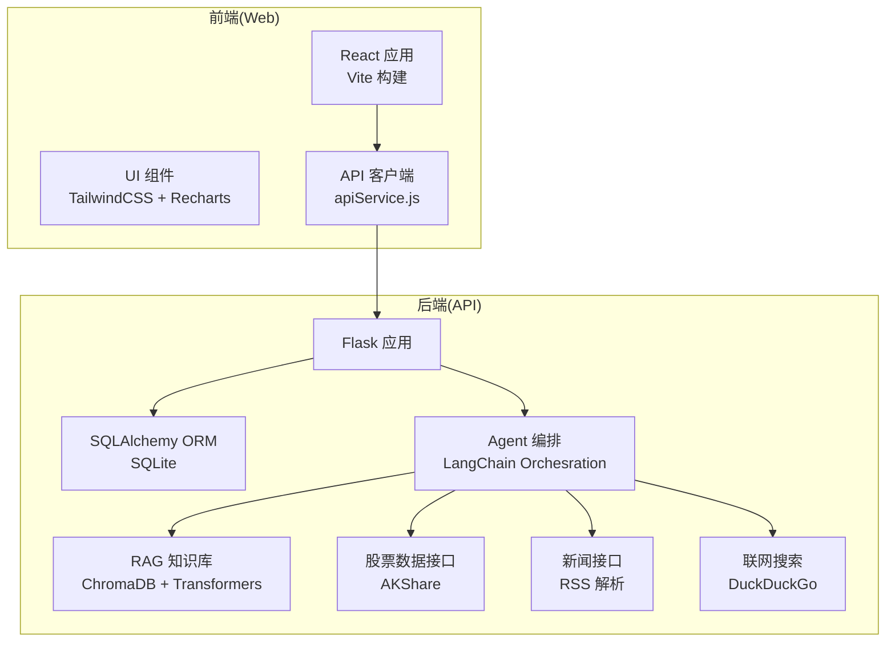
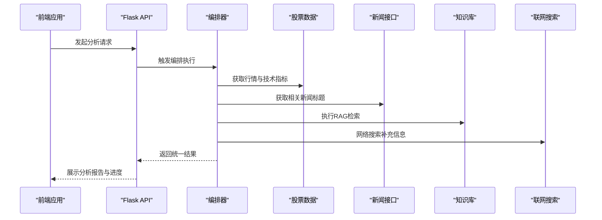
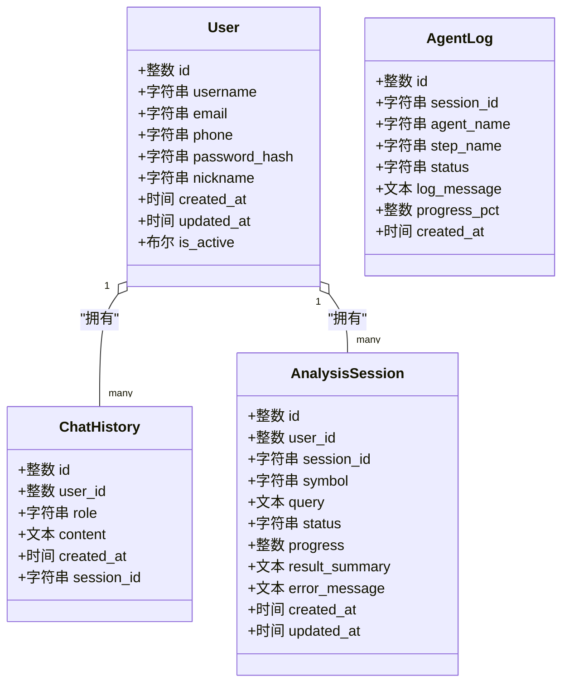
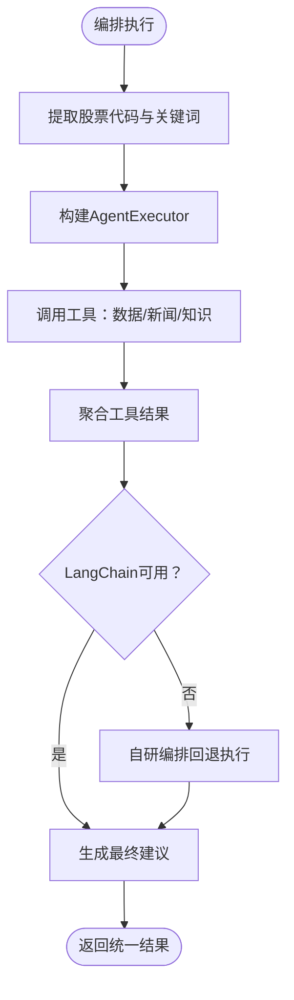
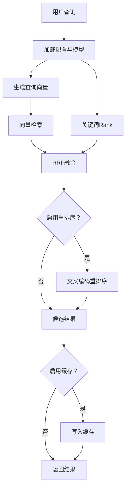
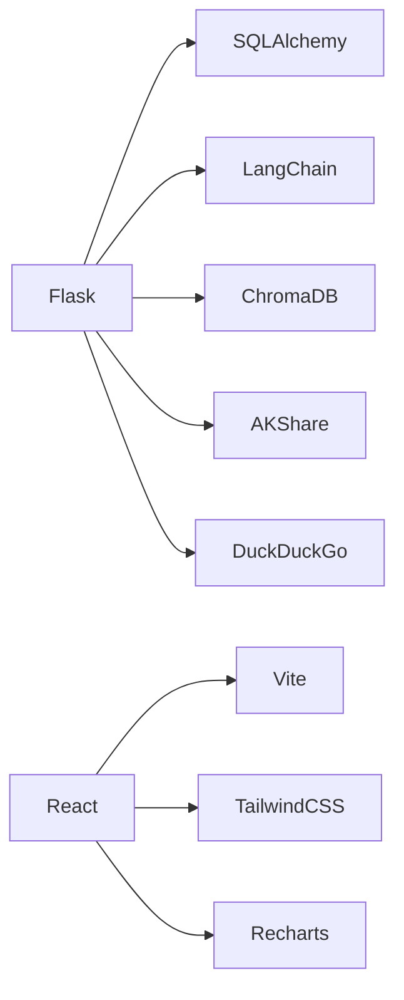

# 技术栈概览

<cite>
**本文档引用的文件**
- [requirements.txt](file://requirements.txt)
- [run.py](file://run.py)
- [src/models/database.py](file://src/models/database.py)
- [src/rag/knowledge_tool.py](file://src/rag/knowledge_tool.py)
- [src/agent/langchain_orchestrator.py](file://src/agent/langchain_orchestrator.py)
- [src/api/main.py](file://src/api/main.py)
- [src/stock/stock_api.py](file://src/stock/stock_api.py)
- [src/news/news_api.py](file://src/news/news_api.py)
- [src/utils/web_search.py](file://src/utils/web_search.py)
- [src/web/package.json](file://src/web/package.json)
- [src/web/vite.config.js](file://src/web/vite.config.js)
- [src/web/tailwind.config.js](file://src/web/tailwind.config.js)
- [src/web/src/App.jsx](file://src/web/src/App.jsx)
- [src/web/src/services/apiService.js](file://src/web/src/services/apiService.js)
- [DESIGN.md](file://DESIGN.md)
</cite>

## 目录
1. [引言](#引言)
2. [项目结构](#项目结构)
3. [核心组件](#核心组件)
4. [架构总览](#架构总览)
5. [详细组件分析](#详细组件分析)
6. [依赖关系分析](#依赖关系分析)
7. [性能考量](#性能考量)
8. [故障排查指南](#故障排查指南)
9. [结论](#结论)
10. [附录](#附录)

## 引言
本技术栈概览面向AI投资分析系统，系统采用前后端分离架构：后端以Python与Flask为核心，结合SQLAlchemy ORM与SQLite持久化；编排层融合LangChain AgentExecutor与自研编排方案；前端采用React + Vite + TailwindCSS + Recharts；数据与检索层以AKShare、网页联网搜索、ChromaDB与sentence-transformers构成；通过统一的API服务连接各组件，形成可扩展、可维护的智能投研平台。

## 项目结构
项目采用模块化分层组织：
- 后端API与业务逻辑：src/api、src/agent、src/models、src/rag、src/stock、src/news、src/utils
- 前端应用：src/web（React + Vite）
- 启动与环境：run.py、requirements.txt、.env(.example)
- 设计与文档：DESIGN.md、README.md

图表来源
- [src/api/main.py](file://src/api/main.py#L40-L57)
- [src/agent/langchain_orchestrator.py](file://src/agent/langchain_orchestrator.py#L20-L28)
- [src/rag/knowledge_tool.py](file://src/rag/knowledge_tool.py#L22-L54)
- [src/stock/stock_api.py](file://src/stock/stock_api.py#L1-L20)
- [src/news/news_api.py](file://src/news/news_api.py#L41-L53)
- [src/utils/web_search.py](file://src/utils/web_search.py#L39-L80)
- [src/web/src/services/apiService.js](file://src/web/src/services/apiService.js#L1-L35)

章节来源
- [run.py](file://run.py#L1-L60)
- [requirements.txt](file://requirements.txt#L1-L41)

## 核心组件
- 后端技术栈
  - Python 3.x（配合依赖版本约束）
  - Flask：提供REST API、CORS支持、日志与健康检查
  - SQLAlchemy：ORM映射与SQLite持久化
- 编排技术
  - LangChain AgentExecutor：可选编排，封装工具调用与多Agent协作
  - 自研编排：在LangChain不可用或失败时回退，保障系统可用性
- 前端技术栈
  - React 19 + Vite：快速开发与热更新
  - TailwindCSS：原子化样式与主题定制
  - Recharts：可视化图表渲染
- 数据与检索技术
  - SQLite：本地轻量数据库，配合SQLAlchemy
  - ChromaDB：向量数据库，支持RAG检索
  - sentence-transformers：文本嵌入与重排序
  - AKShare：A股行情与基础数据
  - 网页联网搜索：DuckDuckGo（DDGS）
- 数据源
  - AKShare：A股实时/历史行情、技术指标、财务数据
  - RSS新闻源：财经媒体RSS订阅
  - 网络搜索：DuckDuckGo搜索结果

章节来源
- [src/api/main.py](file://src/api/main.py#L40-L57)
- [src/models/database.py](file://src/models/database.py#L24-L86)
- [src/agent/langchain_orchestrator.py](file://src/agent/langchain_orchestrator.py#L20-L28)
- [src/rag/knowledge_tool.py](file://src/rag/knowledge_tool.py#L22-L54)
- [src/stock/stock_api.py](file://src/stock/stock_api.py#L1-L20)
- [src/news/news_api.py](file://src/news/news_api.py#L41-L53)
- [src/utils/web_search.py](file://src/utils/web_search.py#L39-L80)
- [src/web/package.json](file://src/web/package.json#L12-L31)

## 架构总览
系统采用“前端-后端-API-工具层”的分层架构。前端通过apiService.js调用后端Flask API；后端通过Agent编排器协调数据Agent、新闻Agent、知识库Agent与分析Agent；数据Agent对接AKShare与联网搜索；知识库Agent对接ChromaDB与sentence-transformers；所有状态与会话持久化至SQLite。

图表来源
- [src/web/src/App.jsx](file://src/web/src/App.jsx#L184-L269)
- [src/web/src/services/apiService.js](file://src/web/src/services/apiService.js#L72-L94)
- [src/agent/langchain_orchestrator.py](file://src/agent/langchain_orchestrator.py#L151-L273)
- [src/stock/stock_api.py](file://src/stock/stock_api.py#L137-L142)
- [src/news/news_api.py](file://src/news/news_api.py#L233-L248)
- [src/rag/knowledge_tool.py](file://src/rag/knowledge_tool.py#L254-L273)
- [src/utils/web_search.py](file://src/utils/web_search.py#L39-L80)

## 详细组件分析

### 后端API与数据库
- Flask应用负责路由注册、CORS、认证中间件、健康检查与用户管理接口
- SQLAlchemy定义用户、聊天历史、分析会话与Agent日志等核心模型
- 数据库采用SQLite，便于本地开发与部署

图表来源
- [src/models/database.py](file://src/models/database.py#L24-L86)

章节来源
- [src/api/main.py](file://src/api/main.py#L40-L57)
- [src/models/database.py](file://src/models/database.py#L24-L86)

### 编排器（LangChain AgentExecutor 与自研编排）
- LangChainOrchestrator：封装工具（数据Agent、新闻Agent、知识库Agent），构建AgentExecutor，按策略调用工具并整合结果
- 自研编排：在LangChain不可用或失败时回退，确保核心流程可用
- 统一结果结构：WorkflowResult，包含任务计划、Agent执行结果与最终建议

图表来源
- [src/agent/langchain_orchestrator.py](file://src/agent/langchain_orchestrator.py#L151-L273)

章节来源
- [src/agent/langchain_orchestrator.py](file://src/agent/langchain_orchestrator.py#L20-L28)
- [src/agent/langchain_orchestrator.py](file://src/agent/langchain_orchestrator.py#L71-L149)
- [src/agent/langchain_orchestrator.py](file://src/agent/langchain_orchestrator.py#L151-L273)

### RAG知识库与检索
- RagKnowledgeBase：封装ChromaDB客户端、SentenceTransformer嵌入器、CrossEncoder重排序器
- 支持混合检索（向量+关键词）、RRF融合、可选重排序与查询缓存
- 提供统一查询接口，返回检索结果与引用信息

图表来源
- [src/rag/knowledge_tool.py](file://src/rag/knowledge_tool.py#L177-L248)

章节来源
- [src/rag/knowledge_tool.py](file://src/rag/knowledge_tool.py#L22-L54)
- [src/rag/knowledge_tool.py](file://src/rag/knowledge_tool.py#L177-L248)

### 股票数据与新闻接口
- 股票数据：封装AKShare接口，提供实时行情、历史数据、技术指标、分时数据等
- 新闻接口：RSS解析器，支持多种RSS/Atom格式，抽取标题、链接、描述与发布时间

章节来源
- [src/stock/stock_api.py](file://src/stock/stock_api.py#L137-L142)
- [src/news/news_api.py](file://src/news/news_api.py#L100-L195)

### 联网搜索工具
- 基于DuckDuckGo（DDGS），支持禁用代理、区域设置与结果清洗
- 提供统一搜索接口，返回标题、链接、摘要

章节来源
- [src/utils/web_search.py](file://src/utils/web_search.py#L39-L80)

### 前端应用与服务
- React应用：状态管理、视图切换、分析流程驱动、聊天与引用展示
- apiService：封装HTTP请求、认证头注入、错误处理
- Vite + TailwindCSS + Recharts：开发体验与UI/UX实现

章节来源
- [src/web/src/App.jsx](file://src/web/src/App.jsx#L184-L269)
- [src/web/src/services/apiService.js](file://src/web/src/services/apiService.js#L1-L35)
- [src/web/package.json](file://src/web/package.json#L12-L31)
- [src/web/vite.config.js](file://src/web/vite.config.js#L1-L15)
- [src/web/tailwind.config.js](file://src/web/tailwind.config.js#L1-L9)

## 依赖关系分析
- 后端依赖
  - Flask + Flask-CORS：Web框架与跨域支持
  - SQLAlchemy + PyMySQL：ORM与数据库驱动
  - LangChain + openai：可选编排与大模型调用
  - ChromaDB + sentence-transformers：RAG检索
  - AKShare：A股数据
  - DuckDuckGo：联网搜索
- 前端依赖
  - React + Vite：开发与构建
  - TailwindCSS + Recharts：样式与图表
  - lucide-react：图标库

图表来源
- [requirements.txt](file://requirements.txt#L2-L41)
- [src/web/package.json](file://src/web/package.json#L12-L31)

章节来源
- [requirements.txt](file://requirements.txt#L1-L41)
- [src/web/package.json](file://src/web/package.json#L1-L33)

## 性能考量
- 编排与工具调用
  - LangChain AgentExecutor设置最大迭代次数与解析错误处理，避免无限循环
  - 自研编排在失败时快速降级，保障系统可用性
- 检索与缓存
  - RAG支持查询缓存与候选集上限，减少重复计算
  - 混合检索与RRF融合平衡召回与精度
- 数据与网络
  - 股票与新闻接口存在网络波动，建议增加重试与降级策略
  - 联网搜索建议设置区域与代理控制，避免风控
- 前端交互
  - 增量更新分析进度与日志，避免频繁重渲染
  - 图表按需渲染，减少首屏压力

## 故障排查指南
- 后端启动
  - 确认Flask端口与调试模式环境变量
  - 检查CORS与路由注册是否正确
- 数据库
  - 初始化数据库与模型映射，确认SQLite文件存在
- 编排失败
  - LangChain不可用时自动回退到自研编排
  - 检查工具调用参数与返回格式一致性
- RAG检索
  - 确认ChromaDB持久目录与集合存在
  - 检查嵌入模型与重排序模型加载状态
- 股票与新闻
  - AKShare接口可能因数据源不稳定导致失败，建议增加重试
  - RSS解析器对不同格式的兼容性，注意异常捕获
- 联网搜索
  - DuckDuckGo搜索可能受代理与区域限制，可通过环境变量调整
- 前端
  - 确认API基础URL与认证头
  - 检查Vite开发服务器端口占用

章节来源
- [src/api/main.py](file://src/api/main.py#L238-L243)
- [src/models/database.py](file://src/models/database.py#L24-L86)
- [src/agent/langchain_orchestrator.py](file://src/agent/langchain_orchestrator.py#L62-L69)
- [src/rag/knowledge_tool.py](file://src/rag/knowledge_tool.py#L35-L61)
- [src/stock/stock_api.py](file://src/stock/stock_api.py#L1-L20)
- [src/news/news_api.py](file://src/news/news_api.py#L186-L194)
- [src/utils/web_search.py](file://src/utils/web_search.py#L63-L78)
- [src/web/src/services/apiService.js](file://src/web/src/services/apiService.js#L14-L35)

## 结论
本技术栈围绕“模块化、可扩展、可降级”的原则构建：后端以Flask与SQLAlchemy为基础，编排层融合LangChain与自研方案，前端以React/Vite提供良好交互体验，数据与检索层通过AKShare、ChromaDB与sentence-transformers实现高质量信息处理。通过统一API与清晰的组件边界，系统可在开发、测试与生产环境中稳定演进。

## 附录
- 版本与兼容性
  - Python：3.x（配合依赖版本约束）
  - Flask：3.x
  - SQLAlchemy：2.x
  - LangChain：0.2+
  - React：19.x
  - Vite：7.x
  - TailwindCSS：3.x
  - ChromaDB：0.5+
  - sentence-transformers：2.2.2+
  - AKShare：1.x
  - DuckDuckGo：DDGS
- 环境变量
  - FLASK_DEBUG、FLASK_USE_RELOADER：Flask调试与热重载
  - LOG_LEVEL：日志级别
  - OPENAI_* / DEEPSEEK_*：大模型调用配置
  - DDGS_*：联网搜索配置
- 启动方式
  - run.py支持分别启动后端与前端，或提示同时启动的注意事项

章节来源
- [requirements.txt](file://requirements.txt#L1-L41)
- [src/web/package.json](file://src/web/package.json#L12-L31)
- [run.py](file://run.py#L35-L56)
- [DESIGN.md](file://DESIGN.md#L115-L129)