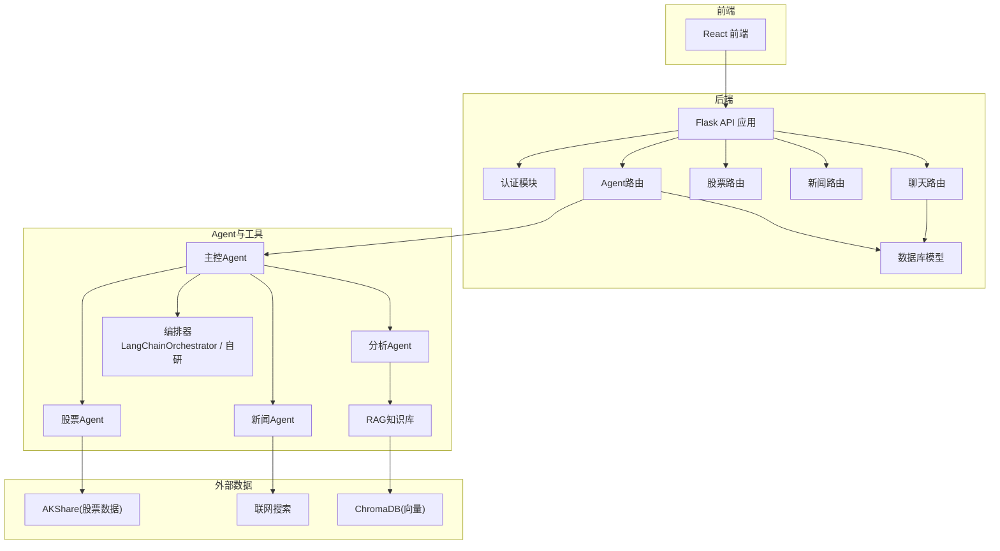
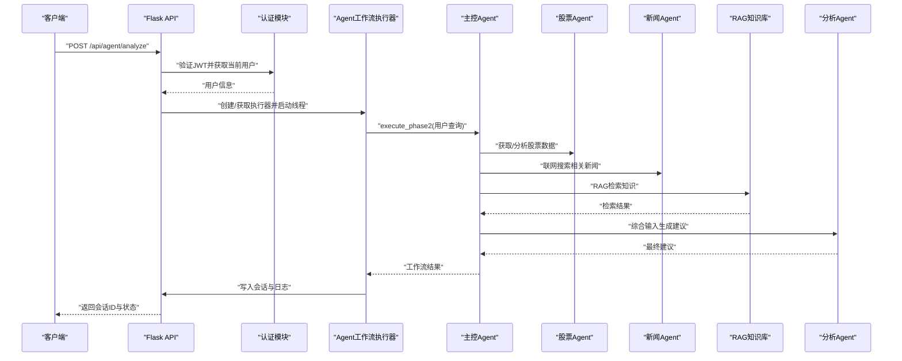
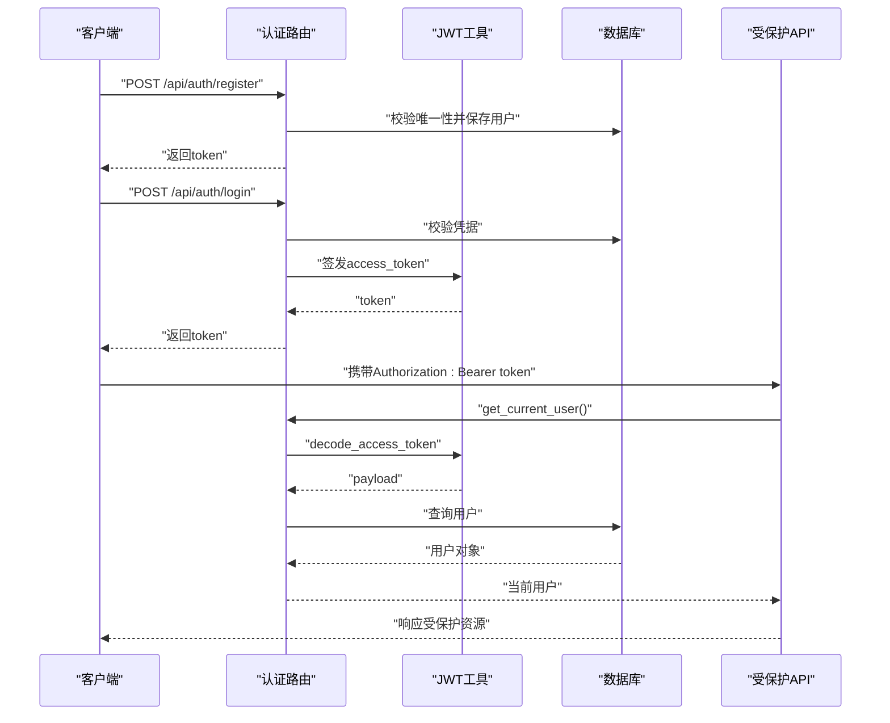
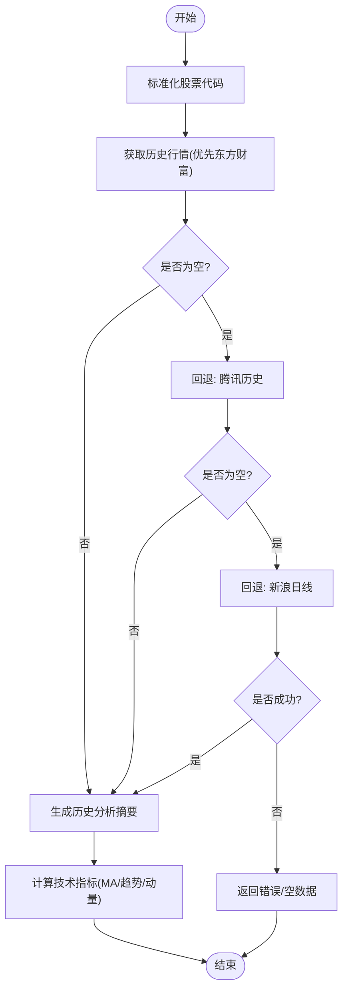
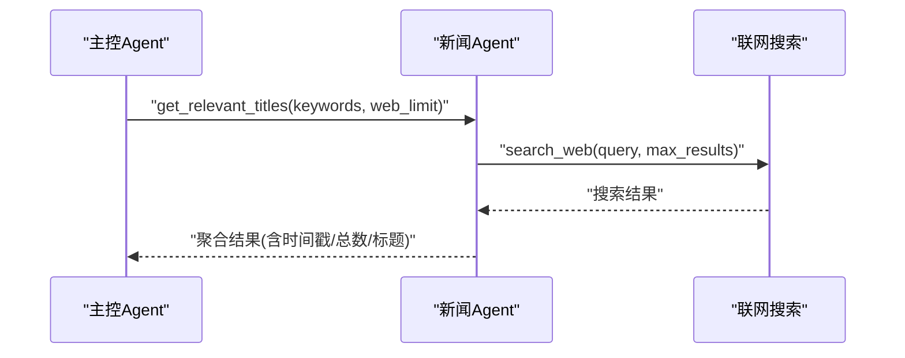
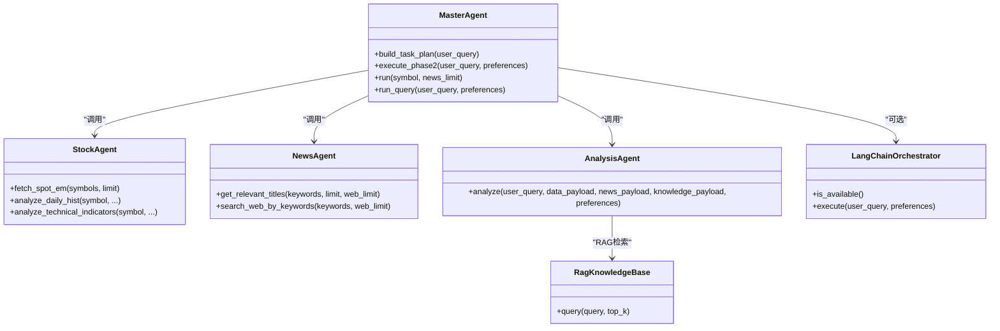
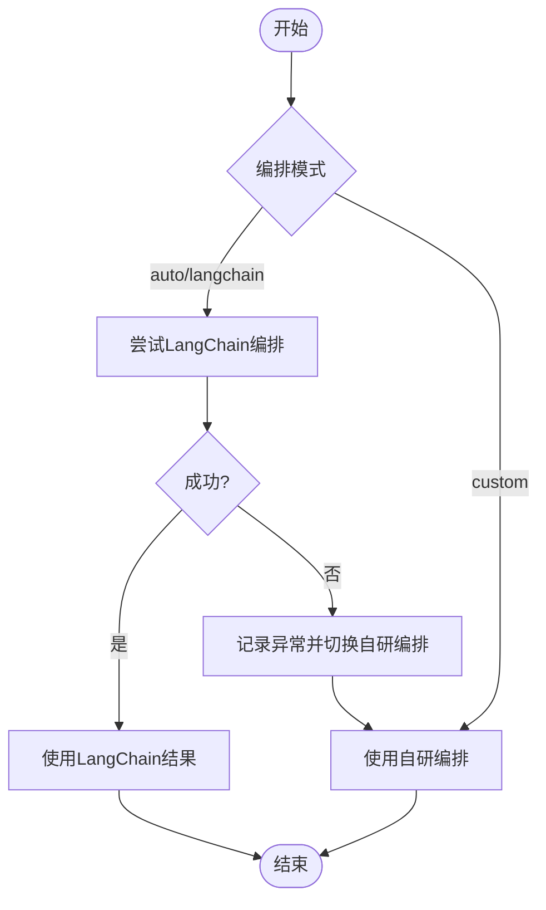
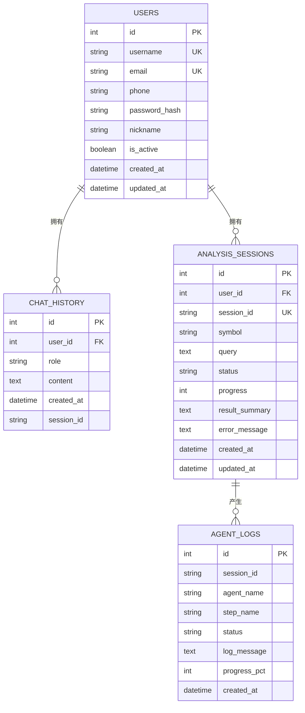
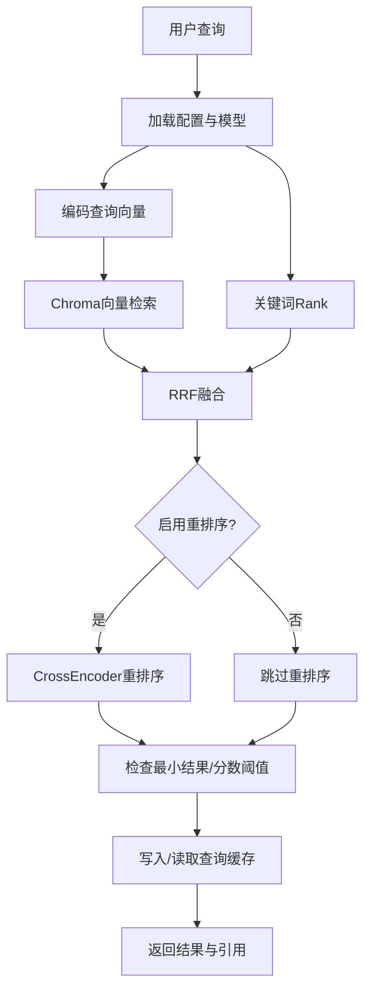
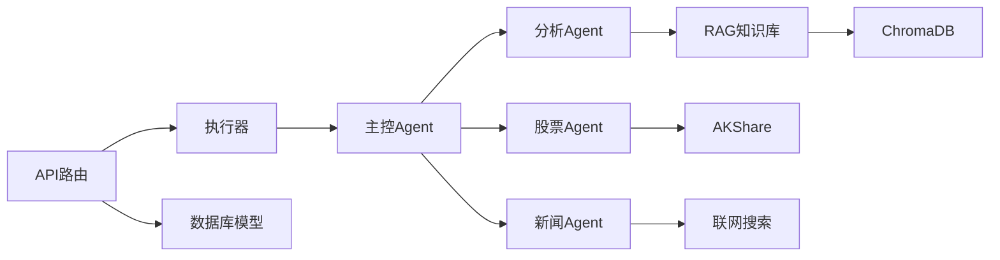

# 核心功能特性

<cite>
**本文引用的文件**
- [README.md](file://README.md)
- [src/api/main.py](file://src/api/main.py)
- [src/api/auth.py](file://src/api/auth.py)
- [src/utils/jwt_utils.py](file://src/utils/jwt_utils.py)
- [src/agent/master_agent.py](file://src/agent/master_agent.py)
- [src/agent/langchain_orchestrator.py](file://src/agent/langchain_orchestrator.py)
- [src/rag/knowledge_tool.py](file://src/rag/knowledge_tool.py)
- [src/models/database.py](file://src/models/database.py)
- [src/api/agent.py](file://src/api/agent.py)
- [src/api/agent_executor.py](file://src/api/agent_executor.py)
- [src/stock/stock_api.py](file://src/stock/stock_api.py)
- [src/news/news_api.py](file://src/news/news_api.py)
- [src/agent/analysis_agent.py](file://src/agent/analysis_agent.py)
- [src/agent/stock_agent.py](file://src/agent/stock_agent.py)
- [src/agent/news_agent.py](file://src/agent/news_agent.py)
</cite>

## 目录
1. [简介](#简介)
2. [项目结构](#项目结构)
3. [核心组件](#核心组件)
4. [架构总览](#架构总览)
5. [详细组件分析](#详细组件分析)
6. [依赖关系分析](#依赖关系分析)
7. [性能考量](#性能考量)
8. [故障排查指南](#故障排查指南)
9. [结论](#结论)
10. [附录](#附录)

## 简介
本文件面向AI投资分析系统的核心功能特性，围绕以下主题展开：用户认证与JWT鉴权机制、股票数据查询与分析（基于AKShare）、新闻联网检索与分析、多Agent协同分析流程（主控、数据、新闻、知识、分析）、可切换编排器（LangChain AgentExecutor与自研编排）、聊天记录与分析会话持久化、RAG本地知识库检索。每个功能均给出技术实现原理、使用场景、优势特点与实际效果，并提供具体代码路径以便开发者快速定位与应用。

## 项目结构
系统采用后端（Flask + SQLAlchemy）+ 前端（React）+ 多Agent协作的分层架构。核心模块包括：
- API层：认证、Agent工作流、股票、新闻、聊天路由
- Agent层：主控Agent、数据Agent、新闻Agent、分析Agent、编排器
- 数据与检索：AKShare封装、RAG知识库（Chroma + 重排序）
- 模型与持久化：用户、聊天历史、分析会话、Agent日志

图表来源
- [src/api/main.py](file://src/api/main.py#L40-L56)
- [src/api/auth.py](file://src/api/auth.py#L15-L15)
- [src/api/agent.py](file://src/api/agent.py#L17-L17)
- [src/api/agent_executor.py](file://src/api/agent_executor.py#L25-L40)
- [src/agent/master_agent.py](file://src/agent/master_agent.py#L24-L39)
- [src/agent/stock_agent.py](file://src/agent/stock_agent.py#L30-L67)
- [src/agent/news_agent.py](file://src/agent/news_agent.py#L18-L24)
- [src/agent/analysis_agent.py](file://src/agent/analysis_agent.py#L15-L26)
- [src/agent/langchain_orchestrator.py](file://src/agent/langchain_orchestrator.py#L20-L28)
- [src/rag/knowledge_tool.py](file://src/rag/knowledge_tool.py#L22-L61)
- [src/models/database.py](file://src/models/database.py#L24-L86)

章节来源
- [README.md](file://README.md#L24-L40)
- [src/api/main.py](file://src/api/main.py#L40-L56)

## 核心组件
- 用户认证与JWT鉴权：提供注册/登录、密码哈希、令牌签发与校验、请求拦截获取当前用户
- 股票数据查询与分析：封装AKShare接口，提供历史行情、实时行情、技术指标计算与分析摘要
- 新闻联网检索与分析：基于关键词的联网搜索，聚合新闻标题与相关度
- 多Agent协同分析：主控Agent统一任务规划与调度，数据/新闻/知识/分析Agent分工协作
- 可切换编排器：LangChain AgentExecutor优先，异常时自动回退至自研编排
- 聊天记录与分析会话持久化：将分析过程与结果写入数据库，支持状态查询与回溯
- RAG本地知识库检索：Chroma向量检索 + 关键词融合 + 重排序 + 缓存

章节来源
- [README.md](file://README.md#L5-L14)
- [src/api/auth.py](file://src/api/auth.py#L18-L136)
- [src/utils/jwt_utils.py](file://src/utils/jwt_utils.py#L18-L36)
- [src/agent/stock_agent.py](file://src/agent/stock_agent.py#L68-L128)
- [src/stock/stock_api.py](file://src/stock/stock_api.py#L137-L142)
- [src/agent/news_agent.py](file://src/agent/news_agent.py#L25-L93)
- [src/agent/master_agent.py](file://src/agent/master_agent.py#L137-L318)
- [src/agent/langchain_orchestrator.py](file://src/agent/langchain_orchestrator.py#L62-L149)
- [src/api/agent_executor.py](file://src/api/agent_executor.py#L93-L282)
- [src/models/database.py](file://src/models/database.py#L40-L86)
- [src/rag/knowledge_tool.py](file://src/rag/knowledge_tool.py#L177-L248)

## 架构总览
系统通过Flask蓝图组织各模块路由，认证中间件在请求进入时解析JWT并注入当前用户。Agent工作流由API触发，异步执行并写入分析会话与Agent日志。RAG检索贯穿分析Agent，形成“数据+新闻+知识”的综合分析闭环。

图表来源
- [src/api/agent.py](file://src/api/agent.py#L20-L108)
- [src/api/agent_executor.py](file://src/api/agent_executor.py#L93-L186)
- [src/agent/master_agent.py](file://src/agent/master_agent.py#L155-L318)
- [src/agent/stock_agent.py](file://src/agent/stock_agent.py#L305-L432)
- [src/agent/news_agent.py](file://src/agent/news_agent.py#L69-L92)
- [src/rag/knowledge_tool.py](file://src/rag/knowledge_tool.py#L254-L273)
- [src/agent/analysis_agent.py](file://src/agent/analysis_agent.py#L27-L92)

## 详细组件分析

### 用户认证与JWT鉴权机制
- 技术实现
  - 注册/登录：接收用户名/邮箱/密码，校验唯一性与有效性，生成SHA-256哈希存储
  - JWT签发：使用HS256算法，7天有效期，包含用户ID与用户名
  - 请求拦截：从Authorization头解析Bearer Token，解码并查询用户
- 使用场景
  - 所有受保护路由（用户资料、分析会话、聊天记录）均需有效JWT
- 优势特点
  - 简洁的无状态鉴权，便于前后端分离
  - 支持多端登录与跨域CORS
- 实际效果
  - 保障用户隐私与数据安全，防止未授权访问

图表来源
- [src/api/auth.py](file://src/api/auth.py#L23-L136)
- [src/utils/jwt_utils.py](file://src/utils/jwt_utils.py#L18-L36)
- [src/api/main.py](file://src/api/main.py#L85-L101)

章节来源
- [src/api/auth.py](file://src/api/auth.py#L18-L136)
- [src/utils/jwt_utils.py](file://src/utils/jwt_utils.py#L13-L36)
- [src/api/main.py](file://src/api/main.py#L85-L101)

### 股票数据查询与分析（基于AKShare）
- 技术实现
  - 代码标准化：统一处理带/不带市场前缀的6位代码
  - 历史行情：优先使用东方财富，失败回退腾讯/新浪
  - 实时行情：获取沪深京A股实时快照并支持关键词过滤
  - 技术分析：计算均线、趋势、动量等指标，输出摘要
- 使用场景
  - 股票画像、趋势判断、波动率评估、技术面辅助
- 优势特点
  - 多数据源回退提升稳定性
  - 统一字段选择与缺失容错
- 实际效果
  - 在网络不稳定时仍能提供稳健的历史与实时数据摘要

图表来源
- [src/agent/stock_agent.py](file://src/agent/stock_agent.py#L129-L168)
- [src/agent/stock_agent.py](file://src/agent/stock_agent.py#L305-L432)
- [src/agent/stock_agent.py](file://src/agent/stock_agent.py#L434-L552)
- [src/stock/stock_api.py](file://src/stock/stock_api.py#L137-L142)

章节来源
- [src/agent/stock_agent.py](file://src/agent/stock_agent.py#L68-L128)
- [src/agent/stock_agent.py](file://src/agent/stock_agent.py#L129-L168)
- [src/agent/stock_agent.py](file://src/agent/stock_agent.py#L305-L432)
- [src/agent/stock_agent.py](file://src/agent/stock_agent.py#L434-L552)
- [src/stock/stock_api.py](file://src/stock/stock_api.py#L137-L142)

### 新闻联网检索与分析
- 技术实现
  - 关键词驱动：将用户查询或股票代码转化为关键词序列
  - 联网搜索：调用通用搜索接口，返回标题与链接
  - 结果聚合：返回时间戳、总数、相关标题与联网结果
- 使用场景
  - 事件驱动分析、消息面解读、情绪与热点追踪
- 优势特点
  - 无需RSS订阅即可获取最新新闻线索
  - 与股票Agent/知识Agent形成互补
- 实际效果
  - 快速抓取与筛选相关新闻，支撑实时分析

图表来源
- [src/agent/news_agent.py](file://src/agent/news_agent.py#L69-L92)
- [src/agent/news_agent.py](file://src/agent/news_agent.py#L49-L67)

章节来源
- [src/agent/news_agent.py](file://src/agent/news_agent.py#L25-L93)

### 多Agent协同分析流程（主控、数据、新闻、知识、分析）
- 技术实现
  - 主控Agent：解析用户查询，抽取股票代码与关键词，生成任务计划
  - 数据/新闻/知识Agent：分别产出数据摘要、新闻线索与知识检索结果
  - 分析Agent：整合三类输入，输出合规、可读的建议文本
  - 编排器：LangChain优先，异常回退自研编排
- 使用场景
  - 股票深度分析、问题问答、策略建议生成
- 优势特点
  - 模块化分工，可扩展性强
  - 双编排器保障高可用
- 实际效果
  - 提升分析质量与鲁棒性，降低单一依赖风险

图表来源
- [src/agent/master_agent.py](file://src/agent/master_agent.py#L24-L39)
- [src/agent/stock_agent.py](file://src/agent/stock_agent.py#L30-L67)
- [src/agent/news_agent.py](file://src/agent/news_agent.py#L18-L24)
- [src/agent/analysis_agent.py](file://src/agent/analysis_agent.py#L15-L26)
- [src/agent/langchain_orchestrator.py](file://src/agent/langchain_orchestrator.py#L20-L28)
- [src/rag/knowledge_tool.py](file://src/rag/knowledge_tool.py#L22-L61)

章节来源
- [src/agent/master_agent.py](file://src/agent/master_agent.py#L137-L318)
- [src/agent/analysis_agent.py](file://src/agent/analysis_agent.py#L27-L92)
- [src/agent/langchain_orchestrator.py](file://src/agent/langchain_orchestrator.py#L62-L149)

### 可切换编排器（LangChain AgentExecutor与自研编排）
- 技术实现
  - LangChain编排：动态构造工具（数据/新闻/知识），创建tool-calling AgentExecutor
  - 自研编排：主控Agent直接串行调用各Agent，记录AgentResult与WorkflowResult
  - 回退策略：LangChain不可用或异常时自动切换自研编排，并记录回退原因
- 使用场景
  - 需要LLM驱动的智能工具调用时启用LangChain；否则使用稳定自研编排
- 优势特点
  - 双引擎并行，兼顾灵活性与可靠性
  - 环境变量控制编排模式（auto/langchain/custom）
- 实际效果
  - 在不同部署环境下保持一致的分析体验

图表来源
- [src/agent/master_agent.py](file://src/agent/master_agent.py#L155-L193)
- [src/agent/langchain_orchestrator.py](file://src/agent/langchain_orchestrator.py#L62-L149)

章节来源
- [src/agent/master_agent.py](file://src/agent/master_agent.py#L155-L193)
- [src/agent/langchain_orchestrator.py](file://src/agent/langchain_orchestrator.py#L62-L149)
- [README.md](file://README.md#L118-L131)

### 聊天记录与分析会话持久化
- 技术实现
  - 数据模型：用户、聊天历史、分析会话、Agent日志
  - API：启动分析/查询即创建会话，异步执行过程中写入Agent日志
  - 状态查询：按会话ID返回进度、日志、结果与错误信息
- 使用场景
  - 用户可回溯分析过程，支持多轮对话与历史查询
- 优势特点
  - 结构化存储，便于审计与二次利用
  - 支持并发与事务回滚
- 实际效果
  - 提升用户体验与可追溯性

图表来源
- [src/models/database.py](file://src/models/database.py#L24-L86)
- [src/api/agent.py](file://src/api/agent.py#L20-L108)
- [src/api/agent_executor.py](file://src/api/agent_executor.py#L57-L92)

章节来源
- [src/models/database.py](file://src/models/database.py#L40-L86)
- [src/api/agent.py](file://src/api/agent.py#L111-L168)
- [src/api/agent_executor.py](file://src/api/agent_executor.py#L57-L92)

### RAG本地知识库检索
- 技术实现
  - 向量检索：Chroma持久化集合 + SentenceTransformer嵌入
  - 关键词融合：TF-IDF式关键词匹配，与向量结果RRF融合
  - 重排序：CrossEncoder对候选进行再排序
  - 缓存：可配置TTL与容量上限
  - 回退：当结果不足或分数过低时标记回退并提示
- 使用场景
  - 方法论/估值/风险框架等知识问答
- 优势特点
  - 向量+关键词混合检索，兼顾语义与关键词召回
  - 可插拔重排序与缓存，兼顾性能与准确性
- 实际效果
  - 提升知识问答质量与稳定性

图表来源
- [src/rag/knowledge_tool.py](file://src/rag/knowledge_tool.py#L177-L248)
- [src/rag/knowledge_tool.py](file://src/rag/knowledge_tool.py#L114-L151)

章节来源
- [src/rag/knowledge_tool.py](file://src/rag/knowledge_tool.py#L22-L61)
- [src/rag/knowledge_tool.py](file://src/rag/knowledge_tool.py#L177-L248)

## 依赖关系分析
- 组件耦合
  - 主控Agent依赖数据/新闻/分析Agent与编排器
  - 分析Agent依赖RAG知识库与LLM客户端
  - API层依赖模型与执行器，执行器依赖数据库与Agent
- 外部依赖
  - AKShare：股票数据源
  - ChromaDB + sentence-transformers：向量检索
  - OpenAI/DeepSeek：LLM推理
- 潜在循环依赖
  - 通过模块导入顺序与蓝图注册避免循环

图表来源
- [src/api/agent.py](file://src/api/agent.py#L17-L17)
- [src/api/agent_executor.py](file://src/api/agent_executor.py#L25-L40)
- [src/agent/master_agent.py](file://src/agent/master_agent.py#L24-L39)
- [src/agent/stock_agent.py](file://src/agent/stock_agent.py#L19-L27)
- [src/agent/news_agent.py](file://src/agent/news_agent.py#L15-L15)
- [src/rag/knowledge_tool.py](file://src/rag/knowledge_tool.py#L42-L53)

章节来源
- [src/api/agent.py](file://src/api/agent.py#L17-L17)
- [src/api/agent_executor.py](file://src/api/agent_executor.py#L25-L40)
- [src/agent/master_agent.py](file://src/agent/master_agent.py#L24-L39)

## 性能考量
- 数据获取
  - 多数据源回退减少单点失败概率，但增加网络往返；建议合理设置超时与重试
- 检索与排序
  - 向量检索与重排序成本较高，建议开启缓存与合理的top_k
- 编排器
  - LangChain工具调用具备更强灵活性，但开销更大；在稳定性优先时可选择自研编排
- 数据库
  - 会话与日志写入频繁，建议使用连接池与异步写入策略

## 故障排查指南
- 认证失败
  - 检查Authorization头格式与JWT签名算法、密钥是否正确
  - 确认用户状态是否被禁用
- 股票数据异常
  - 网络不稳定或数据源限流导致；查看代理配置与回退日志
- 新闻检索失败
  - 联网搜索接口异常或关键词为空；检查关键词构造与最大返回数
- RAG检索效果差
  - 重新构建Chroma索引，检查分块与嵌入模型配置
- 编排器异常
  - LangChain不可用或LLM配置错误；切换至自研编排并记录回退原因

章节来源
- [src/api/auth.py](file://src/api/auth.py#L78-L118)
- [src/agent/stock_agent.py](file://src/agent/stock_agent.py#L104-L114)
- [src/agent/news_agent.py](file://src/agent/news_agent.py#L85-L92)
- [src/rag/knowledge_tool.py](file://src/rag/knowledge_tool.py#L268-L272)
- [src/agent/langchain_orchestrator.py](file://src/agent/langchain_orchestrator.py#L62-L69)

## 结论
本系统通过模块化的Agent架构与可切换编排器，在保证稳定性的同时提供了强大的分析能力。结合JWT鉴权、会话持久化与RAG知识库，实现了从数据获取、新闻联动到知识增强的全链路投资分析闭环。开发者可基于现有代码路径快速扩展新Agent或优化现有流程。

## 附录
- 快速开始与配置参考
  - 环境变量：JWT_SECRET_KEY、DATABASE_URL、AGENT_ORCHESTRATOR、LLM相关环境变量
  - 启动方式：前后端一键启动或分别启动后端/前端
- API概览
  - 认证：注册、登录、获取/更新用户信息
  - Agent：启动分析/查询、查询状态、列出会话
  - 股票：封装的AKShare接口
  - 新闻：联网搜索与标题聚合
  - 聊天：聊天历史与分析会话

章节来源
- [README.md](file://README.md#L97-L153)
- [src/api/main.py](file://src/api/main.py#L58-L101)
- [src/api/agent.py](file://src/api/agent.py#L20-L108)