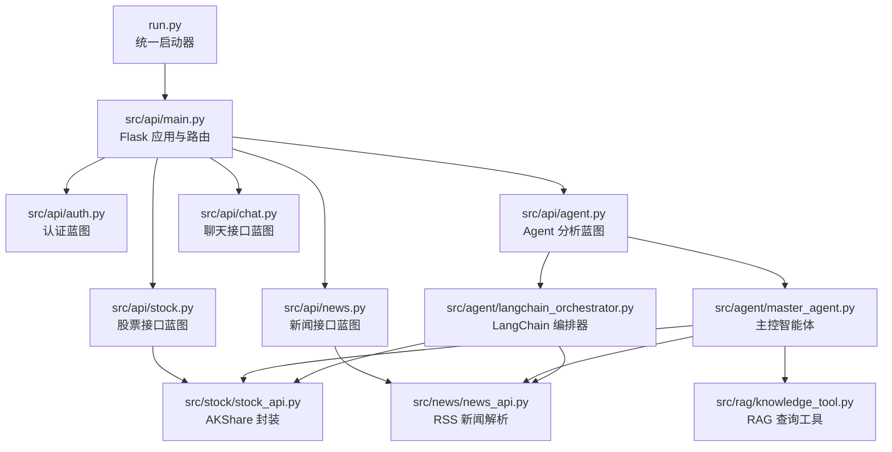
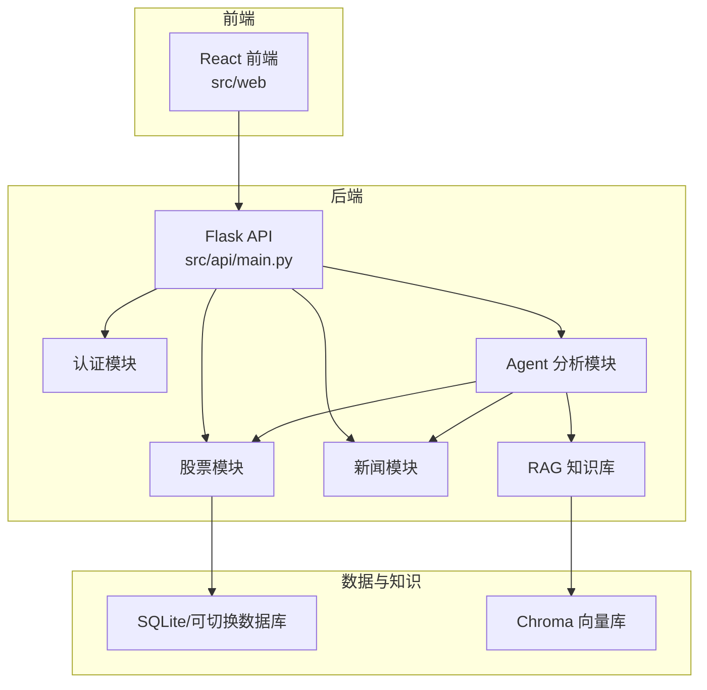
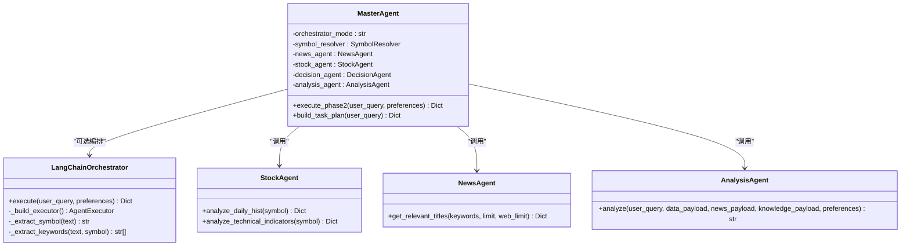
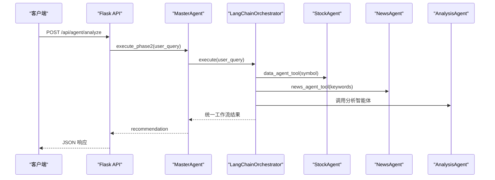
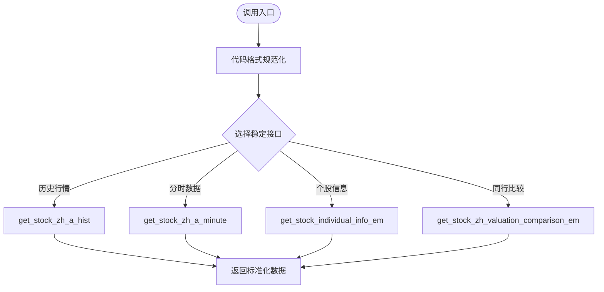
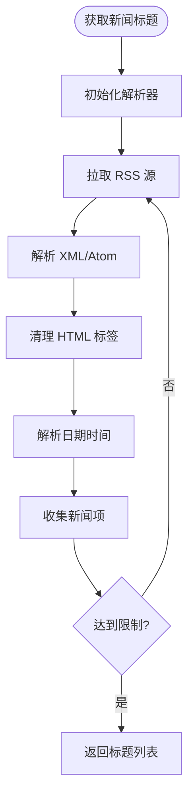
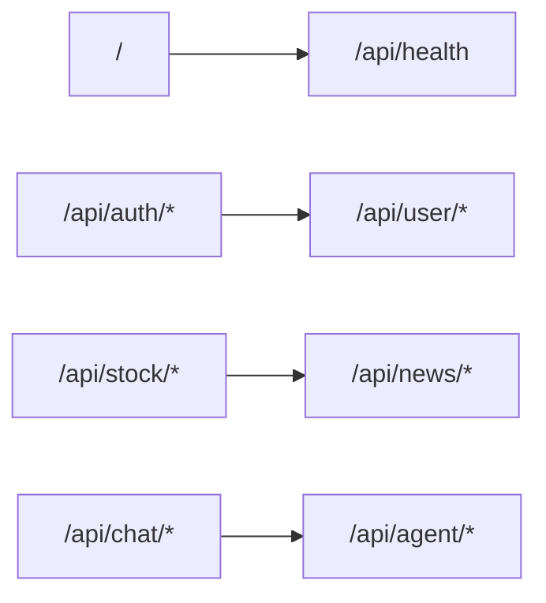
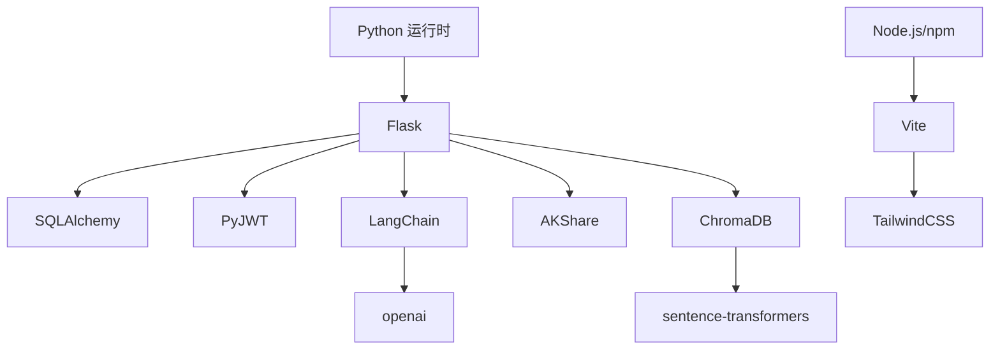

# 项目概述

<cite>
**本文档引用的文件**
- [README.md](file://README.md)
- [DESIGN.md](file://DESIGN.md)
- [run.py](file://run.py)
- [requirements.txt](file://requirements.txt)
- [.env.example](file://.env.example)
- [src/api/main.py](file://src/api/main.py)
- [src/agent/README.md](file://src/agent/README.md)
- [src/agent/master_agent.py](file://src/agent/master_agent.py)
- [src/agent/langchain_orchestrator.py](file://src/agent/langchain_orchestrator.py)
- [src/stock/stock_api.py](file://src/stock/stock_api.py)
- [src/news/news_api.py](file://src/news/news_api.py)
</cite>

## 目录
1. [简介](#简介)
2. [项目结构](#项目结构)
3. [核心组件](#核心组件)
4. [架构总览](#架构总览)
5. [详细组件分析](#详细组件分析)
6. [依赖关系分析](#依赖关系分析)
7. [性能考量](#性能考量)
8. [故障排查指南](#故障排查指南)
9. [结论](#结论)
10. [附录](#附录)

## 简介
本项目是一个基于 Flask + React + 多智能体协作的投资分析系统，支持用户认证、股票与新闻信息聚合、对话分析与 RAG 知识检索。系统采用前后端分离架构，后端以 Flask 提供 REST API，前端使用 React/Vite 构建可视化界面；核心分析能力通过多智能体编排实现，包括主控智能体、数据智能体、新闻智能体、分析智能体与知识智能体，支持可切换的编排器（LangChain AgentExecutor 与自研编排）。

系统的主要能力包括：
- 用户注册/登录与 JWT 鉴权
- 股票数据查询与分析（基于 AKShare）
- 新闻联网检索与分析
- 多 Agent 协同分析流程（主控、数据、新闻、知识、分析）
- 可切换编排器（LangChain AgentExecutor / 自研编排自动回退）
- 聊天记录与分析会话持久化（SQLite/可切换数据库）
- RAG 本地知识库检索（Chroma）

**章节来源**
- [README.md](file://README.md#L1-L215)

## 项目结构
项目采用模块化分层设计，核心目录与职责如下：
- run.py：统一启动器，支持同时或分别启动前后端
- src/api：Flask 路由与蓝图，提供认证、用户、股票、新闻、聊天、Agent 分析等接口
- src/agent：多智能体编排与协议，包含主控智能体、数据/新闻/分析/知识智能体、LangChain 编排器
- src/stock：股票数据模块，封装 AKShare 接口，提供标准化行情与指标
- src/news：新闻模块，提供 RSS 解析与标题提取
- src/rag：RAG 知识库，包含知识文档、分块、索引构建与查询工具
- src/utils：通用工具，如 JWT 工具与网络搜索
- src/web：React 前端，提供仪表盘与交互界面
- src/models：数据库模型与初始化（SQLite 默认）

**图表来源**
- [run.py](file://run.py#L1-L60)
- [src/api/main.py](file://src/api/main.py#L1-L243)
- [src/agent/master_agent.py](file://src/agent/master_agent.py#L1-L351)
- [src/agent/langchain_orchestrator.py](file://src/agent/langchain_orchestrator.py#L1-L273)
- [src/stock/stock_api.py](file://src/stock/stock_api.py#L1-L425)
- [src/news/news_api.py](file://src/news/news_api.py#L1-L248)

**章节来源**
- [README.md](file://README.md#L24-L40)
- [run.py](file://run.py#L1-L60)
- [src/api/main.py](file://src/api/main.py#L1-L243)

## 核心组件
- 主控智能体（MasterAgent）：负责任务分解、编排、降级与汇总，支持两种编排模式（LangChain 优先或自研编排），并输出统一的工作流结果结构
- 数据智能体（StockAgent）：负责获取股票历史行情与技术指标，提供标准化输出
- 新闻智能体（NewsAgent）：负责联网搜索与相关新闻聚合
- 分析智能体（AnalysisAgent）：负责综合推理并生成最终建议
- 知识智能体（KnowledgeAgent）：通过 RAG 查询投资知识库，提供方法论与框架支撑
- LangChain 编排器：可选的 AgentExecutor 实现，封装工具调用并回退至自研编排
- API 层：Flask 蓝图提供认证、用户管理、股票、新闻、聊天与 Agent 分析接口
- 数据层：默认 SQLite，支持通过环境变量切换数据库

**章节来源**
- [src/agent/README.md](file://src/agent/README.md#L1-L59)
- [src/agent/master_agent.py](file://src/agent/master_agent.py#L1-L351)
- [src/agent/langchain_orchestrator.py](file://src/agent/langchain_orchestrator.py#L1-L273)
- [src/api/main.py](file://src/api/main.py#L1-L243)

## 架构总览
系统采用“前端 + 后端 API + 多智能体编排 + 数据与知识库”的分层架构。前端通过 HTTP 请求与后端交互，后端根据用户查询启动主控智能体，主控智能体按配置选择编排器，协调各子智能体并整合结果，最终返回统一的分析建议。

**图表来源**
- [src/api/main.py](file://src/api/main.py#L1-L243)
- [src/agent/master_agent.py](file://src/agent/master_agent.py#L1-L351)
- [src/stock/stock_api.py](file://src/stock/stock_api.py#L1-L425)
- [src/news/news_api.py](file://src/news/news_api.py#L1-L248)

## 详细组件分析

### 主控智能体（MasterAgent）
主控智能体负责任务规划、编排与降级汇总。其核心流程包括：
- 股票代码解析与关键词提取
- 任务计划生成（数据、新闻、知识、分析）
- 编排器选择（auto/langchain/custom）
- 子智能体执行与结果收集
- 统一输出结构（task_plan、agent_results、degraded、recommendation）

**图表来源**
- [src/agent/master_agent.py](file://src/agent/master_agent.py#L1-L351)
- [src/agent/langchain_orchestrator.py](file://src/agent/langchain_orchestrator.py#L1-L273)

**章节来源**
- [src/agent/master_agent.py](file://src/agent/master_agent.py#L137-L318)
- [src/agent/README.md](file://src/agent/README.md#L19-L59)

### LangChain 编排器
LangChain 编排器通过 AgentExecutor 将主控智能体的任务映射为工具调用，支持多次工具调用与中间步骤记录。若不可用或异常，则自动回退至自研编排。

**图表来源**
- [src/agent/langchain_orchestrator.py](file://src/agent/langchain_orchestrator.py#L151-L273)
- [src/agent/master_agent.py](file://src/agent/master_agent.py#L155-L318)

**章节来源**
- [src/agent/langchain_orchestrator.py](file://src/agent/langchain_orchestrator.py#L71-L149)

### 股票数据模块（AKShare）
股票模块封装了 AKShare 的多种接口，提供标准化的历史行情、分时数据、个股信息与同行比较等能力，并包含代码格式规范化工具函数。

**图表来源**
- [src/stock/stock_api.py](file://src/stock/stock_api.py#L13-L425)

**章节来源**
- [src/stock/stock_api.py](file://src/stock/stock_api.py#L137-L425)

### 新闻模块（RSS 解析）
新闻模块提供 RSS 源解析与标题提取能力，支持多种 RSS/Atom 格式，具备 HTML 标签清理与日期解析功能。

**图表来源**
- [src/news/news_api.py](file://src/news/news_api.py#L100-L226)

**章节来源**
- [src/news/news_api.py](file://src/news/news_api.py#L1-L248)

### API 设计概览
后端通过蓝图划分功能域，提供认证、用户管理、股票、新闻、聊天与 Agent 分析等接口。健康检查与全局错误处理完善，便于前端集成与调试。

**图表来源**
- [src/api/main.py](file://src/api/main.py#L58-L235)

**章节来源**
- [src/api/main.py](file://src/api/main.py#L1-L243)
- [README.md](file://README.md#L132-L160)

## 依赖关系分析
系统依赖包括：
- Python 运行时与 Flask、SQLAlchemy、JWT 等后端库
- LangChain 与 openai，用于可选的 AgentExecutor 编排
- AKShare，用于股票数据获取
- ChromaDB 与 sentence-transformers，用于 RAG 索引与嵌入
- 前端依赖 Node.js 与 npm，使用 Vite 与 TailwindCSS

**图表来源**
- [requirements.txt](file://requirements.txt#L1-L41)

**章节来源**
- [requirements.txt](file://requirements.txt#L1-L41)
- [.env.example](file://.env.example#L1-L19)

## 性能考量
- 编排器切换：通过环境变量控制编排器模式，auto 模式优先 LangChain，失败自动回退自研编排，兼顾可靠性与灵活性
- 数据获取：股票与新闻接口依赖外部数据源，建议设置合理的超时与重试策略，避免阻塞主流程
- RAG 检索：索引构建与查询需考虑向量化与存储性能，建议定期重建索引并优化查询参数
- 前后端分离：前端与后端独立部署，可通过负载均衡与缓存提升整体吞吐

[本节为通用性能建议，无需具体文件分析]

## 故障排查指南
常见问题与解决思路：
- 启动后端报模块导入错误：确认在项目根目录执行命令，确保 PYTHONPATH 正确
- 前端无法启动：确认 Node.js 与 npm 已安装，且已执行 npm install
- 股票或新闻数据异常：可能与网络状态、数据源可用性有关，建议检查代理与超时设置
- RAG 检索效果不佳：先重新构建索引并检查知识文档与分块质量
- JWT 密钥与安全：生产环境务必更换密钥并关闭 debug 模式

**章节来源**
- [README.md](file://README.md#L205-L211)
- [.env.example](file://.env.example#L1-L19)

## 结论
本项目通过多智能体协作与可切换编排器，实现了从股票数据、新闻信息到知识库检索的完整分析闭环。前后端分离设计与模块化架构便于扩展与维护。建议在生产环境中完善鉴权、限流、监控与合规声明，并持续优化数据与检索质量以提升分析准确性与用户体验。

[本节为总结性内容，无需具体文件分析]

## 附录

### 快速开始
- 环境要求：Python 3.10+（建议 3.11）、Node.js 18+、npm 9+
- 安装后端依赖：在项目根目录执行 pip install -r requirements.txt
- 安装前端依赖：cd src/web && npm install
- 启动项目：python run.py（默认启动前端开发服务器），或分别启动后端/前端
- 访问地址：后端 http://127.0.0.1:5000，前端 http://127.0.0.1:5173

**章节来源**
- [README.md](file://README.md#L42-L96)
- [run.py](file://run.py#L35-L56)

### 配置说明
- 数据库：默认 SQLite（sqlite:///ai_investment.db），可通过 DATABASE_URL 环境变量切换
- JWT 密钥：JWT_SECRET_KEY，生产环境必须修改
- LLM 配置：OPENAI_API_KEY/OPENAI_BASE_URL/OPENAI_MODEL 或 DEEPSEEK_API_KEY/DEEPSEEK_BASE_URL/DEEPSEEK_MODEL
- 编排器模式：AGENT_ORCHESTRATOR（auto/langchain/custom）

**章节来源**
- [.env.example](file://.env.example#L1-L19)
- [README.md](file://README.md#L97-L131)

### 架构设计与工作流
- 分层与解耦：用户交互层、Agent 协调层、工具与数据层
- 核心组件：数据与工具层（股票/新闻/知识库）、Agent 协调层（主控/数据/新闻/分析/知识 Agent）
- 工作流：用户输入 → 主控智能体 → 并行执行 → 分析与决策 → 报告生成 → UI 展示

**章节来源**
- [DESIGN.md](file://DESIGN.md#L1-L191)