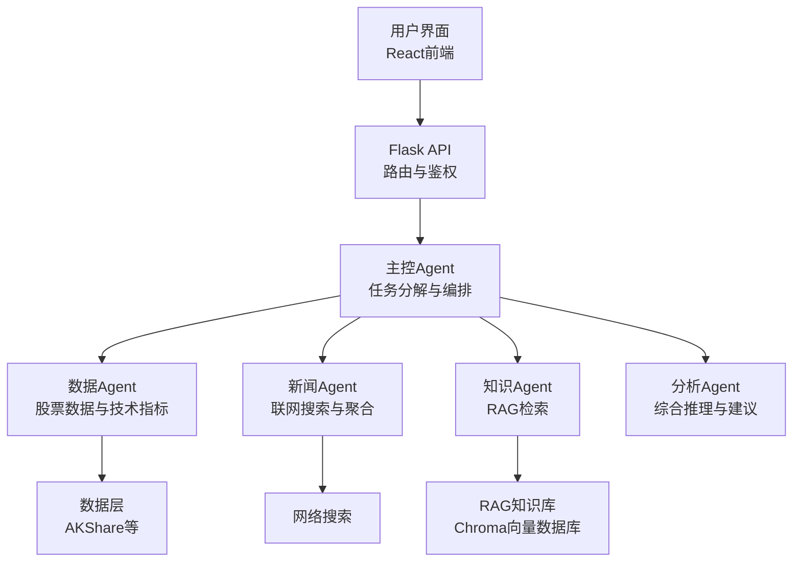
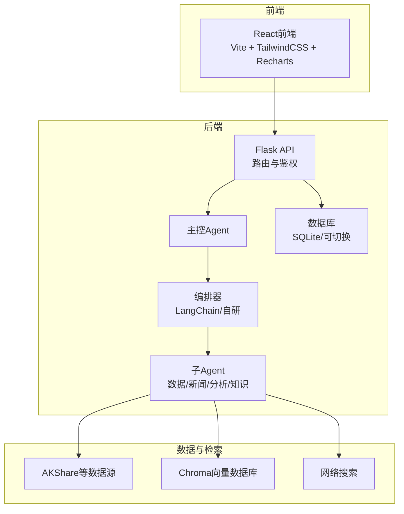
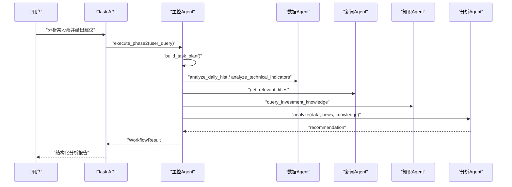
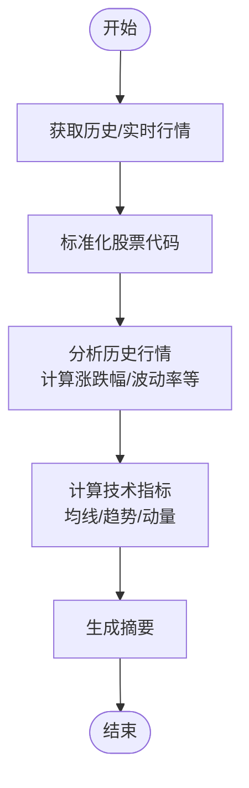

# 项目简介与目标

<cite>
**本文档引用的文件**
- [README.md](file://README.md)
- [DESIGN.md](file://DESIGN.md)
- [AGENTS.md](file://AGENTS.md)
- [run.py](file://run.py)
- [src/api/main.py](file://src/api/main.py)
- [src/agent/README.md](file://src/agent/README.md)
- [src/agent/master_agent.py](file://src/agent/master_agent.py)
- [src/agent/langchain_orchestrator.py](file://src/agent/langchain_orchestrator.py)
- [src/agent/analysis_agent.py](file://src/agent/analysis_agent.py)
- [src/agent/stock_agent.py](file://src/agent/stock_agent.py)
- [src/agent/news_agent.py](file://src/agent/news_agent.py)
- [src/rag/knowledge_tool.py](file://src/rag/knowledge_tool.py)
- [src/stock/stock_api.py](file://src/stock/stock_api.py)
- [src/news/news_api.py](file://src/news/news_api.py)
</cite>

## 目录
1. [项目概述](#项目概述)
2. [核心使命与愿景](#核心使命与愿景)
3. [多智能体协作架构](#多智能体协作架构)
4. [主要应用场景](#主要应用场景)
5. [技术创新点与独特价值](#技术创新点与独特价值)
6. [系统架构概览](#系统架构概览)
7. [详细组件分析](#详细组件分析)
8. [性能与可靠性考量](#性能与可靠性考量)
9. [结语](#结语)

## 项目概述

AI投资分析系统是一个基于Flask + React + 多智能体协作的投资分析平台，支持用户认证、股票与新闻信息聚合、对话分析与RAG知识检索。系统通过模块化设计与多Agent分工协作，将复杂的投资决策过程拆解为可管理、可扩展的子任务，为个人投资者与金融分析师提供智能化辅助决策能力。

- 支持能力：用户注册/登录与JWT鉴权、股票数据查询与分析（AKShare）、新闻联网检索与分析、多Agent协同分析流程（主控、数据、新闻、知识、分析）、可切换编排器（LangChain AgentExecutor / 自研编排）、聊天记录与分析会话持久化（SQLite/可切换数据库）、RAG本地知识库检索（Chroma）、React前端可视化界面。
- 技术栈：后端Python + Flask + SQLAlchemy，编排LangChain AgentExecutor（可选）+ 自研编排（fallback），前端React + Vite + TailwindCSS + Recharts，数据与检索SQLite（默认）+ ChromaDB + sentence-transformers，数据源AKShare、网页联网搜索。

**章节来源**
- [README.md](file://README.md#L1-L215)

## 核心使命与愿景

- 核心使命：通过多智能体协作与RAG知识检索，将分散的市场数据、新闻资讯与专业分析框架整合为可理解、可追溯、可解释的投资建议，降低信息噪音，提升决策质量。
- 愿景：成为个人投资者与金融分析师的“智能投顾助手”，在合规前提下提供稳健、透明、可验证的分析流程，推动投资决策从经验驱动向数据与知识驱动转变。

## 多智能体协作架构

系统采用“分层、模块化、多智能体协同”的架构，将复杂的投资决策过程拆解为更小、更专业的子任务，每个子任务由专门的Agent负责，通过主控Agent进行协调，并利用共享的知识库作为决策依据。

- 分层设计：用户交互层（UI）→ Agent协调层（Orchestration）→ 工具与数据层（数据获取、新闻检索、知识库）。
- 协调机制：主控Agent负责任务分解、工具调用、结果整合与最终报告生成；数据Agent负责行情与技术指标标准化；新闻Agent负责联网搜索与相关信息聚合；分析Agent负责综合推理与建议生成；知识Agent负责RAG检索与方法论支撑。
- 可靠性保障：支持LangChain编排器与自研编排双通道，任一子Agent失败时，主链路会降级输出并明确缺失项，避免编造内容。

**图表来源**
- [DESIGN.md](file://DESIGN.md#L1-L191)
- [src/agent/README.md](file://src/agent/README.md#L1-L59)

**章节来源**
- [DESIGN.md](file://DESIGN.md#L1-L191)
- [src/agent/README.md](file://src/agent/README.md#L1-L59)

## 主要应用场景

- 个人投资者辅助决策：输入“分析某股票并给出投资建议”，系统自动识别股票代码、拉取历史行情与技术指标、联网检索相关新闻、结合RAG知识库中的分析框架，生成包含摘要、数据要点、风险提示、操作建议的可读报告。
- 金融分析师工作流程优化：在已有研究框架基础上，通过多Agent并行获取数据与新闻，缩短信息搜集与整理时间，提高报告质量与一致性；支持对方法论与案例的RAG检索，增强分析深度。
- 快速问答与简答：针对简单问题，通过聊天简答链路（工具调用 + 简短总结）快速输出3-5句话的结论，满足日常咨询场景。

**章节来源**
- [README.md](file://README.md#L132-L162)

## 技术创新点与独特价值

- 多源数据融合：统一接入AKShare等数据源，提供历史行情、技术指标与市场总貌等多维度数据，并通过代理层进行标准化输出，降低上游差异带来的复杂度。
- 智能体协作：将任务分解与工具调用分离，主控Agent专注于编排与整合，子Agent专注各自领域，既保证灵活性又便于替换与扩展。
- RAG知识检索：构建本地知识库（Chroma + 向量嵌入 + 重排序），支持混合检索（向量 + 关键词）与结果融合，为分析提供方法论与规则支撑。
- 可切换编排器：支持LangChain AgentExecutor与自研编排器，优先LangChain但异常时自动回退自研编排，兼顾生态成熟度与工程可控性。
- 合规与可解释：在使用模式下屏蔽内部调试信息，避免确定性收益表述，强调“部分信息暂不可用”等合规表达，降低法律与道德风险。

**章节来源**
- [src/rag/knowledge_tool.py](file://src/rag/knowledge_tool.py#L1-L273)
- [src/agent/langchain_orchestrator.py](file://src/agent/langchain_orchestrator.py#L1-L273)
- [src/agent/analysis_agent.py](file://src/agent/analysis_agent.py#L1-L119)

## 系统架构概览

系统采用前后端分离架构，后端以Flask为核心，提供REST API与多Agent编排；前端以React为基础，提供可视化界面与交互体验。数据与检索层通过AKShare与RAG知识库实现多源融合。

**图表来源**
- [README.md](file://README.md#L16-L40)
- [src/api/main.py](file://src/api/main.py#L1-L243)
- [src/agent/master_agent.py](file://src/agent/master_agent.py#L1-L351)

**章节来源**
- [README.md](file://README.md#L16-L40)
- [src/api/main.py](file://src/api/main.py#L1-L243)

## 详细组件分析

### 主控Agent（MasterAgent）

- 职责：任务分解、工具调用、结果整合、最终报告生成；支持LangChain编排器与自研编排器双通道。
- 关键流程：识别股票代码 → 生成任务计划 → 并行调用子Agent → 汇总结果 → 分析Agent生成建议 → 返回统一结构（task_plan、agent_results、degraded、recommendation）。
- 降级策略：任一子Agent失败时，记录错误并标记degraded，输出“部分信息暂不可用”等合规表述。

**图表来源**
- [src/agent/master_agent.py](file://src/agent/master_agent.py#L155-L318)
- [src/agent/analysis_agent.py](file://src/agent/analysis_agent.py#L27-L92)

**章节来源**
- [src/agent/master_agent.py](file://src/agent/master_agent.py#L1-L351)
- [src/agent/README.md](file://src/agent/README.md#L19-L59)

### 数据Agent（StockAgent）

- 职责：获取与分析历史行情、实时行情、技术指标，提供标准化输出；支持多数据源降级回退（东方财富 → 腾讯 → 新浪）。
- 特性：统一股票代码格式、计算基础技术指标（均线、趋势、动量）、异常处理与日志记录。

**图表来源**
- [src/agent/stock_agent.py](file://src/agent/stock_agent.py#L305-L552)
- [src/stock/stock_api.py](file://src/stock/stock_api.py#L1-L425)

**章节来源**
- [src/agent/stock_agent.py](file://src/agent/stock_agent.py#L1-L572)
- [src/stock/stock_api.py](file://src/stock/stock_api.py#L1-L425)

### 新闻Agent（NewsAgent）

- 职责：联网搜索与相关信息聚合；支持关键词检索与结果筛选。
- 特性：通过网络搜索获取最新资讯，返回结构化结果供分析Agent使用。

**章节来源**
- [src/agent/news_agent.py](file://src/agent/news_agent.py#L1-L93)
- [src/news/news_api.py](file://src/news/news_api.py#L1-L248)

### 分析Agent（AnalysisAgent）

- 职责：整合数据、新闻、知识库输出，生成最终建议文本；支持调试模式与使用模式，严格区分内部信息与对外输出。
- 特性：在使用模式下屏蔽异常细节，避免泄露内部状态；输出结构化建议，包含摘要、数据要点、风险提示、操作建议。

**章节来源**
- [src/agent/analysis_agent.py](file://src/agent/analysis_agent.py#L1-L119)

### 编排器（LangChainOrchestrator）

- 职责：基于LangChain AgentExecutor的可选编排器，封装工具调用与中间步骤处理；不可用时由上层回退到自研编排。
- 特性：动态构建工具（数据/新闻/知识），执行并收集中间步骤，最终汇总到WorkflowResult。

**章节来源**
- [src/agent/langchain_orchestrator.py](file://src/agent/langchain_orchestrator.py#L1-L273)

### RAG知识库（RagKnowledgeBase）

- 职责：提供RAG检索能力，支持向量检索、关键词检索、重排序与结果融合；内置缓存与降级策略。
- 特性：混合检索（向量 + 关键词）+ RRF融合 + 交叉编码重排序；支持查询缓存与最小结果阈值控制。

**章节来源**
- [src/rag/knowledge_tool.py](file://src/rag/knowledge_tool.py#L1-L273)

## 性能与可靠性考量

- 数据源稳定性：通过多数据源降级回退（东方财富 → 腾讯 → 新浪）提升获取成功率；对代理层进行异常捕获与日志记录。
- 编排器切换：默认优先LangChain，异常时自动回退自研编排，确保主链路可用性。
- 缓存与重试：RAG知识库支持查询缓存与最大容量控制；前端与后端均提供错误日志与重试机制。
- 合规与可解释：在使用模式下屏蔽内部调试信息，避免确定性收益表述，强调“部分信息暂不可用”等合规表达。

**章节来源**
- [src/agent/stock_agent.py](file://src/agent/stock_agent.py#L129-L168)
- [src/rag/knowledge_tool.py](file://src/rag/knowledge_tool.py#L153-L176)
- [src/agent/analysis_agent.py](file://src/agent/analysis_agent.py#L60-L77)

## 结语

AI投资分析系统通过多智能体协作与RAG知识检索，将分散的信息转化为可理解、可追溯、可解释的投资建议，既适合个人投资者辅助决策，也能优化金融分析师的工作流程。系统在架构设计、数据融合、编排策略与合规表达方面具备明确的技术创新点与独特价值，为构建智能化投资决策体系提供了可扩展、可落地的工程方案。